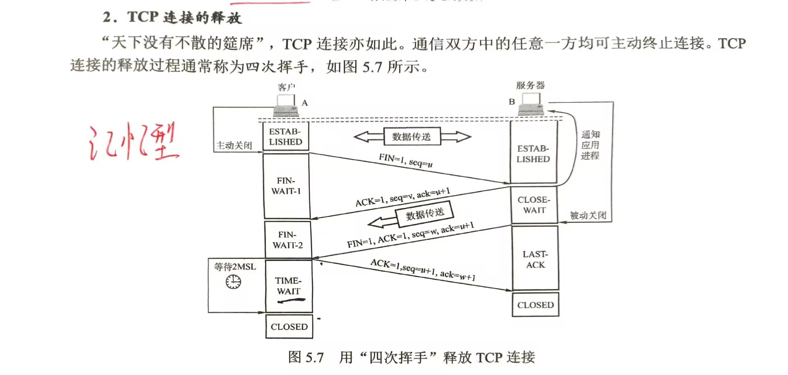
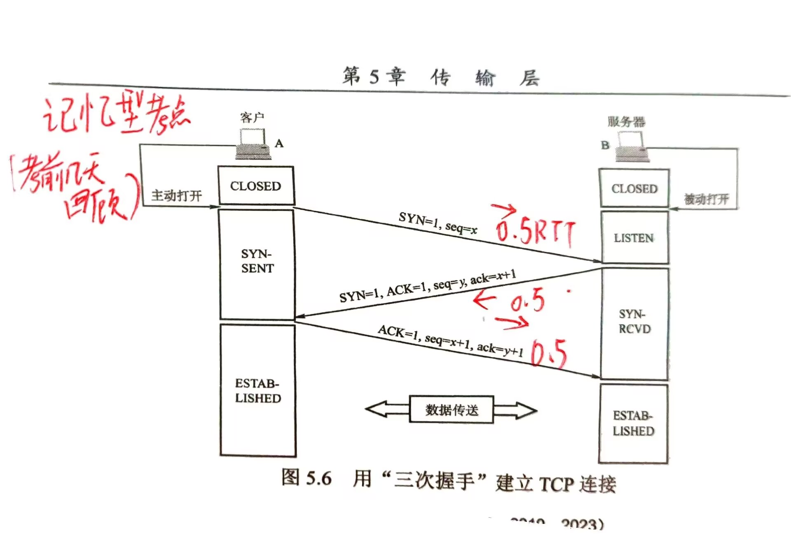

**这些内容需要考前去记忆**
# 数据结构
- [ ] 8.7外部排序

# 计算机组成原理
- [ ] 2.1溢出标志，移位运算；
- [ ] 5.6.5高级流水线技术
- [ ] 5.7多处理器的基本概念
# 操作系统

# 计算机网络
TCP连接的建立和释放过程中：客户端和服务器的状态

	
- DNS分层域名系统
	DNS是因特网上解决域名到IP地址转换的系统。
	1. 域名结构：采用层次结构的命名方法，每个域名都由标号序列组成，各标号之间用点隔开。
		* 根域名（.）
		* 顶级域名(TLD)：国家顶级域名(cn, us, uk)，通用顶级域名(com, org, net, gov)，基础结构域名(arpa)
		* 二级域名：例如，baidu.com 中的 baidu
		* 三级域名：例如，www.baidu.com 中的 www
	2. 域名服务器：
		* 根域名服务器：最高层，负责管理顶级域名服务器。
		* 顶级域名服务器：管理在该顶级域名下注册的所有二级域名。
		* 授权域名服务器：负责一个“区”的域名服务器。
		* 本地域名服务器：当一台主机发出DNS查询请求时，这个请求首先发给本地域名服务器。
海明码部分