# 408 每日一题

> [!info] 说明
> 汇总各来源的 408 每日一题，按科目分区、各自编号。
> 题目版权归对应来源所有，仅作个人学习整理，免费资源 · 禁止商用。
> **当前来源**：[湖科大教书匠](https://space.bilibili.com/360996402)、[零壹计算机考研](https://space.bilibili.com/521521146)

> [!abstract] 科目导航
> - [[#一、数据结构]]
> - [[#二、计算机组成原理]]
> - [[#三、操作系统]]
> - [[#四、计算机网络]]

---

# 一、数据结构

> [!abstract] 题号索引
> - [[#No.001 双层循环的时间复杂度]]

## No.001 双层循环的时间复杂度

> [!note] 标签
> #零壹计算机考研 #时间复杂度 #双层循环 #循环变量共享

**来源**：零壹计算机考研　**题型**：单选题

### 题目

下列程序段的时间复杂度是（　　）。

```c
sum = 0;
for (int i = 1; i <= n; i++) {
    for (int j = 1; j <= n; j++) {
        sum++;
        i++;
    }
}
```

- A. $O(\log_{2}n)$
- B. $O(n)$
- C. $O(n\log_{2}n)$
- D. $O(n^{2})$

### 答案

> [!success] 正确答案：B

### 我的作答

> [!question] 我选 B —— 正确
> 关键是认出内层的 `i++` 会把外层循环变量顶出范围——外层实际只跑 1 轮。

### 解析

**思路**（按库里 `1. 数据结构知识.md` 的多变量处理法：列举 i 与 j 的变化，求和找出与 n 的关系）：

1. 内层 `for (j = 1; j <= n; j++)` 的循环条件只看 `j`，与 `i` 无关 → **每进一次内层就完整跑满 n 次**。
2. 内层循环体里除了 `sum++` 还有 `i++`：内层每循环一轮就把 `i` 加 1，所以内层跑完 `i` 净增 n。
3. 再看外层：`i = 1` 进入 → 内层跑完 `i = 1 + n` → 外层 `i++` 后 `i = n + 2 > n`，**第二次判断就不成立**，整个外层只执行 1 次。
4. 故总执行次数 = 内层的 n 次 + 常数次外层开销，即 $T(n) = n + O(1) = O(n)$。

**逐项**：

- **B 正确**：外层常数次 × 内层 n 次 = $O(n)$。
- **D 错**：看到两层嵌套就条件反射相乘。双重循环是 $O(n^{2})$ 的前提是**两层各自跑满**；本题外层被内层的 `i++` 压成了常数轮。
- **A 错**：$O(\log n)$ 要求每轮规模折半或倍增，本题没有这种跳跃。
- **C 错**：$O(n\log n)$ 需要「一层线性 × 一层对数」，本题是「常数层 × 线性层」。

---

# 二、计算机组成原理

> [!abstract] 题号索引
> - [[#No.001 加法运算标志位的组合分析]]

## No.001 加法运算标志位的组合分析

> [!note] 标签
> #零壹计算机考研 #标志位 #溢出 #进位 #补码

**来源**：零壹计算机考研　**题型**：单选题

### 题目

若某次**整数加法**运算后，标志位 **OF = CF = 1**，则二元组 **（ZF, SF）** 的可能取值有（　　）种。

- A. 1
- B. 2
- C. 3
- D. 4

### 答案

> [!success] 正确答案：B

### 我的作答

> [!question] 我选 B —— 正确
> 一句话结论：**OF = CF = 1 时符号位必为 0 → SF 被锁死，只有 ZF 自由**，所以是 2 种。

### 解析

**先把四个标志位的定义摆清楚**。符号按本题讲解图的口径来：设**最高位（符号位）产生的进位输出**为 $C_{n+1}$，**进入符号位的进位输入**为 $C_n$，加减控制信号为 $sub$（加法 sub = 0，减法 sub = 1）。

| 标志 | 含义 | 由谁决定 |
|---|---|---|
| **CF** | 无符号数运算的进位/借位 | $CF = C_{n+1} \oplus sub$ —— 加法时 sub = 0，退化为 $CF = C_{n+1}$ |
| **OF** | 有符号数是否溢出 | $OF = C_{n+1} \oplus C_n$（符号位的进位输出 ⊕ 符号位的进位输入） |
| **ZF** | 结果是否为 0 | 结果各位**全 0** 时 ZF = 1 |
| **SF** | 结果的符号 | $SF = s_{n-1}$（结果的最高位） |


#### 做法一： 枚举法（把 2 位数的加法全试一遍）

取 n = 2（补码范围 −2 ～ +1），4 个二位数两两相加共 3+2+1 = 6 个不同组合，逐个算进位与结果：

| 算式 | 硬件结果（截取低 2 位） | $C_2$（符号位进位输出） | $C_1$（进入符号位） | CF | OF = $C_2 \oplus C_1$ | 符合 OF=CF=1？ | 结果 | ZF | SF |
|---|---|---|---|---|---|---|---|---|---|
| 01 + 11 | 100 → `00` | 1 | 1 | 1 | **0** | ✗ | | | |
| **10 + 10** | 100 → `00` | 1 | 0 | 1 | **1** | ✔ | `00` | **1** | **0** |
| **10 + 11** | 101 → `01` | 1 | 0 | 1 | **1** | ✔ | `01` | **0** | **0** |
| 11 + 01 | 100 → `00` | 1 | 1 | 1 | **0** | ✗ | | | |
| **11 + 10** | 101 → `01` | 1 | 0 | 1 | **1** | ✔ | `01` | **0** | **0** |
| 11 + 11 | 110 → `10` | 1 | 1 | 1 | **0** | ✗ | | | |

（讲解图里标红的正是满足条件的三行：`10+10`、`10+11`、`11+10`。）

- 注意 `01+11`、`11+01`、`11+11` 虽然 **CF = 1**，但 $C_1 = 1$ 使 $OF = C_2 \oplus C_1 = 0$，**被排除**；
- 剩下三行给出的 (ZF, SF) 是 **(1, 0)、(0, 0)、(0, 0)** → 不重复的取值只有 **2 种**，选 **B**。

**换成真数看更直观**（2 位补码：`10` = −2、`11` = −1）：

- `10 + 10`：−2 + (−2) = −4，溢出，硬件结果 `00` → **ZF = 1、SF = 0**
- `10 + 11` / `11 + 10`：−2 + (−1) = −3，溢出，硬件结果 `01` → **ZF = 0、SF = 0**
- `11 + 11`：−1 + (−1) = −2，**和仍在范围内，不溢出** → OF = 0，排除

#### 做法二：分析法（不用碰进位数，全靠符号推理）

推导链一共四步，环环相扣：

1. **OF = 1 ⟹ A、B 一定同号**（异号相加绝不会溢出）；
2. **同号里再分两正 / 两负，而 CF = 1 把"两正"排除了**：
   两个正数的符号位都是 0，符号位相加最多是 $0 + 0 + 1 = 1$，**不可能产生进位输出** → CF 必为 0。
   ∴ 只能是**两负**，即 **A = `1xxxxxxx`、B = `1yyyyyyy`**；
3. **两负数相加，结果本应是负数；但 OF = 1 说明发生了溢出** ⟹ 结果的**符号位被翻转**成了 0 ⟹ **SF = 0**（唯一取值，被彻底锁死）；
4. **ZF 独立判断**：两负数的和越小越可能全 0。极端例子取 **A = B = `10000000`**（即 −128）：−128 + (−128) = −256，溢出后截取 8 位得 `00000000` → **ZF = 1**；其他组合结果非全 0 → **ZF = 0**。

→ (ZF, SF) 只有 **(1, 0)** 和 **(0, 0)** 两种 → **2 种**，选 **B**。

**这条链最短**：抓住「OF = 1 → 同号」「CF = 1 → 不能是两正 → 两负」「溢出 → 符号位翻转」三句，符号位就定了。

#### 做法三： 进位信号法（从 CF、OF 的定义式解进位）

直接用两条定义式联立：

$$CF = C_{n+1} \oplus sub = 1 \quad\Longrightarrow\quad C_{n+1} = 1 \quad(\text{加法 } sub = 0)$$

$$OF = C_{n+1} \oplus C_n = 1 \quad\Longrightarrow\quad C_n = 0 \quad(\text{已知 } C_{n+1} = 1)$$

**两个进位信号都被解出来了**：符号位**产生了**进位输出（$C_{n+1} = 1$），却**没有收到**进位输入（$C_n = 0$）。

回到符号位那一位全加器：$a_{n-1} + b_{n-1} + C_n = s_{n-1} + 2C_{n+1}$，代入 $C_n = 0$、$C_{n+1} = 1$：

$$a_{n-1} + b_{n-1} = s_{n-1} + 2$$

而 $a_{n-1}, b_{n-1} \in \{0, 1\}$，左边最大为 2 → **只能 $a_{n-1} = b_{n-1} = 1$、$s_{n-1} = 0$**。

- 两个加数符号位都是 1 → 又是 **A = `1xxxxxxx`、B = `1yyyyyyy`（两负）**；
- 结果符号位是 0 → **SF = 0**；
- ZF 同做法二（取 A = B = `10000000` 时 ZF = 1，其余为 0）→ **2 种**，选 **B**。

**sub 在这里的角色**：$sub$ 是**加减控制信号** —— 加法时 sub = 0、最低位进位输入也是 0；减法时 sub = 1，同时把 B 各位取反、最低位进位输入置 1。它出现在 **CF 的定义式**（$CF = C_{n+1} \oplus sub$）里：减法时 $CF = \overline{C_{n+1}}$，正好对应"借位"的语义。而 **OF 的定义式不含 sub**，无论加减都是 $C_{n+1} \oplus C_n$。

#### 三种做法对比

| 做法        | 怎么做                                                                                 | 什么时候用                     |
| --------- | ----------------------------------------------------------------------------------- | ------------------------- |
| **枚举法**   | 取 n = 2，把 6 种加法全试一遍，筛出 CF = OF = 1 的三行                                              | 选择题**最快最稳**，不用记任何公式       |
| **分析法**   | OF=1 → 同号；CF=1 → 排除两正 → 两负；溢出 → 符号位翻转 → SF = 0                                      | 需要讲清**为什么**，逻辑链最短         |
| **进位信号法** | 由 $CF = C_{n+1} \oplus sub$、$OF = C_{n+1} \oplus C_n$ 解出 $C_{n+1}=1$、$C_n=0$，再回代符号位 | 与**加法器硬件**（进位链）挂钩，写推导时最正规 |

**三条路殊途同归**：符号位只能是 0（SF 被锁死），ZF 可 0 可 1 → **(ZF, SF) 共 2 种**。

**易错点**：

1. 别把 **CF 和 OF 混为一谈**：CF 管**无符号**（只看有没有进位），OF 管**有符号**（看符号位前后进位的异或）。本题两者都是 1，说明"无符号溢出"和"有符号溢出"同时发生。
2. **OF = 1 且 CF = 1 时符号位必为 0** —— 这是本题唯一需要记住的结论。
3. 别漏了 **ZF 的独立性**：ZF 由结果的**全部数据位**决定，与符号位不冲突，所以能取 2 个值。看到"有几种取值"就要想"哪些位被约束了、哪些还自由"。

---

# 三、操作系统

> [!abstract] 题号索引
> - [[#No.001 中断处理时进程的状态]]
> - [[#No.002 地址映射与地址转换的透明性]] ⚠️
> - [[#No.003 read 唤醒时数据的位置]]
> - [[#No.004 优先级抢占调度求完成时刻]]
> - [[#No.005 管道内核缓冲区的数据结构]]

## No.001 中断处理时进程的状态

> [!note] 标签
> #零壹计算机考研 #进程状态 #中断处理 #状态转换

**来源**：零壹计算机考研　**题型**：单选题

### 题目

进程 P 响应键盘输入中断并开始执行中断服务程序时，进程 P 处于（　　）。

- A. 就绪态
- B. 运行态
- C. 阻塞态
- D. 挂起态

### 答案

> [!success] 正确答案：B

### 我的作答

> [!question] 我选 B —— 正确
> 关键是认出中断处理程序不是进程、期间不发生进程切换——P 没被挂进就绪队列，状态不变。

### 解析

**一、先看清题干的两处措辞**

- 「**响应**中断」：这是**硬件**动作（中断隐指令：关中断 → 保存断点 PC/PSW → 按中断号查中断向量表 → 转入中断服务程序），由硬件自动完成，不需要指令参与。
- 「**开始执行中断服务程序**」：这是**软件**阶段，由内核的中断处理代码完成。

整个过程中，P 的执行流只是被打了个岔，**CPU 的"所有权"始终在 P 手里**，从没交给别的进程。

**二、为什么说"中断处理程序不是进程"**

- 进程 = 程序段 + 数据段 + **PCB**，是资源分配和调度的独立单位；
- 中断处理程序是**内核代码**，**没有自己的 PCB**，不参与调度、也不允许被调度；
- 它只是"借用"当前进程 P 的内核栈、页表等上下文，执行完 `iret` 就返回 P 被打断的那一条指令处。

**关键推论**：它既然不是进程，整个过程就**不会发生进程切换**；不发生进程切换，P 的 PCB 里 `state` 字段就**不会被改写，P 也不会被挂进就绪队列** → P 的状态保持不变。

**三、用三态的定义去卡**

| 状态 | 定义 | P 符合吗 |
|---|---|---|
| 运行态 | **已获得 CPU，正在 CPU 上执行** | ✔ 中断处理程序用的是 P 的上下文、P 占着 CPU |
| 就绪态 | 已具备运行条件，**在等 CPU** | ✘ P 没进就绪队列，也没在等调度 |
| 阻塞态 | 在等某个事件，**CPU 空闲也不能运行** | ✘ P 没等任何东西 |

所以 P 处于**运行态**，选 **B**。

**四、什么情况才真的会变状态（这张表要背下来）**

| 触发事件 | 转换 | 本质 |
|---|---|---|
| 时间片到 | 运行 → 就绪 | 调度程序**换人** |
| 被更高优先级进程抢占 | 运行 → 就绪 | 调度程序**换人** |
| P 主动请求资源 / 等待事件（如 `read`） | 运行 → 阻塞 | P **主动**放弃 CPU |
| **P 等待的事件完成**（该设备的 I/O 完成中断到来） | 阻塞 → 就绪 | 中断处理程序执行**唤醒**原语 |
| **P 被打断、转去执行中断处理程序** | **不变（仍运行态）** | 只是**打断执行流**，不换人 ← 本题 |

核心分界线：**"被打断执行流" ≠ "被换下 CPU"**。只有后者才改状态。

**五、本题最大的争议点：A 就绪态**

有部分资料流传"中断处理期间被中断进程处于就绪态"，理由是"CPU 被中断处理程序占用了，所以 P 不再占有 CPU"。这个说法站不住：

1. **自相矛盾**：中断处理期间**禁止进程调度**。如果 P 真被放进就绪队列，调度程序一运行就可能把 CPU 分给别人，中断处理就无法保证及时完成——两者不可能同时成立。
2. **返回路径不同**：中断返回时 CPU 是**直接回到 P 被打断的那条指令**，**不经过调度器**。这也说明 P 从未离开运行态。
3. **教材口径**：库里 `4.操作系统.md` 2.1.4 写明，运行 → 就绪的触发条件只有「**时间片到 / 被抢占**」，都属于"换人"；中断处理不属于换人。

零壹给的 **B（运行态）** 与 408 教材口径一致。**但真要遇到官方标 A 的卷子，以官方答案为准** —— 这题真正的分值在于"能说清为什么"。

**六、三个变体，一题三吃**

| 变体问法 | 答案 | 理由 |
|---|---|---|
| 「P 正在等待的 I/O 完成，该设备的中断到来」 | **阻塞 → 就绪** | 等的事件发生了，中断处理程序执行唤醒原语 |
| 「P 的时间片用完（产生时钟中断）」 | **运行 → 就绪** | 时钟中断的语义就是"该换人了"，处理程序会调用调度器 |
| 「时钟中断处理程序**正在执行**时，P 处于什么状态」 | 仍是**运行态** | 调度决策还没做出；决策做出后才把 P 转成就绪 |

**七、库内已补的对应条目**

`4.操作系统.md`「2.1.4 进程的状态与转换」节末尾有一块 `> [!warning] 中断处理时进程处于什么状态`，三条要点 + "什么时候才真的换态" + 排除项，与本题一一对应，可对照复习。

---


## No.002 地址映射与地址转换的透明性

> [!note] 标签
> #零壹计算机考研 #透明性 #地址映射 #地址转换 #指令系统

**来源**：零壹计算机考研　**题型**：单选题

### 题目

下面过程对指令系统透明的是（　　）。

- A. 中断处理
- B. 中断初始化
- C. 地址映射
- D. 地址转换

### 答案

> [!success] 正确答案：D

### 我的作答

> [!warning] 我选 C —— 错误
> **错因**：A、B 用「中断肯定要涉及指令」排掉是对的；卡在 C、D 上时把「映射」和「转换」当成同一件事了，没建立「映射＝软件、转换＝硬件」这条区分线。按本题的辨析：**地址映射是软件过程**——OS 用一条条指令去分配页框、创建页表和修改页表，指令系统全程看得见 → **不透明**；**地址转换是硬件过程**——MMU 在运行时自动完成，没有任何一条"转换指令" → 指令系统感知不到 → **透明**。

### 解析

**判据**：库里 `2.计算机组成原理笔记.md` 1.4.1 给出「透明 = 看不见 = 不需要关心」。套到本题，就是问**哪个过程不需要指令参与、指令系统感知不到**。实际上就是只需要硬件就能完成

| 过程    | 由谁完成                        | 需要指令参与吗      | 对指令系统    |
| ----- | --------------------------- | ------------ | -------- |
| 中断处理  | 中断服务程序（本身就是指令序列）            | 需要           | 不透明      |
| 中断初始化 | OS 用指令设置中断向量表、开中断等          | 需要           | 不透明      |
| 地址映射  | **软件**：OS 分配和创建页表、页框分配、修改页表 | 需要（一条条指令改页表） | 不透明      |
| 地址转换  | **硬件**：MMU 在程序运行时自动完成       | 不需要          | **透明** ✓ |

故只有 **D 地址转换**对指令系统透明。

**零壹的原文辨析**（照录）：

- **地址映射**（address mapping）：指建立逻辑地址与物理地址之间的映射关系，在虚拟页式管理中对应了分配和创建页表，页框分配和修改页表等过程。
- **地址转换**（address translation）：指通过 MMU 实现从虚拟地址向物理地址转换的过程，其具体过程与 TLB 等硬件息息相关。
- 地址映射是**软件**过程，地址转换是**硬件**过程，只有先经过了地址映射，地址转换才能正确进行。

**易错点**：

1. 「映射」和「转换」中文只差一个字，但前者是 OS 建表（软件、要指令），后者是 MMU 查表换算（硬件、不要指令）——本题就考这一刀。
2. 注意别被「中断隐指令」这个名字误导：它虽然叫"指令"，实际由**硬件**自动完成（关中断、保存断点、取中断入口）；但**中断处理**整体是实实在在的指令序列 → 仍不透明。
3. 交叉参考：地址转换的硬件实现（MMU、TLB、页表）见 `4.操作系统.md` 3.2 内存管理与 `3.存储系统串联.md`。

---

## No.003 read 唤醒时数据的位置

> [!note] 标签
> #零壹计算机考研 #内核缓冲区 #用户缓冲区 #DMA #系统调用

**来源**：零壹计算机考研　**题型**：单选题

### 题目

进程 P 使用 read 系统调用读取文件数据时被阻塞，系统使用 DMA 方式传送磁盘块，则进程 P 被唤醒时对应文件数据位于（　　）中。

- A. 用户缓冲区
- B. 内核缓冲区
- C. DMA 控制器
- D. 磁盘控制器

### 答案

> [!success] 正确答案：B

### 我的作答

> [!question] 我选 B —— 正确
> 我的理解：数据先落在**系统（内核）缓冲区**，再由内核送到**用户缓冲区**；被唤醒的那一刻只走完第一步。

### 解析

**关键在时刻**——「被唤醒」这个瞬间，数据刚由 DMA 搬进内核缓冲区，还没往用户空间拷。库里 `4.操作系统.md` 5.2「I/O 操作举例」的 read() 流程正好把这条时序写全了：

| 步骤 | 发生的事 | 数据在哪 |
|---|---|---|
| ① | `sys_read()` 查磁盘高速缓存未命中，从缓冲池取一个缓冲区 | 磁盘上 |
| ② | 驱动启动 **DMA**，数据从磁盘**直接搬进内存缓冲区**（不经过 CPU） | **内核缓冲区** |
| ③ | 数据没到，进程**阻塞**（＝题干的"被阻塞"） | 内核缓冲区（在传） |
| ④ | 传完，DMA 控制器**发中断** → 中断处理程序把缓冲区挂到装满队列、**唤醒原进程** | **内核缓冲区** ← **题目问的就是这一刻** |
| ⑤ | 进程重新被调度，内核把数据**从缓冲区拷到用户空间的 buf**，read 返回 | 两处都有（用户 buf 是新副本） |

所以唤醒时数据位于**内核缓冲区**，选 **B**。

**逐项排除**：

- **A 用户缓冲区**：拷到用户 `buf` 是第 ⑤ 步，发生在唤醒**之后**（要等进程被重新调度）。这题的分水岭就是"**唤醒时**"这三个字——题目要是改成"read 返回后数据在哪"，才是 A。
- **C DMA 控制器**：DMA 控制器里只有主存地址寄存器、计数器、命令/状态寄存器和数据寄存器，数据寄存器是硬件接口用的临时暂存（字节级），文件数据不在那儿停留。库里的对比表说得很清楚：**缓冲区的数据流向是「设备 → 缓冲区 → 进程取走」**。
- **D 磁盘控制器**：同 C——设备侧的接口硬件，数据只是"路过"，真正的落脚点是内存里的内核缓冲区。

---
## No.004 优先级抢占调度求完成时刻

> [!note] 标签
> #零壹计算机考研 #进程调度 #优先级抢占 #甘特图

**来源**：零壹计算机考研　**题型**：单选题

### 题目

在基于优先级抢占处理机的单 CPU 系统中，进程 P1、P2 均在 0 时刻就绪，P1 优先级大于 P2，且 P1 和 P2 执行流程均为：**8ms 计算 + 2ms I/O + 5ms 计算**。若全过程无其他进程就绪，进程调度和切换的时间忽略不计，则 P2 执行完毕的时刻为（　　）。

- A. 30ms
- B. 28ms
- C. 23ms
- D. 26ms

### 答案

> [!success] 正确答案：B

### 我的作答

> [!question] 我选 B —— 正确
> 关键节点是 **t = 10**：P1 的 I/O 一结束、优先级又高于 P2，必须**立刻抢回 CPU**，P2 只能停在"算了一半"的位置上。

### 解析

**时间线推演**（单 CPU、优先级抢占、切换开销为 0）：

| 时刻 | 事件 | CPU 上是谁 |
|---|---|---|
| 0 | P1、P2 同时就绪，P1 优先级高 | **P1** 开始算「计算 1」 |
| 8 | P1 的「计算 1」做完，发起 **2ms I/O** → P1 阻塞 | CPU 空出 → **P2** 上（算「计算 1」） |
| 10 | P1 的 I/O 完成 → P1 变就绪 → **优先级高于 P2，抢占** | **P1** 抢回，算「计算 2」；P2 只算了 2ms，**还剩 6ms** |
| 15 | P1 全部完成（8+2+5 = 15）→ CPU 空出 | **P2** 接着算剩下的 6ms |
| 21 | P2 的「计算 1」做完（2+6 = 8ms），发起 **2ms I/O** | CPU 空闲（无其他进程就绪） |
| 23 | P2 的 I/O 完成 | **P2** 算「计算 2」（5ms） |
| **28** | **P2 全部完成** | — |

**甘特图**：

```mermaid
gantt
    title P1、P2 执行甘特图（时间轴 0~28ms）
    dateFormat HH:mm:ss
    axisFormat %S
    todayMarker off

    section P1
    计算1 8ms    :a1, 00:00:00, 00:00:08
    I/O 2ms      :a2, 00:00:08, 00:00:10
    计算2 5ms    :a3, 00:00:10, 00:00:15

    section P2
    计算1 前2ms  :b1, 00:00:08, 00:00:10
    计算1 余6ms  :b2, 00:00:15, 00:00:21
    I/O 2ms      :b3, 00:00:21, 00:00:23
    计算2 5ms    :b4, 00:00:23, 00:00:28
```



因此 **P2 完成于 t = 28ms**，选 **B**。

**干扰项拆解**：

| 选项 | 来历 |
|---|---|
| **A 30ms** | 误以为「被抢占后进度作废、要重跑」：P2 在 t=8~10 白算 2ms，t=15 从头再跑 8+2+5 = 15 → 15+15 = 30ms |
| **B 28ms** | ✔ 正确路径（抢占时保留进度，P2 只补算剩余 6ms） |
| **D 26ms** | **按非抢占调度**算出来的结果：P1 的 I/O 在 t=10 完成时不抢，等 P2 自己让出 CPU（P2 在 8→16 一口气算完 8ms，CPU 空闲后 P1 才上，P1 在 16→21 完成，P2 最后一段 21→26）→ 26ms |
| C 23ms | 其他口径的漏算，不构成有效路径 |

**易错点**：

1. **本题唯一的分水岭就是"可抢占"三个字**。P1 的 I/O 一结束就立刻抢回 CPU —— 这跟"P1 重新获得 CPU 后要从头算"是两回事：**被抢占只是暂停，进度保留**。
2. **I/O 期间不占 CPU**：P1 在 8~10 做 I/O，CPU 借给 P2；P2 在 21~23 做 I/O，CPU 空转。这两段千万别算成"占用 CPU"。
3. **P2 的 8ms 计算被切成了两段**（2ms + 6ms），做题时把"分片"标出来就不容易漏。
4. 一旦题目改成"**非抢占**"，答案就是 D 26ms —— 这是常见的换条件考法，见上面的干扰项表。

---

## No.005 管道内核缓冲区的数据结构

> [!note] 标签
> #零壹计算机考研 #管道 #循环队列 #FIFO

**来源**：零壹计算机考研　**题型**：单选题

### 题目

实现**管道的内核缓冲区**时，最适合使用的数据结构是（　　）。

- A. 栈
- B. 循环队列
- C. 堆
- D. 静态链表

### 答案

> [!success] 正确答案：B

### 我的作答

> [!question] 我选 B —— 正确
> 关键在「**最适合**」三个字：循环队列不只是"能存"，它的**判空判满恰好就是管道"读空阻塞/写满阻塞"的触发条件**。

### 解析

#### 一、先看管道对缓冲区提了什么要求

管道的本质：**内核里一块固定大小的内存** + 两个文件描述符（读端、写端）。它给缓冲区提了四条要求（库 `4.操作系统.md` 第 198–203 行「管道」那组要点就是这几条）：

| # | 要求 | 出处 |
|---|---|---|
| 1 | **FIFO** —— 写进去的字节必须按写入顺序被读出 | 「FIFO，先写入先读出」 |
| 2 | **容量固定** —— 内核空间有限，创建时就定好，不能无限写 | 「特点：单向，**有容量限制**」 |
| 3 | **空间要反复复用** —— 写满一次不能就废了 | 由 2 推出 |
| 4 | **两端各自记录位置** —— 读端记读到哪，写端记写到哪 | 「一端写、一端读」 |

#### 二、为什么只有循环队列天然满足这四条

| 要求 | 循环队列的对应 |
|---|---|
| FIFO | 队列本身就是先进先出：**队尾入队**（写）、**队首出队**（读） |
| 容量固定 | 底层就是**定长数组**，无需动态分配 |
| 空间复用 | 取模：`rear = (rear + 1) % N`，写到末尾自动绕回开头，**复用已被读走的空间** |
| 两端各记位置 | 两个指针正是 `front`（读端）和 `rear`（写端） |

**两个指针 ↔ 管道两端**，这是最漂亮的对应：

```c
// 写端（生产者）
buf[rear] = ch;
rear = (rear + 1) % N;

// 读端（消费者）
ch = buf[front];
front = (front + 1) % N;
```

#### 三、关键：管道的阻塞语义 ＝ 循环队列的判空判满

管道最重要的行为是「**写满就阻塞写进程、读空就阻塞读进程**」。这两条规则落到数据结构上，正好就是循环队列的两个状态判据：

| 管道状态 | 循环队列判据 | 内核动作 |
|---|---|---|
| 管道**满** | `(rear + 1) % N == front`（或 `size == N`） | **写进程阻塞**，进等待队列 |
| 管道**空** | `front == rear`（或 `size == 0`） | **读进程阻塞**，进等待队列 |
| 非空 | `front != rear` | 唤醒等待的读进程 |
| 非满 | `(rear+1) % N != front` | 唤醒等待的写进程 |

**这就是"最适合"的真正含义**：循环队列不只是"能存数据"，它的**状态判据直接对应管道的同步逻辑** —— 判空判满这两个条件，恰恰就是"该阻塞谁、该唤醒谁"的触发条件。换成栈、链表，这个对应关系就得另写一套。

#### 四、还省了两笔开销

- **不用搬数据**：普通（非循环）顺序队列出队后要整体前移（$O(n)$），或指针单向推进到末尾就"**假溢出**"（前面明明空着却写不进去）。循环队列用取模一次性解决。
- **不用动态分配**：管道是**按字节**高频读写，若用链表/堆，每读写一次都要申请释放节点，开销和碎片都受不了。

#### 五、逐项排除

| 选项 | 排除理由 |
|---|---|
| **A. 栈** | LIFO（后进先出），与管道"按写入顺序读出"的 FIFO 要求**正好相反** |
| **C. 堆** | **堆不是数据结构**，它是用于**动态内存分配**的内存区域（`malloc`/`new` 的来源）。管道缓冲区是内核创建的固定空间，不是堆上动态分配的 —— **概念错位** |
| **D. 静态链表** | 用数组模拟链表，逻辑上确实能实现 FIFO，但要额外维护"空闲节点链 + 数据链"（游标 next），读一个字节要跳指针、还要管节点回收；**空间与实现成本都高于循环队列**，谈不上"最适合" |
| **B. 循环队列** | ✔ 定长数组 + 两指针 + 取模，FIFO、固定容量、判空判满三件事一次解决 |

#### 六、库内对照

- `4.操作系统.md` 第 198–203 行「(3) 管道（Pipe）」：半双工、FIFO、有容量限制 —— 管道对缓冲区的前三条要求。
- 循环队列的判空判满有两种经典写法（**牺牲一个单元** ／ **设 size 或 tag 变量**），见 `琐碎知识点\循环队列常见两种情况.md` —— 管道实现时直接就用这套。

#### 七、一句话记法

> **管道 ＝ 定长数组 + 两个指针 + 取模。** FIFO 对应"队列"，容量固定且要复用对应"循环"，判空判满对应"阻塞 / 唤醒"。

---

# 四、计算机网络

> [!abstract] 题号索引
> - [[#No.001 分层网络体系结构]]
> - [[#No.002 时延带宽积]]
> - [[#No.003 海明码校验位数]] ⚠️
> - [[#No.004 CSMA/CD 最短帧长]]
> - [[#No.005 CIDR 地址块划分]]
> - [[#No.006 路由聚合精确覆盖]] ⚠️
> - [[#No.007 SDN 的三类接口]]
> - [[#No.008 可靠传输分布在哪几层]]
> - [[#No.009 最长前缀匹配]]
> - [[#No.010 应用层 PDU 的传输效率]] ⭐
> - [[#No.011 静态路由配置与路由环路全过程]] ⚠️
> - [[#No.012 总时延最小时的分组长度]] ⚠️
> - [[#No.013 广播域与冲突域的数量判断]]

## No.001 分层网络体系结构

> [!note] 标签
> #湖科大教书匠 #分层体系结构 #网络模型 #协议与服务

**来源**：湖科大教书匠　**题型**：单选题

### 题目

下列有关分层网络体系结构的叙述中，错误的是（　　）。

Ⅰ. TCP/IP 模型的网际层只提供无连接服务。

Ⅱ. 分层应遵循"层内高内聚，层间低耦合"的原则。

Ⅲ. 由于 TCP/IP 模型取消了表示层和会话层，因此 TCP/IP 网络不具备数据格式转换、会话管理等功能。

Ⅳ. 同一结点内相邻两层实体之间通过协议交换信息，不同结点对等实体之间通过服务访问点（SAP）和服务原语交换信息。

- A. 仅Ⅲ
- B. 仅Ⅳ
- C. 仅Ⅰ和Ⅱ
- D. 仅Ⅲ和Ⅳ

### 答案

> [!success] 正确答案：D

### 我的作答

> [!question] 我选 D —— 正确
> 关键是把「协议（水平）」与「服务（垂直）」分清，Ⅲ、Ⅳ 都栽在这个点上。

### 解析

**Ⅰ 正确。** TCP/IP 模型的网际层（IP 层）向上只提供无连接、尽最大努力交付的数据报服务。IP 本身不建立连接、不保证可靠送达。面向连接、可靠传输在传输层由 TCP 实现（UDP 仍是无连接）。

**Ⅱ 正确。** 层内高内聚：每一层内部功能紧密相关。层间低耦合：层与层之间通过清晰的接口交互，尽量降低相互依赖，便于实现、维护和替换。

**Ⅲ 错误。** TCP/IP 模型把 OSI 模型的会话层、表示层合并进了应用层，只是不再单独设立这两层，并不意味着 TCP/IP 网络不具备相应的功能。

**Ⅳ 错误。** 将协议（水平）和服务（垂直）的关系弄反了。

---

## No.002 时延带宽积

> [!note] 标签
> #湖科大教书匠 #时延带宽积 #香农公式 #传播时延

**来源**：湖科大教书匠　**题型**：单选题

### 题目

某点对点链路的带宽为 2MHz、信噪比 $S/N = 1023$、链路长度为 1000km、信号传播速率为 $2\times10^{8}\ \mathrm{m/s}$。若发送端在该链路一端连续发送数据，则当第一个比特信号的前沿到达该链路另一端时，发送端已发送的比特数量最大为（　　）。

- A. $1\times10^{4}$
- B. $1\times10^{5}$
- C. $2\times10^{5}$
- D. $2\times10^{7}$

### 答案

> [!success] 正确答案：B

### 我的作答

> [!question] 我选 B —— 正确
> 认出「最大比特数 = 时延带宽积」，先算传播时延再乘香农极限速率，两步都对。

### 解析

本题是对**时延带宽积**这个性能指标的考查，其中（速率）带宽是由香农公式求得的极限信息传输速率。

- 时延带宽积 = 传播时延（s）× 速率带宽（b/s）
- 传播时延 $=\dfrac{1000\ \mathrm{km}}{2\times10^{8}\ \mathrm{m/s}}=\dfrac{10^{6}}{2\times10^{8}}=5\times10^{-3}\ \mathrm{s}=5\ \mathrm{ms}$
- 速率带宽 $=W\log_{2}\left(1+\dfrac{S}{N}\right)=2\times10^{6}\times\log_{2}(1+1023)=2\times10^{6}\times\log_{2}2^{10}=2\times10^{6}\times10=2\times10^{7}\ \mathrm{b/s}$
- 时延带宽积 $=5\times10^{-3}\ \mathrm{s}\times2\times10^{7}\ \mathrm{b/s}=1\times10^{5}\ \mathrm{b}$

通过本题可以看出：

- 若发送端连续发送数据，则在发送的第一个比特即将到达终点时，发送端已经发送了**时延带宽积**个比特。
- 因此，链路的时延带宽积也称为**以比特为单位的链路长度**。
- 这对理解以太网的**最短帧长**也有帮助。

---

## No.003 海明码校验位数

> [!note] 标签
> #湖科大教书匠 #海明码 #冗余校验位 #纠错编码

**来源**：湖科大教书匠　**题型**：单选题

### 题目

待传输的信息为 12 位，采用二进制海明（汉明）码进行校验，要求能够发现并纠正任意一位错误（不要求检测两位错），则所需冗余校验位数至少是（　　）。

- A. 3
- B. 4
- C. 5
- D. 6

### 答案

> [!success] 正确答案：C

### 我的作答

> [!warning] 我选 B —— 错误
> **错因**：B 是最容易落进去的坑——用 $2^{r} \geq k + r$ 去卡，$r=4$ 时 $16 \geq 16$ 恰好成立，看着就「够了」。漏掉的是判据里的那个「+1」：「校验子全 0 ＝ 无错」也要占掉一个组合，所以 $r=4$ 只有 $2^{4}=16$ 种组合，而要指认 12 个数据位位置 + 4 个校验位位置 + 1 种无错共需 17 种，差一个，$r$ 必须取 5。主要是当时看到这题的时候有点模糊了，忘了海明码的检错了

### 解析

**海明校验码中数据位与校验位的长度关系**

- $r$ 位校验结果共有 $2^{r}$ 个组合：
  - 「全 0」组合用来表示**未出现误码**；
  - 剩余 $(2^{r} - 1)$ 个组合用来指出**误码位置**。
- 海明校验码的位数为 $(m + r)$ 位，且**仅 1 位误码**，所以每个位置都要能用校验子指认：

$$m + r \leq 2^{r} - 1$$

**对于本题**：$12 + r \leq 2^{r} - 1$，即 $2^{r} \geq r + 13$。

| $r$ | $2^{r}$ | $2^{r} \geq r + 13$ |
|---|---|---|
| 4 | 16 | $16 \geq 17$ ✗ |
| 5 | 32 | $32 \geq 18$ ✓ |

解得 $r \geq 5$，即**至少需要 5 位**冗余校验位。

---

## No.004 CSMA/CD 最短帧长

> [!note] 标签
> #湖科大教书匠 #CSMA-CD #最短帧长 #奈氏准则 #香农公式

**来源**：湖科大教书匠　**题型**：单选题

### 题目

某总线型网络采用 CSMA/CD 协议，总线长度为 2km（不考虑中继器及其他设备带来的时延），信号在总线中的传播速率为 $2\times10^{8}\ \mathrm{m/s}$。若总线的信道带宽为 10MHz、信噪比为 30dB、采用可调制出 128 种不同码元的调制方式、以总线在此调制方式下所能达到的最高数据率发送数据，为保证 CSMA/CD 正常工作，最短帧长至少为（　　）。

- A. 1000 比特
- B. 1400 比特
- C. 2000 比特
- D. 2800 比特

### 答案

> [!success] 正确答案：C

### 我的作答

> [!question] 我选 C —— 正确
> 串对了整条链：奈氏准则与香农公式取小得 $R_{max}=100\mathrm{Mb/s}$，再乘争用期 $2\tau$。

### 解析

本题将以下知识点综合考查：

**1. 奈氏准则**

$$R_{\text{奈}} = 2W\log_{2}128 = 2\times10\mathrm{M}\times\log_{2}2^{7} = 2\times10\mathrm{M}\times7 = 140\ \mathrm{Mb/s}$$

**2. 香农公式**

① 将信噪比 30dB 转换为无量纲形式：$10\lg(S/N) = 30 \Rightarrow S/N = 10^{3} = 1000$

② $$R_{\text{香}} = W\log_{2}(1+S/N) = 10\mathrm{M}\times\log_{2}(1+1000) \approx 10\mathrm{M}\times\log_{2}(1024) = 100\ \mathrm{Mb/s}$$

**3. 最高数据率**

$$R_{max} = \min(R_{\text{奈}},\ R_{\text{香}}) = \min(140\ \mathrm{Mb/s},\ 100\ \mathrm{Mb/s}) = 100\ \mathrm{Mb/s}$$

**4. 争用期**

$$2\tau = 2\times\frac{2\ \mathrm{km}}{2\times10^{8}\ \mathrm{m/s}} = 2\times10^{-5}\ \mathrm{s} = 20\ \mu\mathrm{s}$$

**5. 最短帧长**

$$L_{min} = R_{max}\times2\tau = 100\ \mathrm{Mb/s}\times20\times10^{-6}\ \mathrm{s} = 2000\ \mathrm{b}$$

---

## No.005 CIDR 地址块划分

> [!note] 标签
> #湖科大教书匠 #CIDR #子网划分 #二叉前缀树

**来源**：湖科大教书匠　**题型**：单选题

### 题目

将某个"／24"CIDR 地址块划分成恰好 5 个子块，以便分配给 5 个网络，不考虑每个网络所需 IPv4 地址数量，则以下划分方案正确的有（　　）。

Ⅰ. 1 个"／26"子块和 4 个"／27"子块

Ⅱ. 4 个"／26"子块和 1 个"／27"子块

Ⅲ. 1 个"／25"子块和 4 个"／27"子块

Ⅳ. 3 个"／26"子块和 2 个"／27"子块

- A. 仅Ⅲ
- B. 仅Ⅰ、Ⅱ
- C. 仅Ⅲ、Ⅳ
- D. 仅Ⅰ、Ⅱ、Ⅳ

### 答案

> [!success] 正确答案：C

### 我的作答

> [!question] 我选 C —— 正确
> 用二叉树法逐条展开：／24 为根，每向下一层即前缀 +1、地址块减半；把每个子块在树上标出，检查同一父节点的两个分支是否被用完，以及有无"漏水"或"重复封堵"。

### 解析

**先把四层前缀的地址块大小摆出来**（／24 为根，每往下切一层，子块数 ×2、每块大小 ÷2）：

| 前缀 | 占 ／24 的份额 | 地址数（含网络地址与广播地址） |
|---|---|---|
| ／24 | 1 | 256 |
| ／25 | 1/2 | 128 |
| ／26 | 1/4 | 64 |
| ／27 | 1/8 | 32 |

**判据**：把 ／24 画成一棵二叉前缀树——根是 ／24，每次向下分叉即前缀 +1。划分合法的充要条件是：==每一条从根到叶的路径上，子块互不重叠，且并集恰好铺满 ／24 的全部 256 个地址==（等价说法：同一父节点的左右两个分支要么都不用、要么都用，不能只用一个）。

**逐条验证**（份额化为 1/8 为单位，／26 计 2 份、／27 计 1 份，总数必须是 8）：

| 方案 | 组成 | 份额合计 | 判定 |
|---|---|---|---|
| Ⅰ | 1 个／26 + 4 个／27 | $2 + 4 = 6$ | ✗ 只占 6/8，**剩下的 2 份（1 个 ／26）没有被划出去**——树上有分支悬空，题图称"漏水" |
| Ⅱ | 4 个／26 + 1 个／27 | $8 + 1 = 9$ | ✗ 超过 8 份，必然有两个 ／27 挤在同一个 ／26 里，**重复覆盖同一段地址**——题图称"重复封堵" |
| Ⅲ | 1 个／25 + 4 个／27 | $4 + 4 = 8$ | ✓ ／25 占半棵树；另外半棵 ／25 拆成两个 ／26，每个 ／26 再拆成两个 ／27，正好 4 个 ／27 |
| Ⅳ | 3 个／26 + 2 个／27 | $6 + 2 = 8$ | ✓ 3 个 ／26 各占 1 个分支；剩下的第 4 个 ／26 拆成 2 个 ／27（该 ／26 内部刚好铺满），合计 8 份 |

因此正确的是 **Ⅲ 和 Ⅳ**，选 **C**。

**用份额法可以更快**：把 ／24 当作 8 份（每份 ／27），只需检验各方案的份额之和是否恰好为 8、且组合在二叉树上能铺满——Ⅰ 少 2 份（漏水）、Ⅱ 多 1 份（重叠），排除；Ⅲ、Ⅳ 均为 8 份且结构完整，保留。

---

## No.006 路由聚合精确覆盖

> [!note] 标签
> #湖科大教书匠 #路由聚合 #CIDR #精确覆盖

**来源**：湖科大教书匠　**题型**：单选题

### 题目

路由表中仅有下列 4 条具有相同"下一跳"的路由条目，若进行路由聚合且**不引入下列 4 个 /24 网络以外的其他 /24 网络（不产生多余覆盖）**，则得到聚合路由表中的路由条目数量最少是（　　）。

| 10.1.5.0/24 | 10.1.6.0/24 | 10.1.7.0/24 | 10.1.8.0/24 |
|---|---|---|---|

- A. 1
- B. 2
- C. 3
- D. 4

### 答案

> [!success] 正确答案：C

### 我的作答

> [!warning] 我选 B —— 错误
> **错因**：没理解「不产生多余覆盖」的约束——以为块能合就合，想把条目压到 2 条。实际上聚合块不许圈进题干 4 个 /24 以外的任何 /24：{5,6,7} 聚合得 10.1.4.0/22，会把 10.1.4.0/24（第三字节 00000100）圈进来；把 8 往里并同理，聚合块会连到块外地址。只有 {6,7} 能干净地聚成 10.1.6.0/23、不碰块外，所以最少是 {5} + {6,7} + {8} 共 3 条。

### 解析

**「不产生多余覆盖」是本题的硬约束**：聚合块只能覆盖题干给出的 4 个 /24，不允许顺带圈进任何其他的 /24 网络。

**方法一：二进制展开第三字节，找最长共同前缀。**

| 网络 | 第三字节二进制 |
|---|---|
| 10.1.5.0/24 | 00000**101** |
| 10.1.6.0/24 | 00000**110** |
| 10.1.7.0/24 | 00000**111** |
| 10.1.8.0/24 | 00001**000** |

逐组合检验（关键看共同前缀切在哪一位、会多圈进谁）：

| 组合 | 聚合结果 | 覆盖范围 | 判定 |
|---|---|---|---|
| {6,7} | 10.1.6.0/23 | 仅 6、7 | ✓ 干净聚合 |
| {5,6} | 10.1.4.0/22 | 4、5、6、7 | ✗ 多圈了 4 和 7 |
| {5,6,7} | 10.1.4.0/22 | 4、5、6、7 | ✗ 多圈了 10.1.4.0/24（00000100） |
| {6,7,8} | 10.1.0.0/20 | 0–15 | ✗ 多圈 0–5、9–15 |
| {7,8} | 10.1.0.0/20 | 0–15 | ✗ 多圈 0–6、9–15 |
| {5,6,7,8} | 10.1.0.0/20 | 0–15 | ✗ 多圈 0–4、9–15 |

只有 {6,7} 这一种聚合合法，其余两个块只能落单保留原 /24。故最少条目数 = {5} + {6,7} + {8} = **3 条**，选 **C**。

**方法二：二叉树。** 两个 /24 能干净聚合，当且仅当它们是**同一个 /23 的左右两个孩子**，即第三字节是「偶数、奇数」相邻对（6=…110 与 7=…111 恰好是 10.1.6.0/23 的两个孩子）。5 的同父兄弟是 4、8 的同父兄弟是 9，都不在路由表里 → 5、8 无法聚合，只能落单。结论同样是 3 条。

---

## No.007 SDN 的三类接口

> [!note] 标签
> #湖科大教书匠 #SDN #北向接口 #南向接口 #东西向接口

**来源**：湖科大教书匠　**题型**：单选题

### 题目

某数据中心采用软件定义网络（SDN）架构，运维人员开发了某种应用需要依次完成**从控制器读取全网络链路状态**、**将转发规则装入交换机**、**多个控制器之间同步状态**等三个动作，依次使用的接口是（　　）。

- A. 北向　南向　东西向
- B. 南向　北向　东西向
- C. 北向　东西向　南向
- D. 东西向　南向　北向

### 答案

> [!success] 正确答案：A

### 我的作答

> [!question] 我选 A —— 正确
> 按「**上北下南，中间是东西**」的空间方位记的：应用在上 → 北向；交换机在下 → 南向；控制器与控制器平行 → 东西向。

### 解析

**SDN 的控制器夹在中间，三个方向各有一套接口**：

| 接口 | 连接的两端 | 典型协议 | 干什么 |
|---|---|---|---|
| **北向接口** | 应用 ↔ 控制器 | REST API | 「应用调用控制器」的**向上**接口：读取全网络链路状态、下发业务策略 |
| **南向接口** | 控制器 ↔ 交换机 | OpenFlow | 「控制器管理设备」的**向下**接口：把转发规则（流表）装入交换机 |
| **东西向接口** | 控制器 ↔ 控制器 | （图中未画出） | **多控制器协同**：同步状态、跨域协同 |

对照题干的三个动作：

1. 「从控制器读取全网络链路状态」→ 应用向控制器取信息 → **北向**
2. 「将转发规则装入交换机」→ 控制器向下管设备 → **南向**
3. 「多个控制器之间同步状态」→ 控制器之间平级通信 → **东西向**

故选 **A**。

**易错点**：① 千万别把「读链路状态」当成南向——那是应用在问控制器，走的是北向；② 东西向接口是控制器**之间**的，不是控制器跟设备的；③ 口诀「上北下南」里的「上」指应用层方向、「下」指数据面（交换机）方向，与地理方位无关。

---

## No.008 可靠传输分布在哪几层

> [!note] 标签
> #湖科大教书匠 #可靠传输 #802-11 #TCP #数据链路层

**来源**：湖科大教书匠　**题型**：单选题

### 题目

某 802.11 无线局域网中的主机 H 通过 HTTP 访问 Web 服务器 S，从网络体系结构看，实现可靠传输的层有（　　）。

Ⅰ. 应用层　Ⅱ. 传输层　Ⅲ. 网际层　Ⅳ. 数据链路层

- A. 仅Ⅰ、Ⅱ
- B. 仅Ⅱ、Ⅳ
- C. 仅Ⅲ、Ⅳ
- D. 仅Ⅰ、Ⅱ、Ⅲ

### 答案

> [!success] 正确答案：B

### 我的作答

> [!question] 我选 B —— 正确
> 我的理解：802.11 要求可靠传输；网际层 IP 是不可靠的（无连接、尽最大努力交付）；传输层 TCP 提供可靠传输；应用层自己不负责可靠传输。

### 解析

**湖科大原文解析（照录）**：

- 由于无线信道误码率远高于有线信道，因此 **802.11 要求数据链路层实现可靠传输**（使用停止-等待协议）。
- **网际层 IP** 提供的是**无连接、尽最大努力交付**的服务，即不可靠传输。
- **传输层 TCP** 提供的是**面向连接的可靠传输**服务。
- **应用层 HTTP** 本身只是简单的"请求-响应"式协议，自身不负责可靠传输，HTTP **享受 TCP 提供的可靠传输服务**。

**各层的可靠性分布**（把湖科大那张五层结构图转成文字）：

| 层次 | 协议 | 是否可靠 |
|---|---|---|
| 应用层 | HTTP、DNS、DHCP、FTP、SMTP、POP3 | 自身不负责（HTTP 是请求-响应，搭 TCP 的便车） |
| 传输层 | **TCP** | **可靠**（面向连接）；UDP 则无连接不可靠 |
| 网际层 | IP（IPv4/IPv6）、ICMP | 不可靠（无连接、尽最大努力交付） |
| 数据链路层 | PPP：面向连接不可靠；802.3 以太网（CSMA/CD）：无连接不可靠；**802.11（CSMA/CA）：无连接但可靠（逐帧 ACK）** | **本题中可靠** ✓ |
| 物理层 | —— | 不涉及可靠性 |

题干限定了是 **802.11** 这一环境，所以数据链路层也算可靠 → 答案是 **Ⅱ、Ⅳ**，选 **B**。

**库内印证**（`5.计算机网络梳理.md`）：

- 第 32 行：「以太网**只检错不纠错、不重传**，CRC 出错直接丢弃，可靠性交给传输层（TCP）。**802.11 反而是有确认的**——因为无线信道太差。」
- 第 311 行对比表：「802.3 以太网：**无确认**，错了丢给上层；802.11 无线：**必须逐帧 ACK**（误码率高）。」
- 第 340 行：「802.11 的 ACK 是**链路层**的，与 TCP 的 ACK 不是一回事。」

**易错点**：

1. **本题的胜负手在数据链路层那一格**。如果把题干换成"主机 H 通过**以太网**访问 Web 服务器"，链路层就不可靠了，答案会变成"仅 Ⅱ"（TCP）。做题必须先确认链路层用的是什么技术。
2. 应用层别凑数：HTTP 自身没有任何确认、重传机制，它的可靠性完全是 TCP 给的——「A. 仅Ⅰ、Ⅱ」就是给这一误判准备的。
3. 网际层永远是"无连接、尽最大努力交付"，任何"IP 可靠"的表述都是错的（「C、D」两个选项都含 Ⅲ，一眼排掉）。

---

## No.009 最长前缀匹配

> [!note] 标签
> #湖科大教书匠 #最长前缀匹配 #路由表 #IP转发

**来源**：湖科大教书匠　**题型**：单选题

### 题目

路由器 R0 的路由表如下表所示：

| 目的网络 | 子网掩码 | 下一跳 |
|---|---|---|
| 0.0.0.0 | 0.0.0.0 | R5 |
| 172.16.0.0 | 255.255.0.0 | R1 |
| 172.16.5.0 | 255.255.255.0 | R2 |
| 172.16.5.128 | 255.255.255.128 | R3 |
| 172.16.5.255 | 255.255.255.255 | R4 |

R0 正确收到一个目的 IP 地址为 **172.16.5.200** 的 IP 数据报，则 R0 转发该数据报的下一跳是（　　）。

- A. R2
- B. R3
- C. R4
- D. R5

### 答案

> [!success] 正确答案：B

### 我的作答

> [!question] 我选 B —— 正确
> 关键是**五条都要试一遍按位与**，不能看到 /24 匹配就停手 —— 命中四条后取前缀最长的那个 /25。

### 解析

**路由器转发 IP 数据报的三步**（湖科大原文）：

1. 将 IP 数据报的**目的 IP 地址**与路由表中**每个**路由条目中的**子网掩码**进行按位与运算；
2. 凡是「按位与运算的结果 ＝ 该路由条目中的**目的网络地址**」的都算**匹配**；
3. 在**所有匹配**的路由条目里选择**网络前缀最长**（可由子网掩码看出）的那一条 —— 这就是**最长前缀匹配**：网络前缀越长，地址块越小（地址越具体），匹配优先级越高。

**逐条验证 172.16.5.200**：

| 目的网络 / 掩码 | 前缀长度 | 按位与结果 | 与目的网络比对 | 是否匹配 |
|---|---|---|---|---|
| 0.0.0.0 / 0.0.0.0 | /0 | 0.0.0.0 | = 0.0.0.0 | ✔ 匹配（兜底，优先级最低） |
| 172.16.0.0 / 255.255.0.0 | /16 | 172.16.0.0 | = 172.16.0.0 | ✔ 匹配 |
| 172.16.5.0 / 255.255.255.0 | /24 | 172.16.5.0 | = 172.16.5.0 | ✔ 匹配 |
| 172.16.5.128 / 255.255.255.128 | /25 | 172.16.5.128 | = 172.16.5.128 | ✔ 匹配 |
| 172.16.5.255 / 255.255.255.255 | /32 | 172.16.5.200 | ≠ 172.16.5.255 | ✘ **不匹配** |

**为什么 172.16.5.200 落在 /25 里**：把最后一段写成二进制，200 = `11001000`，**最高位是 1** → 落在 128～255 这一半 → 属于 **172.16.5.128/25**（该 /25 覆盖 172.16.5.128 ～ 172.16.5.255）。

四条匹配中前缀最长的是 **/25** → 下一跳 **R3**，选 **B**。

**易错点**：

1. **必须把五条都算一遍**，最长前缀匹配找的是"**最长**"，不是"第一个匹配"。
2. **/32 是特定主机路由**，前缀最长、优先级最高，但本题 172.16.5.200 ≠ 172.16.5.255，**它并不匹配** —— 选项 C（R4）就是为这个误判准备的。
3. **默认路由 /0 优先级最低**：它"匹配一切"，但只要有更长前缀命中就用不着它 —— 选项 D（R5）是给"只看默认路由"的人准备的。
4. 一句话口诀：**先把所有能匹配的都找出来，再挑前缀最长的那个**。

---

## No.010 应用层 PDU 的传输效率

> [!note] 标签
> #湖科大教书匠 #传输效率 #首部开销 #最短帧长 #UDP

**来源**：湖科大教书匠　**题型**：单选题

### 题目

以太网中的主机 H 上运行了一个对**实时性要求很高**的私有应用，该应用基于 TCP/IP 协议栈传输数据，应用层 PDU 为 8B，不考虑以太网物理层的前导码，则该应用层 PDU 的传输效率最大约为（　　）。

- A. 10.8%
- B. 12.1%
- C. 12.5%
- D. 14.8%

### 答案

> [!success] 正确答案：C

### 我的作答

> [!question] 我选 C —— 正确
> **但这题我是蒙对的，隐患要记下来**：
> - 抓住了「实时性要求很高」→ 识别出传输层用 **UDP**（这一步是对的，也是本题的关键信息）；
> - **却忘了传输层也有首部开销**（UDP 8B）——只记得网际层首部 20B、以太网最短帧长 64B；
> - 隐患：本题只要把 UDP 换成 TCP（首部 20B），算出来的就是 **12.1%（选项 B）**，我就掉坑了。传输层首部这 8B/20B 必须记牢。

### 解析

**第 1 步·从题干信息选协议**：「**实时性要求很高**」是唯一线索 → 传输层用 **UDP**（面向无连接、不重传、时延小；TCP 要建连、要重传，不适合实时）。这一步选错，整题数值全错。

**第 2 步·逐层封装加首部**（湖科大分层图，转成文字）：

| 层 | 内容 | 本层新增 | 累计字节 |
|---|---|---|---|
| 应用层 | 应用层 PDU | 8B | 8 |
| 传输层 | UDP 用户数据报 | UDP 首部 **8B** | 16 |
| 网际层 | IP 数据报 | IP 首部 **20B** | 36 |
| 网络接口层 | 以太网帧 | 帧头 **14B** | 50 |
| 网络接口层 | 补 FCS | **4B** | 54 |
| 网络接口层 | **填充** | **10B** | **64** |

**第 3 步·算填充**：以太网最短帧长 **64B**。不含 FCS 时帧长为 14+20+8+8 = 50B，加 FCS 4B 得 54B < 64B → 需填充 64 − 54 = **10B**。

**第 4 步·算效率**：

$$\text{应用层 PDU 的传输效率} = \frac{8}{14+20+8+8+10+4} = \frac{8}{64} = 12.5\%$$

选 **C**。

**干扰项拆解（本题最值钱的地方）**：

- **B 12.1% ＝ 误用 TCP 的结果**：若传输层是 TCP（首部 20B），则 14+20+**20**+8 = 62B，加 FCS 4B = 66B，**已超过 64B、不需要填充** → 效率 $=\dfrac{8}{66}\approx12.12\%\approx$ **12.1%**。所以 B 这个选项是为"没看清协议"或"按 TCP 硬算"的人准备的。
- 由此可得一条判断经验：**本题四个选项里，只有正确识别 UDP/TCP 才能选出唯一解**，两个数字分别对应两套协议。

**易错点**：

1. **传输层也要算首部**——最容易漏的一层（UDP 8B，TCP 20B）。
2. 分母是**实际发送的总字节数**，含 FCS 和填充；分子只是应用层 PDU 的 8B。
3. 「实时性要求很高」＝UDP 的固定信号；反过来「要求可靠传输」＝TCP。
4. 填充量 = $\max(0,\ 64 - \text{帧长})$。

**各层首部/帧头长度速查**（做封装 / 效率类题必用）：

| 段 | 长度 | 组成 |
|---|---|---|
| 以太网帧头 | 14B | 目的 MAC 6 + 源 MAC 6 + 类型 2 |
| 以太网 FCS | 4B | 帧检验序列 |
| IP 首部 | 20B | 固定部分（不含选项） |
| UDP 首部 | 8B | 源端口 2 + 目的端口 2 + 长度 2 + 校验和 2 |
| TCP 首部 | 20B | 固定部分（不含选项） |
| 以太网最短帧长 | 64B | 不足要填充，另加帧间间隔 $9.6\ \mu s$ |

---

## No.011 静态路由配置与路由环路全过程

> [!note] 标签
> #湖科大教书匠 #静态路由 #路由聚合 #路由环路 #黑洞路由

**来源**：湖科大教书匠　**题型**：综合题（5 小问）

### 题目

网络拓扑如图所示，路由器 R1、R2 各自的接口号（如 0、1、2）及其所配置的 IP 地址和子网掩码已标注在图中（子网掩码由接口的直连网络的网络前缀间接给出）。若 R1、R2 的路由表中的非直连路由均采用静态手工配置，路由表的格式为：**目的网络（CIDR 形式）｜下一跳｜自身接口**。

**（1）** 请给出 R1、R2 各自自行得出的直连网络路由条目。
**（2）** 请给 R1 添加一条去往因特网的默认路由条目。
**（3）** 请给 R2 添加一条去往 R1 的直连网络 192.168.1.0/24、192.168.2.0/24 的聚合路由条目。
**（4）** 若 R2 收到一个目的 IP 地址为 192.168.3.166 的 IP 数据报 P，请详细描述 P 在整个网络拓扑中的转发过程。
**（5）** 请给 R1 再添加一条路由条目以解决（4）中出现的问题。

**拓扑（把图转成文字）**：

| 设备 | 接口号 | 接口 IP | 直连的网络 |
|---|---|---|---|
| **R1** | 0 | 192.168.1.254 | 192.168.1.0/24 |
| **R1** | 1 | 10.0.0.1 | 10.0.0.0/30（与 R2 的点对点链路） |
| **R1** | 2 | 192.168.2.254 | 192.168.2.0/24 |
| **R2** | 0 | 10.0.0.2 | 10.0.0.0/30（与 R1 的点对点链路） |
| **R2** | 1 | （图中未标注） | 因特网 |

### 答案

**（1）直连路由**

R1：

| 目的网络 | 下一跳 | 接口 |
|---|---|---|
| 192.168.1.0/24 | 无 | 0 |
| 192.168.2.0/24 | 无 | 2 |
| 10.0.0.0/30 | 无 | 1 |

R2：

| 目的网络 | 下一跳 | 接口 |
|---|---|---|
| 10.0.0.0/30 | 无 | 0 |

**（2）R1 去因特网的默认路由**

| 目的网络 | 下一跳 | 接口 |
|---|---|---|
| 0.0.0.0/0 | **10.0.0.2** | 1 |

**（3）R2 去 192.168.1.0/24、192.168.2.0/24 的聚合路由**

| 目的网络 | 下一跳 | 接口 |
|---|---|---|
| **192.168.0.0/22** | **10.0.0.1** | 0 |

**（4）** 数据报 P 会在 R1 与 R2 之间**反复兜圈（路由环路）**，直到 **TTL 减为 0** 被丢弃，并向源主机发送 **ICMP 差错报告报文（时间超过）**。

**（5）给 R1 加一条黑洞路由**

| 目的网络 | 下一跳 | 接口 |
|---|---|---|
| 192.168.0.0/22 | 无 | **Null0** |

### 我的作答

> [!warning] 第（2）(3) 问出错 —— 「下一跳」写成了网络地址
> **错因**：新增路由时，两问的「下一跳」都写成了 **10.0.0.0**（把两个路由器之间那条链路的**网络地址**当成了对端地址）。
> - 第（2）问正确应写 **10.0.0.2**（R2 在 10.0.0.0/30 链路上的接口地址）
> - 第（3）问正确应写 **10.0.0.1**（R1 在该链路上的接口地址）
>
> 后果：第（3）问的 R2 路由表整体作废，第（4）问要判断"R1 把包发给谁"就失去了依据，环路推不出来。

### 解析

#### 一、先讲透根源：**「下一跳」到底写什么？**

这是本题的命门，也是唯一出错的地方。记死一句话：

> **下一跳＝"把包交给哪台设备的哪个接口"，必须写成某台设备的、可寻址的接口 IP 地址；绝不能写成网络地址。**

三个判断依据：

1. **10.0.0.0/30 是"网络地址"，不是一个可寻址的设备。** /30 的掩码是 255.255.255.252，只有 4 个地址：

| 地址 | 身份 | 能否做下一跳 |
|---|---|---|
| 10.0.0.0 | **网络地址**（主机位全 0） | ✘ 它代表"整条链路"，不是任何一台机器 |
| 10.0.0.1 | R1 的接口地址 | ✔ 可以（R2 用它当下一跳） |
| 10.0.0.2 | R2 的接口地址 | ✔ 可以（R1 用它当下一跳） |
| 10.0.0.3 | **广播地址**（主机位全 1） | ✘ |

2. **下一跳永远写"对端"的地址，不写自己的。**
   - R1 要把包发给因特网方向 → 交给 R2 → 写 **R2 的地址 10.0.0.2**
   - R2 要把包发给 192.168.x 网段方向 → 交给 R1 → 写 **R1 的地址 10.0.0.1**

3. **「接口」列写的是本机的出接口号**，不是对端的。
   - R1 从接口 1 发出（因为 10.0.0.1 配在接口 1 上）
   - R2 从接口 0 发出（因为 10.0.0.2 配在接口 0 上）
   - 判断方法：**下一跳地址配在本机哪个接口上，出接口就是几号**。

> [!tip] 一个自查动作
> 每次写完路由表，扫一眼「下一跳」列：**只要出现主机位全 0 的地址（网络地址），或者出现本机自己的地址，就是错的**。另外，**直连路由的下一跳栏一律填"无"**（直接交付，不经过别的路由器）。

#### 二、第（1）问：直连路由怎么来

直连路由**不需要手工配置**，路由器只要给接口配上 IP 和掩码，就会自动生成：

| 设备 | 推导 |
|---|---|
| R1 接口 0：192.168.1.254 配在 /24 下 → 网络地址 192.168.1.0 | → **192.168.1.0/24** |
| R1 接口 1：10.0.0.1 配在 /30 下 → 网络地址 10.0.0.0 | → **10.0.0.0/30** |
| R1 接口 2：192.168.2.254 配在 /24 下 → 网络地址 192.168.2.0 | → **192.168.2.0/24** |
| R2 接口 0：10.0.0.2 配在 /30 下 | → **10.0.0.0/30** |

要点：**直连路由的下一跳是"无"**，因为目的地就在本接口直连的网段上，直接交付即可。

#### 三、第（2）问：默认路由

**默认路由＝0.0.0.0/0**（前缀长度为 0，匹配一切目的地址），它只在"其他路由都匹配不上"时才兜底。

| 目的网络 | 下一跳 | 接口 |
|---|---|---|
| 0.0.0.0/0 | 10.0.0.2 | 1 |

界面判断：下一跳 10.0.0.2 是 R2 的地址，R1 从自己配着 10.0.0.1 的**接口 1** 发出去。

#### 四、第（3）问：聚合路由（含聚合过程）

**聚合算法的完整过程**：

1. 把两个网络写成二进制，找**最长共同前缀**：
   - 192.168.1.0/24 → 第三字节 1 = `00000001`
   - 192.168.2.0/24 → 第三字节 2 = `00000010`
   - 逐位比对：**前 6 位都是 0**（`000000`），从第 7 位起不同（1 的第 7 位是 0，2 的第 7 位是 1）
   - → 共同前缀长度 = 16 + 6 = **/22**
2. 网络地址 = 共同前缀 + 后面全补 0 → 192.168.**0**.0 → **192.168.0.0/22**

**聚合的代价（本题的关键铺垫）**：/22 覆盖的范围是第三字节 0～3，即：

| 覆盖的 /24 | 是否存在 |
|---|---|
| 192.168.**1**.0/24 | ✔ 存在 |
| 192.168.**2**.0/24 | ✔ 存在 |
| 192.168.**0**.0/24 | ✘ **不存在（被"多圈"进来的）** |
| 192.168.**3**.0/24 | ✘ **不存在（被"多圈"进来的）** |

> 这正是 2026-09-12 那道题（本库 **计网 No.006 路由聚合精确覆盖**）考的"**多余覆盖**"问题：聚合能省条目，但会顺带圈进不存在的网络 —— 第（4）(5) 问就是这些"多圈进来的网络"惹的祸。

#### 五、第（4）问：转发全过程（环路逐步推演）

**前提**：R2 只有 10.0.0.0/30（直连）+ 192.168.0.0/22（第（3）问加的）两条路由；R1 只有三条直连 + 0.0.0.0/0（第（2）问加的）默认路由。**R1 上没有 192.168.x 的静态路由**。

目的地址 192.168.3.166，第三字节 3 → 落在 192.168.0.0/22 范围内，但 192.168.3.0/24 实际**不存在**。

| 步 | 在哪里 | 查表结果 | 动作 |
|---|---|---|---|
| ① | **R2** 收到 P | 查表：`192.168.0.0/22`（/22）命中；默认路由它没有 | **最长前缀匹配**选中 /22 → 下一跳 10.0.0.1 → 从接口 0 发给 **R1** |
| ② | **R1** 收到 P | 查表：不匹配 192.168.1.0/24、192.168.2.0/24（直连），也不匹配 10.0.0.0/30 → 只剩兜底 | 命中 `0.0.0.0/0` → 下一跳 10.0.0.2 → 从接口 1 **发回 R2** |
| ③ | **R2** 又收到 P | 与 ① 完全相同 | 再次发给 R1 |
| ④ | **R1** 又收到 P | 与 ② 完全相同 | 再次发回 R2 |
| … | …… | **循环往复** | **路由环路形成** |

**结局**：IP 首部里的 **TTL 每经过一个路由器减 1**。当 TTL 减到 0 时，持有它的路由器**丢弃 P**，并向**源主机**发送 **ICMP 差错报告报文（类型 11：时间超过）**。

**为什么绕不出来？**
- R2 的 /22 路由把它指向 R1，**R2 认为去 192.168.3.x 就该找 R1**；
- R1 上没有任何 192.168.x 的具体路由，只能走默认路由把包**全甩给 R2**；
- 两边互相推诿，谁都不知道 192.168.3.0/24 其实并不存在。

#### 六、第（5）问：黑洞路由解决问题

**思路**：R1 上补一条比默认路由**更精确**的路由，把这些"多圈进来、其实不存在"的地址在 R1 上就地丢弃，不再互相踢皮球。

| 目的网络 | 下一跳 | 接口 |
|---|---|---|
| **192.168.0.0/22** | 无 | **Null0** |

**为什么这样就断环了？**

- **最长前缀匹配**：R1 再收到去 192.168.3.166 的包时，`192.168.0.0/22`（/22）比 `0.0.0.0/0`（/0）**更长更精确** → 优先命中黑洞路由 → 从 Null0 出去；
- **Null0 是一个虚拟黑洞接口**：凡是路由到 Null0 的报文**直接被丢弃**，不做任何转发，也**不产生路由环路**；
- 于是 R1 不再"甩回 R2"，环路被打破。

**代价与取舍**：丢包是**静默**的（一般不回 ICMP 不可达），源主机表现为"超时"。这属于**用"静默丢弃"换"消除环路"**的工程折中 —— 也正是图 2 那条"注意 2"想说的：**有时候为了减少路由条目必须聚合，聚合又无法避免引入额外网络，此时就用黑洞路由兜底**。

#### 七、易错点汇总

1. **下一跳绝不能写网络地址**（本题唯一失分点）。
2. **接口列写本机出接口**，不是对端接口；判断依据是"下一跳地址配在哪个接口上"。
3. **直连路由下一跳填"无"**，别画蛇添足填对端地址。
4. **第（5）问能生效全靠最长前缀匹配**：/22 必须比 /0 更精确。若把黑洞路由写成 /16 或更短，就压不住默认路由。
5. **这道题和 No.006 是一对**：No.006 从"聚合时别引入额外网络"的角度考，本题从"引入了额外网络会怎样（环路）→ 怎么补救（黑洞路由）"的角度考 —— 建议对照看。

---

## No.012 总时延最小时的分组长度

> [!note] 标签
> #湖科大教书匠 #分组交换 #总时延 #均值不等式 #分组长度

**来源**：湖科大教书匠　**题型**：单选题

### 题目

在某个分组交换网中，各设备的接口速率都相同，通信两端要经过 **3 段带宽相同的链路**。设报文长度为 8MB，分组的首部长度为 64B，传播时延、排队时延以及处理时延均忽略不计。为了使**总时延最小**，则分组的数据载荷长度应为（　　）。

- A. 2048B
- B. 4096B
- C. 8192B
- D. 16384B

### 答案

> [!success] 正确答案：D

### 我的作答

> [!warning] 没能算出答案 —— 两处失误
> **失误 1（段数理解错）**：把题目里的数字当成了**交换机的个数**，于是**误认为是 4 段链路**——实际是 **3 段链路**，对应的是 **2 个转发点**的额外时延，即 $(3-1)$。
> **失误 2（均值不等式没走完最后一步）**：自己设了未知数 $n$ 直接代入（用的是 $D = (n+2)\left(\frac{M_L}{nv}+\frac{H_L}{v}\right)$ 这条式子，见第七节——这个 $n$ **实际是"分组个数"**），用均值不等式解到 $n^2 = \dfrac{2M_L}{H_L}$ 就停了，**忘了开根号**。
>
> 两个坑叠在一起，最后算出的数在四个选项里都对不上，没能选出答案。

### 解析

**一、符号约定**（按图上的口径）

| 符号 | 含义 | 本题取值 |
|---|---|---|
| $M_L$ | 报文长度 | 8MB $= 8 \times 2^{20} = 2^{23}$ B |
| $P_L$ | 分组的**数据载荷**长度（所求） | 待定 |
| $H_L$ | 分组的**首部**长度 | 64B $= 2^{6}$ B |
| $C$ | 数据发送速率 | 常数 |
| $D$ | 总时延 | 待求最小 |

一个分组的完整长度是 $P_L + H_L$，发送一个分组需要 $\dfrac{P_L + H_L}{C}$。

**二、总时延公式（分组交换的"类流水线"）**

报文要切成 $\left\lceil \dfrac{M_L}{P_L} \right\rceil$ 个分组（求极值时按连续量近似为 $\dfrac{M_L}{P_L}$）。总时延由两块组成：

$$D = \underbrace{\frac{M_L}{P_L}\cdot\frac{P_L+H_L}{C}}_{\text{源端把全部数据依次发送出去}} + \underbrace{(3-1)\cdot\frac{P_L+H_L}{C}}_{\text{最后一段数据还要经过 2 个转发点}} = \frac{(P_L+H_L)(M_L+2P_L)}{CP_L}$$

> [!warning] 这里就是第一个坑
> **"经过 3 段链路" ⟹ 中间只有 $(3-1) = 2$ 个转发点**。
> 记一条通用式：**$n$ 段链路的分组交换总时延 $= \left(\dfrac{M_L}{P_L} + n - 1\right)\times$ 单个分组的发送时延** —— 那个 $n-1$ 就是"最后一份数据除了源端发一次，还要在沿途每个转发点再发一次"。
> 库内对照：`5-1.计算机网络计算大全.md` 1.5 节讲的"流水线为什么快"，用的就是这个口径（第 180–181 行）。

**三、化简（把常数和变量分开）**

把上式展开：

$$D = \frac{1}{C}\left(M_L + 2H_L + 2P_L + \frac{M_L H_L}{P_L}\right)$$

其中 $C$、$M_L$、$H_L$ 全是常数 → **要使 $D$ 最小，只需让 $\boxed{2P_L + \dfrac{M_L H_L}{P_L}}$ 最小**。

**四、均值不等式求最小值**

$2P_L$ 与 $\dfrac{M_L H_L}{P_L}$ 都为正数，且**乘积是常数** $2M_L H_L$，正好可以用均值不等式：

$$2P_L + \frac{M_L H_L}{P_L} \geq 2\sqrt{2P_L \cdot \frac{M_L H_L}{P_L}} = 2\sqrt{2M_L H_L}$$

**取到最小值的条件**（两项相等）：

$$2P_L = \frac{M_L H_L}{P_L} \;\Longrightarrow\; P_L^2 = \frac{M_L H_L}{2} \;\Longrightarrow\; P_L = \sqrt{\frac{M_L H_L}{2}}$$

> [!warning] 这里就是第二个坑
> 均值不等式给出的取等条件只能推到 $P_L^2 = \dfrac{M_L H_L}{2}$ ——**最后必须再开一次根号**才是 $P_L$。停在平方这一步，数值就对不上任何选项。

**五、代入数值**

$$P_L = \sqrt{\frac{M_L H_L}{2}} = \sqrt{\frac{2^{23} \times 2^{6}}{2}} = \sqrt{2^{28}} = 2^{14} = \textbf{16384 B}$$

选 **D**。

**六、易错点**

1. **段数 → 转发点数**：$n$ 段链路对应 $n-1$ 个中间转发点。凡是"经过 $n$ 段链路"的题，先把这个数算出来再往下做。
2. **均值不等式的最后一步是开根号**：取等条件给的是 $P_L^2$，不是 $P_L$。
3. **四个选项都是 2 的幂**（$2^{11}$、$2^{12}$、$2^{13}$、$2^{14}$）：说明本题的区分度全在"指数算对没有"——段数多一段、少开一次根、或首部长度的指数取错，都会掉到别的选项上。**算完拿 2 的幂自查一遍**。
4. **$8\text{MB} = 2^{23}$ B**（8MB 按 $2^{20}$ 进位），$64 = 2^6$ —— 题面给的数据都是 2 的幂，就是为了让你用指数运算，别换成十进制硬算。

**七、另一种设法：直接设「分组数」为 $n$（我的写法）**

上面那是"设分组长度、推时延表达式"的路子；也可以反过来**设分组数**，式子会更短：

设分组数为 $n$，则

- 每个分组的数据载荷 $= \dfrac{M_L}{n}$
- 每个分组的发送时延 $= \dfrac{M_L/n + H_L}{v} = \dfrac{M_L}{nv} + \dfrac{H_L}{v}$

于是总时延：

$$D = (n+2)\left(\frac{M_L}{nv} + \frac{H_L}{v}\right) = \frac{1}{v}\left(M_L + 2H_L + \underbrace{\frac{2M_L}{n} + nH_L}_{\text{需最小化}}\right)$$

（$(n+2)$ 里的 2 就是转发点数 $3-1$。）

同样用均值不等式 —— 两项乘积是常数：

$$nH_L \cdot \frac{2M_L}{n} = 2M_L H_L \quad (\text{常数})$$

取等条件（**这一步给的是 $n^2$，最后要开根号**）：

$$nH_L = \frac{2M_L}{n} \Longrightarrow n^2 = \frac{2M_L}{H_L} \Longrightarrow n = \sqrt{\frac{2M_L}{H_L}} = \sqrt{\frac{2^{24}}{2^{6}}} = \sqrt{2^{18}} = 2^{9} = \textbf{512 个}$$

再换算回分组长度：

$$P_L = \frac{M_L}{n} = \frac{2^{23}}{2^{9}} = 2^{14} = \textbf{16384 B}$$

**两种设法对照**：

| | 设**分组长度** $P_L$（湖科大） | 设**分组数** $n$ |
|---|---|---|
| 时延表达式 | $\dfrac{(P_L+H_L)(M_L+2P_L)}{vP_L}$ | $(n+2)\left(\dfrac{M_L}{nv}+\dfrac{H_L}{v}\right)$ |
| 需最小化的部分 | $2P_L + \dfrac{M_L H_L}{P_L}$ | $nH_L + \dfrac{2M_L}{n}$ |
| 均值不等式取等 | $P_L = \sqrt{\dfrac{M_L H_L}{2}}$ | $n = \sqrt{\dfrac{2M_L}{H_L}}$ |
| 结果 | 直接得到长度 16384B | 先得分组数 512 个，再换算 $M_L/n$ |

> [!tip] 注意 $n$ 的身份
> 这里的 $n$ 是**分组个数**（无量纲），不是分组长度。判据很简单：$(n+2)$ 里的 2 是"转发点数"，能和"个数"直接相加的只能是"分组个数"。把它当长度代入，量纲就对不上了。

---

## No.013 广播域与冲突域的数量判断

> [!note] 标签
> #湖科大教书匠 #广播域 #冲突域 #全双工 #VLAN

**来源**：湖科大教书匠　**题型**：单选题

### 题目

在图（a）、图（b）各自所示的网络拓扑中，主机、路由器、交换机的各接口都支持**全双工和半双工（CSMA/CD）自动协商**，若**全部按照最高性能协商成功且未划分 VLAN**，则图（a）、图（b）中**广播域和冲突域（碰撞域）**的数量分别是（　　）。

- A. 图（a）：1，1；图（b）：1，3
- B. 图（a）：2，0；图（b）：2，0
- C. 图（a）：2，1；图（b）：2，3
- D. 图（a）：2，6；图（b）：2，4

**拓扑（把两张图转成文字）**：

| 结构                                                          | 图       |
| ----------------------------------------------------------- | ------- |
| 主机1、主机6 → 集线器 → 路由器 → **交换机** → 主机2、主机3、主机4、主机5（主机直接接交换机）   | **（a）** |
| 主机1、主机6 → 集线器 → 路由器 → **交换机** → 集线器（挂主机2、主机3）／集线器（挂主机4、主机5） | **（b）** |

### 答案

> [!success] 正确答案：C

### 我的作答

> [!question] 我选 C —— 正确
> **我的理解（自述）**：路由器隔离广播域；接同一个集线器就冲突。
>
> **核对结论：答案对，两个题眼也都在。** 自述写得简略，但掌握得是完整的：
> - **交换机不隔离广播域** —— 图（a）右侧交换机连同它挂的 4 台主机，仍然只是 **1 个**广播域；
> - **全双工下交换机链路没有冲突域** —— 「最高性能协商成功」＝全双工，点对点链路**不用 CSMA/CD → 冲突域为 0**，本题只有集线器那一段算。

### 解析

**一、三台设备的边界**（湖科大口径）

| 设备 | 隔离冲突域 | 隔离广播域 |
|---|---|---|
| **集线器** | ✘ | ✘ |
| **交换机**（未划 VLAN） | ✔ | ✘ |
| **路由器** | ✔ | ✔ |

**二、题眼：题干的每个限定词都能换一个答案**

- 「**最高性能协商成功**」＝**全双工** → 点对点链路**收发各走一条线**，不存在介质争用 → **不用 CSMA/CD → 冲突域为 0**。==本题里只有集线器那一段才是真冲突域== —— 这正是要拆的那句"死记"：**"交换机每个接口一个冲突域"**，**只在半双工时成立**。
- 「**未划分 VLAN**」＝"交换机不隔离广播域"的**前提**。VLAN 让每个 VLAN 各成一个广播域；图（b）那台交换机若划 2 个 VLAN，广播域就从 2 变 **3**。

**三、两图分别数**

| 图 | 广播域 | 冲突域 | 冲突域明细 |
|---|---|---|---|
| **（a）** | **2** | **1** | 左侧集线器 **1** ＋ 右侧交换机（全双工）**0** |
| **（b）** | **2** | **3** | 左侧集线器 **1** ＋ 两条集线器支路各 **1** ＋ 交换机各链路 **0** |

> **广播域只按路由器切** —— 路由器把它两边分开，左右各 1；交换机不切。故两图广播域都是 **2**。

**四、四个选项的来历**

| 选项 | 来历 |
|---|---|
| A（1,1 / 1,3） | 只数了路由器左侧，忘掉右边 |
| B（2,0 / 2,0） | 把图（b）那两个集线器也当成全双工 |
| **C（2,1 / 2,3）** | ✔ 按**全双工**数 |
| D（2,6 / 2,4） | **按半双工数**：图（a）$1+4+1=6$；图（b）$1+1+1+1=4$ |

**一句话：D 就是"忽略全双工前提"的产物** —— 题干那句"最高性能协商成功"不是装饰。

**五、易错点**

1. ==**全双工链路没有冲突域**（计 0）== —— 与"交换机每端口一个冲突域"的直觉相反，那句话**只在半双工时成立**。
2. **看到"自动协商""最高性能"立刻想全双工** —— 近几年反复出现的条件陷阱。
3. **集线器不隔离任何东西**（广播域、冲突域都不改），它只做多端口中继。
4. **数广播域看路由器接口**（每个接口一个）；**数冲突域看集线器和半双工链路**。
5. ==**冲突的根源是"半双工"，不是"集线器"**== —— 交换机端口若协商成半双工，那条链路**同样是 1 个冲突域**；集线器总有冲突域，只是因为它**只能**半双工。
6. **VLAN 隔离广播域、但不改变冲突域** —— 它是逻辑划分，物理端口该几个还是几个。
7. **本题两个限定各能改一次答案**：去掉「最高性能」→ 换半双工口径（C→D）；划了 VLAN → 广播域 2→3。
8. ==**半双工速查**==：交换机连 2 主机 = **2 个**冲突域；集线器连 2 主机 = **1 个**。

> [!note] 库内对照
> `5.计算机网络梳理.md` 第 601、607 行的设备总览表（交换机：冲突域 ==每端口独立==／广播域 ==同一个==），第 549–556 行完整的「### VLAN」小节。

---
