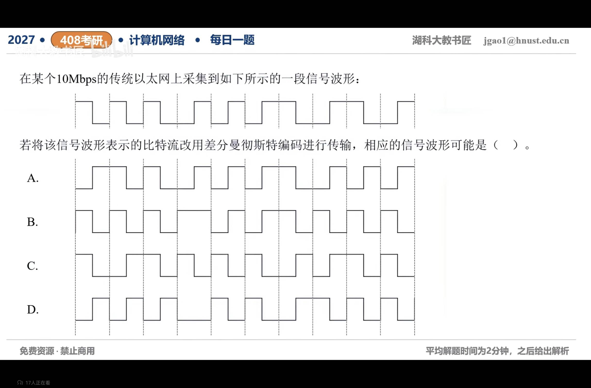

# 408 每日一题

> [!info] 说明  
> 汇总各来源的 408 每日一题，按科目分区、各自编号。  
> 题目版权归对应来源所有，仅作个人学习整理，免费资源 · 禁止商用。  
> **当前来源**：[湖科大教书匠](https://space.bilibili.com/360996402)、[零壹计算机考研](https://space.bilibili.com/521521146)

> [!abstract] 科目导航
>
> - [[#一、数据结构]]
> - [[#二、计算机组成原理]]
> - [[#三、操作系统]]
> - [[#四、计算机网络]]

---

# 一、数据结构

> [!abstract] 题号索引
>
> - [[#No.001 双层循环的时间复杂度]]
> - [[#No.002 内层次数带 i 的双层循环复杂度]]

## No.001 双层循环的时间复杂度

> [!note] 标签  
> #零壹计算机考研 #时间复杂度 #双层循环 #循环变量共享

**来源**：零壹计算机考研　**题型**：单选题

### 题目

下列程序段的时间复杂度是（　　）。

```c
sum = 0;
for (int i = 1; i <= n; i++) {
    for (int j = 1; j <= n; j++) {
        sum++;
        i++;
    }
}
```

- A. $O(\log_{2}n)$
- B. $O(n)$
- C. $O(n\log_{2}n)$
- D. $O(n^{2})$

### 答案

> [!success] 正确答案：B

### 我的作答

> [!question] 我选 B —— 正确  
> 关键是认出内层的 `i++` 会把外层循环变量顶出范围——外层实际只跑 1 轮。

### 解析

**思路**（按库里 `1. 数据结构知识.md` 的多变量处理法：列举 i 与 j 的变化，求和找出与 n 的关系）：

1. 内层 `for (j = 1; j <= n; j++)` 的循环条件只看 `j`，与 `i` 无关 → **每进一次内层就完整跑满 n 次**。
2. 内层循环体里除了 `sum++` 还有 `i++`：内层每循环一轮就把 `i` 加 1，所以内层跑完 `i` 净增 n。
3. 再看外层：`i = 1` 进入 → 内层跑完 `i = 1 + n` → 外层 `i++` 后 `i = n + 2 > n`，**第二次判断就不成立**，整个外层只执行 1 次。
4. 故总执行次数 = 内层的 n 次 + 常数次外层开销，即 $T(n) = n + O(1) = O(n)$。

**逐项**：

- **B 正确**：外层常数次 × 内层 n 次 = $O(n)$。
- **D 错**：看到两层嵌套就条件反射相乘。双重循环是 $O(n^{2})$ 的前提是**两层各自跑满**；本题外层被内层的 `i++` 压成了常数轮。
- **A 错**：$O(\log n)$ 要求每轮规模折半或倍增，本题没有这种跳跃。
- **C 错**：$O(n\log n)$ 需要「一层线性 × 一层对数」，本题是「常数层 × 线性层」。

---

## No.002 内层次数带 i 的双层循环复杂度

> [!note] 标签  
> #零壹计算机考研 #时间复杂度 #等比级数 #双重循环

**来源**：零壹计算机考研　**题型**：单选题

### 题目

下列程序段的时间复杂度是（　　）。

```c
i = 1;
while (i <= n) {
    j = i;
    while (j <= n) {
        j += i;
    }
    i *= 2;
}
```

- A. $O(n)$
- B. $O(n^{2})$
- C. $O(\log n)$
- D. $O(n\log n)$

### 答案

> [!success] 正确答案：A

### 我的作答

> [!question] 我选 A —— 正确  
> 干扰项 **D 是 $O(n\log n)$**。

### 解析

**概念**：外层 `i` 每次**翻倍**（$1,2,4,8,\dots$）→ 外层是**对数次**；但内层 `j` 从 `i` 开始、**步长也是 `i`** → 内层跑 $\lfloor n/i \rfloor$ 次，==**次数随外层变量变化，不能直接"外层 × n"**==。

**算链**：

$$\sum_{i=1,2,4,8,\dots}\left\lfloor \frac{n}{i} \right\rfloor = n\left(1+\frac12+\frac14+\cdots\right) < n\sum_{k\ge0}\frac{1}{2^{k}} = 2n$$

等比级数**收敛到常数 2**（不是发散的），所以

$$T(n)=\Theta(n)\;\Longrightarrow\;\textbf{A. }O(n)$$

**精确值**（$n$ 是 2 的幂时，实测）：$T(n)=n\!\left(2-\dfrac{1}{n}\right)=2n-1$

| $n$ | 8 | 16 | 32 | 64 | 128 | 1024 |
| --- | --- | --- | --- | --- | --- | --- |
| 实际执行次数 | 15 | 31 | 63 | 127 | 255 | 2047 |

非 2 的幂时略小（$n=1000\Rightarrow 1994$），仍是 $\Theta(n)$。

**逐项排除**：

| 选项 | 判定 |
| --- | --- |
| **A $O(n)$** | ✔ 等比级数收敛 → 总次数 $<2n$ |
| B $O(n^{2})$ | ✗ 没有哪一层跑满 $n$ 的平方级 |
| C $O(\log n)$ | ✗ 内层每一次都是**线性**的（不是只跑 1 次） |
| D $O(n\log n)$ | ✗ ==**本题最大的陷阱**== —— 只有"内层次数**恒为 $n$**、与外层无关"时才会乘出 $n\log n$ |

**坑**：

1. ==**先看"内层的次数里有没有外层变量"**==：本题内层是 $\lfloor n/i\rfloor$，**带 $i$** → 必须**求和**；若内层恒为 $n$ 次 → 直接**相乘**。
2. **`i *= 2` 是"倍增"**，正是外层对数次的来源；顺带注意 `j += i` 的**步长也是 $i$**（不是 1）。
3. **等比级数 $\sum_{k\ge0}2^{-k}=2$ 收敛** —— 这就是"看着像 $n\log n$、实际是 $O(n)$"的原因：$i$ 每翻一倍，内层就少一半。
4. **取整不影响阶**：非 2 的幂时实测 1994 vs 上界 1999，仍是 $\Theta(n)$。

> **一句话记法**：**内层次数带外层变量（$n/i$）→ 求和，等比收敛到 $2n$，得 $O(n)$；内层次数恒为 $n$（与外层无关）→ 相乘，得 $O(n\log n)$。**

---

# 二、计算机组成原理

> [!abstract] 题号索引
>
> - [[#No.001 加法运算标志位的组合分析]]

## No.001 加法运算标志位的组合分析

> [!note] 标签  
> #零壹计算机考研 #标志位 #溢出 #进位 #补码

**来源**：零壹计算机考研　**题型**：单选题

### 题目

若某次**整数加法**运算后，标志位 **OF = CF = 1**，则二元组 **（ZF, SF）** 的可能取值有（　　）种。

- A. 1
- B. 2
- C. 3
- D. 4

### 答案

> [!success] 正确答案：B

### 我的作答

> [!question] 我选 B —— 正确  
> 一句话结论：**OF = CF = 1 时符号位必为 0 → SF 被锁死，只有 ZF 自由**，所以是 2 种。

### 解析

**先把四个标志位的定义摆清楚**。符号按本题讲解图的口径来：设**最高位（符号位）产生的进位输出**为 $C_{n+1}$，**进入符号位的进位输入**为 $C_n$，加减控制信号为 $sub$（加法 sub = 0，减法 sub = 1）。

| 标志     | 含义           | 由谁决定                                                        |
| ------ | ------------ | ----------------------------------------------------------- |
| **CF** | 无符号数运算的进位/借位 | $CF = C_{n+1} \oplus sub$ —— 加法时 sub = 0，退化为 $CF = C_{n+1}$ |
| **OF** | 有符号数是否溢出     | $OF = C_{n+1} \oplus C_n$（符号位的进位输出 ⊕ 符号位的进位输入）              |
| **ZF** | 结果是否为 0      | 结果各位**全 0** 时 ZF = 1                                        |
| **SF** | 结果的符号        | $SF = s_{n-1}$（结果的最高位）                                      |

#### 做法一： 枚举法（把 2 位数的加法全试一遍）

取 n = 2（补码范围 −2 ～ +1），4 个二位数两两相加共 3+2+1 = 6 个不同组合，逐个算进位与结果：

| 算式          | 硬件结果（截取低 2 位） | $C_2$（符号位进位输出） | $C_1$（进入符号位） | CF | OF = $C_2 \oplus C_1$ | 符合 OF=CF=1？ | 结果   | ZF    | SF    |
| ----------- | ------------- | -------------- | ------------ | -- | --------------------- | ----------- | ---- | ----- | ----- |
| 01 + 11     | 100 → `00`    | 1              | 1            | 1  | **0**                 | ✗           |      |       |       |
| **10 + 10** | 100 → `00`    | 1              | 0            | 1  | **1**                 | ✔           | `00` | **1** | **0** |
| **10 + 11** | 101 → `01`    | 1              | 0            | 1  | **1**                 | ✔           | `01` | **0** | **0** |
| 11 + 01     | 100 → `00`    | 1              | 1            | 1  | **0**                 | ✗           |      |       |       |
| **11 + 10** | 101 → `01`    | 1              | 0            | 1  | **1**                 | ✔           | `01` | **0** | **0** |
| 11 + 11     | 110 → `10`    | 1              | 1            | 1  | **0**                 | ✗           |      |       |       |

（讲解图里标红的正是满足条件的三行：`10+10`、`10+11`、`11+10`。）

- 注意 `01+11`、`11+01`、`11+11` 虽然 **CF = 1**，但 $C_1 = 1$ 使 $OF = C_2 \oplus C_1 = 0$，**被排除**；
- 剩下三行给出的 (ZF, SF) 是 **(1, 0)、(0, 0)、(0, 0)** → 不重复的取值只有 **2 种**，选 **B**。

**换成真数看更直观**（2 位补码：`10` = −2、`11` = −1）：

- `10 + 10`：−2 + (−2) = −4，溢出，硬件结果 `00` → **ZF = 1、SF = 0**
- `10 + 11` / `11 + 10`：−2 + (−1) = −3，溢出，硬件结果 `01` → **ZF = 0、SF = 0**
- `11 + 11`：−1 + (−1) = −2，**和仍在范围内，不溢出** → OF = 0，排除

#### 做法二：分析法（不用碰进位数，全靠符号推理）

推导链一共四步，环环相扣：

1. **OF = 1 ⟹ A、B 一定同号**（异号相加绝不会溢出）；
2. **同号里再分两正 / 两负，而 CF = 1 把"两正"排除了**：  
   两个正数的符号位都是 0，符号位相加最多是 $0 + 0 + 1 = 1$，**不可能产生进位输出** → CF 必为 0。  
   ∴ 只能是**两负**，即 **A = `1xxxxxxx`、B = `1yyyyyyy`**；
3. **两负数相加，结果本应是负数；但 OF = 1 说明发生了溢出** ⟹ 结果的**符号位被翻转**成了 0 ⟹ **SF = 0**（唯一取值，被彻底锁死）；
4. **ZF 独立判断**：两负数的和越小越可能全 0。极端例子取 **A = B = `10000000`**（即 −128）：−128 + (−128) = −256，溢出后截取 8 位得 `00000000` → **ZF = 1**；其他组合结果非全 0 → **ZF = 0**。

→ (ZF, SF) 只有 **(1, 0)** 和 **(0, 0)** 两种 → **2 种**，选 **B**。

**这条链最短**：抓住「OF = 1 → 同号」「CF = 1 → 不能是两正 → 两负」「溢出 → 符号位翻转」三句，符号位就定了。

#### 做法三： 进位信号法（从 CF、OF 的定义式解进位）

直接用两条定义式联立：

$CF = C_{n+1} \oplus sub = 1 \quad\Longrightarrow\quad C_{n+1} = 1 \quad(\text{加法 } sub = 0)$

$OF = C_{n+1} \oplus C_n = 1 \quad\Longrightarrow\quad C_n = 0 \quad(\text{已知 } C_{n+1} = 1)$

**两个进位信号都被解出来了**：符号位**产生了**进位输出（$C_{n+1} = 1$），却**没有收到**进位输入（$C_n = 0$）。

回到符号位那一位全加器：$a_{n-1} + b_{n-1} + C_n = s_{n-1} + 2C_{n+1}$，代入 $C_n = 0$、$C_{n+1} = 1$：

$a_{n-1} + b_{n-1} = s_{n-1} + 2$

而 $a_{n-1}, b_{n-1} \in \{0, 1\}$，左边最大为 2 → **只能 $a_{n-1} = b_{n-1} = 1$、$s_{n-1} = 0$**。

- 两个加数符号位都是 1 → 又是 **A = `1xxxxxxx`、B = `1yyyyyyy`（两负）**；
- 结果符号位是 0 → **SF = 0**；
- ZF 同做法二（取 A = B = `10000000` 时 ZF = 1，其余为 0）→ **2 种**，选 **B**。

**sub 在这里的角色**：$sub$ 是**加减控制信号** —— 加法时 sub = 0、最低位进位输入也是 0；减法时 sub = 1，同时把 B 各位取反、最低位进位输入置 1。它出现在 **CF 的定义式**（$CF = C_{n+1} \oplus sub$）里：减法时 $CF = \overline{C_{n+1}}$，正好对应"借位"的语义。而 **OF 的定义式不含 sub**，无论加减都是 $C_{n+1} \oplus C_n$。

#### 三种做法对比

| 做法        | 怎么做                                                                                 | 什么时候用                     |
| --------- | ----------------------------------------------------------------------------------- | ------------------------- |
| **枚举法**   | 取 n = 2，把 6 种加法全试一遍，筛出 CF = OF = 1 的三行                                              | 选择题**最快最稳**，不用记任何公式       |
| **分析法**   | OF=1 → 同号；CF=1 → 排除两正 → 两负；溢出 → 符号位翻转 → SF = 0                                      | 需要讲清**为什么**，逻辑链最短         |
| **进位信号法** | 由 $CF = C_{n+1} \oplus sub$、$OF = C_{n+1} \oplus C_n$ 解出 $C_{n+1}=1$、$C_n=0$，再回代符号位 | 与**加法器硬件**（进位链）挂钩，写推导时最正规 |

**三条路殊途同归**：符号位只能是 0（SF 被锁死），ZF 可 0 可 1 → **(ZF, SF) 共 2 种**。

**易错点**：

1. 别把 **CF 和 OF 混为一谈**：CF 管**无符号**（只看有没有进位），OF 管**有符号**（看符号位前后进位的异或）。本题两者都是 1，说明"无符号溢出"和"有符号溢出"同时发生。
2. **OF = 1 且 CF = 1 时符号位必为 0** —— 这是本题唯一需要记住的结论。
3. 别漏了 **ZF 的独立性**：ZF 由结果的**全部数据位**决定，与符号位不冲突，所以能取 2 个值。看到"有几种取值"就要想"哪些位被约束了、哪些还自由"。

---

# 三、操作系统

> [!abstract] 题号索引
>
> - [[#No.001 中断处理时进程的状态]]
> - [[#No.002 地址映射与地址转换的透明性]] ⚠️
> - [[#No.003 read 唤醒时数据的位置]]
> - [[#No.004 优先级抢占调度求完成时刻]]
> - [[#No.005 管道内核缓冲区的数据结构]]
> - [[#No.006 信号处理各步骤的运行态]] ⚠️
> - [[#No.007 安全状态检测算法的时间复杂度]]
> - [[#No.008 让工作集尽可能驻留该选哪个置换算法]]
> - [[#No.009 用条件变量保证 B 先于 A 执行]]
> - [[#No.010 伙伴系统里"相邻"与"伙伴"的区别]]
> - [[#No.011 由无向图求最少互斥信号量个数]]
> - [[#No.012 动态链接相比静态链接的优点]] ⚠️
> - [[#No.013 操作系统的模块化设计「不包括」哪项优势]]
> - [[#No.014 设备驱动程序的接口规范由谁决定]] ⚠️

## No.001 中断处理时进程的状态

> [!note] 标签  
> #零壹计算机考研 #进程状态 #中断处理 #状态转换

**来源**：零壹计算机考研　**题型**：单选题

### 题目

进程 P 响应键盘输入中断并开始执行中断服务程序时，进程 P 处于（　　）。

- A. 就绪态
- B. 运行态
- C. 阻塞态
- D. 挂起态

### 答案

> [!success] 正确答案：B

### 我的作答

> [!question] 我选 B —— 正确  
> 关键是认出中断处理程序不是进程、期间不发生进程切换——P 没被挂进就绪队列，状态不变。

### 解析

**一、先看清题干的两处措辞**

- 「**响应**中断」：这是**硬件**动作（中断隐指令：关中断 → 保存断点 PC/PSW → 按中断号查中断向量表 → 转入中断服务程序），由硬件自动完成，不需要指令参与。
- 「**开始执行中断服务程序**」：这是**软件**阶段，由内核的中断处理代码完成。

整个过程中，P 的执行流只是被打了个岔，**CPU 的"所有权"始终在 P 手里**，从没交给别的进程。

**二、为什么说"中断处理程序不是进程"**

- 进程 = 程序段 + 数据段 + **PCB**，是资源分配和调度的独立单位；
- 中断处理程序是**内核代码**，**没有自己的 PCB**，不参与调度、也不允许被调度；
- 它只是"借用"当前进程 P 的内核栈、页表等上下文，执行完 `iret` 就返回 P 被打断的那一条指令处。

**关键推论**：它既然不是进程，整个过程就**不会发生进程切换**；不发生进程切换，P 的 PCB 里 `state` 字段就**不会被改写，P 也不会被挂进就绪队列** → P 的状态保持不变。

**三、用三态的定义去卡**

| 状态  | 定义                     | P 符合吗                       |
| --- | ---------------------- | --------------------------- |
| 运行态 | **已获得 CPU，正在 CPU 上执行** | ✔ 中断处理程序用的是 P 的上下文、P 占着 CPU |
| 就绪态 | 已具备运行条件，**在等 CPU**     | ✘ P 没进就绪队列，也没在等调度           |
| 阻塞态 | 在等某个事件，**CPU 空闲也不能运行** | ✘ P 没等任何东西                  |

所以 P 处于**运行态**，选 **B**。

**四、什么情况才真的会变状态（这张表要背下来）**

| 触发事件                           | 转换           | 本质                   |
| ------------------------------ | ------------ | -------------------- |
| 时间片到                           | 运行 → 就绪      | 调度程序**换人**           |
| 被更高优先级进程抢占                     | 运行 → 就绪      | 调度程序**换人**           |
| P 主动请求资源 / 等待事件（如 `read`）      | 运行 → 阻塞      | P **主动**放弃 CPU       |
| **P 等待的事件完成**（该设备的 I/O 完成中断到来） | 阻塞 → 就绪      | 中断处理程序执行**唤醒**原语     |
| **P 被打断、转去执行中断处理程序**           | **不变（仍运行态）** | 只是**打断执行流**，不换人 ← 本题 |

核心分界线：**"被打断执行流" ≠ "被换下 CPU"**。只有后者才改状态。

**五、本题最大的争议点：A 就绪态**

有部分资料流传"中断处理期间被中断进程处于就绪态"，理由是"CPU 被中断处理程序占用了，所以 P 不再占有 CPU"。这个说法站不住：

1. **自相矛盾**：中断处理期间**禁止进程调度**。如果 P 真被放进就绪队列，调度程序一运行就可能把 CPU 分给别人，中断处理就无法保证及时完成——两者不可能同时成立。
2. **返回路径不同**：中断返回时 CPU 是**直接回到 P 被打断的那条指令**，**不经过调度器**。这也说明 P 从未离开运行态。
3. **教材口径**：库里 `4.操作系统.md` 2.1.4 写明，运行 → 就绪的触发条件只有「**时间片到 / 被抢占**」，都属于"换人"；中断处理不属于换人。

零壹给的 **B（运行态）** 与 408 教材口径一致。**但真要遇到官方标 A 的卷子，以官方答案为准** —— 这题真正的分值在于"能说清为什么"。

**六、三个变体，一题三吃**

| 变体问法                         | 答案          | 理由                         |
| ---------------------------- | ----------- | -------------------------- |
| 「P 正在等待的 I/O 完成，该设备的中断到来」    | **阻塞 → 就绪** | 等的事件发生了，中断处理程序执行唤醒原语       |
| 「P 的时间片用完（产生时钟中断）」           | **运行 → 就绪** | 时钟中断的语义就是"该换人了"，处理程序会调用调度器 |
| 「时钟中断处理程序**正在执行**时，P 处于什么状态」 | 仍是**运行态**   | 调度决策还没做出；决策做出后才把 P 转成就绪    |

**七、库内已补的对应条目**

`4.操作系统.md`「2.1.4 进程的状态与转换」节末尾有一块 `> [!warning] 中断处理时进程处于什么状态`，三条要点 + "什么时候才真的换态" + 排除项，与本题一一对应，可对照复习。

---

## No.002 地址映射与地址转换的透明性

> [!note] 标签  
> #零壹计算机考研 #透明性 #地址映射 #地址转换 #指令系统

**来源**：零壹计算机考研　**题型**：单选题

### 题目

下面过程对指令系统透明的是（　　）。

- A. 中断处理
- B. 中断初始化
- C. 地址映射
- D. 地址转换

### 答案

> [!success] 正确答案：D

### 我的作答

> [!warning] 我选 C —— 错误  
> **错因**：A、B 用「中断肯定要涉及指令」排掉是对的；卡在 C、D 上时把「映射」和「转换」当成同一件事了，没建立「映射＝软件、转换＝硬件」这条区分线。按本题的辨析：**地址映射是软件过程**——OS 用一条条指令去分配页框、创建页表和修改页表，指令系统全程看得见 → **不透明**；**地址转换是硬件过程**——MMU 在运行时自动完成，没有任何一条"转换指令" → 指令系统感知不到 → **透明**。

### 解析

**判据**：库里 `2.计算机组成原理笔记.md` 1.4.1 给出「透明 = 看不见 = 不需要关心」。套到本题，就是问**哪个过程不需要指令参与、指令系统感知不到**。实际上就是只需要硬件就能完成

| 过程    | 由谁完成                        | 需要指令参与吗      | 对指令系统    |
| ----- | --------------------------- | ------------ | -------- |
| 中断处理  | 中断服务程序（本身就是指令序列）            | 需要           | 不透明      |
| 中断初始化 | OS 用指令设置中断向量表、开中断等          | 需要           | 不透明      |
| 地址映射  | **软件**：OS 分配和创建页表、页框分配、修改页表 | 需要（一条条指令改页表） | 不透明      |
| 地址转换  | **硬件**：MMU 在程序运行时自动完成       | 不需要          | **透明** ✓ |

故只有 **D 地址转换**对指令系统透明。

**零壹的原文辨析**（照录）：

- **地址映射**（address mapping）：指建立逻辑地址与物理地址之间的映射关系，在虚拟页式管理中对应了分配和创建页表，页框分配和修改页表等过程。
- **地址转换**（address translation）：指通过 MMU 实现从虚拟地址向物理地址转换的过程，其具体过程与 TLB 等硬件息息相关。
- 地址映射是**软件**过程，地址转换是**硬件**过程，只有先经过了地址映射，地址转换才能正确进行。

**易错点**：

1. 「映射」和「转换」中文只差一个字，但前者是 OS 建表（软件、要指令），后者是 MMU 查表换算（硬件、不要指令）——本题就考这一刀。
2. 注意别被「中断隐指令」这个名字误导：它虽然叫"指令"，实际由**硬件**自动完成（关中断、保存断点、取中断入口）；但**中断处理**整体是实实在在的指令序列 → 仍不透明。
3. 交叉参考：地址转换的硬件实现（MMU、TLB、页表）见 `4.操作系统.md` 3.2 内存管理与 `3.存储系统串联.md`。

---

## No.003 read 唤醒时数据的位置

> [!note] 标签  
> #零壹计算机考研 #内核缓冲区 #用户缓冲区 #DMA #系统调用

**来源**：零壹计算机考研　**题型**：单选题

### 题目

进程 P 使用 read 系统调用读取文件数据时被阻塞，系统使用 DMA 方式传送磁盘块，则进程 P 被唤醒时对应文件数据位于（　　）中。

- A. 用户缓冲区
- B. 内核缓冲区
- C. DMA 控制器
- D. 磁盘控制器

### 答案

> [!success] 正确答案：B

### 我的作答

> [!question] 我选 B —— 正确  
> 我的理解：数据先落在**系统（内核）缓冲区**，再由内核送到**用户缓冲区**；被唤醒的那一刻只走完第一步。

### 解析

**关键在时刻**——「被唤醒」这个瞬间，数据刚由 DMA 搬进内核缓冲区，还没往用户空间拷。库里 `4.操作系统.md` 5.2「I/O 操作举例」的 read() 流程正好把这条时序写全了：

| 步骤 | 发生的事                                           | 数据在哪                      |
| -- | ---------------------------------------------- | ------------------------- |
| ①  | `sys_read()` 查磁盘高速缓存未命中，从缓冲池取一个缓冲区             | 磁盘上                       |
| ②  | 驱动启动 **DMA**，数据从磁盘**直接搬进内存缓冲区**（不经过 CPU）       | **内核缓冲区**                 |
| ③  | 数据没到，进程**阻塞**（＝题干的"被阻塞"）                       | 内核缓冲区（在传）                 |
| ④  | 传完，DMA 控制器**发中断** → 中断处理程序把缓冲区挂到装满队列、**唤醒原进程** | **内核缓冲区** ← **题目问的就是这一刻** |
| ⑤  | 进程重新被调度，内核把数据**从缓冲区拷到用户空间的 buf**，read 返回       | 两处都有（用户 buf 是新副本）         |

所以唤醒时数据位于**内核缓冲区**，选 **B**。

**逐项排除**：

- **A 用户缓冲区**：拷到用户 `buf` 是第 ⑤ 步，发生在唤醒**之后**（要等进程被重新调度）。这题的分水岭就是"**唤醒时**"这三个字——题目要是改成"read 返回后数据在哪"，才是 A。
- **C DMA 控制器**：DMA 控制器里只有主存地址寄存器、计数器、命令/状态寄存器和数据寄存器，数据寄存器是硬件接口用的临时暂存（字节级），文件数据不在那儿停留。库里的对比表说得很清楚：**缓冲区的数据流向是「设备 → 缓冲区 → 进程取走」**。
- **D 磁盘控制器**：同 C——设备侧的接口硬件，数据只是"路过"，真正的落脚点是内存里的内核缓冲区。

---

## No.004 优先级抢占调度求完成时刻

> [!note] 标签  
> #零壹计算机考研 #进程调度 #优先级抢占 #甘特图

**来源**：零壹计算机考研　**题型**：单选题

### 题目

在基于优先级抢占处理机的单 CPU 系统中，进程 P1、P2 均在 0 时刻就绪，P1 优先级大于 P2，且 P1 和 P2 执行流程均为：**8ms 计算 + 2ms I/O + 5ms 计算**。若全过程无其他进程就绪，进程调度和切换的时间忽略不计，则 P2 执行完毕的时刻为（　　）。

- A. 30ms
- B. 28ms
- C. 23ms
- D. 26ms

### 答案

> [!success] 正确答案：B

### 我的作答

> [!question] 我选 B —— 正确  
> 关键节点是 **t = 10**：P1 的 I/O 一结束、优先级又高于 P2，必须**立刻抢回 CPU**，P2 只能停在"算了一半"的位置上。

### 解析

**时间线推演**（单 CPU、优先级抢占、切换开销为 0）：

| 时刻     | 事件                                     | CPU 上是谁                                 |
| ------ | -------------------------------------- | --------------------------------------- |
| 0      | P1、P2 同时就绪，P1 优先级高                     | **P1** 开始算「计算 1」                        |
| 8      | P1 的「计算 1」做完，发起 **2ms I/O** → P1 阻塞    | CPU 空出 → **P2** 上（算「计算 1」）              |
| 10     | P1 的 I/O 完成 → P1 变就绪 → **优先级高于 P2，抢占** | **P1** 抢回，算「计算 2」；P2 只算了 2ms，**还剩 6ms** |
| 15     | P1 全部完成（8+2+5 = 15）→ CPU 空出            | **P2** 接着算剩下的 6ms                       |
| 21     | P2 的「计算 1」做完（2+6 = 8ms），发起 **2ms I/O** | CPU 空闲（无其他进程就绪）                         |
| 23     | P2 的 I/O 完成                            | **P2** 算「计算 2」（5ms）                     |
| **28** | **P2 全部完成**                            | —                                       |

**甘特图**：


```mermaid
gantt
    title P1、P2 执行甘特图（时间轴 0~28ms）
    dateFormat HH:mm:ss
    axisFormat %S
    todayMarker off

    section P1
    计算1 8ms    :a1, 00:00:00, 00:00:08
    I/O 2ms      :a2, 00:00:08, 00:00:10
    计算2 5ms    :a3, 00:00:10, 00:00:15

    section P2
    计算1 前2ms  :b1, 00:00:08, 00:00:10
    计算1 余6ms  :b2, 00:00:15, 00:00:21
    I/O 2ms      :b3, 00:00:21, 00:00:23
    计算2 5ms    :b4, 00:00:23, 00:00:28
```

因此 **P2 完成于 t = 28ms**，选 **B**。

**干扰项拆解**：

| 选项         | 来历                                                                                                                        |
| ---------- | ------------------------------------------------------------------------------------------------------------------------- |
| **A 30ms** | 误以为「被抢占后进度作废、要重跑」：P2 在 t=8~10 白算 2ms，t=15 从头再跑 8+2+5 = 15 → 15+15 = 30ms                                                  |
| **B 28ms** | ✔ 正确路径（抢占时保留进度，P2 只补算剩余 6ms）                                                                                              |
| **D 26ms** | **按非抢占调度**算出来的结果：P1 的 I/O 在 t=10 完成时不抢，等 P2 自己让出 CPU（P2 在 8→16 一口气算完 8ms，CPU 空闲后 P1 才上，P1 在 16→21 完成，P2 最后一段 21→26）→ 26ms |
| C 23ms     | 其他口径的漏算，不构成有效路径                                                                                                           |

**易错点**：

1. **本题唯一的分水岭就是"可抢占"三个字**。P1 的 I/O 一结束就立刻抢回 CPU —— 这跟"P1 重新获得 CPU 后要从头算"是两回事：**被抢占只是暂停，进度保留**。
2. **I/O 期间不占 CPU**：P1 在 8~~10 做 I/O，CPU 借给 P2；P2 在 21~~23 做 I/O，CPU 空转。这两段千万别算成"占用 CPU"。
3. **P2 的 8ms 计算被切成了两段**（2ms + 6ms），做题时把"分片"标出来就不容易漏。
4. 一旦题目改成"**非抢占**"，答案就是 D 26ms —— 这是常见的换条件考法，见上面的干扰项表。

---

## No.005 管道内核缓冲区的数据结构

> [!note] 标签  
> #零壹计算机考研 #管道 #循环队列 #FIFO

**来源**：零壹计算机考研　**题型**：单选题

### 题目

实现**管道的内核缓冲区**时，最适合使用的数据结构是（　　）。

- A. 栈
- B. 循环队列
- C. 堆
- D. 静态链表

### 答案

> [!success] 正确答案：B

### 我的作答

> [!question] 我选 B —— 正确  
> 关键在「**最适合**」三个字：循环队列不只是"能存"，它的**判空判满恰好就是管道"读空阻塞/写满阻塞"的触发条件**。

### 解析

#### 一、先看管道对缓冲区提了什么要求

管道的本质：**内核里一块固定大小的内存** + 两个文件描述符（读端、写端）。它给缓冲区提了四条要求：

| # | 要求                              | 出处                |
| - | ------------------------------- | ----------------- |
| 1 | **FIFO** —— 写进去的字节必须按写入顺序被读出    | 「FIFO，先写入先读出」     |
| 2 | **容量固定** —— 内核空间有限，创建时就定好，不能无限写 | 「特点：单向，**有容量限制**」 |
| 3 | **空间要反复复用** —— 写满一次不能就废了        | 由 2 推出            |
| 4 | **两端各自记录位置** —— 读端记读到哪，写端记写到哪   | 「一端写、一端读」         |

#### 二、为什么只有循环队列天然满足这四条

| 要求     | 循环队列的对应                                             |
| ------ | --------------------------------------------------- |
| FIFO   | 队列本身就是先进先出：**队尾入队**（写）、**队首出队**（读）                  |
| 容量固定   | 底层就是**定长数组**，无需动态分配                                 |
| 空间复用   | 取模：`rear = (rear + 1) % N`，写到末尾自动绕回开头，**复用已被读走的空间** |
| 两端各记位置 | 两个指针正是 `front`（读端）和 `rear`（写端）                      |

**两个指针 ↔ 管道两端**，这是最漂亮的对应：

```c
// 写端（生产者）
buf[rear] = ch;
rear = (rear + 1) % N;

// 读端（消费者）
ch = buf[front];
front = (front + 1) % N;
```

#### 三、关键：管道的阻塞语义 ＝ 循环队列的判空判满

管道最重要的行为是「**写满就阻塞写进程、读空就阻塞读进程**」。这两条规则落到数据结构上，正好就是循环队列的两个状态判据：

| 管道状态    | 循环队列判据                                   | 内核动作            |
| ------- | ---------------------------------------- | --------------- |
| 管道**满** | `(rear + 1) % N == front`（或 `size == N`） | **写进程阻塞**，进等待队列 |
| 管道**空** | `front == rear`（或 `size == 0`）           | **读进程阻塞**，进等待队列 |
| 非空      | `front != rear`                          | 唤醒等待的读进程        |
| 非满      | `(rear+1) % N != front`                  | 唤醒等待的写进程        |

**这就是"最适合"的真正含义**：循环队列不只是"能存数据"，它的**状态判据直接对应管道的同步逻辑** —— 判空判满这两个条件，恰恰就是"该阻塞谁、该唤醒谁"的触发条件。换成栈、链表，这个对应关系就得另写一套。

#### 四、还省了两笔开销

- **不用搬数据**：普通（非循环）顺序队列出队后要整体前移（$O(n)$），或指针单向推进到末尾就"**假溢出**"（前面明明空着却写不进去）。循环队列用取模一次性解决。
- **不用动态分配**：管道是**按字节**高频读写，若用链表/堆，每读写一次都要申请释放节点，开销和碎片都受不了。

#### 五、逐项排除

| 选项          | 排除理由                                                                                             |
| ----------- | ------------------------------------------------------------------------------------------------ |
| **A. 栈**    | LIFO（后进先出），与管道"按写入顺序读出"的 FIFO 要求**正好相反**                                                         |
| **C. 堆**    | **堆不是数据结构**，它是用于**动态内存分配**的内存区域（`malloc`/`new` 的来源）。管道缓冲区是内核创建的固定空间，不是堆上动态分配的 —— **概念错位**        |
| **D. 静态链表** | 用数组模拟链表，逻辑上确实能实现 FIFO，但要额外维护"空闲节点链 + 数据链"（游标 next），读一个字节要跳指针、还要管节点回收；**空间与实现成本都高于循环队列**，谈不上"最适合" |
| **B. 循环队列** | ✔ 定长数组 + 两指针 + 取模，FIFO、固定容量、判空判满三件事一次解决                                                          |

#### 六、一句话记法

> **管道 ＝ 定长数组 + 两个指针 + 取模。** FIFO 对应"队列"，容量固定且要复用对应"循环"，判空判满对应"阻塞 / 唤醒"。

---

## No.006 信号处理各步骤的运行态

> [!note] 标签  
> #零壹计算机考研 #信号 #用户态 #内核态 #系统调用

**来源**：零壹计算机考研　**题型**：单选题

### 题目

下列**用户自定义信号**的实现和处理过程中，在**用户态**下完成的是（　　）。

- A. 检测和响应信号
- B. 执行信号处理函数
- C. 注册信号处理入口
- D. 将信号递送到目标进程

### 答案

> [!success] 正确答案：B

### 我的作答

> [!warning] 完全没印象 —— 没写出来  
> **错因**：对「信号」这个机制只记住了一句"异步通信、只能传通知"，**没有建立信号的完整生命线**（注册 → 检测响应 → 递送 → 执行），所以四个步骤各在哪一侧完全无从判断。  
> 补救的主线就一条：**四步里只有"执行处理函数"发生在用户态，其余三步都是内核的活儿。**

### 解析

#### 一、信号的完整生命线（四步分别在哪儿）

用户自定义信号从"注册处理函数"到"函数被执行"，要经过四步：

| 步 | 动作             | 谁在做                                                             | 处于哪个态     |
| - | -------------- | --------------------------------------------------------------- | --------- |
| ① | **注册信号处理入口**   | 用户程序调用 `signal()` / `sigaction()`，**陷入内核**，由内核把处理函数地址登记到 PCB    | **内核态**   |
| ② | **检测和响应信号**    | 内核在**从内核态返回用户态之前**（以及进程被唤醒时）扫描 PCB 里的**未决（pending）信号集**，判断该不该处理 | **内核态**   |
| ③ | **将信号递送到目标进程** | 内核把信号写入目标进程 PCB 的未决集合，并设置待处理标志                                  | **内核态**   |
| ④ | **执行信号处理函数**   | 内核在返回用户态前改写栈帧，让进程返回后**跳到用户自己写的那段代码**上执行                         | **用户态** ✔ |

所以只有 **B 执行信号处理函数** 在用户态完成。

#### 二、逐项辨析

**A. 检测和响应信号 —— 内核态**

信号不是"用户程序自己去查"的。内核在**每次从内核态返回用户态前**（系统调用返回、中断返回）做一次检查，看 PCB 里的未决信号集有没有该处理的。这是内核的例行巡逻，用户程序根本感知不到这个过程。

**C. 注册信号处理入口 —— 内核态（本题最大的迷惑项）**

关键要分清"**谁发起**"和"**谁完成**"：

- **发起**：确实是用户在用户态写下 `signal(SIGUSR1, my_handler)`；
- **但这是一个系统调用** —— CPU 会从用户态**陷入内核态**，真正"注册"的动作（把 `my_handler` 的地址写进进程 PCB 的信号处理表）是**内核在内核态完成的**。

所以这一项**算内核态**。别看它由用户发起就选它。

**D. 将信号递送到目标进程 —— 内核态**

`kill()` 只是用户态发起的一个请求，真正的"递送"是内核把信号放进目标进程的 PCB（未决集合）里，并择机触发处理。递送动作本身由内核执行。

#### 三、一个容易忽略的细节：处理函数返回时又要进内核

处理函数（用户态代码）执行完之后，不能直接跳回被中断处 —— 它要通过 `sigreturn` 这个系统调用**回到内核**，由内核恢复被中断的现场，再返回用户态继续执行。

所以完整路径是：

$\text{用户态} \xrightarrow{\text{信号被检出}} \text{（内核态处理）} \to \text{用户态执行处理函数} \xrightarrow{\text{sigreturn}} \text{内核态} \to \text{用户态（原处继续）}$

**"用户态执行处理函数"这一段，是整条链里唯一在用户态跑业务代码的环节** —— 这正是本题选 B 的根据。

#### 四、易错点

1. **"注册"不等于"在用户态完成"**：`signal()`、`sigaction()` 都是**系统调用**，注册的实际动作由内核执行。
2. **检测 / 响应 / 递送这三步全靠内核**，用户程序无法自己查未决信号、也无法自己递送。
3. **信号处理函数是用户写的代码**（不是内核例程）—— 记住这个定位，B 就不会错。
4. 别与**中断**混淆：中断处理程序是**内核代码**（内核态）；信号处理函数是**用户代码**（用户态）。这是两套机制。

#### 五、一句话记法

> **注册、检测、递送 —— 这三步是内核的活儿；只有"执行处理函数"是你自己写的代码、在用户态跑。**

---

## No.007 安全状态检测算法的时间复杂度

> [!note] 标签  
> #零壹计算机考研 #银行家算法 #死锁避免 #安全序列 #时间复杂度

**来源**：零壹计算机考研　**题型**：单选题

### 题目

若系统中有 $m$ 类资源与 $n$ 个进程，资源总量为 $k$，则安全状态检测算法消耗的时间复杂度为（　　）。

- A. $O(mn)$
- B. $O(mn^2)$
- C. $O(mnk)$
- D. $O(m^2n)$

### 答案

> [!success] 正确答案：B

### 我的作答

> [!question] 我选 B —— 正确  
> 抓住了"每轮挑一个进程能做完"这个结构，认出外层最多转 $n$ 轮、每轮扫 $n$ 个进程、每个进程比 $m$ 类资源。

### 解析

#### 一、安全状态检测算法在做什么

这是银行家算法里的**安全性检查**那一半：拿当前可用向量 `Work`，反复"找一个 `Need[i] ≤ Work` 的进程，让它跑完并归还资源"，看能否把所有进程都跑完。

```
Work = Available;
Finish[i] = false;
while (存在 i：Finish[i] == false 且 Need[i] ≤ Work) {
    Work = Work + Allocation[i];   // Pi 完成，归还资源
    Finish[i] = true;
}
安全 ⟺ 所有 Finish[i] == true;
```

==重活不在循环体（循环体就一句加法），而在"判断要不要再转一圈"上——`while` 的条件本身就要扫一遍所有进程==。抓住这点，复杂度是自然推出来的。

#### 二、复杂度：数两个数

拆成两层数：**"找一个进程"要多少 × "找进程"这件事做几次**。

- **找一个进程**（即 `while` 转一圈）：扫一遍所有进程 —— $n$ 个进程，每个比 $m$ 类资源 → $nm$。
- **"找进程"这件事**：要做 $n$ 次 —— 一次只消掉一个进程（标记 `Finish = true`），共 $n$ 个，所以要找 $n$ 次。

$T(n,m)=O(n)\times O(nm)=O(mn^2)$

读作：**"找进程"做 $n$ 次 × 每次找花 $nm$（扫 $n$ 个、比 $m$ 类）= $mn^2$。**

| 数什么      | 上限   | 为什么                      |
| -------- | ---- | ------------------------ |
| "找进程"做几次 | $n$  | 每找到 1 个只消掉 1 个进程，共 $n$ 个 |
| 每找一次花多少  | $nm$ | 扫 $n$ 个进程，每个比 $m$ 类资源    |

#### 三、卡点：为什么是 $n^2$ 而不是 $n$

`while` 每转一圈都要==把进程从头重扫一遍，不能接着上一圈的位置往下扫==。

原因：每做完一个进程，`Work` 就变大一点，==上一圈"吃不饱"的进程，这一圈可能就吃得饱了==，所以必须回头重扫。"扫描"因此发生了 $n$ 次，每次扫 $n$ 个 → $n^2$，再乘每次比较的宽度 $m$。

> 别把它看成"三层循环"：伪代码只有两层（`while` + 扫描），$m$ 是一次比较的宽度，不是第三层循环。漏掉"转 $n$ 圈"这一层，就掉进 A 项 $O(mn)$。

#### 四、逐项辨析

**A. $O(mn)$ —— 少了一层**

只算了"扫 $n$ 个进程 × 比 $m$ 类资源"这一圈的代价，漏掉 `while` 要转 $n$ 圈。凡是"反复找、每次只消掉一个"的算法，都要乘上这个 $n$ 倍。

**B. $O(mn^2)$ —— 正确**

$n$（圈数）× $n$（每圈扫的进程数）× $m$（每次比较的资源类数）。

**C. $O(mnk)$ —— 混进了资源总量 $k$**

$k$ 是资源的**数值**，不是**规模**。申请 10000 个资源和申请 1 个资源，在算法里都只是**一次比较**，代价相同。复杂度衡量随规模增长的趋势，$k$ 不进入。==矩阵形式的复杂度基本不看数值。==

**D. $O(m^2n)$ —— 把两个字母换了位置**

$m$ 在每次判定里是**线性扫一遍**（逐类比较），不是嵌套两层。要出 $m^2$，得有"对每一类资源再遍历一遍所有资源类"的结构，本算法里没有。

#### 五、易错点

1. ==忘记乘"圈数" $n$== → 掉进 A 项 $O(mn)$，本题主坑。
2. ==把资源总量 $k$ 当规模== → 掉进 C 项。"个数"不是"规模"。
3. $m$、$n$ 角色别混：$n$ = 进程数（决定圈数），$m$ = 资源类数（决定每次比较的宽度）。$n$ 是平方那个，$m$ 是一次方那个。
4. 记忆钩子：==几圈 × 每圈几个 × 每次几类 = $n\cdot n\cdot m$==。

#### 六、一句话记法

> **"找进程"这件事做 $n$ 次 —— 一次只消掉一个进程；每次找要 $nm$ —— 扫 $n$ 个进程、每个比 $m$ 类资源。合起来 $O(mn^2)$。$k$ 是数值不是规模，不进复杂度。**

---

## No.008 让工作集尽可能驻留该选哪个置换算法

> [!note] 标签  
> #零壹计算机考研 #工作集 #驻留集 #页面置换算法 #LRU

**来源**：零壹计算机考研　**题型**：单选题

### 题目

（**零壹二模**）假设进程的**工作集为 P**，**驻留集为 Q**，则要使 $P \cap Q$ 中**元素数量尽可能多**，应采用下列置换算法中的（　　）。

- A. LRU
- B. LFU
- C. CLOCK
- D. OPT

### 答案

> [!success] 正确答案：A

### 我的作答

> [!question] 我选 A —— 正确

### 解析

**先分清 P 和 Q**（这是全题的地基）：

|           | 是什么                            | 由什么决定            |
| --------- | ------------------------------ | ---------------- |
| **工作集 P** | 进程**在某时间段 $\Delta$ 内访问过的页面集合** | 程序的**局部性**（访问历史） |
| **驻留集 Q** | 进程**当前在内存中的页框集合**              | 系统给它的**页框分配**    |

所以 $P \cap Q$ = "**工作集里那些确实还在内存的页面**"。要让这个交集尽可能大，就是==**别把正在用的页面换出去**==。

**判据**：谁的淘汰策略最贴近"最近访问过的那一批页面"，谁的交集就最大。

| 算法      | 淘汰谁               | 与工作集的吻合度                                        |
| ------- | ----------------- | ----------------------------------------------- |
| **LRU** | 淘汰==**最久未被访问**==的 | ==**天然吻合**==：留下的正是"最近访问过的"一批 → 最贴近 P ✔          |
| LFU     | 淘汰**访问次数最少**的     | 次数少 ≠ 最近没用；**刚调入、正被频繁使用的新页会被误杀**                |
| CLOCK   | 用**访问位**近似 LRU    | 只是 LRU 的近似，精度不如 LRU                             |
| OPT     | 淘汰**未来最久不用**的     | 理论缺页率最低，但==**要预知未来，无法实现**== → 题目问"**应采用**"，它用不了 |

→ **选 A**

**坑**：

1. **OPT 看着最优，但"应采用"要选能实现的** —— OPT 是**理论基准**，不是可用算法。题面出现"应采用 / 实际采用"就是排除 OPT 的信号。
2. **别把 P 和 Q 混了**：P 是"**该在内存里的**"（按访问历史），Q 是"**实际在内存里的**"（按页框分配）。$P \cap Q$ 越大 = **该在的都在** = 缺页率越低。
3. **LFU 的典型坑**：新调入的页面访问次数天然少，LFU 会优先淘汰它 —— 而它可能正被频繁使用。
4. 库里有现成结论可直接引：==**驻留集 ≥ 工作集大小，才能避免频繁缺页**==。

> **一句话记法**：**LRU 留下的就是"最近访问过的一批" = 最贴近工作集；OPT 虽最优但不可实现，问"应采用"就选 LRU。**

---

## No.009 用条件变量保证 B 先于 A 执行

> [!note] 标签  
> #零壹计算机考研 #条件变量 #管程 #同步 #谓词

**来源**：零壹计算机考研　**题型**：单选题

### 题目

（**零壹 day86**）线程 T1、T2 中包含如下代码：

```
T1 {  操作① ;  A();  }        T2 {  B();  操作②  }
```

为了保证 **B 先于 A 执行**，引入了**条件变量 x** 和**标志变量 flag**（`flag == true` 代表 B 已经执行），则**操作①**的代码为（　　）。

- A. `x.wait()`
- B. `while(flag) x.wait()`
- C. `while(!flag) x.wait()`
- D. `x.signal()`

### 答案

> [!success] 正确答案：C

### 我的作答

> [!question] 我选 C —— 正确

### 解析

**先看清谁等谁**：要求 **B 先于 A** → **A 这一侧必须等** → 操作① 在 T1 里、A 之前，是**等待方**；操作② 在 T2 里、B 之后，是**通知方**。

**flag 的含义**：`flag == true` = **B 已执行完**（可以放行 A 了）。

**正解 C：`while(!flag) x.wait()`**

- `!flag` = "B 还没执行" → **条件不满足就等**（`x.wait()`）
- 被唤醒后**回到 while 再查一次** → 条件真满足了才跳出 → 执行 A ✓

**逐项排除**：

| 选项                       | 错在哪                                                                                                                                             |
| ------------------------ | ----------------------------------------------------------------------------------------------------------------------------------------------- |
| A `x.wait()`             | ==**缺条件判断**==。若 T2 先跑完 B 并 signal，而 T1 这时**还没 wait** → 这次 signal 就"空放"了（==条件变量的 signal **不会缓存**==）→ 之后 T1 才 wait，==永远等不到下一次 signal== → A 永不执行 ✗ |
| B `while(flag) x.wait()` | ==**条件写反**==：flag 为 true 表示 B 已完成、**该放行**，这里反而去 wait → 死等 ✗                                                                                     |
| **C**                    | ✔ `!flag`（B 未完成）才等；B 完成后 flag = true，直接跳过 wait 去执行 A                                                                                            |
| D `x.signal()`           | ==**角色错了**==：操作① 在 T1 里、A 之前，T1 是**等待方**，不该去唤醒别人。signal 应由 T2 在 B 之后发（即操作② 的内容）✗                                                                |

**操作② 应该是什么**（题目没问，顺手记）：`flag = true; x.signal();` —— ==**先改标志，再唤醒**==。

**坑**：

1. ==**signal 不缓存，条件变量的等待必须配"谓词 + while"**== —— 这是条件变量最核心的规矩：signal 只唤醒"**此刻正在等**"的线程，没人等就**丢了**。所以必须靠 `flag` 这个**谓词**兜底：先查谓词，已满足就别进 wait。
2. **为什么是 `while` 而不是 `if`** —— 被唤醒后**条件未必真成立**（可能被别的线程抢先，也可能**虚假唤醒**）→ 必须**重新检查**。==标准写法固定是 `while(谓词不成立) wait();`==
3. **改标志要在 signal 之前**：先 `flag = true` 再 `x.signal()`；反过来，对手方被唤醒后看到 flag 还是 false，又会睡回去。
4. **wait 会释放锁**：条件变量==**必须配合互斥锁**==使用 —— `wait` **原子地**"释放锁 + 阻塞入队"，`signal` 唤醒后要**重新加锁**。这也正是它不像"忙等"那样烧 CPU 的原因。

> **一句话记法**：**要 B 先于 A，A 那侧就得等 —— 条件是"B 已完成"，所以 `while(!flag) x.wait()`；signal 不缓存，所以必须靠 flag 这个谓词兜底，还得 while 复查。**

---

## No.010 伙伴系统里"相邻"与"伙伴"的区别

> [!note] 标签  
> #零壹计算机考研 #伙伴系统 #动态分区分配 #内部碎片 #内存回收

**来源**：零壹计算机考研　**题型**：单选题

### 题目

（**零壹 day88**）伙伴系统中，内存块 **C 被释放**后，与之**相邻**的内存块 **A、B** 和 **C 大小相同**，则（　　）。

- A. A、B **之一必可**与 C 合并
- B. A、B **都可**与 C 合并
- C. A、B **可能都无法**与 C 合并
- D. A、B、C 可能合并到**更大**的内存块中

### 答案

> [!success] 正确答案：A

### 我的作答

> [!question] 我选 A —— 正确

### 解析

#### 一、核心一句话：**相邻 ≠ 伙伴**

伙伴系统的**回收**规则是"检查**伙伴块**是否空闲，空闲就合并"。==**相邻只是地址挨着，伙伴还要求"合并后的大块地址对齐"**== —— 相邻的两块**未必**是伙伴。

**判据**：设块大小为 $s$，C 的起始地址为 $x$（伙伴系统里 $s$ 大小的块起始地址必是 $s$ 的倍数，记 $x=ms$）。

| 想合并       | 合并后大块起始地址    | 是 $2s$ 的倍数？    |
| --------- | ------------ | -------------- |
| **A + C** | $x-s=(m-1)s$ | 要求 $m$ **为奇数** |
| **C + B** | $x=ms$       | 要求 $m$ **为偶数** |

==$m$ 不可能既是奇数又是偶数 → **恰有一个成立**==：

- $m$ **奇** → A 与 C 是伙伴 ✓
- $m$ **偶** → B 与 C 是伙伴 ✓

**举例**（$s=4$，块起始地址按 4 对齐）：

| 情形 | 三块布局                           | 谁是 C 的伙伴                      |
| -- | ------------------------------ | ----------------------------- |
| ①  | A=[0,4)、**C=[4,8)**、B=[8,12)   | 大块(A,C)=[0,8) 起始 0 ✓ → **A**  |
| ②  | A=[4,8)、**C=[8,12)**、B=[12,16) | 大块(C,B)=[8,16) 起始 8 ✓ → **B** |

→ 两种情况**各有一个伙伴**，就是不会有"两个都是"、也不会有"一个都不是" → **选 A**

#### 二、逐项排除

| 选项    | 判定                                                      |
| ----- | ------------------------------------------------------- |
| **A** | ✔ A、B 中**恰有一个**是 C 的伙伴 → "之一必可"                         |
| B     | ✗ 不可能两个都是 —— 两个判据互斥（$m$ 要么奇要么偶）                         |
| C     | ✗ 不可能"都无法" —— 由上面的表，$m$ 非奇即偶，**必有其一**                   |
| D     | ✗ 要让 A、B、C **三块合成一块**，就得 A–C 与 C–B **同时**成立，与"恰有一个"直接矛盾 |

#### 三、坑

1. ==**别把"相邻"当"伙伴"**== —— 伙伴块除了相邻，还要满足"**合并后地址对齐**"。这是本题唯一的考点（其余选项都在考同一个点）。
2. **回收后要"滚滚向上"**：C 合并出 $2s$ 的大块后，==还要继续检查那个新块**自己的伙伴**是否空闲==，能合就继续合 —— 这就是伙伴系统"回收容易合并"的原因。**只是这题问的是 C 与 A、B 的关系，别被"更大"带偏（D 错在这）。**
3. **优缺点**：优点是**伙伴地址可算**、回收合并快；缺点是 $2^k$ 的粒度带来==**内部碎片**==（申请 65 KB 得给 128 KB）。

> **一句话记法**：**相邻不等于伙伴 —— 合并后的大块必须地址对齐；三块等大的相邻块里，C 只可能与其中一个合并（$m$ 奇配 A、$m$ 偶配 B），所以是"之一必可"。**

---

## No.011 由无向图求最少互斥信号量个数

> [!note] 标签  
> #零壹计算机考研 #信号量 #互斥 #团覆盖

**来源**：零壹计算机考研（day90）　**题型**：单选题

### 题目

下面的**无向图**表示 A、B、C、D、E 这 5 个分别位于五个线程中的操作之间的同步互斥关系：若两点间有边，则代表这两个操作**必须互斥进行**。则为了实现下图中的互斥关系，至少需要（　　）个互斥信号量。

图的**顶点与边**（5 个顶点、5 条边）：

| 边        | 结构                       |
| -------- | ------------------------ |
| AB、AC、BC | A–B–C 两两有边 → 构成一个**三角形** |
| BD       | B 与 D                    |
| BE       | B 与 E                    |

- A. 2
- B. 3
- C. 4
- D. 5

### 答案

> [!success] 正确答案：B（3 个）

### 我的作答

> [!question] 我选 B —— 正确  
> 自述：**「ABC 一个，BD 一个，BE 一个」** —— 正好是三个团，一个团配一个互斥信号量。

### 解析

**判据（一句话）**：==**一个互斥信号量 = 一个「团」**==（团 = **两两之间都有边**的点集）。团内任意两点都互斥，正好用一个信号量管住，所以

$\text{最少互斥信号量数} = \text{盖住所有边所需的最少团数}$

**本题三个团**：

| 团             | 盖住哪些边    | 为什么是这样                          |
| ------------- | -------- | ------------------------------- |
| **{A, B, C}** | AB、AC、BC | A–B–C 两两有边（三角形）✔ 一个团吃掉三条边       |
| **{B, D}**    | BD       | D 只与 B 相连，能容纳 D 的团最大就是 {B, D} ✔ |
| **{B, E}**    | BE       | 同上 ✔                            |

→ 共 **3** 个，选 B。

**为什么 2 个不够**：

- BD、BE 两条边**都带 B**，而 D、E 各自只连 B → 这两条边**必须各占一个信号量**，两个信号量已经用完
- 剩下的 AB、AC、BC 三条边**一条都没被盖住**，而它们两两有边，**至少要再开一个新团** → 3 个

**四个坑**：

1. ==**团里不能塞「没有边的两点」**== —— 例如把 A 塞进 {B, D}，就凭空给 A、D 加了一层互斥，属于**多余的约束**（题目只要求实现图上那些边）
2. **B 同时属于三个信号量，没问题** —— 一个操作可以按顺序 P 多个信号量
3. **不是「顶点数 ÷ 2」，也不是「边数」** —— 要看**结构**：一个三角形能一次省掉两条边
4. **数边没用**：本题 5 条边，却只需要 3 个信号量

> **一句话记法**：**一个团 = 一个互斥信号量，团内两两必须都有边；最少信号量 = 用最少的团把图里所有边盖住。**

---

## No.012 动态链接相比静态链接的优点

> [!note] 标签  
> #零壹计算机考研 #程序的链接 #动态链接 #共享库

**来源**：零壹计算机考研（day91）　**题型**：单选题

### 题目

相比于**静态链接**方式，**动态链接**的优点包括（　　）。

- ① 节约外存空间
- ② 节约内存空间
- ③ 加快地址转换
- A. ①②③
- B. ②
- C. ①②
- D. ①③

### 答案

> [!success] 正确答案：C（①②）

### 我的作答

> [!warning] 我选 B —— 错误  
> 只认了②「节约内存」，==没想通①「节约外存」为什么也成立==。（③ 排除得对：地址转换跟链接方式无关。）

### 解析

#### ① 为什么「节约外存」：静态链接把库**抄**进每个程序

- **静态链接**：链接器把库函数的**代码本体拷贝**进每一个可执行文件 → 磁盘上 **$N$ 个程序就存 $N$ 份库代码**
- **动态链接**：可执行文件里**只留引用信息**，库单独存成一份共享库（`.so` / `.dll`）→ 磁盘上**只存 1 份**

→ **省外存** ✔

#### ② 为什么「节约内存」：共享库在内存里也只有一份

- 静态链接：每个进程各带一份库代码，$N$ 个进程 → 内存里 $N$ 份
- 动态链接：**只有一份共享库的物理副本**，多个进程的页表**映射到同一批物理页** → 内存里也只有 1 份

→ **省内存** ✔

#### ③ 为什么错：地址转换与链接方式**无关**

| 说法           | 实际                                                       |
| ------------ | -------------------------------------------------------- |
| 「动态链接加快地址转换」 | ==地址转换由 **MMU / TLB / 页表** 完成==，与「代码是事先链进去还是运行时才链进来」没有关系 |
| 动态链接的**代价**  | 运行时要做**符号解析 + 重定位** → 是**变慢**，不是加快                       |

**一张表收尾**：

|        | 静态链接        | 动态链接                |
| ------ | ----------- | ------------------- |
| 库放在哪   | 复制进每一个可执行文件 | 单独一份共享库             |
| **外存** | $N$ 份       | ==**1 份**== ✔       |
| **内存** | 每进程各 1 份    | ==**1 份，多进程共享**== ✔ |
| 库更新    | 所有程序重新链接    | 换共享库即可              |
| 地址转换   | ——          | 与链接方式无关（③ 错）        |

> **一句话记法**：**静态链接把库「抄」进每个程序，动态链接让所有程序「共用」一份库 —— 抄 $N$ 份占 $N$ 份的磁盘和内存，共用一份只占一份；地址转换看 MMU，跟链接无关。**

---

## No.013 操作系统的模块化设计「不包括」哪项优势

> [!note] 标签  
> #零壹计算机考研 #操作系统结构 #模块化 #性能

**来源**：零壹计算机考研（day76）　**题型**：单选题

### 题目

操作系统的**模块化设计**的优势**不包括**（　　）。

- A. 实现各功能模块解耦
- B. 可拓展性更强
- C. 具有更好的运行性能
- D. 便于构建轻量级的专用操作系统

### 答案

> [!success] 正确答案：C

### 我的作答

> [!question] 我选 C —— 正确  
> 抓住&#x4E86;**「不包括」**&#x548C;**「性能」**&#x8FD9;两个词：模块化优化的是**结构**（解耦、可扩展、可裁剪），**不是性能**。

### 解析

**模块化的三条优势**（对应 A、B、D）：

| 选项                 | 为什么算优势                                    |
| ------------------ | ----------------------------------------- |
| A 各功能模块**解耦**      | 模块化就是「==模块内部高内聚、模块之间低耦合==」，接口清晰，便于分头开发与维护 |
| B **可拓展性**更强       | 加功能 = 加 / 换模块，不必改动其他模块                    |
| D 便于构建**轻量级专用 OS** | 模块**可裁剪** —— 只保留需要的部分（这正是微内核能「瘦身」的前提）     |

**C 为什么不算**：==模块化**不提升、反而可能降低**运行性能==。

- 模块之间靠**过程调用 / 消息传递**协作 → 每次跨模块调用都有**额外开销**（参数传递、上下文切换）
- 对比：==宏内核把功能都压在一个大核里，模块间直接调用，**反而更快**（代价是难维护）==
- 模块化换来的是**可维护性 / 可扩展性**，代价之一就是性能 —— 典型的**设计取舍**
- （真题印证：`真题解析\2023\2023年408真题操作系统篇.md` **L48** 明写 ==微内核相比宏内核**运行效率有所降低**==，原因正是「客户—服务器通信都要经微内核、多次消息交互与态切换」）

**三个坑**：

1. ==**看清「不包括」**== —— 问的是「**不**」是「是」，别把 C 当正确项反选
2. **「性能」是横切指标**：凡「结构 / 设计」类优点（解耦、可扩展、易裁剪、易维护、可靠、安全）**都不含性能**；性能靠的是算法、缓存、硬件
3. **别把「模块化」和「微内核」混**：模块化是一种**设计思想**（宏内核里也能模块化），微内核是一种**具体结构**

> **一句话记法**：**模块化的好处是「解耦、可扩展、易裁剪、易维护」—— 全是结构上的，唯独不含性能（模块间调用反而更慢）。**

---

## No.014 设备驱动程序的接口规范由谁决定

> [!note] 标签  
> #零壹计算机考研 #设备驱动程序 #IO软件层次 #设备独立性

**来源**：零壹计算机考研（day92）　**题型**：单选题

### 题目

设备驱动程序的**接口规范**由（　　）决定。

- A. 系统调用接口规范
- B. 操作系统需求
- C. 设备的具体功能与设计细节
- D. I/O 端口的编址方式

### 答案

> [!success] 正确答案：B

### 我的作答

> [!warning] 我选 C —— 错误  
> 自述：**「没看清题的话就会选错」** —— 一针见血。  
> 看漏的是「**接口规范**」这四个字：C 决定的是驱动程序**内部怎么实现**（写哪个寄存器、发什么命令），**不决定它向上暴露什么接口**。

### 解析

**"规范"= 标准 / 约定**，所以题目问的是：**这套接口标准是谁定的？**

#### 驱动程序身上有两个"接口"，别混

| 接口 | 朝向 | 由谁决定 | 表现 |
| --- | --- | --- | --- |
| **向上**（对 OS 的 I/O 子系统） | 驱动 → 设备独立性软件 | ==**操作系统**== ✔ | 同一 OS 上所有驱动都实现同一组 `open` / `read` / `write` / `ioctl` |
| **向下**（对设备控制器） | 驱动 → 硬件寄存器 | ==**设备的具体功能与设计细节**== | 写哪个寄存器、发什么命令，每台设备都不同 |

题目问的是**上面那一行** → **B** ✓

#### 两条反证（最省事的判据）

1. **同一块设备，换个 OS 就得重写驱动** —— 同一张网卡的 Windows 驱动与 Linux 驱动不能互换。若接口由**设备**定，就不该有这种现象 → ==**接口规范由 OS 定**==
2. **同一 OS 上不同设备的驱动接口是统一的** —— 都实现同一组读写函数，所以上层 `read()` 不用管底下是磁盘还是串口 → 也正说明是 **OS 在定规范**

#### 另外三项

- **A 系统调用接口规范** —— 那是**设备独立性软件向上**提供的接口（更上面一层），不是驱动程序的接口
- **C** —— 决定驱动的**内部实现**，不决定接口规范（**本题的坑**）
- **D** —— 统一编址 / 独立编址是 CPU 访问寄存器的**编址约定**，与驱动对外的接口无关

**三个坑**：

1. ==**看到"驱动与硬件相关"就往 C 上靠**== —— 「与硬件相关」说的是**实现**：2022 真题就考过「驱动程序与 I/O 控制方式**相关**」，那是讲**实现**；本题问的是**接口规范**，两件事
2. **先问是哪一层的接口** —— 驱动程序夹在中间：==上面那层接口由 OS 定，下面那层由设备定==
3. **"须由厂商单独编写"≠"接口由厂商定"** —— 厂商是**按 OS 规定的接口**去写驱动，所以同一设备在不同 OS 上要各写一份

> **一句话记法**：**驱动向上对 OS 的接口由 OS 定（→ 换 OS 就要重写驱动）；驱动向下对硬件的操作由设备定（→ 换设备就要重写驱动）。**

---

# 四、计算机网络

> [!abstract] 题号索引
>
> - [[#No.001 分层网络体系结构]]
> - [[#No.002 时延带宽积]]
> - [[#No.003 海明码校验位数]] ⚠️
> - [[#No.004 CSMA/CD 最短帧长]]
> - [[#No.005 CIDR 地址块划分]]
> - [[#No.006 路由聚合精确覆盖]] ⚠️
> - [[#No.007 SDN 的三类接口]]
> - [[#No.008 可靠传输分布在哪几层]]
> - [[#No.009 最长前缀匹配]]
> - [[#No.010 应用层 PDU 的传输效率]] ⭐
> - [[#No.011 静态路由配置与路由环路全过程]] ⚠️
> - [[#No.012 总时延最小时的分组长度]] ⚠️
> - [[#No.013 广播域与冲突域的数量判断]]
> - [[#No.014 TCP 序号空间与文件长度上限]] ⚠️
> - [[#No.015 DHCP 中继代理转发后的地址]] ⚠️
> - [[#No.016 IPv4 选项段填充与以太网帧长]] ⭐
> - [[#No.017 导向型与非导向型传输介质]] ⭐
> - [[#No.018 曼彻斯特编码转差分曼彻斯特]]
> - [[#No.019 GBN 卫星链路的最少序号位数]]
> - [[#No.020 APSK 星座图点数与比特率]]
> - [[#No.021 网络互连设备的"最高功能层"排序]]
> - [[#No.022 按网段判断该用二层还是三层设备]] ⭐
> - [[#No.023 OSPF 区域划分与 Area ID 的写法]] ⭐
> - [[#No.024 Trunk 链路与 VLAN 的隔离]] ⭐
> - [[#No.025 IPv6 首部中被取消的字段]] ⚠️
> - [[#No.026 公网分组的源 IP 不能是哪几个值]]
> - [[#No.027 CRC 该补几个 0]] ⚠️
> - [[#No.028 静态路由配置与 PING 的全过程分析]] ⚠️
> - [[#No.029 0.0.0.0 的四种含义辨析]]
> - [[#No.030 CDMA 码片正交性与内积解出数据]]
> - [[#No.031 由时延带宽积反解带宽，再比 GBN 与 SR 的信道利用率]]
> - [[#No.032 由一帧十六进制数据反解 IPv4 / TCP 各字段（综合大题）]] ⚠️
> - [[#No.033 二进制数字调制中用「有载波 / 无载波」表示两个基本状态的是哪个]]
> - [[#No.034 QAM-16 星座图中与给定码元相邻的点表示什么比特串]] ⚠️

## No.001 分层网络体系结构

> [!note] 标签  
> #湖科大教书匠 #分层体系结构 #网络模型 #协议与服务

**来源**：湖科大教书匠　**题型**：单选题

### 题目

下列有关分层网络体系结构的叙述中，错误的是（　　）。

Ⅰ. TCP/IP 模型的网际层只提供无连接服务。

Ⅱ. 分层应遵循"层内高内聚，层间低耦合"的原则。

Ⅲ. 由于 TCP/IP 模型取消了表示层和会话层，因此 TCP/IP 网络不具备数据格式转换、会话管理等功能。

Ⅳ. 同一结点内相邻两层实体之间通过协议交换信息，不同结点对等实体之间通过服务访问点（SAP）和服务原语交换信息。

- A. 仅Ⅲ
- B. 仅Ⅳ
- C. 仅Ⅰ和Ⅱ
- D. 仅Ⅲ和Ⅳ

### 答案

> [!success] 正确答案：D

### 我的作答

> [!question] 我选 D —— 正确  
> 关键是把「协议（水平）」与「服务（垂直）」分清，Ⅲ、Ⅳ 都栽在这个点上。

### 解析

**Ⅰ 正确。** TCP/IP 模型的网际层（IP 层）向上只提供无连接、尽最大努力交付的数据报服务。IP 本身不建立连接、不保证可靠送达。面向连接、可靠传输在传输层由 TCP 实现（UDP 仍是无连接）。

**Ⅱ 正确。** 层内高内聚：每一层内部功能紧密相关。层间低耦合：层与层之间通过清晰的接口交互，尽量降低相互依赖，便于实现、维护和替换。

**Ⅲ 错误。** TCP/IP 模型把 OSI 模型的会话层、表示层合并进了应用层，只是不再单独设立这两层，并不意味着 TCP/IP 网络不具备相应的功能。

**Ⅳ 错误。** 将协议（水平）和服务（垂直）的关系弄反了。

---

## No.002 时延带宽积

> [!note] 标签  
> #湖科大教书匠 #时延带宽积 #香农公式 #传播时延

**来源**：湖科大教书匠　**题型**：单选题

### 题目

某点对点链路的带宽为 2MHz、信噪比 $S/N = 1023$、链路长度为 1000km、信号传播速率为 $2\times10^{8}\ \mathrm{m/s}$。若发送端在该链路一端连续发送数据，则当第一个比特信号的前沿到达该链路另一端时，发送端已发送的比特数量最大为（　　）。

- A. $1\times10^{4}$
- B. $1\times10^{5}$
- C. $2\times10^{5}$
- D. $2\times10^{7}$

### 答案

> [!success] 正确答案：B

### 我的作答

> [!question] 我选 B —— 正确  
> 认出「最大比特数 = 时延带宽积」，先算传播时延再乘香农极限速率，两步都对。

### 解析

本题是对**时延带宽积**这个性能指标的考查，其中（速率）带宽是由香农公式求得的极限信息传输速率。

- 时延带宽积 = 传播时延（s）× 速率带宽（b/s）
- 传播时延 $=\dfrac{1000\ \mathrm{km}}{2\times10^{8}\ \mathrm{m/s}}=\dfrac{10^{6}}{2\times10^{8}}=5\times10^{-3}\ \mathrm{s}=5\ \mathrm{ms}$
- 速率带宽 $=W\log_{2}\left(1+\dfrac{S}{N}\right)=2\times10^{6}\times\log_{2}(1+1023)=2\times10^{6}\times\log_{2}2^{10}=2\times10^{6}\times10=2\times10^{7}\ \mathrm{b/s}$
- 时延带宽积 $=5\times10^{-3}\ \mathrm{s}\times2\times10^{7}\ \mathrm{b/s}=1\times10^{5}\ \mathrm{b}$

通过本题可以看出：

- 若发送端连续发送数据，则在发送的第一个比特即将到达终点时，发送端已经发送了**时延带宽积**个比特。
- 因此，链路的时延带宽积也称为**以比特为单位的链路长度**。
- 这对理解以太网的**最短帧长**也有帮助。

---

## No.003 海明码校验位数

> [!note] 标签  
> #湖科大教书匠 #海明码 #冗余校验位 #纠错编码

**来源**：湖科大教书匠　**题型**：单选题

### 题目

待传输的信息为 12 位，采用二进制海明（汉明）码进行校验，要求能够发现并纠正任意一位错误（不要求检测两位错），则所需冗余校验位数至少是（　　）。

- A. 3
- B. 4
- C. 5
- D. 6

### 答案

> [!success] 正确答案：C

### 我的作答

> [!warning] 我选 B —— 错误  
> **错因**：B 是最容易落进去的坑——用 $2^{r} \geq k + r$ 去卡，$r=4$ 时 $16 \geq 16$ 恰好成立，看着就「够了」。漏掉的是判据里的那个「+1」：「校验子全 0 ＝ 无错」也要占掉一个组合，所以 $r=4$ 只有 $2^{4}=16$ 种组合，而要指认 12 个数据位位置 + 4 个校验位位置 + 1 种无错共需 17 种，差一个，$r$ 必须取 5。主要是当时看到这题的时候有点模糊了，忘了海明码的检错了

### 解析

**海明校验码中数据位与校验位的长度关系**

- $r$ 位校验结果共有 $2^{r}$ 个组合：
  - 「全 0」组合用来表示**未出现误码**；
  - 剩余 $(2^{r} - 1)$ 个组合用来指出**误码位置**。
- 海明校验码的位数为 $(m + r)$ 位，且**仅 1 位误码**，所以每个位置都要能用校验子指认：

$m + r \leq 2^{r} - 1$

**对于本题**：$12 + r \leq 2^{r} - 1$，即 $2^{r} \geq r + 13$。

| $r$ | $2^{r}$ | $2^{r} \geq r + 13$ |
| --- | ------- | ------------------- |
| 4   | 16      | $16 \geq 17$ ✗      |
| 5   | 32      | $32 \geq 18$ ✓      |

解得 $r \geq 5$，即**至少需要 5 位**冗余校验位。

---

## No.004 CSMA/CD 最短帧长

> [!note] 标签  
> #湖科大教书匠 #CSMA-CD #最短帧长 #奈氏准则 #香农公式

**来源**：湖科大教书匠　**题型**：单选题

### 题目

某总线型网络采用 CSMA/CD 协议，总线长度为 2km（不考虑中继器及其他设备带来的时延），信号在总线中的传播速率为 $2\times10^{8}\ \mathrm{m/s}$。若总线的信道带宽为 10MHz、信噪比为 30dB、采用可调制出 128 种不同码元的调制方式、以总线在此调制方式下所能达到的最高数据率发送数据，为保证 CSMA/CD 正常工作，最短帧长至少为（　　）。

- A. 1000 比特
- B. 1400 比特
- C. 2000 比特
- D. 2800 比特

### 答案

> [!success] 正确答案：C

### 我的作答

> [!question] 我选 C —— 正确  
> 串对了整条链：奈氏准则与香农公式取小得 $R_{max}=100\mathrm{Mb/s}$，再乘争用期 $2\tau$。

### 解析

本题将以下知识点综合考查：

**1. 奈氏准则**

$R_{\text{奈}} = 2W\log_{2}128 = 2\times10\mathrm{M}\times\log_{2}2^{7} = 2\times10\mathrm{M}\times7 = 140\ \mathrm{Mb/s}$

**2. 香农公式**

① 将信噪比 30dB 转换为无量纲形式：$10\lg(S/N) = 30 \Rightarrow S/N = 10^{3} = 1000$

② $R_{\text{香}} = W\log_{2}(1+S/N) = 10\mathrm{M}\times\log_{2}(1+1000) \approx 10\mathrm{M}\times\log_{2}(1024) = 100\ \mathrm{Mb/s}$

**3. 最高数据率**

$R_{max} = \min(R_{\text{奈}},\ R_{\text{香}}) = \min(140\ \mathrm{Mb/s},\ 100\ \mathrm{Mb/s}) = 100\ \mathrm{Mb/s}$

**4. 争用期**

$2\tau = 2\times\frac{2\ \mathrm{km}}{2\times10^{8}\ \mathrm{m/s}} = 2\times10^{-5}\ \mathrm{s} = 20\ \mu\mathrm{s}$

**5. 最短帧长**

$L_{min} = R_{max}\times2\tau = 100\ \mathrm{Mb/s}\times20\times10^{-6}\ \mathrm{s} = 2000\ \mathrm{b}$

---

## No.005 CIDR 地址块划分

> [!note] 标签  
> #湖科大教书匠 #CIDR #子网划分 #二叉前缀树

**来源**：湖科大教书匠　**题型**：单选题

### 题目

将某个"／24"CIDR 地址块划分成恰好 5 个子块，以便分配给 5 个网络，不考虑每个网络所需 IPv4 地址数量，则以下划分方案正确的有（　　）。

Ⅰ. 1 个"／26"子块和 4 个"／27"子块

Ⅱ. 4 个"／26"子块和 1 个"／27"子块

Ⅲ. 1 个"／25"子块和 4 个"／27"子块

Ⅳ. 3 个"／26"子块和 2 个"／27"子块

- A. 仅Ⅲ
- B. 仅Ⅰ、Ⅱ
- C. 仅Ⅲ、Ⅳ
- D. 仅Ⅰ、Ⅱ、Ⅳ

### 答案

> [!success] 正确答案：C

### 我的作答

> [!question] 我选 C —— 正确  
> 用二叉树法逐条展开：／24 为根，每向下一层即前缀 +1、地址块减半；把每个子块在树上标出，检查同一父节点的两个分支是否被用完，以及有无"漏水"或"重复封堵"。

### 解析

**先把四层前缀的地址块大小摆出来**（／24 为根，每往下切一层，子块数 ×2、每块大小 ÷2）：

| 前缀  | 占 ／24 的份额 | 地址数（含网络地址与广播地址） |
| --- | --------- | --------------- |
| ／24 | 1         | 256             |
| ／25 | 1/2       | 128             |
| ／26 | 1/4       | 64              |
| ／27 | 1/8       | 32              |

**判据**：把 ／24 画成一棵二叉前缀树——根是 ／24，每次向下分叉即前缀 +1。划分合法的充要条件是：==每一条从根到叶的路径上，子块互不重叠，且并集恰好铺满 ／24 的全部 256 个地址==（等价说法：同一父节点的左右两个分支要么都不用、要么都用，不能只用一个）。

**逐条验证**（份额化为 1/8 为单位，／26 计 2 份、／27 计 1 份，总数必须是 8）：

| 方案 | 组成              | 份额合计        | 判定                                                              |
| -- | --------------- | ----------- | --------------------------------------------------------------- |
| Ⅰ  | 1 个／26 + 4 个／27 | $2 + 4 = 6$ | ✗ 只占 6/8，**剩下的 2 份（1 个 ／26）没有被划出去**——树上有分支悬空，题图称"漏水"            |
| Ⅱ  | 4 个／26 + 1 个／27 | $8 + 1 = 9$ | ✗ 超过 8 份，必然有两个 ／27 挤在同一个 ／26 里，**重复覆盖同一段地址**——题图称"重复封堵"         |
| Ⅲ  | 1 个／25 + 4 个／27 | $4 + 4 = 8$ | ✓ ／25 占半棵树；另外半棵 ／25 拆成两个 ／26，每个 ／26 再拆成两个 ／27，正好 4 个 ／27        |
| Ⅳ  | 3 个／26 + 2 个／27 | $6 + 2 = 8$ | ✓ 3 个 ／26 各占 1 个分支；剩下的第 4 个 ／26 拆成 2 个 ／27（该 ／26 内部刚好铺满），合计 8 份 |
|    |                 |             |                                                                 |

因此正确的是 **Ⅲ 和 Ⅳ**，选 **C**。

**用份额法可以更快**：把 ／24 当作 8 份（每份 ／27），只需检验各方案的份额之和是否恰好为 8、且组合在二叉树上能铺满——Ⅰ 少 2 份（漏水）、Ⅱ 多 1 份（重叠），排除；Ⅲ、Ⅳ 均为 8 份且结构完整，保留。

---

## No.006 路由聚合精确覆盖

> [!note] 标签  
> #湖科大教书匠 #路由聚合 #CIDR #精确覆盖

**来源**：湖科大教书匠　**题型**：单选题

### 题目

路由表中仅有下列 4 条具有相同"下一跳"的路由条目，若进行路由聚合且**不引入下列 4 个 /24 网络以外的其他 /24 网络（不产生多余覆盖）**，则得到聚合路由表中的路由条目数量最少是（　　）。

| 10.1.5.0/24 | 10.1.6.0/24 | 10.1.7.0/24 | 10.1.8.0/24 |
| ----------- | ----------- | ----------- | ----------- |

- A. 1
- B. 2
- C. 3
- D. 4

### 答案

> [!success] 正确答案：C

### 我的作答

> [!warning] 我选 B —— 错误  
> **错因**：没理解「不产生多余覆盖」的约束——以为块能合就合，想把条目压到 2 条。实际上聚合块不许圈进题干 4 个 /24 以外的任何 /24：{5,6,7} 聚合得 10.1.4.0/22，会把 10.1.4.0/24（第三字节 00000100）圈进来；把 8 往里并同理，聚合块会连到块外地址。只有 {6,7} 能干净地聚成 10.1.6.0/23、不碰块外，所以最少是 {5} + {6,7} + {8} 共 3 条。

### 解析

**「不产生多余覆盖」是本题的硬约束**：聚合块只能覆盖题干给出的 4 个 /24，不允许顺带圈进任何其他的 /24 网络。

**方法一：二进制展开第三字节，找最长共同前缀。**

| 网络          | 第三字节二进制      |
| ----------- | ------------ |
| 10.1.5.0/24 | 00000**101** |
| 10.1.6.0/24 | 00000**110** |
| 10.1.7.0/24 | 00000**111** |
| 10.1.8.0/24 | 00001**000** |
|             |              |

逐组合检验（关键看共同前缀切在哪一位、会多圈进谁）：

| 组合        | 聚合结果        | 覆盖范围    | 判定                          |
| --------- | ----------- | ------- | --------------------------- |
| {6,7}     | 10.1.6.0/23 | 仅 6、7   | ✓ 干净聚合                      |
| {5,6}     | 10.1.4.0/22 | 4、5、6、7 | ✗ 多圈了 4 和 7                 |
| {5,6,7}   | 10.1.4.0/22 | 4、5、6、7 | ✗ 多圈了 10.1.4.0/24（00000100） |
| {6,7,8}   | 10.1.0.0/20 | 0–15    | ✗ 多圈 0–5、9–15               |
| {7,8}     | 10.1.0.0/20 | 0–15    | ✗ 多圈 0–6、9–15               |
| {5,6,7,8} | 10.1.0.0/20 | 0–15    | ✗ 多圈 0–4、9–15               |

只有 {6,7} 这一种聚合合法，其余两个块只能落单保留原 /24。故最少条目数 = {5} + {6,7} + {8} = **3 条**，选 **C**。

**方法二：二叉树。** 两个 /24 能干净聚合，当且仅当它们是**同一个 /23 的左右两个孩子**，即第三字节是「偶数、奇数」相邻对（6=…110 与 7=…111 恰好是 10.1.6.0/23 的两个孩子）。5 的同父兄弟是 4、8 的同父兄弟是 9，都不在路由表里 → 5、8 无法聚合，只能落单。结论同样是 3 条。

---

## No.007 SDN 的三类接口

> [!note] 标签  
> #湖科大教书匠 #SDN #北向接口 #南向接口 #东西向接口

**来源**：湖科大教书匠　**题型**：单选题

### 题目

某数据中心采用软件定义网络（SDN）架构，运维人员开发了某种应用需要依次完成**从控制器读取全网络链路状态**、**将转发规则装入交换机**、**多个控制器之间同步状态**等三个动作，依次使用的接口是（　　）。

- A. 北向　南向　东西向
- B. 南向　北向　东西向
- C. 北向　东西向　南向
- D. 东西向　南向　北向

### 答案

> [!success] 正确答案：A

### 我的作答

> [!question] 我选 A —— 正确  
> 按「**上北下南，中间是东西**」的空间方位记的：应用在上 → 北向；交换机在下 → 南向；控制器与控制器平行 → 东西向。

### 解析

**SDN 的控制器夹在中间，三个方向各有一套接口**：

| 接口        | 连接的两端     | 典型协议     | 干什么                                 |
| --------- | --------- | -------- | ----------------------------------- |
| **北向接口**  | 应用 ↔ 控制器  | REST API | 「应用调用控制器」的**向上**接口：读取全网络链路状态、下发业务策略 |
| **南向接口**  | 控制器 ↔ 交换机 | OpenFlow | 「控制器管理设备」的**向下**接口：把转发规则（流表）装入交换机   |
| **东西向接口** | 控制器 ↔ 控制器 | （图中未画出）  | **多控制器协同**：同步状态、跨域协同                |

对照题干的三个动作：

1. 「从控制器读取全网络链路状态」→ 应用向控制器取信息 → **北向**
2. 「将转发规则装入交换机」→ 控制器向下管设备 → **南向**
3. 「多个控制器之间同步状态」→ 控制器之间平级通信 → **东西向**

故选 **A**。

**易错点**：① 千万别把「读链路状态」当成南向——那是应用在问控制器，走的是北向；② 东西向接口是控制器**之间**的，不是控制器跟设备的；③ 口诀「上北下南」里的「上」指应用层方向、「下」指数据面（交换机）方向，与地理方位无关。

---

## No.008 可靠传输分布在哪几层

> [!note] 标签  
> #湖科大教书匠 #可靠传输 #802-11 #TCP #数据链路层

**来源**：湖科大教书匠　**题型**：单选题

### 题目

某 802.11 无线局域网中的主机 H 通过 HTTP 访问 Web 服务器 S，从网络体系结构看，实现可靠传输的层有（　　）。

Ⅰ. 应用层　Ⅱ. 传输层　Ⅲ. 网际层　Ⅳ. 数据链路层

- A. 仅Ⅰ、Ⅱ
- B. 仅Ⅱ、Ⅳ
- C. 仅Ⅲ、Ⅳ
- D. 仅Ⅰ、Ⅱ、Ⅲ

### 答案

> [!success] 正确答案：B

### 我的作答

> [!question] 我选 B —— 正确  
> 我的理解：802.11 要求可靠传输；网际层 IP 是不可靠的（无连接、尽最大努力交付）；传输层 TCP 提供可靠传输；应用层自己不负责可靠传输。

### 解析

**湖科大原文解析（照录）**：

- 由于无线信道误码率远高于有线信道，因此 **802.11 要求数据链路层实现可靠传输**（使用停止-等待协议）。
- **网际层 IP** 提供的是**无连接、尽最大努力交付**的服务，即不可靠传输。
- **传输层 TCP** 提供的是**面向连接的可靠传输**服务。
- **应用层 HTTP** 本身只是简单的"请求-响应"式协议，自身不负责可靠传输，HTTP **享受 TCP 提供的可靠传输服务**。

**各层的可靠性分布**（把湖科大那张五层结构图转成文字）：

| 层次    | 协议                                                                       | 是否可靠                         |
| ----- | ------------------------------------------------------------------------ | ---------------------------- |
| 应用层   | HTTP、DNS、DHCP、FTP、SMTP、POP3                                              | 自身不负责（HTTP 是请求-响应，搭 TCP 的便车） |
| 传输层   | **TCP**                                                                  | **可靠**（面向连接）；UDP 则无连接不可靠     |
| 网际层   | IP（IPv4/IPv6）、ICMP                                                       | 不可靠（无连接、尽最大努力交付）             |
| 数据链路层 | PPP：面向连接不可靠；802.3 以太网（CSMA/CD）：无连接不可靠；**802.11（CSMA/CA）：无连接但可靠（逐帧 ACK）** | **本题中可靠** ✓                  |
| 物理层   | ——                                                                       | 不涉及可靠性                       |

题干限定了是 **802.11** 这一环境，所以数据链路层也算可靠 → 答案是 **Ⅱ、Ⅳ**，选 **B**。

**易错点**：

1. **本题的胜负手在数据链路层那一格**。如果把题干换成"主机 H 通过**以太网**访问 Web 服务器"，链路层就不可靠了，答案会变成"仅 Ⅱ"（TCP）。做题必须先确认链路层用的是什么技术。
2. 应用层别凑数：HTTP 自身没有任何确认、重传机制，它的可靠性完全是 TCP 给的——「A. 仅Ⅰ、Ⅱ」就是给这一误判准备的。
3. 网际层永远是"无连接、尽最大努力交付"，任何"IP 可靠"的表述都是错的（「C、D」两个选项都含 Ⅲ，一眼排掉）。

---

## No.009 最长前缀匹配

> [!note] 标签  
> #湖科大教书匠 #最长前缀匹配 #路由表 #IP转发

**来源**：湖科大教书匠　**题型**：单选题

### 题目

路由器 R0 的路由表如下表所示：

| 目的网络         | 子网掩码            | 下一跳 |
| ------------ | --------------- | --- |
| 0.0.0.0      | 0.0.0.0         | R5  |
| 172.16.0.0   | 255.255.0.0     | R1  |
| 172.16.5.0   | 255.255.255.0   | R2  |
| 172.16.5.128 | 255.255.255.128 | R3  |
| 172.16.5.255 | 255.255.255.255 | R4  |

R0 正确收到一个目的 IP 地址为 **172.16.5.200** 的 IP 数据报，则 R0 转发该数据报的下一跳是（　　）。

- A. R2
- B. R3
- C. R4
- D. R5

### 答案

> [!success] 正确答案：B

### 我的作答

> [!question] 我选 B —— 正确  
> 关键是**五条都要试一遍按位与**，不能看到 /24 匹配就停手 —— 命中四条后取前缀最长的那个 /25。

### 解析

**路由器转发 IP 数据报的三步**（湖科大原文）：

1. 将 IP 数据报的**目的 IP 地址**与路由表中**每个**路由条目中的**子网掩码**进行按位与运算；
2. 凡是「按位与运算的结果 ＝ 该路由条目中的**目的网络地址**」的都算**匹配**；
3. 在**所有匹配**的路由条目里选择**网络前缀最长**（可由子网掩码看出）的那一条 —— 这就是**最长前缀匹配**：网络前缀越长，地址块越小（地址越具体），匹配优先级越高。

**逐条验证 172.16.5.200**：

| 目的网络 / 掩码                      | 前缀长度 | 按位与结果        | 与目的网络比对        | 是否匹配           |
| ------------------------------ | ---- | ------------ | -------------- | -------------- |
| 0.0.0.0 / 0.0.0.0              | /0   | 0.0.0.0      | = 0.0.0.0      | ✔ 匹配（兜底，优先级最低） |
| 172.16.0.0 / 255.255.0.0       | /16  | 172.16.0.0   | = 172.16.0.0   | ✔ 匹配           |
| 172.16.5.0 / 255.255.255.0     | /24  | 172.16.5.0   | = 172.16.5.0   | ✔ 匹配           |
| 172.16.5.128 / 255.255.255.128 | /25  | 172.16.5.128 | = 172.16.5.128 | ✔ 匹配           |
| 172.16.5.255 / 255.255.255.255 | /32  | 172.16.5.200 | ≠ 172.16.5.255 | ✘ **不匹配**      |

**为什么 172.16.5.200 落在 /25 里**：把最后一段写成二进制，200 = `11001000`，**最高位是 1** → 落在 128～255 这一半 → 属于 **172.16.5.128/25**（该 /25 覆盖 172.16.5.128 ～ 172.16.5.255）。

四条匹配中前缀最长的是 **/25** → 下一跳 **R3**，选 **B**。

**易错点**：

1. **必须把五条都算一遍**，最长前缀匹配找的是"**最长**"，不是"第一个匹配"。
2. **/32 是特定主机路由**，前缀最长、优先级最高，但本题 172.16.5.200 ≠ 172.16.5.255，**它并不匹配** —— 选项 C（R4）就是为这个误判准备的。
3. **默认路由 /0 优先级最低**：它"匹配一切"，但只要有更长前缀命中就用不着它 —— 选项 D（R5）是给"只看默认路由"的人准备的。
4. 一句话口诀：**先把所有能匹配的都找出来，再挑前缀最长的那个**。

---

## No.010 应用层 PDU 的传输效率

> [!note] 标签  
> #湖科大教书匠 #传输效率 #首部开销 #最短帧长 #UDP

**来源**：湖科大教书匠　**题型**：单选题

### 题目

以太网中的主机 H 上运行了一个对**实时性要求很高**的私有应用，该应用基于 TCP/IP 协议栈传输数据，应用层 PDU 为 8B，不考虑以太网物理层的前导码，则该应用层 PDU 的传输效率最大约为（　　）。

- A. 10.8%
- B. 12.1%
- C. 12.5%
- D. 14.8%

### 答案

> [!success] 正确答案：C

### 我的作答

> [!question] 我选 C —— 正确  
> **但这题我是蒙对的，隐患要记下来**：
>
> - 抓住了「实时性要求很高」→ 识别出传输层用 **UDP**（这一步是对的，也是本题的关键信息）；
> - **却忘了传输层也有首部开销**（UDP 8B）——只记得网际层首部 20B、以太网最短帧长 64B；
> - 隐患：本题只要把 UDP 换成 TCP（首部 20B），算出来的就是 **12.1%（选项 B）**，我就掉坑了。传输层首部这 8B/20B 必须记牢。

### 解析

**第 1 步·从题干信息选协议**：「**实时性要求很高**」是唯一线索 → 传输层用 **UDP**（面向无连接、不重传、时延小；TCP 要建连、要重传，不适合实时）。这一步选错，整题数值全错。

**第 2 步·逐层封装加首部**（湖科大分层图，转成文字）：

| 层     | 内容        | 本层新增          | 累计字节   |
| ----- | --------- | ------------- | ------ |
| 应用层   | 应用层 PDU   | 8B            | 8      |
| 传输层   | UDP 用户数据报 | UDP 首部 **8B** | 16     |
| 网际层   | IP 数据报    | IP 首部 **20B** | 36     |
| 网络接口层 | 以太网帧      | 帧头 **14B**    | 50     |
| 网络接口层 | 补 FCS     | **4B**        | 54     |
| 网络接口层 | **填充**    | **10B**       | **64** |

**第 3 步·算填充**：以太网最短帧长 **64B**。不含 FCS 时帧长为 14+20+8+8 = 50B，加 FCS 4B 得 54B < 64B → 需填充 64 − 54 = **10B**。

**第 4 步·算效率**：

$\text{应用层 PDU 的传输效率} = \frac{8}{14+20+8+8+10+4} = \frac{8}{64} = 12.5\%$

选 **C**。

**干扰项拆解（本题最值钱的地方）**：

- **B 12.1% ＝ 误用 TCP 的结果**：若传输层是 TCP（首部 20B），则 14+20+**20**+8 = 62B，加 FCS 4B = 66B，**已超过 64B、不需要填充** → 效率 $=\dfrac{8}{66}\approx12.12\%\approx$ **12.1%**。所以 B 这个选项是为"没看清协议"或"按 TCP 硬算"的人准备的。
- 由此可得一条判断经验：**本题四个选项里，只有正确识别 UDP/TCP 才能选出唯一解**，两个数字分别对应两套协议。

**易错点**：

1. **传输层也要算首部**——最容易漏的一层（UDP 8B，TCP 20B）。
2. 分母是**实际发送的总字节数**，含 FCS 和填充；分子只是应用层 PDU 的 8B。
3. 「实时性要求很高」＝UDP 的固定信号；反过来「要求可靠传输」＝TCP。
4. 填充量 = $\max(0,\ 64 - \text{帧长})$。

**各层首部/帧头长度速查**（做封装 / 效率类题必用）：

| 段       | 长度  | 组成                            |
| ------- | --- | ----------------------------- |
| 以太网帧头   | 14B | 目的 MAC 6 + 源 MAC 6 + 类型 2     |
| 以太网 FCS | 4B  | 帧检验序列                         |
| IP 首部   | 20B | 固定部分（不含选项）                    |
| UDP 首部  | 8B  | 源端口 2 + 目的端口 2 + 长度 2 + 校验和 2 |
| TCP 首部  | 20B | 固定部分（不含选项）                    |
| 以太网最短帧长 | 64B | 不足要填充，另加帧间间隔 $9.6\ \mu s$     |

---

## No.011 静态路由配置与路由环路全过程

> [!note] 标签  
> #湖科大教书匠 #静态路由 #路由聚合 #路由环路 #黑洞路由

**来源**：湖科大教书匠　**题型**：综合题（5 小问）

### 题目

网络拓扑如图所示，路由器 R1、R2 各自的接口号（如 0、1、2）及其所配置的 IP 地址和子网掩码已标注在图中（子网掩码由接口的直连网络的网络前缀间接给出）。若 R1、R2 的路由表中的非直连路由均采用静态手工配置，路由表的格式为：**目的网络（CIDR 形式）｜下一跳｜自身接口**。

**（1）** 请给出 R1、R2 各自自行得出的直连网络路由条目。  
**（2）** 请给 R1 添加一条去往因特网的默认路由条目。  
**（3）** 请给 R2 添加一条去往 R1 的直连网络 192.168.1.0/24、192.168.2.0/24 的聚合路由条目。  
**（4）** 若 R2 收到一个目的 IP 地址为 192.168.3.166 的 IP 数据报 P，请详细描述 P 在整个网络拓扑中的转发过程。  
**（5）** 请给 R1 再添加一条路由条目以解决（4）中出现的问题。

**拓扑（把图转成文字）**：

| 设备     | 接口号 | 接口 IP         | 直连的网络                    |
| ------ | --- | ------------- | ------------------------ |
| **R1** | 0   | 192.168.1.254 | 192.168.1.0/24           |
| **R1** | 1   | 10.0.0.1      | 10.0.0.0/30（与 R2 的点对点链路） |
| **R1** | 2   | 192.168.2.254 | 192.168.2.0/24           |
| **R2** | 0   | 10.0.0.2      | 10.0.0.0/30（与 R1 的点对点链路） |
| **R2** | 1   | （图中未标注）       | 因特网                      |

### 答案

**（1）直连路由**

R1：

| 目的网络           | 下一跳 | 接口 |
| -------------- | --- | -- |
| 192.168.1.0/24 | 无   | 0  |
| 192.168.2.0/24 | 无   | 2  |
| 10.0.0.0/30    | 无   | 1  |

R2：

| 目的网络        | 下一跳 | 接口 |
| ----------- | --- | -- |
| 10.0.0.0/30 | 无   | 0  |

**（2）R1 去因特网的默认路由**

| 目的网络      | 下一跳          | 接口 |
| --------- | ------------ | -- |
| 0.0.0.0/0 | **10.0.0.2** | 1  |

**（3）R2 去 192.168.1.0/24、192.168.2.0/24 的聚合路由**

| 目的网络               | 下一跳          | 接口 |
| ------------------ | ------------ | -- |
| **192.168.0.0/22** | **10.0.0.1** | 0  |

**（4）** 数据报 P 会在 R1 与 R2 之间**反复兜圈（路由环路）**，直到 **TTL 减为 0** 被丢弃，并向源主机发送 **ICMP 差错报告报文（时间超过）**。

**（5）给 R1 加一条黑洞路由**

| 目的网络           | 下一跳 | 接口        |
| -------------- | --- | --------- |
| 192.168.0.0/22 | 无   | **Null0** |

### 我的作答

> [!warning] 第（2）(3) 问出错 —— 「下一跳」写成了网络地址  
> **错因**：新增路由时，两问的「下一跳」都写成了 **10.0.0.0**（把两个路由器之间那条链路的**网络地址**当成了对端地址）。
>
> - 第（2）问正确应写 **10.0.0.2**（R2 在 10.0.0.0/30 链路上的接口地址）
> - 第（3）问正确应写 **10.0.0.1**（R1 在该链路上的接口地址）
>
> 后果：第（3）问的 R2 路由表整体作废，第（4）问要判断"R1 把包发给谁"就失去了依据，环路推不出来。

### 解析

#### 一、先讲透根源：**「下一跳」到底写什么？**

这是本题的命门，也是唯一出错的地方。记死一句话：

> **下一跳＝"把包交给哪台设备的哪个接口"，必须写成某台设备的、可寻址的接口 IP 地址；绝不能写成网络地址。**

三个判断依据：

1. **10.0.0.0/30 是"网络地址"，不是一个可寻址的设备。** /30 的掩码是 255.255.255.252，只有 4 个地址：

| 地址       | 身份               | 能否做下一跳               |
| -------- | ---------------- | -------------------- |
| 10.0.0.0 | **网络地址**（主机位全 0） | ✘ 它代表"整条链路"，不是任何一台机器 |
| 10.0.0.1 | R1 的接口地址         | ✔ 可以（R2 用它当下一跳）      |
| 10.0.0.2 | R2 的接口地址         | ✔ 可以（R1 用它当下一跳）      |
| 10.0.0.3 | **广播地址**（主机位全 1） | ✘                    |

1. **下一跳永远写"对端"的地址，不写自己的。**
   - R1 要把包发给因特网方向 → 交给 R2 → 写 **R2 的地址 10.0.0.2**
   - R2 要把包发给 192.168.x 网段方向 → 交给 R1 → 写 **R1 的地址 10.0.0.1**
2. **「接口」列写的是本机的出接口号**，不是对端的。
   - R1 从接口 1 发出（因为 10.0.0.1 配在接口 1 上）
   - R2 从接口 0 发出（因为 10.0.0.2 配在接口 0 上）
   - 判断方法：**下一跳地址配在本机哪个接口上，出接口就是几号**。

> [!tip] 一个自查动作  
> 每次写完路由表，扫一眼「下一跳」列：**只要出现主机位全 0 的地址（网络地址），或者出现本机自己的地址，就是错的**。另外，**直连路由的下一跳栏一律填"无"**（直接交付，不经过别的路由器）。

#### 二、第（1）问：直连路由怎么来

直连路由**不需要手工配置**，路由器只要给接口配上 IP 和掩码，就会自动生成：

| 设备                                                | 推导                   |
| ------------------------------------------------- | -------------------- |
| R1 接口 0：192.168.1.254 配在 /24 下 → 网络地址 192.168.1.0 | → **192.168.1.0/24** |
| R1 接口 1：10.0.0.1 配在 /30 下 → 网络地址 10.0.0.0         | → **10.0.0.0/30**    |
| R1 接口 2：192.168.2.254 配在 /24 下 → 网络地址 192.168.2.0 | → **192.168.2.0/24** |
| R2 接口 0：10.0.0.2 配在 /30 下                         | → **10.0.0.0/30**    |

要点：**直连路由的下一跳是"无"**，因为目的地就在本接口直连的网段上，直接交付即可。

#### 三、第（2）问：默认路由

**默认路由＝0.0.0.0/0**（前缀长度为 0，匹配一切目的地址），它只在"其他路由都匹配不上"时才兜底。

| 目的网络      | 下一跳      | 接口 |
| --------- | -------- | -- |
| 0.0.0.0/0 | 10.0.0.2 | 1  |

界面判断：下一跳 10.0.0.2 是 R2 的地址，R1 从自己配着 10.0.0.1 的**接口 1** 发出去。

#### 四、第（3）问：聚合路由（含聚合过程）

**聚合算法的完整过程**：

1. 把两个网络写成二进制，找**最长共同前缀**：
   - 192.168.1.0/24 → 第三字节 1 = `00000001`
   - 192.168.2.0/24 → 第三字节 2 = `00000010`
   - 逐位比对：**前 6 位都是 0**（`000000`），从第 7 位起不同（1 的第 7 位是 0，2 的第 7 位是 1）
   - → 共同前缀长度 = 16 + 6 = **/22**
2. 网络地址 = 共同前缀 + 后面全补 0 → 192.168.**0**.0 → **192.168.0.0/22**

**聚合的代价（本题的关键铺垫）**：/22 覆盖的范围是第三字节 0～3，即：

| 覆盖的 /24            | 是否存在                |
| ------------------ | ------------------- |
| 192.168.**1**.0/24 | ✔ 存在                |
| 192.168.**2**.0/24 | ✔ 存在                |
| 192.168.**0**.0/24 | ✘ **不存在（被"多圈"进来的）** |
| 192.168.**3**.0/24 | ✘ **不存在（被"多圈"进来的）** |

> 这正是 2026-09-12 那道题（本库 **计网 No.006 路由聚合精确覆盖**）考的"**多余覆盖**"问题：聚合能省条目，但会顺带圈进不存在的网络 —— 第（4）(5) 问就是这些"多圈进来的网络"惹的祸。

#### 五、第（4）问：转发全过程（环路逐步推演）

**前提**：R2 只有 10.0.0.0/30（直连）+ 192.168.0.0/22（第（3）问加的）两条路由；R1 只有三条直连 + 0.0.0.0/0（第（2）问加的）默认路由。**R1 上没有 192.168.x 的静态路由**。

目的地址 192.168.3.166，第三字节 3 → 落在 192.168.0.0/22 范围内，但 192.168.3.0/24 实际**不存在**。

| 步 | 在哪里          | 查表结果                                                             | 动作                                                |
| - | ------------ | ---------------------------------------------------------------- | ------------------------------------------------- |
| ① | **R2** 收到 P  | 查表：`192.168.0.0/22`（/22）命中；默认路由它没有                               | **最长前缀匹配**选中 /22 → 下一跳 10.0.0.1 → 从接口 0 发给 **R1** |
| ② | **R1** 收到 P  | 查表：不匹配 192.168.1.0/24、192.168.2.0/24（直连），也不匹配 10.0.0.0/30 → 只剩兜底 | 命中 `0.0.0.0/0` → 下一跳 10.0.0.2 → 从接口 1 **发回 R2**   |
| ③ | **R2** 又收到 P | 与 ① 完全相同                                                         | 再次发给 R1                                           |
| ④ | **R1** 又收到 P | 与 ② 完全相同                                                         | 再次发回 R2                                           |
| … | ……           | **循环往复**                                                         | **路由环路形成**                                        |

**结局**：IP 首部里的 **TTL 每经过一个路由器减 1**。当 TTL 减到 0 时，持有它的路由器**丢弃 P**，并向**源主机**发送 **ICMP 差错报告报文（类型 11：时间超过）**。

**为什么绕不出来？**

- R2 的 /22 路由把它指向 R1，**R2 认为去 192.168.3.x 就该找 R1**；
- R1 上没有任何 192.168.x 的具体路由，只能走默认路由把包**全甩给 R2**；
- 两边互相推诿，谁都不知道 192.168.3.0/24 其实并不存在。

#### 六、第（5）问：黑洞路由解决问题

**思路**：R1 上补一条比默认路由**更精确**的路由，把这些"多圈进来、其实不存在"的地址在 R1 上就地丢弃，不再互相踢皮球。

| 目的网络               | 下一跳 | 接口        |
| ------------------ | --- | --------- |
| **192.168.0.0/22** | 无   | **Null0** |

**为什么这样就断环了？**

- **最长前缀匹配**：R1 再收到去 192.168.3.166 的包时，`192.168.0.0/22`（/22）比 `0.0.0.0/0`（/0）**更长更精确** → 优先命中黑洞路由 → 从 Null0 出去；
- **Null0 是一个虚拟黑洞接口**：凡是路由到 Null0 的报文**直接被丢弃**，不做任何转发，也**不产生路由环路**；
- 于是 R1 不再"甩回 R2"，环路被打破。

**代价与取舍**：丢包是**静默**的（一般不回 ICMP 不可达），源主机表现为"超时"。这属于**用"静默丢弃"换"消除环路"**&#x7684;工程折中 —— 也正是图 2 那条"注意 2"想说的：**有时候为了减少路由条目必须聚合，聚合又无法避免引入额外网络，此时就用黑洞路由兜底**。

#### 七、易错点汇总

1. **下一跳绝不能写网络地址**（本题唯一失分点）。
2. **接口列写本机出接口**，不是对端接口；判断依据是"下一跳地址配在哪个接口上"。
3. **直连路由下一跳填"无"**，别画蛇添足填对端地址。
4. **第（5）问能生效全靠最长前缀匹配**：/22 必须比 /0 更精确。若把黑洞路由写成 /16 或更短，就压不住默认路由。
5. **这道题和 No.006 是一对**：No.006 从"聚合时别引入额外网络"的角度考，本题从"引入了额外网络会怎样（环路）→ 怎么补救（黑洞路由）"的角度考 —— 建议对照看。

---

## No.012 总时延最小时的分组长度

> [!note] 标签  
> #湖科大教书匠 #分组交换 #总时延 #均值不等式 #分组长度

**来源**：湖科大教书匠　**题型**：单选题

### 题目

在某个分组交换网中，各设备的接口速率都相同，通信两端要经过 **3 段带宽相同的链路**。设报文长度为 8MB，分组的首部长度为 64B，传播时延、排队时延以及处理时延均忽略不计。为了使**总时延最小**，则分组的数据载荷长度应为（　　）。

- A. 2048B
- B. 4096B
- C. 8192B
- D. 16384B

### 答案

> [!success] 正确答案：D

### 我的作答

> [!warning] 没能算出答案 —— 两处失误  
> **失误 1（段数理解错）**：把题目里的数字当成了**交换机的个数**，于是**误认为是 4 段链路**——实际是 **3 段链路**，对应的是 **2 个转发点**的额外时延，即 $(3-1)$。  
> **失误 2（均值不等式没走完最后一步）**：自己设了未知数 $n$ 直接代入（用的是 $D = (n+2)\left(\frac{M_L}{nv}+\frac{H_L}{v}\right)$ 这条式子，见第七节——这个 $n$ **实际是"分组个数"**），用均值不等式解到 $n^2 = \dfrac{2M_L}{H_L}$ 就停了，**忘了开根号**。
>
> 两个坑叠在一起，最后算出的数在四个选项里都对不上，没能选出答案。

### 解析

**一、符号约定**（按图上的口径）

| 符号    | 含义                | 本题取值                               |
| ----- | ----------------- | ---------------------------------- |
| $M_L$ | 报文长度              | 8MB $= 8 \times 2^{20} = 2^{23}$ B |
| $P_L$ | 分组的**数据载荷**长度（所求） | 待定                                 |
| $H_L$ | 分组的**首部**长度       | 64B $= 2^{6}$ B                    |
| $C$   | 数据发送速率            | 常数                                 |
| $D$   | 总时延               | 待求最小                               |

一个分组的完整长度是 $P_L + H_L$，发送一个分组需要 $\dfrac{P_L + H_L}{C}$。

**二、总时延公式（分组交换的"类流水线"）**

报文要切成 $\left\lceil \dfrac{M_L}{P_L} \right\rceil$ 个分组（求极值时按连续量近似为 $\dfrac{M_L}{P_L}$）。总时延由两块组成：

$D = \underbrace{\frac{M_L}{P_L}\cdot\frac{P_L+H_L}{C}}_{\text{源端把全部数据依次发送出去}} + \underbrace{(3-1)\cdot\frac{P_L+H_L}{C}}_{\text{最后一段数据还要经过 2 个转发点}} = \frac{(P_L+H_L)(M_L+2P_L)}{CP_L}$

> [!warning] 这里就是第一个坑  
> **"经过 3 段链路" ⟹ 中间只有 $(3-1) = 2$ 个转发点**。  
> 记一条通用式：**$n$ 段链路的分组交换总时延 $= \left(\dfrac{M_L}{P_L} + n - 1\right)\times$ 单个分组的发送时延** —— 那个 $n-1$ 就是"最后一份数据除了源端发一次，还要在沿途每个转发点再发一次"。  

**三、化简（把常数和变量分开）**

把上式展开：

$D = \frac{1}{C}\left(M_L + 2H_L + 2P_L + \frac{M_L H_L}{P_L}\right)$

其中 $C$、$M_L$、$H_L$ 全是常数 → **要使 $D$ 最小，只需让 $\boxed{2P_L + \dfrac{M_L H_L}{P_L}}$ 最小**。

**四、均值不等式求最小值**

$2P_L$ 与 $\dfrac{M_L H_L}{P_L}$ 都为正数，且**乘积是常数** $2M_L H_L$，正好可以用均值不等式：

$2P_L + \frac{M_L H_L}{P_L} \geq 2\sqrt{2P_L \cdot \frac{M_L H_L}{P_L}} = 2\sqrt{2M_L H_L}$

**取到最小值的条件**（两项相等）：

$2P_L = \frac{M_L H_L}{P_L} \;\Longrightarrow\; P_L^2 = \frac{M_L H_L}{2} \;\Longrightarrow\; P_L = \sqrt{\frac{M_L H_L}{2}}$

> [!warning] 这里就是第二个坑  
> 均值不等式给出的取等条件只能推到 $P_L^2 = \dfrac{M_L H_L}{2}$ ——**最后必须再开一次根号**才是 $P_L$。停在平方这一步，数值就对不上任何选项。

**五、代入数值**

$P_L = \sqrt{\frac{M_L H_L}{2}} = \sqrt{\frac{2^{23} \times 2^{6}}{2}} = \sqrt{2^{28}} = 2^{14} = \textbf{16384 B}$

选 **D**。

**六、易错点**

1. **段数 → 转发点数**：$n$ 段链路对应 $n-1$ 个中间转发点。凡是"经过 $n$ 段链路"的题，先把这个数算出来再往下做。
2. **均值不等式的最后一步是开根号**：取等条件给的是 $P_L^2$，不是 $P_L$。
3. **四个选项都是 2 的幂**（$2^{11}$、$2^{12}$、$2^{13}$、$2^{14}$）：说明本题的区分度全在"指数算对没有"——段数多一段、少开一次根、或首部长度的指数取错，都会掉到别的选项上。**算完拿 2 的幂自查一遍**。
4. **$8\text{MB} = 2^{23}$ B**（8MB 按 $2^{20}$ 进位），$64 = 2^6$ —— 题面给的数据都是 2 的幂，就是为了让你用指数运算，别换成十进制硬算。

**七、另一种设法：直接设「分组数」为 $n$（我的写法）**

上面那是"设分组长度、推时延表达式"的路子；也可以反过来**设分组数**，式子会更短：

设分组数为 $n$，则

- 每个分组的数据载荷 $= \dfrac{M_L}{n}$
- 每个分组的发送时延 $= \dfrac{M_L/n + H_L}{v} = \dfrac{M_L}{nv} + \dfrac{H_L}{v}$

于是总时延：

$D = (n+2)\left(\frac{M_L}{nv} + \frac{H_L}{v}\right) = \frac{1}{v}\left(M_L + 2H_L + \underbrace{\frac{2M_L}{n} + nH_L}_{\text{需最小化}}\right)$

（$(n+2)$ 里的 2 就是转发点数 $3-1$。）

同样用均值不等式 —— 两项乘积是常数：

$nH_L \cdot \frac{2M_L}{n} = 2M_L H_L \quad (\text{常数})$

取等条件（**这一步给的是 $n^2$，最后要开根号**）：

$nH_L = \frac{2M_L}{n} \Longrightarrow n^2 = \frac{2M_L}{H_L} \Longrightarrow n = \sqrt{\frac{2M_L}{H_L}} = \sqrt{\frac{2^{24}}{2^{6}}} = \sqrt{2^{18}} = 2^{9} = \textbf{512 个}$

再换算回分组长度：

$P_L = \frac{M_L}{n} = \frac{2^{23}}{2^{9}} = 2^{14} = \textbf{16384 B}$

**两种设法对照**：

|         | 设**分组长度** $P_L$（湖科大）                | 设**分组数** $n$                                       |
| ------- | ----------------------------------- | -------------------------------------------------- |
| 时延表达式   | $\dfrac{(P_L+H_L)(M_L+2P_L)}{vP_L}$ | $(n+2)\left(\dfrac{M_L}{nv}+\dfrac{H_L}{v}\right)$ |
| 需最小化的部分 | $2P_L + \dfrac{M_L H_L}{P_L}$       | $nH_L + \dfrac{2M_L}{n}$                           |
| 均值不等式取等 | $P_L = \sqrt{\dfrac{M_L H_L}{2}}$   | $n = \sqrt{\dfrac{2M_L}{H_L}}$                     |
| 结果      | 直接得到长度 16384B                       | 先得分组数 512 个，再换算 $M_L/n$                            |

> [!tip] 注意 $n$ 的身份  
> 这里的 $n$ 是**分组个数**（无量纲），不是分组长度。判据很简单：$(n+2)$ 里的 2 是"转发点数"，能和"个数"直接相加的只能是"分组个数"。把它当长度代入，量纲就对不上了。

---

## No.013 广播域与冲突域的数量判断

> [!note] 标签  
> #湖科大教书匠 #广播域 #冲突域 #全双工 #VLAN

**来源**：湖科大教书匠　**题型**：单选题

### 题目

在图（a）、图（b）各自所示的网络拓扑中，主机、路由器、交换机的各接口都支持**全双工和半双工（CSMA/CD）自动协商**，若**全部按照最高性能协商成功且未划分 VLAN**，则图（a）、图（b）中**广播域和冲突域（碰撞域）**&#x7684;数量分别是（　　）。

- A. 图（a）：1，1；图（b）：1，3
- B. 图（a）：2，0；图（b）：2，0
- C. 图（a）：2，1；图（b）：2，3
- D. 图（a）：2，6；图（b）：2，4

**拓扑（把两张图转成文字）**：

| 结构                                                          | 图       |
| ----------------------------------------------------------- | ------- |
| 主机1、主机6 → 集线器 → 路由器 → **交换机** → 主机2、主机3、主机4、主机5（主机直接接交换机）   | **（a）** |
| 主机1、主机6 → 集线器 → 路由器 → **交换机** → 集线器（挂主机2、主机3）／集线器（挂主机4、主机5） | **（b）** |

### 答案

> [!success] 正确答案：C

### 我的作答

> [!question] 我选 C —— 正确  
> **我的理解（自述）**：路由器隔离广播域；接同一个集线器就冲突。
>
> **核对结论：答案对，两个题眼也都在。** 自述写得简略，但掌握得是完整的：
>
> - **交换机不隔离广播域** —— 图（a）右侧交换机连同它挂的 4 台主机，仍然只是 **1 个**广播域；
> - **全双工下交换机链路没有冲突域** —— 「最高性能协商成功」＝全双工，点对点链路**不用 CSMA/CD → 冲突域为 0**，本题只有集线器那一段算。

### 解析

**一、三台设备的边界**（湖科大口径）

| 设备               | 隔离冲突域 | 隔离广播域 |
| ---------------- | ----- | ----- |
| **集线器**          | ✘     | ✘     |
| **交换机**（未划 VLAN） | ✔     | ✘     |
| **路由器**          | ✔     | ✔     |

**二、题眼：题干的每个限定词都能换一个答案**

- 「**最高性能协商成功**」＝**全双工** → 点对点链路**收发各走一条线**，不存在介质争用 → **不用 CSMA/CD → 冲突域为 0**。==本题里只有集线器那一段才是真冲突域== —— 这正是要拆的那句"死记"：**"交换机每个接口一个冲突域"**，**只在半双工时成立**。
- 「**未划分 VLAN**」＝"交换机不隔离广播域"的**前提**。VLAN 让每个 VLAN 各成一个广播域；图（b）那台交换机若划 2 个 VLAN，广播域就从 2 变 **3**。

**三、两图分别数**

| 图       | 广播域   | 冲突域   | 冲突域明细                                       |
| ------- | ----- | ----- | ------------------------------------------- |
| **（a）** | **2** | **1** | 左侧集线器 **1** ＋ 右侧交换机（全双工）**0**               |
| **（b）** | **2** | **3** | 左侧集线器 **1** ＋ 两条集线器支路各 **1** ＋ 交换机各链路 **0** |

> **广播域只按路由器切** —— 路由器把它两边分开，左右各 1；交换机不切。故两图广播域都是 **2**。

**四、四个选项的来历**

| 选项               | 来历                                      |
| ---------------- | --------------------------------------- |
| A（1,1 / 1,3）     | 只数了路由器左侧，忘掉右边                           |
| B（2,0 / 2,0）     | 把图（b）那两个集线器也当成全双工                       |
| **C（2,1 / 2,3）** | ✔ 按**全双工**数                             |
| D（2,6 / 2,4）     | **按半双工数**：图（a）$1+4+1=6$；图（b）$1+1+1+1=4$ |

**一句话：D 就是"忽略全双工前提"的产物** —— 题干那句"最高性能协商成功"不是装饰。

**五、易错点**

1. ==**全双工链路没有冲突域**（计 0）== —— 与"交换机每端口一个冲突域"的直觉相反，那句话**只在半双工时成立**。
2. **看到"自动协商""最高性能"立刻想全双工** —— 近几年反复出现的条件陷阱。
3. **集线器不隔离任何东西**（广播域、冲突域都不改），它只做多端口中继。
4. **数广播域看路由器接口**（每个接口一个）；**数冲突域看集线器和半双工链路**。
5. ==**冲突的根源是"半双工"，不是"集线器"**== —— 交换机端口若协商成半双工，那条链路**同样是 1 个冲突域**；集线器总有冲突域，只是因为它**只能**半双工。
6. **VLAN 隔离广播域、但不改变冲突域** —— 它是逻辑划分，物理端口该几个还是几个。
7. **本题两个限定各能改一次答案**：去掉「最高性能」→ 换半双工口径（C→D）；划了 VLAN → 广播域 2→3。
8. ==**半双工速查**==：交换机连 2 主机 = **2 个**冲突域；集线器连 2 主机 = **1 个**。

---

## No.014 TCP 序号空间与文件长度上限

> [!note] 标签  
> #湖科大教书匠 #TCP序号 #MSS #传输时延 #封装开销

**来源**：湖科大教书匠　**题型**：单选题

### 题目

某以太网中的主机 A 通过 TCP（TCP/IPv4）给主机 B 发送一个长度为 L 的文件 F，**L 受限于「TCP 的序号不能重复使用」这个条件**。若 L 取最大值、**TCP 的 MSS = 1KB**、链路带宽为 10Mb/s、不考虑以太网物理层前导码，则为了传输 F 所耗费的传输时延（发送时延）最少约为（　　）。

- A. 3631s
- B. 3496s
- C. 3564s
- D. $3.7 \times 10^6$ s

### 答案

> [!success] 正确答案：A

### 我的作答

> [!warning] 没能写出 —— 卡在「TCP 序号字段有多大」  
> **错因**：不知道 **TCP 序号字段是 32 位**，于是 $L_{max} = 2^{32}$ B 这一步迈不出去，整题起不了步。
>
> - 更根本的是缺了第二个事实：**序号是按「字节」编号的**（不是按报文段编号）。只有"按字节"，32 位序号空间才等于 $2^{32}$ **字节**的文件长度上限。
> - 这两个事实是本题的钥匙，合起来记：**32 位 + 按字节 → 文件上限 4GB**。

### 解析

#### 一、题眼：TCP 序号的三个基本事实（本题的钥匙）

| # | 事实                                     | 推论                                  |
| - | -------------------------------------- | ----------------------------------- |
| ① | TCP 首部里的**序号字段是 32 位**                 | 共有 $2^{32}$ 个序号（约 43 亿个）            |
| ② | 序号给**数据载荷的每一个字节**编号，**不是给报文段编号**       | 所以 $2^{32}$ 个序号能覆盖 $2^{32}$ **个字节** |
| ③ | 32 位序号会**回绕**（用完从头再来）；题目限定「**不能重复使用**」 | 文件长度上限 = $2^{32}$ B = **4GB**       |

> [!warning] 这里就是本题迈不过去的那道坎  
> 一条 TCP 报文段有多少字节的数据，就**占用多少个序号**（首部不占序号）。所以"序号空间"直接等价于"能发多少字节的数据"。

#### 二、步骤 1：确定文件最大长度 $L_{max}$

序号共 $2^{32}$ 个，每个字节占一个序号，且序号不许重复 → 最多传 $2^{32}$ 个字节：

$L_{max} = 2^{32}\ \text{B} = 4\ \text{GB}$

#### 三、步骤 2：切分成多少个 TCP 报文段

**MSS（最大报文段长度）＝ 报文段里"数据载荷"的最大长度**，**不含 TCP 首部**：

$N = \frac{L_{max}}{MSS} = \frac{2^{32}\ \text{B}}{1\ \text{KB}} = \frac{2^{32}}{2^{10}} = 2^{22}\ \text{个报文段}$

#### 四、步骤 3：每段要套几层首部（额外开销）

| 层         | 开销                             |
| --------- | ------------------------------ |
| TCP 首部    | 20B                            |
| IP 首部     | 20B                            |
| 以太网帧头     | 14B（目的 MAC 6 + 源 MAC 6 + 类型 2） |
| 以太网帧尾 FCS | 4B                             |
| **每段合计**  | **58B**                        |

总额外开销 $= 58 \times 2^{22}$ B。

> [!tip] 为什么 IP、TCP 都按 20B 算？  
> 题干说"所耗费的传输时延**最少**"，这句话隐含两个条件：**① IP 和 TCP 都取最小首部 20B**（不加选项字段）；**② 不发生重传**（无丢包、无误码）。前导码题面已明确不计。

#### 五、步骤 4~5：实际要发的数据量与时延

$\text{实发数据量} = \underbrace{58 \times 2^{22}}_{\text{首部开销}} + \underbrace{2^{32}}_{\text{文件数据}}\ \text{B}$

**计算技巧**：把 $2^{32}$ 折成 $1024 \times 2^{22}$（因为 $2^{32}/2^{22} = 2^{10} = 1024$），再合并同类项：

$\text{时延} = \frac{(58 \times 2^{22} + 1024 \times 2^{22}) \times 8\ \text{bit}}{10\ \text{Mb/s}} = \frac{1082 \times 2^{22} \times 8}{10^{7}} \approx 1082 \times 3.355 \approx \textbf{3631 s}$

选 **A**。

（$2^{22} \times 8 / 10^{7} = 3.3554432$，$\times 1082 \approx 3630.6$ s。）

#### 六、易错点

**湖科大原文的两条**：

1. **误将 MSS 当作 TCP 报文段的最大长度**。实际上 MSS 是 TCP 报文段的**数据载荷**的最大长度。作为复习应联想到 **MTU** —— 它是数据链路层 PDU 的数据载荷最大长度，在 IPv4 数据报封装成帧需要分片的题目里，通常会给定 MTU 的具体数值。
2. **误将 TCP 序号当作 TCP 报文段的序号**。实际上 TCP 序号是对报文段数据载荷中**每个字节**的编号；可以把它第一个字节的编号当作该报文段的序号。

**补充三条**：

1. **记住 TCP 序号字段是 32 位**（本题唯一的拦路虎）—— 序号空间 $2^{32}$ 就是文件上限的来源。
2. **每段开销 = 58B**（20+20+14+4），前导码 8B 题面说不计就不加。
3. **大数别硬算**：把 $2^{32}$ 折成 $1024 \times 2^{22}$ 再合并同类项，全程用 2 的幂运算，最后只剩 $1082 \times 3.355$。

#### 七、一句话记法

> **TCP 序号 32 位、按字节编号 → 序号空间 = $2^{32}$ 字节 = 4GB。** 每段额外开销 58B，换算时把 $2^{32}$ 折成 $1024 \times 2^{22}$ 合并同类项。

---

## No.015 DHCP 中继代理转发后的地址

> [!note] 标签  
> #湖科大教书匠 #DHCP #中继代理 #giaddr #广播转单播

**来源**：湖科大教书匠　**题型**：单选题

### 题目

网络拓扑如下图所示，主机 H（DHCP 客户）从 DHCP 服务器 S 获取网络配置参数，路由器 R 已配置为 **DHCP 中继代理**，S、R 的相关接口的 IP 地址已标注在图中。H 发送装封有 DHCP DISCOVER 报文的 IP 数据报 **P1**，P1 经 R 中继后记为 **P2**，则 P2 的源 IP 地址、目的 IP 地址分别是（　　）。

- A. 192.168.0.254，192.168.0.252
- B. 192.168.1.254，192.168.0.252
- C. 192.168.1.254，255.255.255.255
- D. 0.0.0.0，255.255.255.255

**拓扑（把图转成文字）**：

| 位置                    | 设备 / 接口           | 地址                |
| --------------------- | ----------------- | ----------------- |
| 局域网1                  | **主机 H**（DHCP 客户） | 尚无 IP             |
| 路由器 R（中继代理）**客户端侧**接口 | 面向局域网1            | **192.168.1.254** |
| 路由器 R（中继代理）**服务器侧**接口 | 面向局域网2            | **192.168.0.254** |
| 局域网2                  | **DHCP 服务器 S**    | **192.168.0.252** |

### 答案

> [!success] 正确答案：B

### 我的作答

> [!warning] 我选 A —— 错误  
> **错因**：不理解 DHCP 中继代理在干什么，于是把**面向服务器的出口接口地址 192.168.0.254** 当成了源 IP。  
> **关键**：中继代理要暴露给服务器的是「**接收客户端广播的那个接口**」的地址 —— 即 **192.168.1.254**（客户端侧），不是出口接口（服务器侧）。

### 解析

#### 一、先弄清 DHCP 中继代理是干什么的

1. DHCP 客户端**此刻还没有 IP**，它的 DISCOVER 只能**广播**；
2. 但**广播不能穿过路由器**（路由器隔离广播域）；
3. 若 DHCP 服务器在**另一个网段**，广播根本到不了 → 就需要**中继代理**。

**中继代理 = 替客户端"跑腿"的那台路由器**：收下客户端的广播 → 把它**改头换面成单播**发给服务器 → 服务器把响应回给它 → 它再转交给客户端。

#### 二、P1 → P2 逐字段对照

| 字段            | **P1**（H 发出）          | **P2**（R 中继后）             |
| ------------- | --------------------- | ------------------------- |
| **源 IP**      | `0.0.0.0`（H 还没地址）     | **192.168.1.254**         |
| **目的 IP**     | `255.255.255.255`（广播） | **192.168.0.252**（服务器，单播） |
| **giaddr 字段** | `0.0.0.0`             | **192.168.1.254**         |
| UDP 源端口       | 68                    | 68 或 67                   |
| UDP 目的端口      | 67                    | 67                        |

#### 三、核心：为什么源 IP 必须是与 giaddr 同源的「客户端侧接口」

**湖科大原文（照录）**：

> IP 首部中的源 IP 地址与 DHCP DISCOVER 报文的 giaddr 字段同源，都是中继代理**接收客户广播的那个接口**（192.168.1.254）；而非面向 DHCP 服务器的出口接口 192.168.0.254，否则 DHCP 服务器既选错地址池，也无法将响应原路送回。

**把这个道理拆开**：DHCP 服务器收到这个包后，要用它回答两个问题 ——

| 服务器要回答的问题                           | 依据哪个地址         |
| ----------------------------------- | -------------- |
| ① **客户端在哪个网段？** → 决定从哪个**地址池**分配 IP | 包里带的那个"客户端侧"地址 |
| ② **响应该送回哪里？** → 决定回包的下一跳           | 同上             |

所以中继代理必须把 **192.168.1.254**（客户端所在网段的网关接口）露给服务器：

- **填对了** → 服务器知道"这个请求来自 192.168.1.0/24" → 从该网段地址池分配 ✓ 响应也送回 192.168.1.254（中继），中继再转给 H ✓
- **填成出口接口 192.168.0.254** → 服务器以为客户端在 **192.168.0.0/24**（它自己那个网段）→ **选错地址池**，给客户端一个不属于它网段的 IP；响应也送错方向 ✗

#### 四、两个配套细节

- **giaddr（Gateway IP Address）字段**：专门留给中继代理填"**客户端所在网段**的地址"，服务器就靠它选地址池 —— 所以它与源 IP 同源（都填 192.168.1.254）。

- **UDP 端口**：客户端用 68、服务器用 67。中继转发时**目的端口仍是 67**，源端口可以是 68（沿用客户端的）也可以是 67（用中继自己的）。

#### 五、逐项排除

| 选项                                 | 判定                                   |
| ---------------------------------- | ------------------------------------ |
| **A（192.168.0.254，192.168.0.252）** | ✗ 用**出口接口**当源 IP → 服务器会选错地址池（你的选项）   |
| **B（192.168.1.254，192.168.0.252）** | ✔ 正解：客户端侧接口 + 服务器单播地址                |
| C（192.168.1.254，255.255.255.255）   | ✗ 源对了，但目的还是广播 —— 中继的职责恰恰是**把广播转成单播** |
| D（0.0.0.0，255.255.255.255）         | ✗ 这是 **P1**（客户端原始广播）的地址对             |

#### 六、一句话记法

> **中继代理转发时，源 IP 与 giaddr 都填「客户端侧接口的地址」** —— 服务器靠它认网段、选地址池、回送响应。出口接口（服务器侧）地址绝不能拿来当源 IP。

---

## No.016 IPv4 选项段填充与以太网帧长

> [!note] 标签  
> #湖科大教书匠 #IPv4首部 #可选字段 #首部长度 #以太网帧长 #最短帧长

**来源**：湖科大教书匠　**题型**：单选题

### 题目

某 IPv4 数据报 P 的首部中包含 **1 字节长的可选字段**，P 的数据载荷长度为 **20 字节**，则将 P 封装成以太网 MAC 帧后，若**不考虑物理层为 MAC 帧添加的前导码**，则 MAC 帧的长度为（　　）。

- A. 44 字节
- B. 59 字节
- C. 64 字节
- D. 66 字节

### 答案

> [!success] 正确答案：C

### 我的作答

> [!question] 我选 C —— 正确  
> 想到了"首部长度是 4B 的整数倍"这一条，但**不清楚「可选字段」「填充」各自是什么** —— 这道题正好把两个填充机制放在一起考，需要把概念补上。

### 解析

**两个概念**（题目真正要考的）：

- **可选字段**：IPv4 首部 = 固定部分 **20B**（12 个必备字段）+ 可变部分 **0~40B**，可变部分就是可选字段（记录路由、时间戳等），按需添加；多数包不用，所以默认首部 20B。
- **填充**：首部里凑数的**全 0 字节**。因为「首部长度」字段只有 **4 位**（最大表示 15），而首部最大 60B，所以设计者把**单位定为 4B** → 首部长度只能是 4 的倍数，不足则补 0。

**算链**：

$20 + 1 = 21 \xrightarrow{\text{补 3B}} 24\ \text{B（首部）}\;\Rightarrow\;\text{IP 包} = 24+20 = 44\ \text{B}$  
$44 < 46 \xrightarrow{\text{补 2B}} \text{MAC 帧} = 14 + 46 + 4 = \mathbf{64}\ \text{B}$

（湖科大原话：首部长度字段取值 $24\div4=6$；帧的数据载荷 = "44 字节 + 2 字节填充"。）

**★ 两处填充别混**：

|      | IPv4 首部填充     | 以太网帧填充                        |
| ---- | ------------- | ----------------------------- |
| 层    | 网络层           | 链路层                           |
| 填几 B | **3**（21→24）  | **2**（44→46）                  |
| 为什么  | 首部长度**单位 4B** | **CSMA/CD** 要最短帧 64B（14+46+4） |

**逐项排除**：A 44 = IP 包长不是帧长；B 59、D 66 均＜或不对齐。湖科大先排除 A、B —— 以太网帧长**不可能小于 64B**。

> **一句话**：首部 21 → 补 3 成 24；IP 包 44 < 46 → 补 2；帧 = 14+46+4 = **64**。两个填充：一个为 4B 对齐，一个为凑够 64B 检碰撞。

---

## No.017 导向型与非导向型传输介质

> [!note] 标签  
> #湖科大教书匠 #传输介质 #导向型 #非导向型 #光纤 #自由空间激光

**来源**：湖科大教书匠　**题型**：单选题

### 题目

以下通信场景中，既使用了**导向型**传输媒体又使用了**非导向型**传输媒体的是（　　）。

Ⅰ. 家庭宽带通过光纤接入，室内使用 Wi-Fi 6 覆盖

Ⅱ. 低轨卫星通过激光链路与地面站通信，地面站通过光纤连接因特网的核心网

Ⅲ. 工业传感器通过 LoRa 无线传输数据至网关，网关通过电力线通信接入工厂内网

Ⅳ. 无人机编队使用 ZigBee 进行机间通信，并将采集到的环境参数传送到周围的 4G 基站

- A. 仅Ⅰ
- B. 仅Ⅱ
- C. 仅Ⅲ、Ⅳ
- D. 仅Ⅰ、Ⅱ、Ⅲ

### 答案

> [!success] 正确答案：D

### 我的作答

> [!question] 我选 D —— 正确  
> **没建立起"导向型 = 有线、非导向型 = 无线"这个映射**；且**误以为激光链路属于有线（导向型）** —— Ⅱ 其实是「**自由空间激光**（非导向型）+ 光纤（导向型）」。  
> **侥幸成分**：以为激光是有线 → Ⅱ 判成"纯导向型" → 本应排除；但**选项里没有"仅Ⅰ、Ⅲ"这一项**，只剩 D 可选，才蒙对。

### 解析

**判据**：不是"设备看起来是不是有线"，而是 —— **信号是否被约束在物理介质中沿线传播**。

|       | **导向型**（导引型）            | **非导向型**（非导引型）                             |
| ----- | ----------------------- | ------------------------------------------ |
| 信号怎么走 | 被**约束**在介质中沿线路传播        | 在**自由空间**中向各方向扩散                           |
| 典型介质  | 双绞线、同轴电缆、**光纤**、**电力线** | Wi-Fi、LoRa、ZigBee、4G/5G、微波、**自由空间激光（光无线）** |

**★ 本题唯一的坑：激光有两副面孔**

$\text{光纤里的激光} \to \text{导向型} \qquad \text{自由空间里的激光} \to \text{非导向型}$

- Ⅱ 的"**激光链路**"是**卫星 ↔ 地面站之间** —— 中间没有光纤引导，激光在自由空间（或近真空）中传播 → **非导向型**
- 别看到"激光"就往光纤上想。判"非导向"的关键词是**空间链路 / 空间传播**。

**逐项判定**：

| 项 | 导向型             | 非导向型                | 结论       |
| - | --------------- | ------------------- | -------- |
| Ⅰ | 光纤（接入）          | Wi-Fi 6（室内）         | ✔ 两者都有   |
| Ⅱ | 光纤（连核心网）        | **自由空间激光**（星地）      | ✔ 两者都有   |
| Ⅲ | **电力线通信**（接入内网） | LoRa（传感器）           | ✔ 两者都有   |
| Ⅳ | ——              | ZigBee（机间）+ 4G（对基站） | ✗ 全是非导向型 |

> **Ⅲ 的隐蔽点**：「电力线通信」不算电话线/网线，容易被当成"非通信介质"排除，但它恰恰是**导向型**（信号约束在电力线里）—— 解析里明确把它和双绞线、同轴、光纤并列。

> **一句话记法**：**导向 = 有线（光纤、双绞线、电力线），非导向 = 无线（Wi-Fi、LoRa、ZigBee、4G）；激光看场景 —— 光纤里是导向，自由空间里是非导向。**

---

## No.018 曼彻斯特编码转差分曼彻斯特

> [!note] 标签  
> #湖科大教书匠 #曼彻斯特编码 #差分曼彻斯特 #编码转换 #以太网

**来源**：湖科大教书匠　**题型**：单选题

### 题目

在某个 **10Mbps 的传统以太网**上采集到如下所示的一段信号波形：



若将该信号波形表示的比特流**改用差分曼彻斯特编码**传输，相应的信号波形可能是（　　）。

（A ~ D 四个选项均为波形图，见上图）

### 答案

> [!success] 正确答案：C

### 我的作答

> [!question] 我选 C —— 正确  
> 抓住了两者的分工：**传统以太网用曼彻斯特编码**（下 1 上 0 看中间，**中间必变**）；**差分曼彻斯特的中间跳变只起同步作用**，数据要看**起点**（**跳 0、不跳 1**）。

### 解析

**两种编码的分工**（本题核心）：

|      | **曼彻斯特**             | **差分曼彻斯特**        |
| ---- | -------------------- | ----------------- |
| 中间跳变 | 必有，且==**载数据**==（看方向） | ==必有，只作同步==（不载数据） |
| 数据在哪 | **中间跳变的方向**          | ==**码元起始处**有无跳变== |
| 读法   | 下 1 上 0              | ==跳 0、不跳 1==      |

**第一步：读原始波形**。共 **10 个码元**，每个码元中间都有一次跳变（这正是曼彻斯特的特征），看跳变方向（**下降 = 1、上升 = 0**）：

| 码元       | 1 | 2 | 3 | 4 | 5 | 6 | 7 | 8 | 9 | 10 |
| -------- | - | - | - | - | - | - | - | - | - | -- |
| 中间跳向     | 下 | 下 | 下 | 上 | 上 | 上 | 下 | 上 | 下 | 上  |
| → **比特** | 1 | 1 | 1 | 0 | 0 | 0 | 1 | 0 | 1 | 0  |

→ 比特流 = **1110001010**

**第二步：按差分曼彻斯特编回去**。设初始为**高电平**，逐码元看「**起始处跳不跳**」：

| 码元       | 1  | 2  | 3  | 4     | 5     | 6     | 7  | 8     | 9  | 10    |
| -------- | -- | -- | -- | ----- | ----- | ----- | -- | ----- | -- | ----- |
| 起始处      | 基准 | 不跳 | 不跳 | **跳** | **跳** | **跳** | 不跳 | **跳** | 不跳 | **跳** |
| 校验（=比特流） | 1  | 1  | 1  | 0     | 0     | 0     | 1  | 0     | 1  | 0     |

按这套规则（**起始处跳不跳定数据 + 中间必变**）画出的波形，与 **选项 C** 逐段一致。

**逐项排除**：

| 选项    | 判定                                   |
| ----- | ------------------------------------ |
| A     | ✗ 中间跳变都合规，但**起始跳变解不出**比特流 1110001010 |
| B     | ✗ 有**一个码元中间没跳变** —— 违反"中间必变"，直接淘汰    |
| **C** | ✔ 与推导结果**逐段吻合**                      |
| D     | ✗ 同样有**一个码元中间没跳变**，淘汰                |

> 排除的第一关最省事：**差分曼彻斯特每个码元中间必变** —— 先把中间不变的选项划掉，B、D 当场出局。

> **一句话记法**：**曼彻斯特看中间的跳向（下 1 上 0）；差分曼彻斯特中间只管同步，数据看起点（跳 0 不跳 1）。**

---

## No.019 GBN 卫星链路的最少序号位数

> [!note] 标签  
> #湖科大教书匠 #GBN #信道利用率 #发送窗口 #卫星链路

**来源**：湖科大教书匠　**题型**：单选题

### 题目

两个地面站 A、B 通过**地球同步卫星（GEO）**&#x94FE;路通信，数据链路层采用**后退 N 帧（GBN）**&#x534F;议传输数据，A 给 B 发送数据帧，B 给 A 发送确认帧。若**数据帧和确认帧的长度均为 128B**，数据传输速率为 **16kbps**，GEO 轨道高度为 **36000km**，忽略 GEO 的处理时延和发送时延，为使**信道利用率达到最高**，则序号的比特数**至少**是（　　）。

- A. 2
- B. 3
- C. 4
- D. 5

### 答案

> [!success] 正确答案：C

### 我的作答

> [!question] 我选 C —— 正确  
> 顺带注意到速度取值：电磁波在**空气/真空**中是 $3\times10^8$ m/s，在**光纤**中是 $2\times10^8$ m/s —— 卫星链路走自由空间，该取前者。

### 解析

**概念**：信道利用率 = 窗口里的帧能不能"填满"一整个发送周期。

$U = \frac{W_T \times T_{帧}}{T_{帧} + RTT + T_{ACK}}\quad(\text{上限 }1)$

要 **$U$ 最高**，就得让窗口刚好覆盖「发一帧 + 等一个往返 + 收一帧确认」这一整轮，取**能覆盖的最小整数窗口**。

**算链**（数据帧、确认帧同长，发送时延都记作 $T_D$）：

1. 发送时延：$T_D = \dfrac{128\times8\ \text{bit}}{16\ \text{kb/s}} = \dfrac{1024}{16000} = 0.064\ \text{s} = 64\ \text{ms}$
2. 往返传播时延（**A→星 36000km，星→B 36000km；确认帧再原路走一趟**）：  
   $\text{单程}=2\times36000=72000\ \text{km},\qquad RTT=\frac{72000\times2}{3\times10^5\ \text{km/s}}=480\ \text{ms}$
3. 求窗口：$W_T = \left\lceil \dfrac{64+480+64}{64} \right\rceil = \left\lceil 2+\dfrac{480}{64} \right\rceil = \lceil 9.5 \rceil = 10$
4. 用 GBN 的窗口约束反推序号位数 $n$（$W_T \le 2^n-1$）：  
   $2^n \ge 10+1 = 11 \;\Rightarrow\; n \ge 4$

（$2^3-1=7<10$ 不够，$2^4-1=15\ge10$ 够）→ **选 C**

**坑**：

1. **RTT 是"四倍"高度**：A→星 + 星→B 是两倍高度，确认帧再走一趟 → 共 $4\times36000$ km。只算一趟会得到 240ms，答案偏小。
2. **单位**：速度要用 **$3\times10^5$ km/s**（配 km）。拿 $3\times10^8$ m/s 直接除公里数会把 RTT 算成 0.48ms → $W_T\approx3$ → 掉进 A/B。
3. **窗口向上取整**：$9.5\to10$（问"至少"，不能四舍五入也不能舍去）。
4. **GBN 是 $2^n-1$ 不是 $2^n$**，否则发送方分不清"全 ACK 丢失的重传"和"新一轮的帧"。

> **一句话记法**：**$W_T=\left\lceil 2+\dfrac{RTT}{T_D}\right\rceil$（两个 $T_D$＝数据帧＋确认帧），再解 $2^n-1\ge W_T$；RTT 走四倍高度、速度用 $3\times10^5$ km/s。**

---

## No.020 APSK 星座图点数与比特率

> [!note] 标签  
> #湖科大教书匠 #APSK #星座图 #波特率 #奈奎斯特准则

**来源**：湖科大教书匠　**题型**：单选题

### 题目

某种 **APSK 调制技术**的星座图如下所示，若其波特率达到 **2400Baud**，则相应的比特率为（　　）。

- A. 4800bps
- B. 7200bps
- C. 9600bps
- D. 12000bps

> **星座图长什么样**（文字转述）：**三层同心圆环**，**内圈 4 点、中圈 12 点、外圈 16 点，共 32 个星座点**；外圈 16 点均匀分布（间隔 $360/16=22.5°$），内圈 4 点在 45°、135°、225°、315°（间隔 90°）。APSK = **幅移 + 相移联合**，每圈代表一个幅度、圈上每点代表一个相位。

### 答案

> [!success] 正确答案：D

### 我的作答

> [!question] 我选 D —— 正确  
> 数出 **32 个点** → $\log_2 32=5$ → $2400\times5=12000$。  
> **自己踩到的坑**：一开始把 2400 又**乘了个 2** —— 那个 2 属于**奈奎斯特准则**里「由带宽 $W$ 推极限码元速率 $2W$」，本题**直接给了波特率**，不该再乘。

### 解析

**概念**：

- 星座图上**每一个点 = 一种码元状态**，所以**点数就是码元状态数 $V$**（与圈数无关）。
- $\text{比特率}=\text{波特率}\times\log_2 V$，其中 $\log_2 V$ = **一个码元能带几位比特**。

**算链**：

1. 数点：$V = 4+12+16 = 32$
2. 每码元比特数：$\log_2 32 = 5$ bit/码元
3. 比特率：$2400\ \text{Baud} \times 5\ \text{bit/码元} = \mathbf{12000}\ \text{bps}$ → **D**

**坑**：

1. **别再乘 2**（本题最大的坑）：$2W$ 只出现在**奈奎斯特准则** $C_{\max}=2W\log_2 V$ 里，那是**由带宽求极限码元速率**；本题给的是**波特率本身**，它已经是"每秒几个码元"，直接乘 $\log_2 V$ 即可。
2. **点数是 $V$，不是圈数**：图上有 3 圈 ≠ 3 种状态；同一个幅度圈上有多个相位点，都算不同码元。
3. **两个公式别串**：$\text{比特率}=\text{波特率}\times\log_2 V$（定义式，给波特率用）；$C_{\max}=2W\log_2 V$（奈奎斯特，给带宽用）。

**选项其实是"点数取四种值"**：

| 选项          | 对应的 $\log_2 V$ | 相当于多少点     |
| ----------- | -------------- | ---------- |
| A 4800      | 2              | 4 点        |
| B 7200      | 3              | 8 点        |
| C 9600      | 4              | 16 点       |
| **D 12000** | **5**          | **32 点** ✔ |

> **一句话记法**：**数点 → 取 $\log_2$ → 乘波特率。** 星座图点数就是 $V$；只有题目给"带宽 Hz"时才搬出奈奎斯特的 $2W$。

---

## No.021 网络互连设备的"最高功能层"排序

> [!note] 标签  
> #湖科大教书匠 #网络互连设备 #OSI分层 #网关 #路由器

**来源**：湖科大教书匠　**题型**：单选题

### 题目

对于**中继器、集线器、二层交换机、路由器、网关**这五种网络互连设备，按其"**最高功能层**"在 OSI 参考模型中**由低到高**的排序，正确的是（　　）。

- A. 网关和中继器并列、集线器、二层交换机、路由器
- B. 网关和集线器并列、二层交换机、路由器、中继器
- C. 中继器和集线器并列、二层交换机、路由器和网关并列
- D. 中继器和集线器并列、二层交换机、路由器、网关

### 答案

> [!success] 正确答案：D

### 我的作答

> [!question] 我选 D —— 正确  
> 抓住了关键一条：**网关是最高层（应用层），比路由器（网络层）高**。

### 解析

**概念**：每个互连设备的"**最高功能层**" = 它能处理到的**最高那一层**。排"由低到高"就是把它们按这个层次排队，**同层的并列**。

**算链（其实就是一张层次对照）**：

| 设备           | 最高功能层       |
| ------------ | ----------- |
| 中继器、集线器      | ==**物理层**== |
| 二层交换机（以及网桥）  | ==**链路层**== |
| 路由器（以及三层交换机） | ==**网络层**== |
| 网关           | ==**应用层**== |

由低到高：**中继器 = 集线器 < 二层交换机 < 路由器 < 网关** → **选 D**

**逐项排除**：

| 选项    | 判定                                         |
| ----- | ------------------------------------------ |
| A     | ✗ 说"**网关**和中继器并列" —— 把最高的排到了最低，完全颠倒        |
| B     | ✗ 说"**网关**和集线器并列"，还把中继器排到路由器后面 —— 两处都反了    |
| C     | ✗ 说"**路由器和网关并列**" —— 差了一整个网络层（网络层 vs 应用层）  |
| **D** | ✔ 中继器＝集线器（物理层），二层交换机（链路层），路由器（网络层），网关（应用层） |

**坑**：

1. **"网关"不是"最高层"这种模糊说法** —— OSI 里最高就是**应用层**，答"网络层"或"高层"都是错的（旧笔记里曾把网关统一写成"高层"，容易含糊）。
2. **"最高功能层"≠"只在这一层"** —— 路由器也要处理物理层信号、链路层帧，但它**最高处理到网络层**；网关同理，它也吃下层，但**最高到应用层**。判据看"最高能到哪"。
3. **同层就要并列** —— 中继器/集线器（物理层）、网桥/二层交换机（链路层）、三层交换机/路由器（网络层）都是并列关系。题问"五种"所以只考到中继器与集线器这一组并列。
4. **别与"默认网关"混** —— **默认网关**是主机配置里写的那个**默认路由器**（干的是路由器的活，网络层）；**网关设备**是==能做协议转换==的互联设备（应用层）。名字像，东西不是一回事。

> **一句话记法**：**中继器＝集线器（物理）< 二层交换机（链路）< 路由器（网络）< 网关（应用）** —— 从下往上数，一层一类，同层并列；网关虽叫"网关"，位置是**应用层**。

---

## No.022 按网段判断该用二层还是三层设备

> [!note] 标签  
> #湖科大教书匠 #网络互连设备 #子网划分 #广播域 #路由器接口

**来源**：湖科大教书匠　**题型**：单选题

### 题目

网络拓扑和各主机的 IP 地址（CIDR 形式）如下，可选用的网络互连设备有**集线器 Hub、二层交换机 Switch、路由器 Router**。为了使各主机之间能够正常通信，则**设备 1、2、3**分别是（　　）。

- A. Switch、Router、Switch
- B. Hub、Switch、Router
- C. Router、Switch、Router
- D. Router、Router、Hub

**拓扑（文字转述）**：

$\text{主机1、主机2} \to \textbf{设备1} \to \textbf{设备2} \to \textbf{设备3} \to \text{主机3、主机4}$

| 位置  | IP / 前缀         | **网络地址**            |
| --- | --------------- | ------------------- |
| 主机1 | 172.16.16.1/29  | **172.16.16.0/29**  |
| 主机2 | 172.16.16.9/29  | **172.16.16.8/29**  |
| 主机3 | 172.16.19.17/29 | **172.16.19.16/29** |
| 主机4 | 172.16.19.18/29 | **172.16.19.16/29** |

三组关系：主机1 ↔ 主机2 **不同网络**；主机2 ↔ 主机3 **不同网络**；主机3 ↔ 主机4 ==**相同网络**==。

### 答案

> [!success] 正确答案：D

### 我的作答

> [!question] 我选 D —— 正确  
> 但**两处概念有窟窿**：① 以为**设备3 只能是交换机**，不知道 Hub 也行；② 不知道**设备2 三种都可以**。

### 解析

**判据只有一句**：看这个设备**两侧的主机是不是同一个 IP 网络**。

| 两侧关系         | 需要几层       | 可用的设备                                |
| ------------ | ---------- | ------------------------------------ |
| ==**同一网络**== | 只要**二层**互通 | ==**Hub 或 Switch**==（**不能用 Router**） |
| ==**不同网络**== | 必须**三层**转发 | ==**只能 Router**==（Hub/Switch 不行）     |

**设备1 → 只能 Router**

主机1（`172.16.16.0/29`）与主机2（`172.16.16.8/29`）==不同网络==，必须三层互联。Hub/Switch 是二层设备，**不认 IP、不隔离广播域**：主机1 要发给主机2 时会判断"目的不在本网段 → 交给网关"，而它俩之间根本没有网关 → **不通**。

**设备3 → Hub、Switch 都行，Router 不行** ★（误区①）

- 主机3、主机4 都是 `172.16.19.16/29`，==**同一网络**== → 只要把它俩接进**同一个广播域**就能通，**二层设备足够**。
- **Hub 为什么行**：Hub 把所有端口连成**一段共享介质**（同一冲突域、同一广播域）。两台主机同网段，广播帧和单播帧都直接在这段介质上传到对方 → 通。题目问的是"**能够正常通信**"，Hub 慢、半双工、共享带宽这些**缺点不影响连通性** → **合格**。
- **Switch 为什么行**：同网段二层转发本来就是它的正职。
- **Router 为什么不行**：==**路由器的每个接口必须属于不同的子网**==。把主机3、主机4 分别接在路由器的两个接口上，两个接口就得配**同一网段**的地址 —— 不允许；硬配成不同网段，两台主机又不在同一网络了，也就谈不上"同网段直连互通"。所以 ✗。

**设备2 → Hub、Switch、Router 三种都行** ★（误区②）

关键在于：**设备2 处在"不必须跨网段"的位置** —— 跨网段的任务已经被 设备1 承担了。所以它**可二层、可三层**：

| 设备2 取            | 怎么配                                                                                 | 是否通                 |
| ---------------- | ----------------------------------------------------------------------------------- | ------------------- |
| **Hub / Switch** | 把 设备1 面向设备2 的接口、和 设备3 侧连成**同一个网段**（如 `172.16.19.16/29`）；主机3/4 的网关指向 设备1 的那个接口       | ✔ 通                 |
| **Router**       | 设备2 两侧配成两个网段（如 `172.16.30.0/30` ↔ `172.16.19.16/29`），主机3/4 的网关指向 设备2，设备2 再与设备1 互指路由 | ✔ 通（多一台三层设备，能用但非必需） |

> **"能不能用"看连通性，"要不要用"看需不需要跨网段** —— 设备2 没有跨网段的硬需求，所以三种都不算错。

> [!tip] 两个容易忽略的前提
>
> - **① "设备1 的第三个接口"是什么网段，取决于设备2 怎么选**：设备2 取二层时，该接口与主机3/4 **同属** `172.16.19.16/29`；设备2 取 Router 时，就多出一个**设备1↔设备2 的互联网段**（如 `172.16.30.0/30`）。
> - **② 设备2 能取 Router 的前提是「设备1 也是 Router」** —— 两侧都有三层能力，才互指得起来路由。本题设备1 已确定是 Router，所以这个前提成立。

**坑**：

1. ==**Hub 也算"能用"**== —— 题目问的是**能否正常通信**，不是"哪个更好"。别把"性能差/共享带宽"当成"不通"。
2. ==**路由器不是万能插头**== —— 它的**每个接口必须配不同子网的 IP**（配了 IP 才有"网段归属"），所以**同一网段的多台主机没法各占它一个接口**。
3. ==**/29 的块大小是 8**==：`172.16.16.1` 落在块 `16.0–16.7`、`172.16.16.9` 落在块 `16.8–16.15` —— **看着挨着，其实是两个网络**。这种"相邻但不同网段"是题目最爱的设点。
4. 判断"同一网络"只比**网络地址**（IP AND 掩码），不比 IP 长得像不像。

> **一句话记法**：**同网段 → 二层（Hub / Switch 都行）；跨网段 → 三层（只能 Router）；中间那段"不必须跨网段"的位置，三种都不算错。**  
> **一条规则看两头**（设备1 与设备3 其实是同一句话的两面）：==**路由器的接口必须各属不同子网**== ——  
> 所以**设备1 只能是 Router**（主机1、主机2 **不同网段** → 必须各占一个接口）；  
> **设备3 不能是 Router**（主机3、主机4 **同网段** → 两个接口配不出同一子网）。

---

## No.023 OSPF 区域划分与 Area ID 的写法

> [!note] 标签  
> #湖科大教书匠 #OSPF #区域划分 #AreaID #链路状态

**来源**：湖科大教书匠　**题型**：单选题

### 题目

某**自治系统（AS）**&#x5185;部采用 **OSPF** 进行路由选择，且进行了**区域划分**，则下列叙述**错误**的是（　　）。

- A. OSPF **主干区域的 32 位标识符的点分十进制形式为 `0.0.0.0`**
- B. OSPF 划分区域的好处是把利用**洪泛法**交换链路状态信息的范围**局限于每一个区域**，而不是整个 AS
- C. R1、R2、R5、R8、R9 都属于**区域内部路由器**
- D. OSPF 收敛后，各路由器（R1~R9）**都知道整个 AS 内部的完整网络拓扑**

**拓扑（文字转述）**：AS 内共 **9 台路由器**，围绕**主干区域（Area 0）**&#x7EC4;织；区域边界在图上用虚线标出，**R6 另有一条链路上行"至其他 AS"**。

| 区域              | 该区的**区域内部路由器** | 连接它与主干的 **ABR** |
| --------------- | -------------- | --------------- |
| 区域 1            | R1、R2          | **R3**          |
| **主干区域 Area 0** | R5、R6          | ——              |
| 区域 2            | R8             | **R4**          |
| 区域 3            | R9             | **R7**          |

### 答案

> [!success] 正确答案：D

### 我的作答

> [!question] 我选 D —— 正确  
> 但 **A 看不懂**：「主干区域的 32 位标识符的点分十进制形式为 `0.0.0.0`」这句话不知道在说什么。

### 解析

#### 一、★ A 到底在说什么（本次补充的重点）

OSPF 给每个区域编一个号，叫 **Area ID（区域标识符）**。三个要点：

1. **长度固定 32 位**（4 字节）—— 因为 OSPF 报文和 **LSA 头**里的 Area ID 字段本身就是 32 位。
2. **有两种写法，完全等价**：

| 写法                | 主干区域          | 区域 1      | 区域 2      |
| ----------------- | ------------- | --------- | --------- |
| 十进制整数             | `0`           | `1`       | `2`       |
| **点分十进制**（长得像 IP） | **`0.0.0.0`** | `0.0.0.1` | `0.0.0.2` |

1. **主干区域（Backbone，骨干区）必须是 `0` 号** —— 这是 OSPF 的硬规定。

所以 A 那句话翻成大白话就是：**主干区域 = 区域 0 = `0.0.0.0`**，三种叫法指同一个东西。✓ **A 正确**。

> 之所以读不懂：它**长着一副 IP 地址的样子**，其实==跟 IP 毫无关系==，只是一个 32 位编号的另一种写法而已。

#### 二、B、C 为什么对（简）

- **B ✓**：划区域的意义就是==把洪泛限制在区内==。不划分时链路状态要洪泛给**整个 AS**，规模一大就撑不住 —— 这是 OSPF 比 RIP 更适合大网的根本原因。
- **C ✓**：**区域内部路由器**的定义 = ==所有接口都在同一个区域内==。图上 R1、R2 只在区域1，R5、R6 只在主干区域，R8 只在区域2，R9 只在区域3 → 都符合。  
  （对照：跨了区域边界的 **R3、R4、R7** 叫 **ABR 区域边界路由器**；**R6** 另有链路至其他 AS，兼作 **ASBR**。）

#### 三、★ D 为什么错（本题答案）

OSPF 收敛后：

- 每台路由器==只知道**本区域的完整拓扑**== —— 因为它只在**本区域内**洪泛链路状态、只在**本区域**跑 Dijkstra。
- 要跨区域，靠 **ABR 汇总出的"区域间路由"** —— 那只是一句"到某某网段往我这走"，**不含别的区域的拓扑细节**。

所以"R1~R9 都知道整个 AS 的完整拓扑"是错的 ✗。==**那是不划区域（把整个 AS 当成一个区域）时才成立的说法**== —— 而划区域的目的恰恰就是**让路由器不必知道全网拓扑**。**B 与 D 正好互为反面。**

#### 四、坑

1. **Area ID 与 IP 地址格式相同、含义无关** —— 别把 `0.0.0.0` 当成一个 IP。
2. **只有主干区域强制为 0**；其他区域可以是任意**非 0** 值。
3. **D 的说法只在"不划区域"时成立** —— 划区域就是为了砍掉全网拓扑，别把它当成 OSPF 的优点。
4. **三类路由器要能分**：**区域内部路由器**（所有接口在同一区）／**ABR**（跨区域，一般连着主干）／**ASBR**（连着其他 AS）。

> **一句话记法**：**主干区域 = Area 0 = `0.0.0.0`（同一件事的三种叫法）；划了区域之后，每台路由器只知道本区拓扑，跨区靠 ABR 汇总。**

---

## No.024 Trunk 链路与 VLAN 的隔离

> [!note] 标签  
> #湖科大教书匠 #VLAN #Trunk #Access链路 #802.1Q

**来源**：湖科大教书匠　**题型**：单选题

### 题目

下列有关虚拟局域网（**VLAN**）的叙述中，错误的是（　　）。

- Ⅰ. 交换机之间的 **Trunk 链路**可以承载不同 VLAN 的帧，因此不同 VLAN 的主机可**直接通过 Trunk 实现二层互通**
- Ⅱ. 不同 VLAN 属于不同的**广播域**，其互通必须借助**路由器或三层交换机**等网络层设备
- Ⅲ. 只要把两台主机的 **IP 地址配置在同一网段**，即使它们处于不同 VLAN 也能直接通信
- Ⅳ. VLAN 的划分是在**网络层**实现的，因此不同 VLAN 主机的 IP 地址必须位于不同子网
- A. 仅Ⅰ
- B. 仅Ⅱ、Ⅲ
- C. 仅Ⅱ、Ⅳ
- D. 仅Ⅰ、Ⅲ、Ⅳ

**拓扑（文字转述）**：两台**交换机**用一条 **Trunk 链路**相连；每台交换机各有 4 条 **Access 链路**接主机 —— 上排主机 A、B、E、F 属 **VLAN10**，下排主机 C、D、G、H 属 **VLAN20**。

### 答案

> [!success] 正确答案：D

### 我的作答

> [!question] 我选 D —— 正确  
> 但**不知道 Trunk 是什么东西**（所以才对 Ⅰ 为什么错没有把握）。

### 解析

#### 一、★ Trunk 是什么（本次补充的重点）

交换机上的端口（链路）按"承载几个 VLAN"分成两种角色：

|           | **Access 链路**（接入）      | **Trunk 链路**（中继）          |
| --------- | ---------------------- | ------------------------- |
| 连谁        | 交换机 ↔ **主机**           | 交换机 ↔ **交换机**（或交换机 ↔ 路由器） |
| 承载几个 VLAN | ==**只 1 个**==          | ==**多个（一般是全部）**==         |
| 帧上要不要打标签  | ==不打==（普通以太网帧，主机不认识标签） | ==要打 **802.1Q 标签**==      |

**为什么需要 Trunk**：若不用 Trunk，两台交换机之间想跑 $n$ 个 VLAN 就得拉 $n$ 条物理线。Trunk 的作用就是==**用一条物理链路承载所有 VLAN 的帧**==，靠**标签**区分谁是谁。

**802.1Q 标签**：4 字节，插在以太网帧的**源 MAC 之后**；核心字段是 **VID（VLAN ID，12 位）** → 最多标识 $2^{12}=4096$ 个 VLAN（可用 1–4094）。带标签后帧长上限由 1518 B 变成 ==1522 B==。

#### 二、★ 为什么 Ⅰ 错：Trunk 只是"通道"，不等于"互通"

这是本题的核心陷阱：

> **Trunk 能"承载"多个 VLAN 的帧 ≠ 它把这些 VLAN"打通"了。**

帧虽然物理上跑在**同一根线**上，但各自**打着的标签不同**；到了对端交换机，仍然被==按标签隔离进各自的广播域==，二层根本过不去。

> 类比：一条高速公路上跑着不同公司的货车 —— **路是共享的，货还是各归各家**，不因为共用一条路就变成一家。

湖科大图注的原话就是这句：==**"不同 VLAN 中的主机之间无法直接通过 Trunk 链路实现二层（数据链路层）互通"**==。

#### 三、其余三项

- **Ⅱ ✓**：不同 VLAN = 不同**广播域** → 二层天然不通，==**必须**借助路由器 / 三层交换机==做三层转发。
- **Ⅲ ✗**：==**VLAN 的隔离与 IP 无关**==。哪怕两台主机 IP 配在同一网段，只要不在同一个 VLAN，二层就被隔开 → **照样不通**。（常见误区："同网段就能通"。）
- **Ⅳ ✗**：VLAN 是在==**数据链路层（二层）**==实现的（按端口划分 + 802.1Q 标签），**不是网络层**。至于"不同 VLAN 的 IP 必须位于不同子网" —— 那只是**工程上的习惯做法**，不是 VLAN 的硬性要求（==IP 同子网也不会因此互通==）。

#### 四、坑

1. **Trunk 承载 ≠ 互通**（本题最大坑）—— 别把"能跑在同一根线上"当成"能通信"。
2. **VLAN 隔离在二层做，与 IP 无关** —— 别把"同一网段"当通行证（Ⅲ 就靠这个骗人）。
3. **主机侧一定是 Access** —— 因为主机不认识 802.1Q 标签；只有设备之间才用 Trunk。
4. **802.1Q 标签 4 B**：帧长上限 1518 → ==1522== B；VID 12 位。

> **一句话记法**：**Access 只跑 1 个 VLAN 不打标签，Trunk 跑全部 VLAN 靠标签区分；但 Trunk 只是"运输通道"，VLAN 之间照着隔离 —— 要互通必须走路由器 / 三层交换机。**

---

## No.025 IPv6 首部中被取消的字段

> [!note] 标签  
> #湖科大教书匠 #IPv6 #首部字段 #扩展首部 #首部检验和

**来源**：湖科大教书匠　**题型**：单选题

### 题目

相较于 **IPv4** 分组首部中的各字段，以下在 **IPv6** 分组首部中**被取消**的字段是（　　）。

- Ⅰ. **总长度**字段
- Ⅱ. **协议**字段
- Ⅲ. **首部检验和**字段
- Ⅳ. **标识、标志和片偏移**字段
- A. 仅Ⅲ
- B. 仅Ⅰ、Ⅳ
- C. 仅Ⅱ、Ⅲ
- D. Ⅰ、Ⅱ、Ⅲ、Ⅳ

### 答案

> [!success] 正确答案：D

### 我的作答

> [!warning] 我选 B —— 错误  
> **错因**：只记住了"**长度类**"和"**分片类**"被取消（总长度 Ⅰ、标识/标志/片偏移 Ⅳ），==**漏了 Ⅱ 协议字段和 Ⅲ 首部检验和**==。  
> 根因：**没有把 IPv6 基本首部那 8 个字段记全**，只是零散背了几个"取消项" —— 一旦题目把这些项凑在一起考（本题正是），漏项就暴露了。

### 解析

**防错的总办法：别记"取消了哪几个"，改记"IPv6 基本首部只剩哪 8 个"** —— 拿 IPv4 的字段去减它，减掉的自然就是被取消/替换的。

**IPv6 基本首部只有 8 个字段**（==定长 40 B==）：

$\text{版本 / 通信量类 / 流标号 / 有效载荷长度 / 下一个首部 / 跳数限制 / 源地址 / 目的地址}$

**把 IPv4 的字段逐个过一遍**（这才是防多选题漏项的方式）：

| IPv4 字段           | IPv6 里怎么处理                                  |
| ----------------- | ------------------------------------------- |
| 版本                | 保留（值改为 6）                                   |
| **首部长度**          | ==取消==（IPv6 首部**定长 40 B**，不需要这个字段）          |
| **服务类型**          | ==取消==（改用**通信量类 + 流标号**）                    |
| **总长度**           | ==取消==（改用**有效载荷长度**，只算首部之后的部分）← **Ⅰ ✓**     |
| **标识 / 标志 / 片偏移** | ==取消==（移入**分片扩展首部**，路由器不再分片）← **Ⅳ ✓**       |
| 生存时间 TTL          | ==改名== → **跳数限制**（作用不变）                     |
| **协议**            | ==取消==（改用**下一个首部**，取值沿用 IPv4 的协议号）← **Ⅱ ✓** |
| **首部检验和**         | ==取消==（加快路由器处理，不必每跳重算）← **Ⅲ ✓**             |
| 源 IP、目的 IP 地址     | 保留（**32 位 → 128 位**）                        |
| 选项                | ==取消==（改成**扩展首部**）                          |
| 填充                | ==取消==（首部定长，不用凑 4 的倍数）                      |

题干四项**全部落进"取消"里** → **选 D**

**坑**：

1. **口径提示**：题目说的"取消"==**包含"改名 / 替换"**== —— 总长度 → 有效载荷长度、协议 → 下一个首部，严格说是换了名（含义也变了）的新字段，但**原字段名不再存在**，考试一律算"取消"。
2. **唯一的例外是 TTL** —— TTL → 跳数限制**只是改名**（作用一致），所以==不算"取消"==（也因此不在选项里）。
3. **最容易漏的就是"看不见"的那两个**：==**首部检验和**==与==**选项 / 填充**==（本次错在漏了检验和）。
4. **分片功能没被取消**：只是**从基本首部挪进分片扩展首部**，且==**路由器不再分片**==（只有**源主机**能分）。

> **一句话记法**：**IPv6 基本首部只剩 8 个字段 —— 拿 IPv4 的字段去减，减掉的就是"取消"的；其中只有 TTL 是纯改名，其余全算取消。**

---

## No.026 公网分组的源 IP 不能是哪几个值

> [!note] 标签  
> #湖科大教书匠 #私有地址 #环回地址 #公有地址 #IANA

**来源**：湖科大教书匠　**题型**：单选题

### 题目

某个**在因特网中传送**的 IPv4 分组，按**互联网号码分配局（IANA）**&#x7684;规定，其首部**源 IP 地址字段的值不可能是**（　　）。

- Ⅰ. 11.12.34.56
- Ⅱ. 173.16.0.1
- Ⅲ. 192.16.166.166
- Ⅳ. 127.255.255.254
- A. 仅Ⅲ
- B. 仅Ⅳ
- C. 仅Ⅰ、Ⅲ
- D. 仅Ⅰ、Ⅱ、Ⅳ

### 答案

> [!success] 正确答案：B

### 我的作答

> [!question] 我选 B —— 正确

### 解析

**判据（一句话）**：在**因特网（公网）中传送**的 IPv4 分组，源 / 目的 IP 必须是==**公有可路由地址**==。两类专用地址不能出现：

1. **私有地址**（只在私网内部用，==公网不路由==）
2. **环回地址 127/8**（流量只在**主机内部**，不出网卡）

**四个值逐个验**：

| 选项 | 值                 | 判定                                                                                       |
| -- | ----------------- | ---------------------------------------------------------------------------------------- |
| Ⅰ  | `11.12.34.56`     | **公有** —— 私有段第一段是 `10`，这里是 `11` ✔ 可能                                                     |
| Ⅱ  | `173.16.0.1`      | **公有** —— ==`173` ≠ `172`==！172.16/12 的范围是 `172.16.0.0 – 172.31.255.255`，**不含 173** ✔ 可能 |
| Ⅲ  | `192.16.166.166`  | **公有** —— ==`192.16` ≠ `192.168`==！私有段是 192.**168**/16 ✔ 可能                              |
| Ⅳ  | `127.255.255.254` | 落在 **127/8 环回**段 → 只在主机内部，==不会以源 IP 出现在公网上== ✗ **不可能**                                   |
|    |                   |                                                                                          |

→ **仅 Ⅳ 不可能 → 选 B**

**私有地址三段（必背）**：

| 地址段                           | 简写             |
| ----------------------------- | -------------- |
| 10.0.0.0 – 10.255.255.255     | **10/8**       |
| 172.16.0.0 – 172.31.255.255   | **172.16/12**  |
| 192.168.0.0 – 192.168.255.255 | **192.168/16** |

**坑（本题两个干扰项全靠这两条设套）**：

1. ==**Ⅱ、Ⅲ 都是"长得像私有段"的公网地址**== —— `173.16`（差 1）和 `192.16`（少一位）。==只看数字像不像必错，要按**范围**严格比==。
2. **172.16/12 的"`/12`"意味着第二个字节只用前 4 位** → 范围是 `172.16 – 172.31`，==**不是整个 172/8**==。所以 `172.15.x`、`172.32.x`、`173.x` 统统是**公网**。
3. **192.168/16 是 192.168，不是 192.16** —— 第三段必须恰好是 `168`。
4. **127/8 与私有段的区别**：私有地址是"**能路由、但不该出现在公网**"（出门时被 NAT 换掉）；环回是"**根本不出网卡**" —— 所以环回**绝对不可能**当源 IP。

> **一句话记法**：**公网里跑的源 IP 必须是公有地址 —— 排除三段私有（10/8、172.16/12、192.168/16）和 127/8 环回；`173.16` 和 `192.16` 是"看着像但不是"，专骗只看数字的人。**

---

## No.027 CRC 该补几个 0

> [!note] 标签  
> #湖科大教书匠 #CRC #生成多项式 #零比特填充 #FCS

**来源**：湖科大教书匠　**题型**：单选题

### 题目

某数据链路层协议使用**面向比特的同步传输**链路传送 `10111111011`，该协议实现**透明传输**的方法与 **PPP 相同**，对**实现透明传输后**的比特流使用 **CRC** 计算 **FCS**，若生成多项式为 $G(X)=X^4+X+1$，则 FCS 为（　　）。

- A. 1100
- B. 1110
- C. 10111
- D. 10011

### 答案

> [!success] 正确答案：B

### 我的作答

> [!warning] 卡在"补几个 0" —— 未选出答案  
> 自述：「**我前面都对，就是补成 5 个 0 了，然后算出来是 01111，没有正确答案；如果我补的是 4 个 0，就有正确答案了**」。  
> 也就是说：**零比特填充那一步做对了**，只有"**补几个 0**"这条规则没记牢 —— 补 5 个时算出的余数落在四个选项之外，所以做不下去。（我实测：补 5 个的余数是 `1111`）

### 解析

#### 一、★ 补几个 0？看「最高次幂」，不看「除数位数」（你卡住的地方）

$G(X)=X^4+X+1$ 摊开：$1\cdot X^4+0\cdot X^3+0\cdot X^2+1\cdot X^1+1\cdot X^0$ → 系数串 `10011`。

| 看哪个量            | 值          | 决定什么                               |
| --------------- | ---------- | ---------------------------------- |
| **阶 $r$**（最高次幂） | **4**      | ==补 **4** 个 0==、==FCS 恒为 **4** 位== |
| 系数串长度 $r+1$     | 5（`10011`） | 只是**除法时用到的除数**长度，==**不是**补 0 个数==  |

> **为什么容易补错**：`10011` 摊开有 **5 个数字**，眼睛容易被这个"5"带走。  
> 但**除数是 5 位 → 余数最多 4 位**，所以要在数据后面腾出 **4** 个位置 —— 补的是 **4** 个。

#### 二、完整算链

**第 1 步 · 零比特填充**（与 PPP 相同 → 每 **5 个连续 1** 后插一个 **0**）：

$\texttt{1011111}\underline{\texttt{0}}\texttt{1011} = \texttt{101111101011}\quad(12\ \text{位})$

**第 2 步 · 数据后补 4 个 0**（$r=4$）：

$\texttt{101111101011}\underline{\texttt{0000}} = \texttt{1011111010110000}\quad(16\ \text{位})$

**第 3 步 · 模 2 除法**（异或代替减法、不借位），除数 `10011`：

$\texttt{1011111010110000} \div \texttt{10011} \;\Longrightarrow\; \text{余数}=\texttt{1110}$

**验算**（CRC 的定义性质 —— 拼上 FCS 后必须能被 $G$ 整除）：

$\texttt{101111101011}\texttt{1110} = \texttt{1011111010111110} \div \texttt{10011} \;\Longrightarrow\; \text{余数}\ \texttt{0000}\ ✔$

→ FCS = `1110` → **选 B**

#### 三、逐项排除

> 我实测了"补 **0～8** 个 0"的全部结果：3→`0111`、**4→`1110`**、5→`1111`、6→`1101`、7→`1001`、8→`0001` —— ==**只有"补 4 个"才落进选项**==。

| 选项           | 判定                                                             |
| ------------ | -------------------------------------------------------------- |
| A `1100`     | ✗ 4 位对，值不对，只能真算才排除得掉                                           |
| **B `1110`** | ✔ 与推导结果吻合                                                      |
| C `10111`    | ✗ ==**5 位**== —— FCS 位数**恒等于阶 $r$ = 4 位**，**光看长度就能排除**（最省事的一刀） |
| D `10011`    | ✗ ==**就是生成多项式的系数串本身**==（经典干扰：把**除数**当成了 FCS）                   |

#### 四、坑

1. ==**三个数字别串**==：阶 $r=4$ → **补 4 个 0**；**FCS 位数 = $r$ = 4 位**；**除数位数 = $r+1$ = 5 位**（`10011`）。
2. **零比特填充别漏**：题目特意写"对**实现透明传输后**的比特流"计算，所以要**先填充、再补 0**。（本题若跳过填充，凑巧也得 `1110`，但那只是巧合，规则上必须先填充。）
3. **模 2 除法是"异或"** —— 不借位、不进位。
4. **CRC 只检错不纠错**（链路层口径），别答成"能纠错"。

> **一句话记法**：**$G(X)$ 的最高次是几，就补几个 0、FCS 就是几位；系数串比它多一位，多出来的那一位只是除数的最左边，别当成补 0 的个数。**

---

## No.028 静态路由配置与 PING 的全过程分析

> [!note] 标签  
> #湖科大教书匠 #默认网关 #静态路由 #ICMP #ARP

**来源**：湖科大教书匠　**题型**：综合题

### 题目

**拓扑**（一条链，串起三段网络）：

| 位置 | 网络 / 地址 |
| --- | --- |
| A 所连网段 | **192.168.1.0/24** |
| R1 接口0 | 接 A 侧（192.168.1.0/24） |
| R1 接口1 ↔ R2 接口0 | 同一条 /30 链路：**10.0.0.1/30（R1）— 10.0.0.2/30（R2）** |
| R2 接口1 | 接 B 侧（172.16.0.0/12） |
| B 所连网段 | **172.16.0.0/12** |

请回答下列问题：

1. 分别给主机 A 和 B、路由器 R1 的接口0 和路由器 R2 的接口1 配置 IP 地址。要求**主机**所配置的 IP 地址是其所在网络中所能分配的==**最小**==地址、**路由器接口**所配置的 IP 地址是其所在网络中所能分配的==**最大**==地址。
2. 为了使主机 A 与 B 之间能够正常通信，需要给 A 和 B 各自配置的**默认网关**的 IP 地址分别是？
3. 为了使主机 A 与 B 之间能够正常通信，对 R1 和 R2 进行**静态路由**配置，给出两者配置后各自的**路由表**内容（格式：目的网络　地址掩码　下一跳）。除静态路由条目外，路由器自行得出的**直连路由**条目也需在路由表中给出。
4. 在主机 A 中使用 **PING** 工具测试 A 与 B 之间的连通性。则 A 发送给 B 的 IP 数据报中所封装的 **PDU** 以及该 PDU 的**具体类型**分别是什么？
5. 假设在问题 4）之前各主机和路由器的 **ARP 高速缓存是空的**，则问题 4）的测试过程中**使用 ARP 的数量**是多少？若测试过程中传输的 IP 数据报未出现首部格式错误和误码，则 PING 测试是否==**可能超时**==，为什么？

### 答案

| 问 | 答案 |
| --- | --- |
| 1 | A = **192.168.1.1**、B = **172.16.0.1**；R1 接口0 = **192.168.1.254**、R2 接口1 = **172.31.255.254** |
| 2 | A 的默认网关 = **192.168.1.254**；B 的默认网关 = **172.31.255.254** |
| 3 | 见下表（R1 / R2 路由表） |
| 4 | PDU = **ICMP 报文**，具体类型 = **回送请求**（Echo Request） |
| 5 | 使用 ARP **3** 次；==**可能超时**== |

**R1 的路由表**

| 目的网络 | 地址掩码 | 下一跳 |
| --- | --- | --- |
| 192.168.1.0 | 255.255.255.0 | 直连（接口0） |
| 10.0.0.0 | 255.255.255.252 | 直连（接口1） |
| 172.16.0.0 | 255.240.0.0 | 10.0.0.2 |

**R2 的路由表**

| 目的网络 | 地址掩码 | 下一跳 |
| --- | --- | --- |
| 172.16.0.0 | 255.240.0.0 | 直连（接口1） |
| 10.0.0.0 | 255.255.255.252 | 直连（接口0） |
| 192.168.1.0 | 255.255.255.0 | 10.0.0.1 |

### 我的作答

> [!warning] 第 3 题两处「直连路由的目的网络」写成了**接口地址**；第 5 问第二小问判据用错 —— 其余全对  
> 手写稿实况：
> - R1 表第二行目的网络写成 **`10.0.0.2/30`**、R2 表第二行写成 **`10.0.0.1/30`**
> - ⚠️ 这两个值**正好是官方表里「下一跳」列的值**（官方 R1 行第三行下一跳 = `10.0.0.2`、R2 行 = `10.0.0.1`）→ ==**把「下一跳」列的值填进了「目的网络」列**==
> - 官方「目的网络」列这一行，两张表都是 **`10.0.0.0`**（掩码 255.255.255.252）
> - 第 5 问先写「**不会。TTL最大16，不会超时**」，划掉后改成「**可能超时**」—— 结论对了，但**判据用错**（超时跟 TTL 无关）
> 
> 两处错误落在同一件事上：==**「目的网络」填网络地址、「下一跳」填对端接口地址 —— 两列不能互换**==。

### 解析

#### 一、Q1：可用地址 = 去掉网络号和广播地址

| 网络 | 网络地址 | 广播地址 | 可用范围 | 主机取最小 | 路由器取最大 |
| --- | --- | --- | --- | --- | --- |
| 192.168.1.0/24 | 192.168.1.**0** | 192.168.1.**255** | .1 ~ .254 | **192.168.1.1** | **192.168.1.254** |
| 172.16.0.0/12 | 172.16.0.0 | **172.31.255.255** | 172.16.0.1 ~ 172.31.255.254 | **172.16.0.1** | **172.31.255.254** |
| 10.0.0.0/30 | 10.0.0.**0** | 10.0.0.**3** | ==只有 .1 和 .2== | — | — |

> **`/12` 的坑**：掩码是 **255.240.0.0**，只吃第二个字节的**高 4 位** → 范围 `172.16 ~ 172.31`，==**不是**整个 `172.0.0.0/8`==。所以最大可用是 **172.31.255.254**，不是 172.255.255.254。

#### 二、Q2：默认网关 = 直连路由器的接口地址

| 主机 | 默认网关 | 是谁 |
| --- | --- | --- |
| A | **192.168.1.254** | R1 接口0 |
| B | **172.31.255.254** | R2 接口1 |

> 钉子：==**默认网关必须与主机同网段**== —— 主机是靠 **ARP（二层）**把帧直接交给网关的，跨网段送不到。

#### 三、Q3：直连路由的「目的网络」写==网络地址==，不写接口地址

**这就是两处错误所在。** 直连路由描述的是「这条链路上挂着**哪个网络**」，所以目的网络必须是**网络地址**：

| 写什么 | 对不对 | 为什么 |
| --- | --- | --- |
| **10.0.0.0**/30 | ✔ | 该链路的**网络地址**（块 = 10.0.0.0 ~ 10.0.0.3，网络号 .0、广播 .3） |
| 10.0.0.1/30 | ✗ | 那是 **R1 接口1 的地址**，属**主机号** |
| 10.0.0.2/30 | ✗ | 那是 **R2 接口0 的地址**，属**主机号** |

**10.0.0.0 是怎么算出来的**（接口地址 **AND** 掩码）：

$$\texttt{10.0.0.1}\ \text{AND}\ \texttt{255.255.255.252} = \texttt{10.0.0.0}\qquad \texttt{10.0.0.2}\ \text{AND}\ \texttt{255.255.255.252} = \texttt{10.0.0.0}$$

`/30` → 主机位只剩 **2 位** → 这一块只有 4 个地址：`10.0.0.0`（主机位全 0，**网络地址**）、`10.0.0.1` 与 `10.0.0.2`（**可分配给接口**）、`10.0.0.3`（主机位全 1，**广播**）。

> 两个接口地址算出来是**同一个网络地址** —— 因为它们本来就挂在同一条 /30 链路上。所以 R1、R2 两张表这一格==必然相同==；一旦写成 .1 / .2，就说明填进去的是**主机号**。

两条要点：**掩码写 /30 对应的 255.255.255.252**；**路由器只把「接口地址」配在接口上，路由表里记的是「网络地址」** —— 两回事。

> ==同一张表里两种地址并存==：**目的网络填网络地址**（10.0.0.0、172.16.0.0、192.168.1.0），**下一跳填对端接口地址**（10.0.0.2 / 10.0.0.1）—— 这才是最容易写错的地方。

#### 四、Q4：ping 封装的 PDU

PING 是 **ICMP** 的应用，ICMP 报文直接装在 **IP 分组的数据部分**（协议号 **1**），==不经 TCP / UDP==：

| 问 | 答 |
| --- | --- |
| PDU | **ICMP 报文** |
| 具体类型 | **回送请求**（Echo Request） |

> 注意问的是「**A 发送给 B**」→ 是**请求**；若问「B 返回给 A」才是**回送应答**。

#### 五、Q5：ARP 逐段使用 & 为什么可能超时

**ARP 不跨网络使用**，只在**每一条链路**上解析「下一跳的 MAC」，所以

$$\text{ARP 次数} = \text{经过的路由器数} + 1 = 2 + 1 = \mathbf{3}$$

| 第几次 | 谁在问 | 问谁的 MAC |
| --- | --- | --- |
| 1 | **A** | R1 接口0（192.168.1.254） |
| 2 | **R1** | 下一跳 10.0.0.2（R2 接口0） |
| 3 | **R2** | B（172.16.0.1） |

**为什么「无格式错误、无误码」也可能超时**（==别拿 TTL 说事==）：

1. **等 ARP 的时间** —— 路由器收到 IP 数据报后要先把下一跳 IP 解析成 MAC；解析耗时一旦超过该数据报能在路由器里**缓存的最大时间**，路由器就把它**丢弃** → ping 超时
2. **路由器自身拥塞** —— 按拥塞控制算法也可能丢弃 ping 报文
3. **链路故障**（本题未排除的因素）

> 对比：**TTL 管的是「活得久不久」**（每跳减 1、为 0 才丢），本题只经 2 跳，TTL 绰绰有余 —— **TTL 不是超时的原因**，拿它解释超时，就像拿「保质期」解释「快递送晚了」。

> **一句话记法**：**主机取最小、路由器取最大；默认网关跟主机同网段；直连路由的目的网络写网络地址、下一跳写对端接口地址；ping 的 PDU 是 ICMP 回送请求；ARP 次数 = 路由器数 + 1；超时看 ARP 等不等得及，跟 TTL 无关。**

---

## No.029 0.0.0.0 的四种含义辨析

> [!note] 标签  
> #湖科大教书匠 #特殊地址 #默认路由 #DHCP #OSPF

**来源**：湖科大教书匠　**题型**：单选题

### 题目

下列有关 0.0.0.0 的叙述中，正确的是（　　）。

- Ⅰ. 在默认路由条目中，既是目的网络地址，也是地址掩码
- Ⅱ. 未配置 IPv4 地址的主机，发送 DHCP Discover 报文时的源地址
- Ⅲ. 本地环回测试地址
- Ⅳ. OSPF 的主干区域标识符

- A. 仅Ⅰ
- B. 仅Ⅱ
- C. 仅Ⅲ、Ⅳ
- D. 仅Ⅰ、Ⅱ、Ⅳ

### 答案

> [!success] 正确答案：D

### 我的作答

> [!question] 我选 D —— 正确
> 抓住了「**0.0.0.0 出现在哪几个地方**」：路由表、DHCP 源地址、OSPF 区域号 —— 而**环回是 127/8 的活**，与它无关。

### 解析

**四项逐条对**：

| 叙述 | 判 | 依据 |
| --- | --- | --- |
| Ⅰ 默认路由中既是目的网络也是掩码 | ✔ | 默认路由 = **`0.0.0.0/0`**：目的网络地址 `0.0.0.0`、地址掩码也 `0.0.0.0` |
| Ⅱ 未配 IP 的主机发 DHCP Discover 的源地址 | ✔ | 客户此刻**没有地址**，源 IP 只能填 `0.0.0.0`，目的填 **`255.255.255.255`**（受限广播） |
| Ⅲ 本地环回测试地址 | ✗ | 环回是 **`127.0.0.0/8`**（常用 `127.0.0.1`），==根本不出网卡== —— 与 `0.0.0.0` 无关 |
| Ⅳ OSPF 主干区域标识符 | ✔ | Area ID 固定 **32 位**；主干必须是 **Area 0**，点分十进制即 **`0.0.0.0`** |

**★ `0.0.0.0` 的四种含义（本题的总结）**

| 出现位置 | 含义 | 关键 |
| --- | --- | --- |
| **路由表**（静态路由 / 主机默认路由） | **默认路由**的目的网络地址；掩码也写 `0.0.0.0`（即 `0.0.0.0/0`） | 前缀长 **0** → ==最长前缀匹配里优先级最低==，只在谁都匹配不上时兜底 |
| **DHCP Discover / Request 的源 IP** | 「我这还没 IPv4 地址」 | ==**只能作源地址**（主机初始化阶段），不能作目的地址==（RFC 1122）；目的用 `255.255.255.255` |
| **OSPF 区域标识符** | 主干区域 **Area 0** 的 32 位编号 | 只是点分十进制写法，==**长得像 IP，但不是 IP**== |
| **网络号全 0（旧口径）** | 「**本网络上的本主机**」 | 2017 真题口径：只能作源地址、不能作目的地址 |

**三组「别混」**：

| 别混 | 区别 |
| --- | --- |
| `0.0.0.0` vs **`127.0.0.0/8`** | 一个是「未指定 / 默认」，一个是**环回**（本机内部，不出网卡） |
| `0.0.0.0` vs **`255.255.255.255`** | `0.0.0.0` ==**只能当源**==；`255.255.255.255` ==**只能当目的**==（受限广播，路由器不转发） |
| `0.0.0.0` vs **网络号全 0** | CIDR 下两者合流：谈路由就说 `0.0.0.0/0`，谈主机初始化就说「本网络上的本主机」 |

> **一句话记法**：**`0.0.0.0` 三个身份 —— 默认路由（掩码也是 0）、DHCP 客户端的源地址、OSPF 主干区域号；它只能当源、不能当目的，环回是人家 `127/8` 的活。**

---

## No.030 CDMA 码片正交性与内积解出数据

> [!note] 标签  
> #湖科大教书匠 #CDMA #码片序列 #正交 #规格化内积

**来源**：湖科大教书匠　**题型**：单选题

### 题目

站点 A、B、C 通过 **CDMA** 共享链路，B 和 C 的码片序列分别是 `(1, -1, 1, -1)` 和 `(1, 1, -1, -1)`，而 A 的码片序列是从 `(-1, -1, 1, 1)` 和 `(1, 1, 1, 1)` 中挑选的一个。若链路上传送的序列是 `(2, 0, 2, 0, 0, -2, 0, -2, 0, 2, 0, 2)`，则 A 发送的是（　　）。

- A. 000
- B. 101
- C. 110
- D. 111

### 答案

> [!success] 正确答案：B（101）

### 我的作答

> [!question] 我选 B —— 正确  
> 自述：**「分辨出 A 是全 1 那个，然后算一下就行了」** —— 先用**正交性**定出 A 的码片是 `(1,1,1,1)`，再拿它做**规格化内积**解出比特。两步都对。

### 解析

#### 第一步：先定 A 的码片 —— 必须与 B、C 都正交

**规则**：各站码片序列必须**两两正交**（规格化内积为 0）。拿两个候选分别与 B、C 求内积：

| 候选 | 与 B`(1,-1,1,-1)` 的内积 | 与 C`(1,1,-1,-1)` 的内积 | 结论 |
| --- | --- | --- | --- |
| `(-1,-1,1,1)` | $-1+1+1-1=0$ ✔ | $-1-1-1-1=-4$ ✘ | 与 C **不正交** → 淘汰 |
| **`(1,1,1,1)`** | $1-1+1-1=0$ ✔ | $1+1-1-1=0$ ✔ | ==与两站都正交== ✔ |

→ **A 的码片 = `(1,1,1,1)`**

#### 第二步：链路序列按码片长度切块

码片 **4 位** → 12 位序列切成 **3 块**：

| 块 | 序列 |
| --- | --- |
| 1 | `(2, 0, 2, 0)` |
| 2 | `(0, -2, 0, -2)` |
| 3 | `(0, 2, 0, 2)` |

#### 第三步：用 A 的码片做规格化内积

$$\frac{S_A\cdot S}{m},\quad m=4 \quad\Rightarrow\quad +1\ \text{判 1}，-1\ \text{判 0}$$

| 块 | 内积 $S_A\cdot S$ | $\div 4$ | 比特 |
| --- | --- | --- | --- |
| 1 | $1\times2+1\times0+1\times2+1\times0=+4$ | **+1** | **1** |
| 2 | $1\times0+1\times(-2)+1\times0+1\times(-2)=-4$ | **-1** | **0** |
| 3 | $1\times0+1\times2+1\times0+1\times2=+4$ | **+1** | **1** |

→ **101** → 选 **B**

**反算校验**（各站贡献叠加，应还原出链路序列）：

- A 发 101 → `(1,1,1,1)` `(-1,-1,-1,-1)` `(1,1,1,1)`
- B 发 110 → `(1,-1,1,-1)` `(1,-1,1,-1)` `(-1,1,-1,1)`

逐位相加 = `(2,0,2,0, 0,-2,0,-2, 0,2,0,2)` —— ==**正好等于题目给的链路序列**==，说明 **C 这一段没发数据**（C 的码片只用来检验 A 是否正交）。

**四个坑**：

1. ==**内积必须除以码片长度 $m$**== —— 不除得到的是 $\pm4$ / $0$，看不出 $\pm1$
2. **顺序不能反**：**先定码片、再解数据**；定码片靠**正交性**（与已给各站内积都为 0）
3. **判据看正负号**，不看绝对值：$+1\Rightarrow1$、$-1\Rightarrow0$
4. **数据 0 发的是码片反码** —— 所以第 2 块算出 $-4$ 而不是 $+4$

> **一句话记法**：**码片挑"与别人内积为 0"的那个；解数据 = 用本站码片做规格化内积，正为 1、负为 0。**

---

## No.031 由时延带宽积反解带宽，再比 GBN 与 SR 的信道利用率

> [!note] 标签  
> #湖科大教书匠 #信道利用率 #GBN #SR #时延带宽积

**来源**：湖科大教书匠　**题型**：单选题

### 题目

主机 A 向主机 B 发送数据。已知链路的**时延带宽积为 96 kb**，**单向传播时延为 12 ms**，**数据帧长为 1000 B**，采用 **5 个比特**给帧编序号。确认帧长度、发送方 / 接收方的处理时延与排队时延均忽略不计。若分别采用**后退 N 帧（GBN）**和**选择重传（SR）**实现可靠传输，**SR 的接收窗口取最大值**，则下列关于信道利用率的叙述中，正确的是（　　）。

- A. 两者均能达到 100%
- B. GBN 能达到 100%，SR 最高只能达到 64%
- C. GBN 最高只能达到 80%，SR 能达到 100%
- D. 两者均不能达到 100%，且 SR 的信道利用率高于 GBN

### 答案

> [!success] 正确答案：B

### 我的作答

> [!question] 我选 B —— 正确  
> 自述：**「算出来带宽之后套公式即可」** —— 这题的全部工作量就是**由时延带宽积反解带宽**，剩下都是代公式。

### 解析

#### 第一步：由时延带宽积反解带宽

$$C = \frac{96\ \text{kb}}{12\ \text{ms}} = \frac{96\times10^{3}}{12\times10^{-3}} = 8\times10^{6}\ \text{b/s} = 8\ \text{Mb/s}$$

#### 第二步：求发送时延与 $\tau / T_d$

$$T_d = \frac{1000\ \text{B}}{8\ \text{Mb/s}} = \frac{8000\ \text{b}}{8\times10^{6}\ \text{b/s}} = 1\ \text{ms}\qquad \frac{\tau}{T_d} = \frac{12\ \text{ms}}{1\ \text{ms}} = 12$$

#### 第三步：取两个协议的窗口上限（**本题的分水岭**）

| 协议 | 发送窗口上限 | 代入 $n=5$ |
| --- | --- | --- |
| **GBN** | $2^n-1$ | $2^5-1 = 31$ |
| **SR** | $2^{n-1}$ | $2^{5-1} = 16$ |

> 题面说「SR 的**接收窗口取最大值**」，而 SR 里 $W_T = W_R \le 2^{n-1}$ → 取 **16**。

#### 第四步：代信道利用率公式

$$U = \min\left(1,\ \frac{W\cdot T_d}{T_d + 2\tau}\right) = \min\left(1,\ \frac{W}{1 + 2\tau/T_d}\right)$$

（确认帧忽略 → 一个周期里的等待就是 $2\tau$；分母 $= 1 + 2\times12 = 25$）

| 协议 | $W$ | $W/25$ | $U$ |
| --- | --- | --- | --- |
| GBN | 31 | 1.24（封顶） | **100%** |
| SR | 16 | 0.64 | **64%** |

→ **GBN 100%、SR 64%** → 选 **B**

**四个坑**：

1. ==**SR 的窗口是 $2^{n-1}$，不是 $2^n-1$**== —— 序号空间要**减半**（收发窗口各占一半），这是本题唯一容易翻车的地方；只有 GBN 才用 $2^n-1$
2. **上限要封顶**：GBN 算出 124% 得**截到 100%**（$U$ 是比例，不可能超过 1）
3. **单位别串**：$96\ \text{kb} = 96\times10^{3}$ bit（小写 k = 10³）、$1000\ \text{B} = 8000$ bit
4. **分母是 $T_d + 2\tau$**（确认帧已忽略）；若题目给的是 RTT，就直接代 RTT

> **一句话记法**：**时延带宽积 ÷ 传播时延 = 带宽 → 算 $T_d$ 与 $\tau/T_d$ → 代 $U=\min(1,\ W/(1+2\tau/T_d))$；GBN 取 $2^n-1$、SR 取 $2^{n-1}$。**

---

## No.032 由一帧十六进制数据反解 IPv4 / TCP 各字段（综合大题）

> [!note] 标签  
> #湖科大教书匠 #以太网帧 #IPv4首部 #TCP首部 #首部检验和 #NAT

**来源**：湖科大教书匠　**题型**：综合题

### 题目

主机 A 发送的某个**以太网 V2 的 MAC 帧**（不含帧尾 4B FCS）的字节如下（十六进制，自上而下、从左至右）；由**类型字段 0x0800** 可知数据载荷为 **IPv4 数据报 P**。假设 P 可顺利到达目的主机，无传输差错。

```
4c e9 e4 0f 16 66 58 11 22 d7 3c e6 08 00 45 00
00 28 1c b2 40 00 80 06 7b cd c0 a8 7c 10 77 54
ae 43 e6 64 01 bb 77 ea e9 c7 d8 36 65 24 50 10
04 02 c2 54 00 00
```

1. 若 A 所在网络 N 中的默认网关为 G，则 **G 与 N 进行连接的接口的 MAC 地址**是什么？
2. 在 P 未被转发前，P 的**源 IP** 和**目的 IP** 分别是什么？P 的**数据载荷长度**是多少？
3. 假设 P 到目的主机之间需要经过 **9 个路由器**的转发，则目的主机收到 P 后，P 首部中的 **TTL** 是多少？P 首部中的**源 IP 地址**是什么？若无法确定，请给出原因。
4. P 的数据载荷是 TCP **三报文握手**中的哪个报文段？判断依据是什么？A 给该报文段首部中的**检验和**字段的值设置得是否正确？为什么？
5. 该 TCP 连接为应用层的哪个应用（协议）提供服务？判断依据是什么？
6. A 基于该 TCP 连接发送的**第一个 TCP 数据报文段**的序号是多少（十六进制形式）？

### 答案

| 问 | 答案 |
| --- | --- |
| 1 | **4c:e9:e4:0f:16:66**（即该帧的**目的 MAC**） |
| 2 | 源 IP **192.168.124.16**、目的 IP **119.84.174.67**；数据载荷长度 ==**20 B**== |
| 3 | TTL = ==**119**==；源 IP ==**无法确定**== —— A 的地址是**私有地址**，出网要经 **NAT**，而题目未给默认网关外网侧的公有 IP |
| 4 | 三报文握手的第 **3** 个（= 客户端发的第 **2** 个）；依据 ==**ACK 标志位 = 1**==；检验和==**设置正确**== |
| 5 | **HTTPS**；依据==**目的端口 = 443**== |
| 6 | **0x77eae9c7** |

### 我的作答

> [!warning] 第 2、3 问答错；第 4 问的校验和、第 5 问不会 —— 第 1、6 问正确  
> 自述实况：
> - **第 2 问**：数据载荷长度写成了**总长度**（40B）→ 问的是「**数据载荷**」，应为 $40-20=$ **20 B**
> - **第 3 问**：**没察觉** 192.168.124.16 是**私有地址**（误以为那是默认网关的 IP）→ 没答出「经 NAT 会被换掉 → 源 IP 无法确定」
> - **第 4 问（校验和部分）**：**不会算**首部检验和
> - **第 5 问**：不知道目的端口 **443** 对应哪个应用层协议

### 解析

#### 零、先切分：14B 帧头 + 40B IP 数据报

| 段 | 字节位置 | 内容 |
| --- | --- | --- |
| 目的 MAC | 1–6 | `4c e9 e4 0f 16 66` |
| 源 MAC | 7–12 | `58 11 22 d7 3c e6` |
| 类型 | 13–14 | `08 00`（= IPv4） |
| **IPv4 数据报 P** | 15–54（==40 B==） | 20B 首部 + 20B 载荷（TCP 段） |

#### 一、Q1：目的 MAC 就是默认网关的接口 MAC

P 要出本网络 → A 只能把帧**交给默认网关** → 帧的**目的 MAC** 就是 G 与 N 相连那个接口的 MAC → **`4c:e9:e4:0f:16:66`**。

#### 二、Q2：源/目的 IP 与「数据载荷长度」

| 字段 | 值 | 字节 |
| --- | --- | --- |
| 源 IP | **192.168.124.16** | `c0 a8 7c 10` |
| 目的 IP | **119.84.174.67** | `77 54 ae 43` |
| IP **总长度** | 40 B | `00 28` |
| IP **首部长度** | 20 B（首部长度字段 = 5，$5\times4$） | `45` |
| **数据载荷长度** | $40-20=$ ==**20 B**== | —— |

> **你错在哪**：题目问 P 的「**数据载荷长度**」，那是**总长度 − 首部长度**；你填的是**总长度** 40B。
> 顺带一个信号：载荷恰好 20B = ==**只是一个 TCP 首部**== → 这个报文段**没带数据**。

#### 三、Q3：TTL 好算，源 IP 是「无法确定」（NAT）

- **TTL**：每过一个路由器减 1 → $128-9=$ ==**119**==
- **源 IP**：==**无法确定**==，理由分三步：
  1. 192.168.124.16 落在 **192.168.0.0/16** → 是**私有地址**（另两段：`10/8`、`172.16/12`）
  2. 私有地址**不能在公网上路由** → 出默认网关时要做 **NAT**，把源 IP 换成网关**外网侧接口的公有 IP**
  3. 题目**只给了内网侧的这一帧**，**没给**那个公有 IP → 所以算不出来

> **你错在哪**：==没认出 192.168.124.16 是私有地址==，也就想不到「中途会被 NAT 换掉」，于是默认源 IP 一路不变。
> 记住判据：**只要源 IP 落在三段私有地址里，「跨网络后源 IP 是什么」就未必是原值 —— 先问一句"经过 NAT 了吗"**。

#### 四、Q4：是第 3 个握手报文；校验和用「反码算术求和」

**① 是哪个报文段**：==标志位 **ACK = 1**==，且**无数据**（载荷 20B = 纯 TCP 首部）→ 这是三报文握手的**第 3 个**报文段（也就是**客户端发的第 2 个**）。

**② 校验和怎么验**：把**伪首部 + TCP 首部**的**全部 16 位字**做**反码算术求和**：

| 部分 | 16 位字 |
| --- | --- |
| 伪首部 12B | `c0a8` `7c10`（源 IP）、`7754` `ae43`（目的 IP）、`0006`（全 0 + 协议 6）、`0014`（TCP 长度 20） |
| TCP 首部 20B | `e664`（源端口）、`01bb`（目的端口）、`77ea` `e9c7`（序号）、`d836` `6524`（确认号）、`5010`（偏移 + 标志）、`0402`（窗口）、`c254`（**检验和**）、`0000`（紧急指针） |

求和并回卷：$6\text{FFF9}\Rightarrow 0006+\text{FFF9}=\text{FFFF}$ → 取反 = ==**0000**== → **校验和设置正确** ✔

> 这正是**接收方的检错方法**：把检验和字段**也一起加进去**，结果为全 1（取反后全 0）就说明没错。
> **易错点**：算校验和**必须带伪首部**（源 IP + 目的 IP + 全 0 + 协议号 + TCP 长度）；少了它一定对不上。

#### 五、Q5：目的端口 443 → HTTPS

| 端口 | 应用层协议 |
| --- | --- |
| **443** | ==**HTTPS**==（HTTP over TLS） |
| 80 | HTTP |
| 53 | DNS（主要用 UDP） |
| 25 / 110 / 143 | SMTP / POP3 / IMAP |
| 21 / 20 | FTP 控制 / 数据 |

> 判据就一句：**看目的端口号** —— 「为哪个应用提供服务」= 「这个熟知端口是谁的」。

#### 六、Q6：纯 ACK 不消耗序号 → 第一个数据报文段的序号 = 这个 ACK 的序号

- 三报文握手：`SYN(seq=x)` → `SYN+ACK(seq=y, ack=x+1)` → ==**`ACK(seq=x+1, ack=y+1)`（就是本帧）**==
- 这个 ACK **不携带数据** → ==**不消耗序号**== → A 紧接着发的**第一个数据报文段**，序号仍从 $x+1$ 起
- 本帧 TCP 首部的**序号字段**就是 $x+1$ = ==**0x77eae9c7**==

> **一句话记法**：**从帧的 14B 头切出 IP；「数据载荷」= 总长度 − 首部长度（不是总长度）；跨网络先看源 IP 是不是私有（要 NAT 就未必确定）；TCP 看标志位认报文（ACK=1 且无数据 → 握手第 3 个）；校验和 = 伪首部 + TCP 首部的反码求和、全 1 即正确；端口 443 是 HTTPS；纯 ACK 不耗序号，所以下一个数据段与它同序号。**

---

## No.033 二进制数字调制中用「有载波 / 无载波」表示两个基本状态的是哪个

> [!note] 标签  
> #湖科大教书匠 #数字调制 #ASK #FSK #PSK

**来源**：湖科大教书匠　**题型**：单选题

### 题目

在下列**二进制数字调制方法**中，**两个基本状态通常对应「有载波」和「无载波」**的是（　　）。

- A. ASK
- B. PSK
- C. FSK
- D. DPSK

### 答案

> [!success] 正确答案：A

### 我的作答

> [!question] 我选 A —— 正确  
> 自述：**「振幅就对应那个载波」** —— 抓得准：ASK 动的是**幅度**，而四种调制里只有**幅度能取到 0**。

### 解析

**一句话判据**：==看这种调制改变的那个物理量，能不能取到「0」。==

| 调制 | 改变的量 | 二进制两个基本状态 | 有「无载波」态吗 |
| --- | --- | --- | --- |
| **ASK** 幅移键控 | **幅度** | ==**有载波（幅度 A）/ 无载波（幅度 0）**== | ✔ 幅度可以归零 |
| FSK 频移键控 | **频率** | 频率 $f_1$ / $f_2$ | ✗ 两个频率都在发载波 |
| PSK 相移键控 | **相位** | 相位 0° / 180° | ✗ 振幅恒定，始终有载波 |
| DPSK 差分相移键控 | **相位变化** | 相邻码元相位**变 / 不变** | ✗ 同样是连续载波，只是改看相位差 |

→ 只有**幅度**能归零 → 只有 **ASK** 是「有载波 / 无载波」→ **A** ✓

（ASK 的这个特例也叫 **OOK**（On-Off Keying，通断键控）：发 1 发一段载波、发 0 完全不发。）

**三个坑**：

1. ==**「无载波」≠「低电平」**== —— 图里最上面那行「数字基带信号」的低电平（0 V）是**基带信号本身**；**调制之后**的 ASK 才叫「无载波」。两层别混。
2. **PSK 的 180° 是「反相」不是「无」** —— 0° 和 180° 都是**完整载波**，只差半个周期。
3. **DPSK 也始终有载波** —— 它是 PSK 的变体，信息载体从「相位的绝对值」换成「相邻码元的相位差」，波形照样连续。

> **姊妹题（2024·34）**：同一组选项，问「需要 **2 个不同频率**载波的是」→ 选 **FSK**。两题合看：==**幅度 ↔ ASK、频率 ↔ FSK、相位 ↔ PSK**==，英文首字母就是答案（Amplitude / Frequency / Phase）。

> **一句话记法**：**幅度能归零 → ASK 的 0 就是「不发载波」；频率、相位都归不了零，所以 FSK / PSK / DPSK 一直有载波。**

---

## No.034 QAM-16 星座图中与给定码元相邻的点表示什么比特串

> [!note] 标签  
> #湖科大教书匠 #QAM #格雷码 #星座图

**来源**：湖科大教书匠　**题型**：单选题

### 题目

下图为某种 **QAM** 的星座图（**4×4 共 16 个星座点**，横轴、纵轴穿过正中；图中**标出了 `1111` 那个点**，并标出它与**左侧紧邻的黑点 X** —— 两点在同一水平线上、只隔纵轴一格）。这种 QAM 的类型与码元 X 可能表示的比特串是（　　）。

- A. QAM-4, 1001
- B. QAM-4, 0111
- C. QAM-16, 0110
- D. QAM-16, 1110

### 答案

> [!success] 正确答案：D

### 我的作答

> [!warning] 我选 C —— 错误  
> 自述：**「能从 C/D 里选，但选了 C」** + **「相邻的只差 1 位这个也不知道」**。  
> 数点数定 QAM-16 这步你做对了（所以只在 C、D 里挑）；错在不知道**格雷码规则** —— C 的 `0110` 与 `1111` ==差 2 位==，不算相邻。

### 解析

#### 第一关：数点数，定 QAM 类型（排除 A、B）

星座图有 **16 个点** → **QAM-16** → 每个码元携带 $\log_2 16 = 4$ 个比特。

A、B 写的是 **QAM-4** —— QAM-4 只有 4 个点、每码元只能表示 **2 bit**，==根本放不下 4 位比特串==，自相矛盾，直接淘汰。

#### 第二关：格雷码 —— 紧邻的两点只差 1 位（**本题的关卡**）

> **QAM 星座图用格雷码映射**：图上**紧邻**的两个点，代表的比特串==**只有 1 位不同**==。

X 与 `1111` 紧邻 → X = **1111 改 1 位**，只有四种可能：

| 改哪一位 | 得到 | 在选项里吗 |
| --- | --- | --- |
| 第 1 位 | `0111` | ✗（B 是这个串，但类型写成 QAM-4） |
| 第 2 位 | `1011` | ✗ |
| 第 3 位 | `1101` | ✗ |
| **第 4 位** | **`1110`** | ✔ **D** |

→ X = **1110** → 选 **D**

#### 为什么用格雷码（抗噪）

| 映射方式 | 判决落到**相邻点**上时 | 错几个比特 |
| --- | --- | --- |
| 自然二进制 | `0111` 与 `1000` 相邻，却差 ==4 位== | 最多 4 位 |
| **格雷码** | 相邻点恒差 1 位 | ==恒为 1 位== |

接收端的判决错误，**最常见的就是「落到隔壁点」**（噪声把点推过格线）→ 格雷码让这种最常见的错误**只错 1 个比特**。

**三个坑**：

1. **数的是星座点数，不是别的** —— 点数 = 码元状态数 = $2^{k}$（$k$ = 每个码元的比特数），16 点 ⟹ 4 bit
2. **「相邻」指图上紧邻**（上下左右各一个），==不是比特串数值上相邻==
3. 本题只用 ==**「相邻 ⟹ 差 1 位」**== 这个方向；不必去管哪两位对应横轴、哪两位对应纵轴

> **一句话记法**：**数点数定几路 QAM（16 点 → 4 bit）；图中紧邻的两点比特串只差 1 位（格雷码）—— 拿给定串改 1 位，去选项里找。**

---
