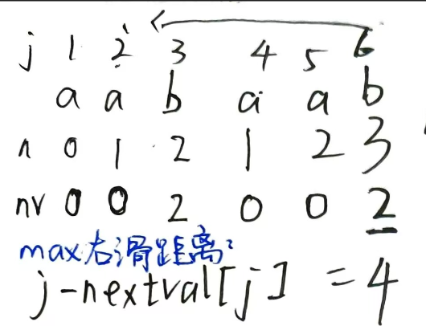

### 二叉树非递归遍历的指针与栈映射机制
#### 1. 入栈（Push）：顺左深入，暂存根节点
沿当前节点的左孩子方向持续深入。每遇到一个节点，在尚未遍历其左子树前，必须先将其压入栈中暂存（挂起）。
- **与前序遍历的联系**：由于入栈顺序即为节点被”首次路过”的顺序，因此**入栈序列**严格等价于二叉树的**前序遍历序列**（根 $\rightarrow$ 左 $\rightarrow$ 右）。
#### 2. 出栈（Pop）：左满回溯，访问根节点
当左孩子指针指向空（即当前左子树已遍历完毕或为空）时，算法触发回溯机制，从栈顶弹出一个节点并执行访问（输出）操作。
- **与中序遍历的联系**：出栈动作意味着该节点的左子树已彻底处理完毕。根据”左 $\rightarrow$ 根 $\rightarrow$ 右”的规则，此时正是访问该”根”节点的正确时机。因此，**出栈序列**严格等价于二叉树的**中序遍历序列**。
#### 3. 转向右侧：单步迭代，引入右子树
当前节点出栈并完成访问后，该节点及其左子树的流程即告结束。随后，将指针强制移向该节点的右孩子，引入右子树并重复上述”深入-入栈-出栈”的迭代过程。
