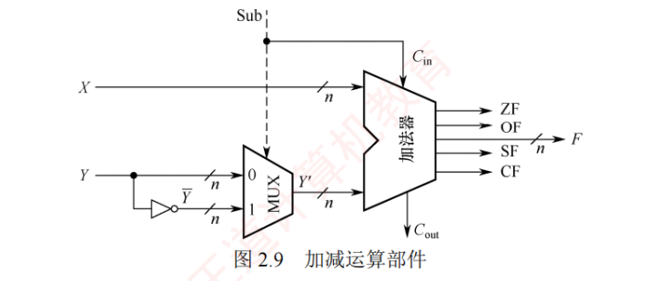
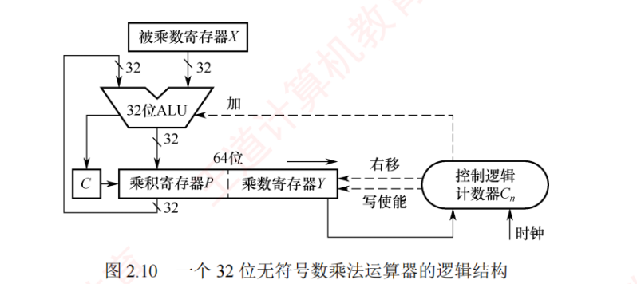
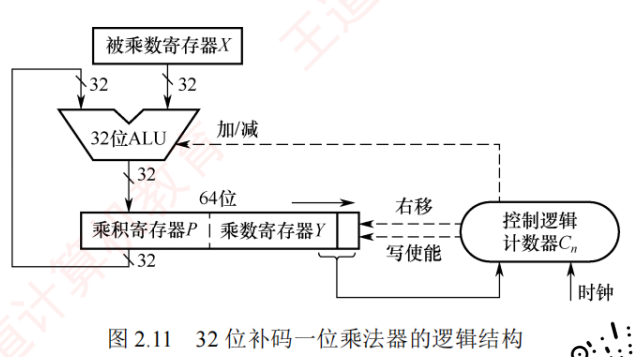
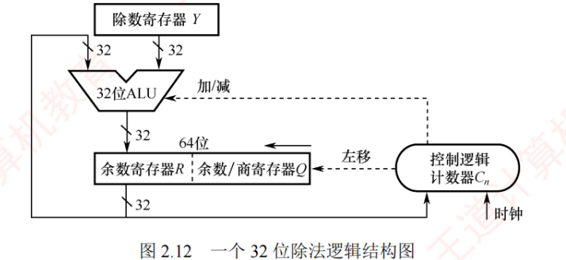

# 运算部件结构与工作流程

## 1. 加减运算部件（ALU）

**基本结构**：
```
X (n位) ──→ ┐
            ├──→ n位加法器 ──→ F (n位结果)
Y (n位) ──→ MUX ──→ Y' (n位)     ↓
  ↑         ↑                  ZF, SF, CF, OF
  └── 求反 ──┘
     Sub信号控制
```

**工作流程**：
1. **加法**：Sub=0，Y直接进入加法器，F = X + Y
2. **减法**：Sub=1，Y取反+1（补码），F = X + (-Y) = X - Y
3. **标志位生成**：
   - ZF：结果全0检测
   - SF：结果最高位
   - CF：最高位进位⊕Sub（Cin）
   - OF：符号位进位 ⊕ 最高数值位进位

**关键点**：减法通过"加补码"实现，只需一个加法器

---

## 2. 无符号数乘法器（右移型）

**基本结构**：
```
被乘数X(32位) → 32位ALU → 64位结果
                    ↓
乘数Y(32位) ← 右移 ← 乘积寄存器P(32位) | 乘数寄存器Y(32位)
                            ↑
                    控制逻辑(Cn) ← 时钟
```

**工作流程**：
1. 初始化：P=0，Y=乘数
2. 循环n次：
   - 若Y最低位=1：P = P + X
   - 若Y最低位=0：P不变
   - PY整体右移1位（P的最低位进入Y的最高位）
3. 结果：64位 = P(高32位) + Y(低32位)

**特点**：部分积逐步累加，每次右移让乘数的下一位参与运算

---

## 3. 有符号数乘法器（补码一位乘法-Booth算法）

**基本结构**：
```
被乘数X(32位) → 32位ALU(加/减) → 64位结果
                    ↓
乘积寄存器P(32位) | 乘数寄存器Y(32位)
        ↓ 右移（算术右移）
    控制逻辑 ← Y的最低位 + 辅助位
```

**工作流程**（简化版Booth）：
1. 初始化：P=0，Y=乘数，Y_{-1}=0（辅助位）
2. 循环n次，根据(Y_0, Y_{-1})决定操作：
   - (1,0)：P = P - X（减被乘数）
   - (0,1)：P = P + X（加被乘数）
   - (0,0)或(1,1)：P不变
   - PY整体算术右移1位
3. 结果：64位补码

**优势**：可以处理负数，减少部分积加法次数

---

## 4. 除法器（恢复余数法/不恢复余数法）

**基本结构**：
```
除数Y(32位) → 32位ALU(加/减) → 余数
                ↓
余数寄存器R(32位) | 商寄存器Q(32位)
        ← 左移
    控制逻辑Cn ← 时钟
```

**工作流程（不恢复余数法）**：
1. 初始化：R=0，Q=被除数
2. 循环n次：
   - RQ整体左移1位
   - 若R≥0：R = R - Y，商位=1（够减）
   - 若R<0：R = R + Y，商位=0（不够减）
   - 商位送入Q的最低位
3. 若最后R<0，执行R = R + Y恢复余数
4. 结果：Q=商，R=余数

**异常检测**：
- **除数为0**：硬件检测Y=0，触发异常
- **溢出**：被除数绝对值≥除数绝对值（有符号数），设置OF=1

---

## 408考点总结

- ALU通过MUX和求反实现加减切换
- 乘法器通过**移位**减少位宽（不需要n×n位的乘法器）
- 除法器通过**试商**（减法+判断符号）逐位确定商
- 标志位在ALU输出时同步生成
- 乘法器用**右移**，除法器用**左移**
