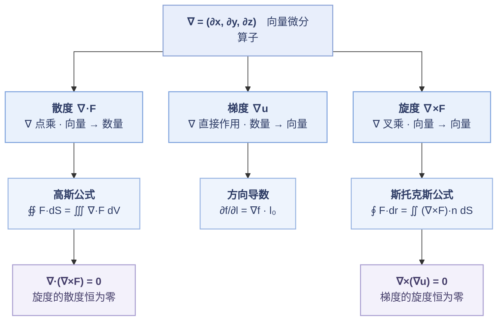

---
tags:
  - 数学/模块/高数
  - 数学/考点/梯度
  - 数学/考点/方向导数
  - 数学/考点/散度
  - 数学/考点/旋度
  - 数学/考点/斯托克斯公式
---

# 梯度 · 散度 · 旋度与斯托克斯公式

> 整理自尽兴 2026-09-16 的手写总结；按标准写法重排，补齐定义、计算、结论与相互关系。
> 相关：[[数学一真题/专项/线面积分专项错题精析|📐 线面积分专项错题精析]]

---

## 〇、总纲：一个算子，三种作用方式

向量微分算子

$$\nabla=\left(\frac{\partial}{\partial x},\ \frac{\partial}{\partial y},\ \frac{\partial}{\partial z}\right)=(\partial_x,\ \partial_y,\ \partial_z)$$

| 运算 | 记号 | 作用对象 | 结果类型 | 一句话含义 |
| --- | --- | --- | --- | --- |
| **梯度** | $\nabla u$（grad $u$） | **数量**场 $u$ | **向量**场 | 增长最快的方向 ＋ 该方向的变化率 |
| **散度** | $\nabla\cdot\boldsymbol F$（div $\boldsymbol F$） | **向量**场 $\boldsymbol F$ | **数量**场 | 该点的"发散程度"（源 / 汇） |
| **旋度** | $\nabla\times\boldsymbol F$（rot $\boldsymbol F$） | **向量**场 $\boldsymbol F$ | **向量**场 | 该点的"旋转程度" |

> **记忆钩子**：**∇ 自己"点乘" ⇒ 结果降为数量；自己"叉乘" ⇒ 结果保持向量；直接作用 ⇒ 数量升为向量。**
> 即 **数→向（grad）、向→数（div）、向→向（rot）**。

---

## 一、梯度

### 1.1 定义

设数量场 $u=u(x,y,z)$ 可微，则

$$\operatorname{grad}u=\nabla u=\left(\frac{\partial u}{\partial x},\ \frac{\partial u}{\partial y},\ \frac{\partial u}{\partial z}\right)$$

### 1.2 计算（两步）

1. 对三个自变量**各求一次偏导**；
2. 按坐标顺序**排成向量**。

**例**：$u=x^{2}+y^{2}$

$$\frac{\partial u}{\partial x}=2x,\qquad \frac{\partial u}{\partial y}=2y$$

$$\nabla u=(2x,\ 2y)\quad(\text{二维写法}),\qquad \nabla u=(2x,\ 2y,\ 0)\quad(\text{三维嵌入})$$

### 1.3 几何意义（两个"最"）

| 要素 | 含义 |
| --- | --- |
| **方向** | $\nabla u(P_0)$ 指向 $u$ 在 $P_0$ 处**增长最快**的方向 |
| **模** | $\lvert\nabla u(P_0)\rvert$ 就是该方向的**最大变化率** —— 通俗说"坡最陡有多陡" |

### 1.4 重要结论

$$\boxed{\nabla\times(\nabla u)=\boldsymbol 0}$$

**梯度的旋度恒为零** —— 数量场生成的梯度场一定是**无旋场**。

---

## 二、方向导数

### 2.1 定义（极限式）

设 $\boldsymbol l_0=(\cos\alpha,\ \cos\beta,\ \cos\gamma)$ 为**单位**方向向量，则

$$\left.\frac{\partial f}{\partial l}\right|_{P_0}=\lim_{t\to0^{+}}\frac{f(P_0+t\,\boldsymbol l_0)-f(P_0)}{t}$$

**二维写开**（$P_0=(x_0,y_0)$）：

$$\left.\frac{\partial f}{\partial l}\right|_{(x_0,y_0)}=\lim_{t\to0}\frac{f(x_0+t\cos\alpha,\ y_0+t\cos\beta)-f(x_0,y_0)}{t}$$

> ⚠️ 记号提醒：$\dfrac{\partial f}{\partial l}$ 分母里的 $l$ 是**方向**不是长度；$\boldsymbol l_0$ **必须是单位向量**。

### 2.2 计算公式

$$\boxed{\frac{\partial f}{\partial l}=\nabla f\cdot\boldsymbol l_0=f_x'\cos\alpha+f_y'\cos\beta+f_z'\cos\gamma}$$

**二维形式**：

$$\frac{\partial f}{\partial l}=f_x'\cos\alpha+f_y'\cos\beta$$

### 2.3 三个结论

| #   | 结论                                             | 取到该值的方向                                                          |
| --- | ---------------------------------------------- | ---------------------------------------------------------------- |
| 1   | **最大值** $\left.\dfrac{\partial f}{\partial l}\right\rvert_{\max}=\lvert\nabla f\rvert$ | $\boldsymbol l_0=\dfrac{\nabla f}{\lvert\nabla f\rvert}$（**沿梯度方向**） |
| 2   | **最小值** $-\lvert\nabla f\rvert$                 | $\boldsymbol l_0=-\dfrac{\nabla f}{\lvert\nabla f\rvert}$         |
| 3   | 与梯度**垂直**的方向上，方向导数为 $0$                          | —                                                                |

其中（二维）$\lvert\nabla f\rvert=\sqrt{f_x'^{2}+f_y'^{2}}$。

### 2.4 与梯度的关系（一句话）

**方向导数 = 梯度在指定方向上的投影** —— 这正是"点乘"的几何含义：

$$\frac{\partial f}{\partial l}=\lvert\nabla f\rvert\cos\theta$$

$\theta$ 是 $\nabla f$ 与 $\boldsymbol l_0$ 的夹角。取 $\theta=0$ 即得最大值 $\lvert\nabla f\rvert$，取 $\theta=\pi$ 得最小值 $-\lvert\nabla f\rvert$。

---

## 三、散度

### 3.1 定义

设向量场 $\boldsymbol F=(P,Q,R)$，则

$$\operatorname{div}\boldsymbol F=\nabla\cdot\boldsymbol F=\frac{\partial P}{\partial x}+\frac{\partial Q}{\partial y}+\frac{\partial R}{\partial z}$$

### 3.2 计算

三个分量**各对同名变量**求偏导，再相加（结果是**数量**，没有方向）。

### 3.3 意义（数量场）

$\nabla\cdot\boldsymbol F(P_0)$ 描述场在 $P_0$ 处的**发散程度**：

| 符号 | 含义 |
| --- | --- |
| $\nabla\cdot\boldsymbol F>0$ | **源**（正源，向外发散） |
| $\nabla\cdot\boldsymbol F<0$ | **汇**（负源，向内汇聚） |
| $\nabla\cdot\boldsymbol F=0$ | 无源无汇（如不可压缩流体的速度场） |

### 3.4 重要结论与应用

$$\boxed{\nabla\cdot(\nabla\times\boldsymbol F)=0}$$

**旋度的散度恒为零** —— 旋度场一定是**无源场**。

**高斯公式（散度定理）**：

$$\unicode{x222F}_{\Sigma}\boldsymbol F\cdot d\boldsymbol S=\iiint_{\Omega}\nabla\cdot\boldsymbol F\,dV$$

一句话：**闭合曲面上的通量 = 内部散度的体积分**。

---

## 四、旋度

### 4.1 定义（行列式写法）

$$\nabla\times\boldsymbol F=\begin{vmatrix}\boldsymbol i&\boldsymbol j&\boldsymbol k\\[3pt]\dfrac{\partial}{\partial x}&\dfrac{\partial}{\partial y}&\dfrac{\partial}{\partial z}\\[9pt]P&Q&R\end{vmatrix}=\left(\frac{\partial R}{\partial y}-\frac{\partial Q}{\partial z},\ \ \frac{\partial P}{\partial z}-\frac{\partial R}{\partial x},\ \ \frac{\partial Q}{\partial x}-\frac{\partial P}{\partial y}\right)$$

> 行列式只是**助记符号**：第一行写 $\boldsymbol i,\boldsymbol j,\boldsymbol k$，第二行写 $\nabla$ 的三个分量，第三行写 $\boldsymbol F$ 的三个分量；按第一行展开即得右式。

### 4.2 意义（向量场）

| 要素 | 含义 |
| --- | --- |
| **模** $\lvert\nabla\times\boldsymbol F(P_0)\rvert$ | $P_0$ 附近**绕转的强度** |
| **方向** | 由**右手定则**确定的"旋转轴"方向 |
| **物理** | 单位面积上，绕微小闭合环路一周所做的功（环量密度） |

### 4.3 重要结论

$$\boxed{\nabla\times(\nabla u)=\boldsymbol 0}$$

**梯度的旋度恒为零**。

### 4.4 恒等式汇总

| 恒等式 | 名称 / 含义 |
| --- | --- |
| $\nabla\times(\nabla u)=\boldsymbol 0$ | 梯度场**无旋** |
| $\nabla\cdot(\nabla\times\boldsymbol F)=0$ | 旋度场**无源** |
| $\nabla\cdot(\nabla u)=\Delta u$ | 拉普拉斯算子 $\Delta=\nabla\cdot\nabla$（补充） |
| $\nabla\times(\nabla\times\boldsymbol F)=\nabla(\nabla\cdot\boldsymbol F)-\Delta\boldsymbol F$ | 旋度的旋度（补充） |

---

## 五、斯托克斯公式

### 5.1 向量形式

$$\boxed{\oint_{L}\boldsymbol F\cdot d\boldsymbol r=\iint_{S}(\nabla\times\boldsymbol F)\cdot\boldsymbol n\,dS}$$

**读法**：**沿闭合曲线 $L$ 的环量 = 旋度在曲面 $S$ 上的通量**。其中 $S$ 以 $L$ 为边界，$\boldsymbol n$ 是 $S$ 的**单位**法向量。

### 5.2 坐标形式（行列式写法）

$$\oint_{L}P\,dx+Q\,dy+R\,dz=\iint_{S}\begin{vmatrix}\cos\alpha&\cos\beta&\cos\gamma\\[3pt]\dfrac{\partial}{\partial x}&\dfrac{\partial}{\partial y}&\dfrac{\partial}{\partial z}\\[9pt]P&Q&R\end{vmatrix}dS$$

> 这其实就是把 5.1 展开：$(\nabla\times\boldsymbol F)\cdot\boldsymbol n$ 按 $\boldsymbol n=(\cos\alpha,\cos\beta,\cos\gamma)$ 分量展开成行列式。
> **注意 $\boldsymbol n$ 必须是单位法向量**（否则行列式里要写 $n_x,n_y,n_z$ 并额外除以 $\lvert\boldsymbol n\rvert$）。

### 5.3 投影形式

$$\oint_{L}P\,dx+Q\,dy+R\,dz=\iint_{S}\left(\frac{\partial R}{\partial y}-\frac{\partial Q}{\partial z}\right)dydz+\left(\frac{\partial P}{\partial z}-\frac{\partial R}{\partial x}\right)dzdx+\left(\frac{\partial Q}{\partial x}-\frac{\partial P}{\partial y}\right)dxdy$$

### 5.4 定向（唯一易错点）

> [!warning] 右手定则
> 右手四指顺着 $L$ 的**绕行方向**，**拇指指向**就是 $\boldsymbol n$ 的方向。
> **$L$ 与 $\boldsymbol n$ 必须成右手系** —— 不一致就整体差一个负号。

**平面退化 ⇒ 格林公式**：取 $S$ 为 $xOy$ 面上的区域 $D$（$\boldsymbol n=\boldsymbol k$），

$$\oint_{L}P\,dx+Q\,dy=\iint_{D}\left(\frac{\partial Q}{\partial x}-\frac{\partial P}{\partial y}\right)dxdy$$

此时 $L$ 应取**正方向（逆时针）**。

> 格林公式还有**另一个形式**（通量形式），对应的是**高斯公式** —— 两个形式的对照见 [[#7.3 格林公式的定位（两副面孔）]]。

---

## 六、高斯公式是怎么来的

### 6.1 两个铺垫

**① 通量**　$\boldsymbol F$ 穿过曲面 $\Sigma$ 的通量
$$\Phi=\iint_\Sigma\boldsymbol F\cdot\boldsymbol n\,dS$$
物理读法是"**单位时间穿过 $\Sigma$ 的流量**"（若 $\boldsymbol F$ 是流速场，就是体积流量）。

**② 散度（内蕴定义，不依赖坐标系）**
$$\operatorname{div}\boldsymbol F(P)=\lim_{V\to P}\frac{1}{V}\unicode{x222F}_{\partial V}\boldsymbol F\cdot\boldsymbol n\,dS$$

即"**包住 $P$ 的小闭曲面上的通量 ÷ 体积**，再让体积趋于 0" = **单位体积向外的净流量**。
这才是散度的本来面目；$\dfrac{\partial P}{\partial x}+\dfrac{\partial Q}{\partial y}+\dfrac{\partial R}{\partial z}$ 只是它在**直角坐标**下的计算公式。

### 6.2 推导三步

**第 1 步 · 分割**
把 $\Omega$ 任意分成 $n$ 小块 $V_i$（记各块直径的最大值为 $\lambda$）。对每小块用散度定义：
$$\unicode{x222F}_{\partial V_i}\boldsymbol F\cdot d\boldsymbol S\approx(\nabla\cdot\boldsymbol F)(P_i)\,V_i$$

**第 2 步 · 求和**
$$\sum_{i=1}^{n}\unicode{x222F}_{\partial V_i}\boldsymbol F\cdot d\boldsymbol S\approx\sum_{i=1}^{n}(\nabla\cdot\boldsymbol F)(P_i)\,V_i$$

**第 3 步 · 内外相消（关键）**
相邻两块在**公共面**上的法向量各自指向"自己那块的外侧"，**方向恰好相反** ⇒ 两份通量**数值相等、符号相反，逐对抵消**。全部抵消完，只剩**最外层边界 $\Sigma$**：

$$\unicode{x222F}_\Sigma\boldsymbol F\cdot d\boldsymbol S=\lim_{\lambda\to0}\sum_{i=1}^{n}(\nabla\cdot\boldsymbol F)(P_i)\,V_i=\iiint_\Omega\nabla\cdot\boldsymbol F\,dV$$

> 一句话：**"内部的总源强 = 边界流出的净通量"**。
> 直觉版：把房间隔成许多小格，各小格的"净流出"加起来；**格与格之间的流动互相抵消**，最后只剩**外墙上的流动**。

### 6.3 为什么必须取"外侧"

散度定义式里的 $\boldsymbol n$ 就是**各小块的外法向**。只有两块都取自己的外法向，公共面上的两份通量才严格反号、才能真正抵消。
⇒ **"外侧"不是人为约定，而是推导的必然结果。**

### 6.4 坐标形式怎么来的

只需对 $\boldsymbol F=(P,0,0)$ 证明 $\displaystyle\unicode{x222F}_\Sigma P\,dydz=\iiint_\Omega\frac{\partial P}{\partial x}\,dV$，另两个分量同理，三式相加即得。

1. 把 $\Omega$ 投影到 $yOz$ 面得 $D_{yz}$；设 $\Sigma$ 由两片组成 $x=x_1(y,z)$（左片）与 $x=x_2(y,z)$（右片）；
2. 右片外法向的 $x$ 分量为正、左片为负 ⇒
$$\unicode{x222F}_\Sigma P\,dydz=\iint_{D_{yz}}\big[P(x_2,y,z)-P(x_1,y,z)\big]\,dydz$$
3. 对 $x$ 用**牛顿–莱布尼茨**：$P(x_2,y,z)-P(x_1,y,z)=\displaystyle\int_{x_1}^{x_2}\frac{\partial P}{\partial x}\,dx$；
4. 代回第 2 步即得。三个分量相加：
$$\unicode{x222F}_\Sigma P\,dydz+Q\,dzdx+R\,dxdy=\iiint_\Omega\left(\frac{\partial P}{\partial x}+\frac{\partial Q}{\partial y}+\frac{\partial R}{\partial z}\right)dV$$

> 可见：**坐标形式的高斯公式，本质就是"先在 $x$ 方向用一次牛顿–莱布尼茨，再把各方向的贡献加起来"。**

---

## 七、各概念之间的关系

### 7.1 算子关系

### 7.2 四大公式是同一件事

| 维数 | 公式 | 说的都是 | 用到的原函数关系 |
| --- | --- | --- | --- |
| 1 | 牛顿–莱布尼茨 $\displaystyle\int_a^b f'\,dx=f(b)-f(a)$ | 区间积分的值 = **端点**之差 | 求导 ↔ 求积分 |
| 2 | **格林** $\displaystyle\oint_L P\,dx+Q\,dy=\iint_D\left(Q_x-P_y\right)dxdy$ | 平面区域的面积分 = **边界曲线**的线积分 | $Q_x-P_y$ ↔ 边界环量 |
| 3 | **高斯** $\displaystyle\unicode{x222F}_\Sigma\boldsymbol F\cdot d\boldsymbol S=\iiint_\Omega\nabla\cdot\boldsymbol F\,dV$ | 体积分 = **边界面**的通量 | $\nabla\cdot\boldsymbol F$ ↔ 通量 |
| 3 | **斯托克斯** $\displaystyle\oint_L\boldsymbol F\cdot d\boldsymbol r=\iint_S(\nabla\times\boldsymbol F)\cdot\boldsymbol n\,dS$ | 曲面积分 = **边界曲线**的环量 | $\nabla\times\boldsymbol F$ ↔ 环量 |

> **共性**：都是"**某个导数在内部的积分 = 边界上的值**"。
> **格林**其实有**两个形式**：环量形式是**斯托克斯的平面特例**，通量形式是**高斯的平面特例** —— 详见 7.3。

### 7.3 格林公式的定位（两副面孔）

格林公式不是"另一个公式"，而是上面两条公式**降到二维**的样子。它有两个形式：

| 形式           | 表达式                                                                                                                    | 对应谁           | 边界上量的是 |
| ------------ | ---------------------------------------------------------------------------------------------------------------------- | ------------- | ------ |
| **环量形式**（切向） | $\displaystyle\oint_L P\,dx+Q\,dy=\iint_D\left(\frac{\partial Q}{\partial x}-\frac{\partial P}{\partial y}\right)dxdy$ | **斯托克斯的平面特例** | 切向分量   |
| **通量形式**（法向） | $\displaystyle\oint_L P\,dy-Q\,dx=\iint_D\left(\frac{\partial P}{\partial x}+\frac{\partial Q}{\partial y}\right)dxdy$ | **高斯的平面特例**   | 外法向分量  |

> **记忆**：边界上量「**切向**」⇒ 对上**旋度**；量「**法向**」⇒ 对上**散度**。

**为什么环量形式就是斯托克斯的平面特例**：取 $\boldsymbol F=(P(x,y),\ Q(x,y),\ 0)$，曲面 $S$ 取 $xOy$ 面上的区域 $D$，$\boldsymbol n=\boldsymbol k$，则

$$\nabla\times\boldsymbol F=(0,\ 0,\ Q_x-P_y)\ \Longrightarrow\ (\nabla\times\boldsymbol F)\cdot\boldsymbol k=Q_x-P_y$$

而 $\displaystyle\oint_L\boldsymbol F\cdot d\boldsymbol r=\oint_L P\,dx+Q\,dy$，代进 5.1 即得环量形式，**一字不用改**。

**顺带解释了定向**：$\boldsymbol n=+\boldsymbol k$ 按右手定则对应的绕行方向**正是逆时针** —— 这与格林公式"$L$ 取正方向"的要求天然吻合。

### 7.4 概念 ↔ 公式 ↔ 本库错题

| 概念 | 对应公式 | 本库相关错题 |
| --- | --- | --- |
| 梯度 / 方向导数 | 无（直接用） | **2015·17**（最大方向导数 = 梯度的模）、2017·3 |
| 散度 | 高斯公式 | **2021·14** |
| 旋度 | 斯托克斯公式 | **1997·12**、**2015·19** |
| 平面旋度 | 格林公式 | **2021·20(2)** |

详见 [[数学一真题/专项/线面积分专项错题精析|📐 线面积分专项错题精析]]。

---

## 附 · 三句话记牢

1. **∇ 点乘降维**：向→数，所以**散度是数量**。
2. **∇ 叉乘保维、∇ 直接作用升维**：**旋度、梯度都是向量**。
3. **两个恒等式别记反**：**梯**度的**旋**度为 $0$（"梯旋 0"）；**旋**度的**散**度为 $0$（"旋散 0"）。
