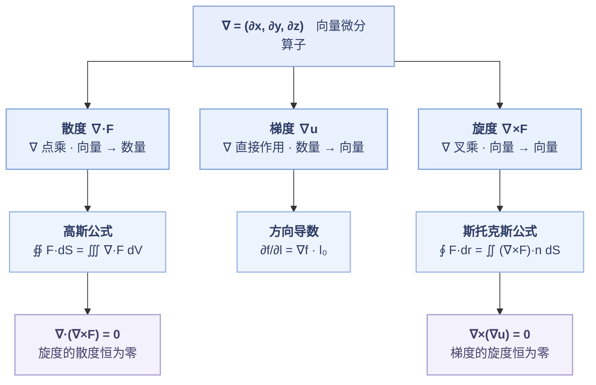

---
tags:
  - 数学/模块/高数
  - 数学/考点/梯度
  - 数学/考点/方向导数
  - 数学/考点/散度
  - 数学/考点/旋度
  - 数学/考点/格林公式
  - 数学/考点/斯托克斯公式
  - 数学/考点/高斯公式
  - 数学/考点/曲线积分
  - 数学/考点/曲面积分
  - 数学/考点/三重积分
---

# 线面积分与三重积分 · 公式与方法总表（含 梯度 · 散度 · 旋度）

> 整理自尽兴 2026-09-16 的手写总结；按标准写法重排，补齐定义、计算、结论与相互关系。
> **2026-10-03 扩容**：① 并入《第二类空间曲线》（**一整份只讲一招的方法稿**：「消元降维 ＋ 格林 ＋ 奇偶性」）—— **§十二 方法本体 ＋ §十三 例题库**；② 补齐**三重积分 / 曲线积分 / 曲面积分**的公式与解法（§九–§十一）。
> **「线面公式」＝ 格林公式 ＋ 高斯公式 ＋ 斯托克斯公式**（连同一维的牛顿–莱布尼茨，本质是同一件事在不同维数的样子，见 §八）。
> 相关：[[三重线面专项错题精析|📐 三重线面专项错题精析]]

> [!tip] 怎么用这一页
> - **概念不清** ⇒ §〇 总纲 → §一 ~ §四（三算子）→ §八（关系图）
> - **公式记不住** ⇒ §五 斯托克斯 / §六 高斯（含推导）/ §七 格林；三类积分公式见 §九 ~ §十一
> - **拿到题不知道走哪条路** ⇒ 先看下面这张「**决策表**」，再跳对应节
> - **空间第二类曲线积分（$L$ 是两曲面交线）不知道走哪条路** ⇒ **§10.4 三法对比**（消元降维／斯托克斯／参数化）；要细节看 §十二，同类题看 §十三

> [!info] ★ 决策表：拿到一道积分题，先问三个问题
> **① 积分是几维的？　② 带不带方向？　③ 区域/曲线闭不闭？**
>
> | 题面形态 | 判定 | 首选路线 | 详见 |
> | --- | --- | --- | --- |
> | 一元区间积分 | 定积分 | 牛顿–莱布尼茨 / 分部 / 换元 | — |
> | 平面区域上的积分 | 二重积分 | 直角（先一后二 / 先二后一）→ 极坐标 → 对称性 | — |
> | 空间区域上的积分 | **三重积分** | 直角（投影法 / 截面法）→ 柱面 → 球面 → 对称性 | **§九** |
> | $\int_L f\,ds$（无方向） | **第一类曲线积分** | **参数化**（万能）；显式 $y=y(x)$ | **§十** |
> | $\int_L P\,dx+Q\,dy+R\,dz$ | **第二类曲线积分** | 闭？→ 平面走**格林**、空间走**消元降维+格林**或**斯托克斯**；不闭 → 参数化 / 补线 / 路径无关 | **§十 · §十二** |
> | $\iint_\Sigma f\,dS$（无方向） | **第一类曲面积分** | **投影法**（$dS$ 换算）；勿漏 $dS$ | **§十一** |
> | $\iint_\Sigma P\,dy\,dz+\cdots$ | **第二类曲面积分** | 闭？→ **高斯**；不闭 → 补面 / 合一投影 / 两类互换 | **§十一** |

---

## 〇、总纲：一个算子，三种作用方式

向量微分算子

$$\nabla=\left(\frac{\partial}{\partial x},\ \frac{\partial}{\partial y},\ \frac{\partial}{\partial z}\right)=(\partial_x,\ \partial_y,\ \partial_z)$$

| 运算 | 记号 | 作用对象 | 结果类型 | 一句话含义 |
| --- | --- | --- | --- | --- |
| **梯度** | $\nabla u$（grad $u$） | **数量**场 $u$ | **向量**场 | 增长最快的方向 ＋ 该方向的变化率 |
| **散度** | $\nabla\cdot\boldsymbol F$（div $\boldsymbol F$） | **向量**场 $\boldsymbol F$ | **数量**场 | 该点的"发散程度"（源 / 汇） |
| **旋度** | $\nabla\times\boldsymbol F$（rot $\boldsymbol F$） | **向量**场 $\boldsymbol F$ | **向量**场 | 该点的"旋转程度" |

> **记忆钩子**：**∇ 自己"点乘" ⇒ 结果降为数量；自己"叉乘" ⇒ 结果保持向量；直接作用 ⇒ 数量升为向量。**
> 即 **数→向（grad）、向→数（div）、向→向（rot）**。

---

## 一、梯度

### 1.1 定义

设数量场 $u=u(x,y,z)$ 可微，则

$$\operatorname{grad}u=\nabla u=\left(\frac{\partial u}{\partial x},\ \frac{\partial u}{\partial y},\ \frac{\partial u}{\partial z}\right)$$

### 1.2 计算（两步）

1. 对三个自变量**各求一次偏导**；
2. 按坐标顺序**排成向量**。

**例**：$u=x^{2}+y^{2}$

$$\frac{\partial u}{\partial x}=2x,\qquad \frac{\partial u}{\partial y}=2y$$

$$\nabla u=(2x,\ 2y)\quad(\text{二维写法}),\qquad \nabla u=(2x,\ 2y,\ 0)\quad(\text{三维嵌入})$$

### 1.3 几何意义（两个"最"）

| 要素 | 含义 |
| --- | --- |
| **方向** | $\nabla u(P_0)$ 指向 $u$ 在 $P_0$ 处**增长最快**的方向 |
| **模** | $\lvert\nabla u(P_0)\rvert$ 就是该方向的**最大变化率** —— 通俗说"坡最陡有多陡" |

### 1.4 重要结论

$$\boxed{\nabla\times(\nabla u)=\boldsymbol 0}$$

**梯度的旋度恒为零** —— 数量场生成的梯度场一定是**无旋场**。

---

## 二、方向导数

### 2.1 定义（极限式）

设 $\boldsymbol l_0=(\cos\alpha,\ \cos\beta,\ \cos\gamma)$ 为**单位**方向向量，则

$$\left.\frac{\partial f}{\partial l}\right|_{P_0}=\lim_{t\to0^{+}}\frac{f(P_0+t\,\boldsymbol l_0)-f(P_0)}{t}$$

**二维写开**（$P_0=(x_0,y_0)$）：

$$\left.\frac{\partial f}{\partial l}\right|_{(x_0,y_0)}=\lim_{t\to0}\frac{f(x_0+t\cos\alpha,\ y_0+t\cos\beta)-f(x_0,y_0)}{t}$$

> ⚠️ 记号提醒：$\dfrac{\partial f}{\partial l}$ 分母里的 $l$ 是**方向**不是长度；$\boldsymbol l_0$ **必须是单位向量**。

### 2.2 计算公式

$$\boxed{\frac{\partial f}{\partial l}=\nabla f\cdot\boldsymbol l_0=f_x'\cos\alpha+f_y'\cos\beta+f_z'\cos\gamma}$$

**二维形式**：

$$\frac{\partial f}{\partial l}=f_x'\cos\alpha+f_y'\cos\beta$$

### 2.3 三个结论

| #   | 结论                                             | 取到该值的方向                                                          |
| --- | ---------------------------------------------- | ---------------------------------------------------------------- |
| 1   | **最大值** $\left.\dfrac{\partial f}{\partial l}\right\rvert_{\max}=\lvert\nabla f\rvert$ | $\boldsymbol l_0=\dfrac{\nabla f}{\lvert\nabla f\rvert}$（**沿梯度方向**） |
| 2   | **最小值** $-\lvert\nabla f\rvert$                 | $\boldsymbol l_0=-\dfrac{\nabla f}{\lvert\nabla f\rvert}$         |
| 3   | 与梯度**垂直**的方向上，方向导数为 $0$                          | —                                                                |

其中（二维）$\lvert\nabla f\rvert=\sqrt{f_x'^{2}+f_y'^{2}}$。

### 2.4 与梯度的关系（一句话）

**方向导数 = 梯度在指定方向上的投影** —— 这正是"点乘"的几何含义：

$$\frac{\partial f}{\partial l}=\lvert\nabla f\rvert\cos\theta$$

$\theta$ 是 $\nabla f$ 与 $\boldsymbol l_0$ 的夹角。取 $\theta=0$ 即得最大值 $\lvert\nabla f\rvert$，取 $\theta=\pi$ 得最小值 $-\lvert\nabla f\rvert$。

---

## 三、散度

### 3.1 定义

设向量场 $\boldsymbol F=(P,Q,R)$，则

$$\operatorname{div}\boldsymbol F=\nabla\cdot\boldsymbol F=\frac{\partial P}{\partial x}+\frac{\partial Q}{\partial y}+\frac{\partial R}{\partial z}$$

### 3.2 计算

三个分量**各对同名变量**求偏导，再相加（结果是**数量**，没有方向）。

### 3.3 意义（数量场）

$\nabla\cdot\boldsymbol F(P_0)$ 描述场在 $P_0$ 处的**发散程度**：

| 符号 | 含义 |
| --- | --- |
| $\nabla\cdot\boldsymbol F>0$ | **源**（正源，向外发散） |
| $\nabla\cdot\boldsymbol F<0$ | **汇**（负源，向内汇聚） |
| $\nabla\cdot\boldsymbol F=0$ | 无源无汇（如不可压缩流体的速度场） |

### 3.4 重要结论与应用

$$\boxed{\nabla\cdot(\nabla\times\boldsymbol F)=0}$$

**旋度的散度恒为零** —— 旋度场一定是**无源场**。

**高斯公式（散度定理）**：

$$\unicode{x222F}_{\Sigma}\boldsymbol F\cdot d\boldsymbol S=\iiint_{\Omega}\nabla\cdot\boldsymbol F\,dV$$

一句话：**闭合曲面上的通量 = 内部散度的体积分**。

---

## 四、旋度

### 4.1 定义（行列式写法）

$$\nabla\times\boldsymbol F=\begin{vmatrix}\boldsymbol i&\boldsymbol j&\boldsymbol k\\[3pt]\dfrac{\partial}{\partial x}&\dfrac{\partial}{\partial y}&\dfrac{\partial}{\partial z}\\[9pt]P&Q&R\end{vmatrix}=\left(\frac{\partial R}{\partial y}-\frac{\partial Q}{\partial z},\ \ \frac{\partial P}{\partial z}-\frac{\partial R}{\partial x},\ \ \frac{\partial Q}{\partial x}-\frac{\partial P}{\partial y}\right)$$

> 行列式只是**助记符号**：第一行写 $\boldsymbol i,\boldsymbol j,\boldsymbol k$，第二行写 $\nabla$ 的三个分量，第三行写 $\boldsymbol F$ 的三个分量；按第一行展开即得右式。

### 4.2 意义（向量场）

| 要素 | 含义 |
| --- | --- |
| **模** $\lvert\nabla\times\boldsymbol F(P_0)\rvert$ | $P_0$ 附近**绕转的强度** |
| **方向** | 由**右手定则**确定的"旋转轴"方向 |
| **物理** | 单位面积上，绕微小闭合环路一周所做的功（环量密度） |

### 4.3 重要结论

$$\boxed{\nabla\times(\nabla u)=\boldsymbol 0}$$

**梯度的旋度恒为零**。

### 4.4 恒等式汇总

| 恒等式 | 名称 / 含义 |
| --- | --- |
| $\nabla\times(\nabla u)=\boldsymbol 0$ | 梯度场**无旋** |
| $\nabla\cdot(\nabla\times\boldsymbol F)=0$ | 旋度场**无源** |
| $\nabla\cdot(\nabla u)=\Delta u$ | 拉普拉斯算子 $\Delta=\nabla\cdot\nabla$（补充） |
| $\nabla\times(\nabla\times\boldsymbol F)=\nabla(\nabla\cdot\boldsymbol F)-\Delta\boldsymbol F$ | 旋度的旋度（补充） |

---

## 五、斯托克斯公式

### 5.1 向量形式

$$\boxed{\oint_{L}\boldsymbol F\cdot d\boldsymbol r=\iint_{S}(\nabla\times\boldsymbol F)\cdot\boldsymbol n\,dS}$$

**读法**：**沿闭合曲线 $L$ 的环量 = 旋度在曲面 $S$ 上的通量**。其中 $S$ 以 $L$ 为边界，$\boldsymbol n$ 是 $S$ 的**单位**法向量。

### 5.2 坐标形式（行列式写法）

$$\oint_{L}P\,dx+Q\,dy+R\,dz=\iint_{S}\begin{vmatrix}\cos\alpha&\cos\beta&\cos\gamma\\[3pt]\dfrac{\partial}{\partial x}&\dfrac{\partial}{\partial y}&\dfrac{\partial}{\partial z}\\[9pt]P&Q&R\end{vmatrix}dS$$

> 这其实就是把 5.1 展开：$(\nabla\times\boldsymbol F)\cdot\boldsymbol n$ 按 $\boldsymbol n=(\cos\alpha,\cos\beta,\cos\gamma)$ 分量展开成行列式。
> **注意 $\boldsymbol n$ 必须是单位法向量**（否则行列式里要写 $n_x,n_y,n_z$ 并额外除以 $\lvert\boldsymbol n\rvert$）。

### 5.3 投影形式

$$\oint_{L}P\,dx+Q\,dy+R\,dz=\iint_{S}\left(\frac{\partial R}{\partial y}-\frac{\partial Q}{\partial z}\right)dydz+\left(\frac{\partial P}{\partial z}-\frac{\partial R}{\partial x}\right)dzdx+\left(\frac{\partial Q}{\partial x}-\frac{\partial P}{\partial y}\right)dxdy$$

### 5.4 定向（唯一易错点）

> [!warning] 右手定则
> 右手四指顺着 $L$ 的**绕行方向**，**拇指指向**就是 $\boldsymbol n$ 的方向。
> **$L$ 与 $\boldsymbol n$ 必须成右手系** —— 不一致就整体差一个负号。

**平面退化**：取 $S$ 为 $xOy$ 面上的区域 $D$（$\boldsymbol n=\boldsymbol k$），斯托克斯公式立刻退化成 **格林公式的环量形式** —— 见 [[梯度·散度·旋度与线面公式#七、格林公式]]。

### 5.5 ⚠️ 用不用斯托克斯？（本库血泪）

本库线面积分已**连续 5 套失分**，其中栽在"法向/定向"上的占多数。命题人原话（2015·19 【常见问题】）：「**上述错误都会导致答案的正负号错误**」。

| 场合 | 建议 | 理由 |
| --- | --- | --- |
| 交线含**平面**（$z$ 能写成 $x,y$ 的函数） | **优先 §十二 消元降维** | 流水线、不用定法向 |
| 交线是**两曲面相贯**（消不掉 $z$） | 用斯托克斯，或两曲面分别参数化 | 只有这一条路 |
| 题目**明确要求**用斯托克斯 | 用，但**动笔第一句先写定向** | 定向 = 本题唯一失分点 |

---

## 六、高斯公式是怎么来的

### 6.1 两个铺垫

**① 通量**　$\boldsymbol F$ 穿过曲面 $\Sigma$ 的通量
$$\Phi=\iint_\Sigma\boldsymbol F\cdot\boldsymbol n\,dS$$
物理读法是"**单位时间穿过 $\Sigma$ 的流量**"（若 $\boldsymbol F$ 是流速场，就是体积流量）。

**② 散度（内蕴定义，不依赖坐标系）**
$$\operatorname{div}\boldsymbol F(P)=\lim_{V\to P}\frac{1}{V}\unicode{x222F}_{\partial V}\boldsymbol F\cdot\boldsymbol n\,dS$$

即"**包住 $P$ 的小闭曲面上的通量 ÷ 体积**，再让体积趋于 0" = **单位体积向外的净流量**。
这才是散度的本来面目；$\dfrac{\partial P}{\partial x}+\dfrac{\partial Q}{\partial y}+\dfrac{\partial R}{\partial z}$ 只是它在**直角坐标**下的计算公式。

### 6.2 推导三步

**第 1 步 · 分割**
把 $\Omega$ 任意分成 $n$ 小块 $V_i$（记各块直径的最大值为 $\lambda$）。对每小块用散度定义：
$$\unicode{x222F}_{\partial V_i}\boldsymbol F\cdot d\boldsymbol S\approx(\nabla\cdot\boldsymbol F)(P_i)\,V_i$$

**第 2 步 · 求和**
$$\sum_{i=1}^{n}\unicode{x222F}_{\partial V_i}\boldsymbol F\cdot d\boldsymbol S\approx\sum_{i=1}^{n}(\nabla\cdot\boldsymbol F)(P_i)\,V_i$$

**第 3 步 · 内外相消（关键）**
相邻两块在**公共面**上的法向量各自指向"自己那块的外侧"，**方向恰好相反** ⇒ 两份通量**数值相等、符号相反，逐对抵消**。全部抵消完，只剩**最外层边界 $\Sigma$**：

$$\unicode{x222F}_\Sigma\boldsymbol F\cdot d\boldsymbol S=\lim_{\lambda\to0}\sum_{i=1}^{n}(\nabla\cdot\boldsymbol F)(P_i)\,V_i=\iiint_\Omega\nabla\cdot\boldsymbol F\,dV$$

> 一句话：**"内部的总源强 = 边界流出的净通量"**。
> 直觉版：把房间隔成许多小格，各小格的"净流出"加起来；**格与格之间的流动互相抵消**，最后只剩**外墙上的流动**。

### 6.3 为什么必须取"外侧"

散度定义式里的 $\boldsymbol n$ 就是**各小块的外法向**。只有两块都取自己的外法向，公共面上的两份通量才严格反号、才能真正抵消。
⇒ **"外侧"不是人为约定，而是推导的必然结果。**

### 6.4 坐标形式怎么来的

只需对 $\boldsymbol F=(P,0,0)$ 证明 $\displaystyle\unicode{x222F}_\Sigma P\,dydz=\iiint_\Omega\frac{\partial P}{\partial x}\,dV$，另两个分量同理，三式相加即得。

1. 把 $\Omega$ 投影到 $yOz$ 面得 $D_{yz}$；设 $\Sigma$ 由两片组成 $x=x_1(y,z)$（左片）与 $x=x_2(y,z)$（右片）；
2. 右片外法向的 $x$ 分量为正、左片为负 ⇒
$$\unicode{x222F}_\Sigma P\,dydz=\iint_{D_{yz}}\big[P(x_2,y,z)-P(x_1,y,z)\big]\,dydz$$
3. 对 $x$ 用**牛顿–莱布尼茨**：$P(x_2,y,z)-P(x_1,y,z)=\displaystyle\int_{x_1}^{x_2}\frac{\partial P}{\partial x}\,dx$；
4. 代回第 2 步即得。三个分量相加：
$$\unicode{x222F}_\Sigma P\,dydz+Q\,dzdx+R\,dxdy=\iiint_\Omega\left(\frac{\partial P}{\partial x}+\frac{\partial Q}{\partial y}+\frac{\partial R}{\partial z}\right)dV$$

> 可见：**坐标形式的高斯公式，本质就是"先在 $x$ 方向用一次牛顿–莱布尼茨，再把各方向的贡献加起来"。**

---

## 七、格林公式

> 格林公式不是"第五个公式"，而是**前面两条公式降到二维**的样子 —— 而且它**有两副面孔**：一副属于斯托克斯，一副属于高斯。这一节单独讲清。

### 7.1 两个形式

**① 环量形式（切向）**
$$\oint_{L}P\,dx+Q\,dy=\iint_{D}\left(\frac{\partial Q}{\partial x}-\frac{\partial P}{\partial y}\right)dxdy$$

**② 通量形式（法向）**
$$\oint_{L}P\,dy-Q\,dx=\iint_{D}\left(\frac{\partial P}{\partial x}+\frac{\partial Q}{\partial y}\right)dxdy$$

| 形式 | 左端（边界上量什么） | 右端（内部是什么） | 属于谁 |
| --- | --- | --- | --- |
| **环量形式** | $\oint_L P\,dx+Q\,dy$（**切向**分量） | $\iint_D\left(\dfrac{\partial Q}{\partial x}-\dfrac{\partial P}{\partial y}\right)$（**平面旋度**） | **斯托克斯的平面特例** |
| **通量形式** | $\oint_L P\,dy-Q\,dx$（**法向**分量） | $\iint_D\left(\dfrac{\partial P}{\partial x}+\dfrac{\partial Q}{\partial y}\right)$（**平面散度**） | **高斯的平面特例** |

> **口诀**：**边界上量「切向」⇒ 对上旋度；量「法向」⇒ 对上散度。**
> **考试视角**：所谓"格林公式"默认就是**环量形式** —— 大纲、教材、题目基本都用它；**通量形式**多见于物理（平面流量），考研偶见，但仍要认识，因为它才是"格林 = 二维高斯"的真身。
> ⚠️ **两个符号坑**：① 环量形式右端是 $Q_x-P_y$（**别记反**）；② $L$ 必须取**逆时针**，取顺时针要整体加负号。

### 7.2 它是怎么从斯托克斯降下来的

> [!note] 先约定记号：$\boldsymbol i,\boldsymbol j,\boldsymbol k$ 是什么
> 它们是**三个坐标轴方向上的单位向量**：
> $$\boldsymbol i=(1,0,0),\qquad \boldsymbol j=(0,1,0),\qquad \boldsymbol k=(0,0,1)$$
> 所以 $\boldsymbol k$ 就是**指向 $z$ 轴正向的单位向量**。
> 又因为单位法向量 $\boldsymbol n=(\cos\alpha,\ \cos\beta,\ \cos\gamma)$，取 $\boldsymbol n=\boldsymbol k$ 就意味着
> $$(\cos\alpha,\ \cos\beta,\ \cos\gamma)=(0,\ 0,\ 1).$$

取三维向量场（**第一、二分量只含 $x,y$，第三分量恒为 0**）：

$$\boldsymbol F=(P(x,y),\ Q(x,y),\ 0),\qquad\text{即}\quad P=P(x,y),\quad Q=Q(x,y),\quad R\equiv 0$$

曲面取 $xOy$ 面上的平面区域 $D$，其**单位法向量取 $z$ 轴正向**：

$$\boldsymbol n=\boldsymbol k=(0,0,1),\qquad (\cos\alpha,\ \cos\beta,\ \cos\gamma)=(0,0,1)$$

**① 算旋度**（$R\equiv0$ ⇒ 含 $R$ 的偏导为 $0$；$P,Q$ 不含 $z$ ⇒ 含 $\partial/\partial z$ 的偏导也为 $0$）：

$$\nabla\times\boldsymbol F=\left(\frac{\partial R}{\partial y}-\frac{\partial Q}{\partial z},\ \ \frac{\partial P}{\partial z}-\frac{\partial R}{\partial x},\ \ \frac{\partial Q}{\partial x}-\frac{\partial P}{\partial y}\right)=(0-0,\ \ 0-0,\ \ Q_x-P_y)=(0,\ 0,\ Q_x-P_y)$$

**② 与单位法向量点乘**（只留第三个分量）：

$$(\nabla\times\boldsymbol F)\cdot\boldsymbol n=(0,\ 0,\ Q_x-P_y)\cdot(0,\ 0,\ 1)=Q_x-P_y$$

**③ 左端展开**（$R\equiv0$，且 $L$ 落在 $xOy$ 面内 ⇒ $dz=0$）：

$$\oint_L\boldsymbol F\cdot d\boldsymbol r=\oint_L P\,dx+Q\,dy+R\,dz=\oint_L P\,dx+Q\,dy$$

**④ 代入 5.1**

$$\oint_L P\,dx+Q\,dy=\iint_D\left(\frac{\partial Q}{\partial x}-\frac{\partial P}{\partial y}\right)dxdy\qquad\text{—— 即格林公式的环量形式，一字不用改。}$$

**顺带解释了定向**：$\boldsymbol n=+\boldsymbol k=(0,0,1)$ 按右手定则对应的绕行方向**正是逆时针** ⇒ 与格林公式"$L$ 取正方向"的要求天然吻合，不是另立的规矩。

> **通量形式怎么来的**：把平面场 $(P,Q)$ **旋转 90°**（改取 $(-Q,\ P)$）再套一遍环量形式：
> $$\oint_L(-Q)\,dx+P\,dy=\iint_D\left(\frac{\partial P}{\partial x}-\frac{\partial(-Q)}{\partial y}\right)dxdy=\iint_D\left(\frac{\partial P}{\partial x}+\frac{\partial Q}{\partial y}\right)dxdy$$
> 左端正是 $\displaystyle\oint_L P\,dy-Q\,dx$ ⇒ 得通量形式。所以它本质就是**二维的高斯公式**。

### 7.3 三个前提（漏一个就错）

1. $P,Q$ 在 $D$（含边界）上有**连续偏导**；
2. $L$ 是**闭曲线**，且是 $D$ 的**正向边界（逆时针）** —— 取顺时针要整体加负号；
3. $D$ 是**单连通**区域 —— 有奇点时必须先**挖洞**（见 7.5）。

### 7.4 三个典型用法

| 用法 | 什么时候用 | 动作 |
| --- | --- | --- |
| **化线积分为二重积分** | $\oint_L$ 难算、$\iint_D$ 好算 | 直接套环量形式（最常见） |
| **判"积分与路径无关"** | 单连通区域上 $\dfrac{\partial P}{\partial y}=\dfrac{\partial Q}{\partial x}$ | 环量恒为 $0$ ⇒ 路径无关；可求原函数 $u$ 使 $P\,dx+Q\,dy=du$ |
| **挖洞** | 区域内有奇点，单连通不成立 | 挖去含奇点的小闭曲线（小圆 / 小椭圆），对剩下的环形区域套格林 |

### 7.5 挖洞型（考试高频，也是本库的坑）

**标准三步**（以 2021·20(2) 为例）：

1. **先验证** $\dfrac{\partial P}{\partial y}=\dfrac{\partial Q}{\partial x}$ —— 过了才有资格挖洞；
2. **挖洞**：补一条含奇点的小闭曲线 $l_1$（与小椭圆 / 小圆同形），使 $L+l_1$ 围成**单连通**闭区域；
3. **提常数再算**：在 $l_1$ 上，把与 $l_1$ 方程**同构的量一律当常数提出来**，剩下用"面积公式"一步到位。

> ⚠️ 三个识别信号（同时命中就挖洞）：分母是**正定二次型**？原点在积分区域**内部**？$\partial P/\partial y=\partial Q/\partial x$？

### 7.6 本库错题

| 题号 | 用法 | 卡在哪 |
| --- | --- | --- |
| **2021·20(2)** | **挖洞** | 分母 $x^2+4y^2$、原点为奇点；偏导相等**验对了却停手** |

详细分析见 [[三重线面专项错题精析#题 ④ · 2021 第 20(2) 题|📐 三重线面专项 · 题 ④]]。

---

## 八、各概念之间的关系

### 8.1 算子关系

### 8.2 四大公式是同一件事

| 维数 | 公式 | 说的都是 | 用到的原函数关系 |
| --- | --- | --- | --- |
| 1 | 牛顿–莱布尼茨 $\displaystyle\int_a^b f'\,dx=f(b)-f(a)$ | 区间积分的值 = **端点**之差 | 求导 ↔ 求积分 |
| 2 | **格林** $\displaystyle\oint_L P\,dx+Q\,dy=\iint_D\left(Q_x-P_y\right)dxdy$ | 平面区域的面积分 = **边界曲线**的线积分 | $Q_x-P_y$ ↔ 边界环量 |
| 3 | **高斯** $\displaystyle\unicode{x222F}_\Sigma\boldsymbol F\cdot d\boldsymbol S=\iiint_\Omega\nabla\cdot\boldsymbol F\,dV$ | 体积分 = **边界面**的通量 | $\nabla\cdot\boldsymbol F$ ↔ 通量 |
| 3 | **斯托克斯** $\displaystyle\oint_L\boldsymbol F\cdot d\boldsymbol r=\iint_S(\nabla\times\boldsymbol F)\cdot\boldsymbol n\,dS$ | 曲面积分 = **边界曲线**的环量 | $\nabla\times\boldsymbol F$ ↔ 环量 |

> **共性**：都是"**某个导数在内部的积分 = 边界上的值**"。
> 四者之中**格林最特殊 —— 它有两个形式**（环量形式属斯托克斯、通量形式属高斯），已在 §七 单独讲过。

### 8.3 概念 ↔ 公式 ↔ 本库错题

| 概念 | 对应公式 | 本库相关错题 |
| --- | --- | --- |
| 梯度 / 方向导数 | 无（直接用） | **2015·17**（最大方向导数 = 梯度的模）、2017·3 |
| 散度 | 高斯公式 | **2021·14** |
| 旋度 | 斯托克斯公式 | **1997·12**、**2015·19**、**2011·12** |
| 平面旋度 | 格林公式（环量形式） | **2021·20(2)** |

详见 [[三重线面专项错题精析|📐 三重线面专项错题精析]]。

---

## 九、三重积分：公式与解法

### 9.1 定义与基本性质

$$\iiint_{\Omega}f(x,y,z)\,dV=\lim_{\lambda\to0}\sum_{i=1}^{n}f(\xi_i,\eta_i,\zeta_i)\,\Delta V_i$$

| 性质 | 表述 |
| --- | --- |
| 线性 | $\iiint(\alpha f+\beta g)dV=\alpha\iiint f\,dV+\beta\iiint g\,dV$ |
| 区域可加 | $\Omega=\Omega_1\cup\Omega_2$ 且内部不重叠 ⇒ $\iiint_\Omega=\iiint_{\Omega_1}+\iiint_{\Omega_2}$ |
| 体积 | $\iiint_\Omega 1\,dV=V_\Omega$ |
| **中值定理** | $f$ 连续、$\Omega$ 闭 ⇒ $\iiint_\Omega f\,dV=f(\xi,\eta,\zeta)\,V_\Omega$ |
| 保序性 | $f\le g$ ⇒ $\iiint f\le\iiint g$ |

### 9.2 三种坐标系：怎么选

| 坐标系 | 什么时候用 | 变换 | 体积元素 |
| --- | --- | --- | --- |
| **直角坐标** | 长方体、四面体、任意区域；被积函数简单 | 不变 | $dV=dx\,dy\,dz$ |
| **柱面坐标** | 出现 $x^2+y^2$；**旋转体、柱体、锥体、抛物面** | $x=\rho\cos\theta,\ y=\rho\sin\theta,\ z=z$ | $dV=\rho\,d\rho\,d\theta\,dz$ |
| **球面坐标** | 出现 $x^2+y^2+z^2$；**球、球壳、锥与球相贯** | $x=r\sin\varphi\cos\theta,\ y=r\sin\varphi\sin\theta,\ z=r\cos\varphi$ | $dV=r^{2}\sin\varphi\,dr\,d\varphi\,d\theta$ |

> **球坐标的角度约定**（考研通用）：$\varphi$ 是**与 $z$ 轴正向的夹角**，$0\le\varphi\le\pi$（不是与 $xOy$ 面的夹角）；$\theta$ 是 $xOy$ 面内的极角，$0\le\theta\le2\pi$。
> **记忆钩子**：球坐标的体积元素**必须带 $r^2\sin\varphi$**（漏了 $\sin\varphi$ 是最常见的错）；柱坐标带一个 $\rho$。

### 9.3 直角坐标的两种积分次序

**① 投影法（先一后二：先 $z$，后 $xy$）**

$$\iiint_\Omega f\,dV=\iint_{D_{xy}}\left[\int_{z_1(x,y)}^{z_2(x,y)}f(x,y,z)\,dz\right]dx\,dy$$

适用：$\Omega$ 的**上下曲面**容易写成 $z=z_1(x,y)$、$z=z_2(x,y)$。

**② 截面法（先二后一：先 $xy$，后 $z$）**

$$\iiint_\Omega f\,dV=\int_{c}^{d}\left[\iint_{D_z}f(x,y,z)\,dx\,dy\right]dz$$

适用：**垂直于 $z$ 轴的截面 $D_z$ 形状简单**（圆、椭圆、矩形），且**被积函数只含 $z$** —— 这时内层积分直接就是 $f(z)\cdot\text{Area}(D_z)$，一步出结果。
> 典型场景：$\Omega$ 由椭球面 / 双曲面围成 ⇒ 截面是椭圆，面积好写。

### 9.4 柱面坐标：怎么定限

$$\iiint_\Omega f\,dV=\int_{\theta_1}^{\theta_2}d\theta\int_{\rho_1(\theta)}^{\rho_2(\theta)}\rho\,d\rho\int_{z_1(\rho,\theta)}^{z_2(\rho,\theta)}f\,dz$$

**定限口诀**：把 $\Omega$ 投影到 $xOy$ 面得 $D$ ⇒ 用极坐标描述 $D$（这就是 $\theta,\rho$ 的范围）；再对每个 $(\rho,\theta)$ 找 $z$ 的上下界（**穿过法**：从下往上射一条平行 $z$ 轴的直线，进点/出点）。
> **典型**：$\Omega: x^2+y^2\le z\le 1$（锥面与平面）⇒ 投影是单位圆，$z$ 从 $\rho$ 到 1。

### 9.5 球面坐标：怎么定限

$$\iiint_\Omega f\,dV=\int_{\theta_1}^{\theta_2}d\theta\int_{\varphi_1}^{\varphi_2}\sin\varphi\,d\varphi\int_{r_1(\theta,\varphi)}^{r_2(\theta,\varphi)}r^{2}f\,dr$$

**定限口诀**：$\theta$ 看**在 $xOy$ 面上的投影扇区**；$\varphi$ 看**与 $z$ 轴正向的夹角范围**（从 $\varphi=0$ 即 $z$ 轴正向开始张到 $\varphi=\pi$ 即负向）；$r$ 用**从原点射出的射线**穿过 $\Omega$，进点为下界、出点为上界。
> **典型**：球 $x^2+y^2+z^2\le R^2$ ⇒ $0\le\theta\le2\pi$、$0\le\varphi\le\pi$、$0\le r\le R$。
> 锥面 $z=\sqrt{x^2+y^2}$（半顶角 $45^\circ$）⇒ $\varphi=\pi/4$。

### 9.6 对称性：不换坐标多省一半力

**① 奇偶性（对坐标面的对称性）**　若 $\Omega$ 关于 $xOy$ 面**对称**（$(x,y,z)\in\Omega\Leftrightarrow(x,y,-z)\in\Omega$）：

| $f$ 关于 $z$ | 结论 |
| --- | --- |
| **奇函数**（$f(x,y,-z)=-f(x,y,z)$） | $\iiint_\Omega f\,dV=\boldsymbol 0$ |
| **偶函数** | $\iiint_\Omega f\,dV=2\iiint_{\Omega_{z\ge0}}f\,dV$ |

关于 $yOz$ 面（看 $x$ 的奇偶）、$zOx$ 面（看 $y$ 的奇偶）同理。
> 例：$\Omega$ 是球 $x^2+y^2+z^2\le R^2$ ⇒ $\iiint z\,dV=0$、$\iiint xyz\,dV=0$；但 $\iiint z^2\,dV\ne0$（偶函数）。

**② 轮换对称性**　若把 $x,y,z$ **任意互换**后 $\Omega$ 不变（如球、$\lvert x\rvert+\lvert y\rvert+\lvert z\rvert\le1$），则

$$\iiint_\Omega x^{2}\,dV=\iiint_\Omega y^{2}\,dV=\iiint_\Omega z^{2}\,dV=\frac13\iiint_\Omega(x^{2}+y^{2}+z^{2})\,dV$$

**③ 平移对称**　$\Omega$ 关于平面 $x=a$ 对称 ⇒ $\iiint_\Omega(x-a)\,dV=0$（把 $x$ 拆成 $(x-a)+a$，前者消掉、后者提常数）。

### 9.7 三重积分的应用

| 量 | 公式 |
| --- | --- |
| 体积 | $V=\iiint_\Omega dV$ |
| 质量 | $m=\iiint_\Omega\rho(x,y,z)\,dV$ |
| **形心 / 质心** | $\bar x=\dfrac{\iiint_\Omega x\rho\,dV}{\iiint_\Omega\rho\,dV}$（$\bar y,\bar z$ 同理；$\rho\equiv1$ 时为形心） |
| 转动惯量（对 $z$ 轴） | $I_z=\iiint_\Omega(x^{2}+y^{2})\rho\,dV$ |

### 9.8 本库相关

| 题号 | 用法 | 备注 |
| --- | --- | --- |
| **2013·19** | 旋转面 ＋ **形心**（三重积分求形心坐标） | 官方【分析】："考查利用三重积分求形心坐标的公式和三重积分的计算" |
| **2021·14** | 高斯公式 → 三重积分 → **椭圆柱体积** | 官方【分析】："转化为求椭圆柱体的体积，利用已知公式得到结果" |

---

## 十、曲线积分：公式与解法

### 10.1 两类对比（先分清再动笔）

| | **第一类**（对弧长） | **第二类**（对坐标） |
| --- | --- | --- |
| 记号 | $\displaystyle\int_L f(x,y)\,ds$ | $\displaystyle\int_L P\,dx+Q\,dy$（＋$R\,dz$） |
| **与方向** | **无关**（$ds>0$ 恒正） | **有关**（反向 ⇒ 整体变号） |
| 物理 | 曲线质量 / 弧长累积 | 变力做功 / 环量 |
| 小元素 | $ds$（弧长） | $dx,\ dy,\ dz$（坐标增量） |
| 计算手段 | **参数化**（万能） | 参数化 / **格林** / **斯托克斯** / 路径无关 / 消元降维 |
| 本库例题 | 2011·9（弧长） | 2011·12、2015·19、2021·20(2) |

> ⚠️ **判定第一件事**：题面是 $ds$ 还是 $dx,dy$？**看错这个，后面全错。**

### 10.2 第一类曲线积分：计算公式（参数化是万能钥匙）

**① 平面参数式**　$L:\ x=x(t),\ y=y(t),\ t\in[\alpha,\beta]$：

$$\int_L f(x,y)\,ds=\int_{\alpha}^{\beta}f\big(x(t),y(t)\big)\sqrt{x'^{2}(t)+y'^{2}(t)}\,dt$$

**② 空间参数式**　$L:\ x=x(t),\ y=y(t),\ z=z(t)$：

$$\int_L f\,ds=\int_{\alpha}^{\beta}f\big(x,y,z\big)\sqrt{x'^{2}+y'^{2}+z'^{2}}\,dt$$

**③ 显式 $y=y(x)$**（$x\in[a,b]$）：

$$\int_L f\,ds=\int_a^b f\big(x,y(x)\big)\sqrt{1+y'^{2}}\,dx$$

**④ 显式 $x=x(y)$**（$y\in[c,d]$）：

$$\int_L f\,ds=\int_c^d f\big(x(y),y\big)\sqrt{1+x'^{2}}\,dy$$

**⑤ 极坐标 $r=r(\theta)$**（$\theta\in[\alpha,\beta]$）：

$$\int_L f\,ds=\int_{\alpha}^{\beta}f\big(r\cos\theta,r\sin\theta\big)\sqrt{r^{2}+r'^{2}}\,d\theta$$

> ⚠️ **弧长元素三公式别混**（本库 2011·9 就栽在这）：
> **弧长** $ds=\sqrt{1+y'^{2}}dx$ **（没有 $y$ 因子）**；**旋转体侧面积** $=2\pi\int\lvert y\rvert\,ds$（**多一个 $\lvert y\rvert$**）；**旋转体体积** $=\pi\int y^{2}dx$（**没有根号**）。
> 这就是 2011·9 "把 $f(x)$ 乘进根号" 导致"积分套积分算不下去"的根源。

### 10.3 第二类曲线积分：计算公式

**① 参数化（万能，方向由 $t$ 的走向定）**

$$\int_L P\,dx+Q\,dy+R\,dz=\int_{\alpha}^{\beta}\Big[P\,x'(t)+Q\,y'(t)+R\,z'(t)\Big]dt$$

$\alpha$ 对应起点、$\beta$ 对应终点（**上下限不必 $\alpha<\beta$，方向全由这一条决定**）。

**② 平面 + 显式 $y=y(x)$**

$$\int_L P\,dx+Q\,dy=\int_{a}^{b}\Big[P\big(x,y(x)\big)+Q\big(x,y(x)\big)\,y'(x)\Big]dx$$

**③ 闭曲线 + 平面 ⇒ 格林公式（环量形式）**　见 §七。

**④ 闭曲线 + 空间 ⇒ 消元降维+格林，或斯托克斯**　见 §五、**§十二**。

**⑤ 路径无关（单连通 + $P_y=Q_x$）**

$$\int_L P\,dx+Q\,dy=u(B)-u(A),\qquad du=P\,dx+Q\,dy$$

（$u$ 为原函数；把积分变成"端点相减"，常可秒杀）
> 判据补充：若区域**不是单连通**（有奇点），$P_y=Q_x$ 只能保证"**绕任意闭曲线的积分相等**"，不能保证为 0 —— 这时要**挖洞**（§7.5）。

**⑥ 补线法（开口曲线）**：补一条辅助线段成闭曲线 ⇒ 格林算闭积分 ⇒ 减去补线段上的积分。见 §12.4。

### 10.4 ★ 第二类空间曲线积分：三种解法对比

> $L$ 是两曲面交线时，**只有三条路**。先看表定路线，再看后面的要点 —— 别拿到题就往斯托克斯上撞。

| | **① 消元降维 ＋ 格林** | **② 斯托克斯** | **③ 参数化** |
| --- | --- | --- | --- |
| 一句话 | 用交线里的曲面把 $z,dz$ 换成 $x,y,dx,dy$ ⇒ 降成**平面**闭曲线积分 ⇒ 格林 | 化曲面积分：$\oint_L=\iint_S(\nabla\times\boldsymbol F)\cdot\boldsymbol n\,dS$ | 把 $L$ 直接写成 $x(t),y(t),z(t)$ 代进去 |
| 前提 | 交线里**含平面**（能解出 $z=z(x,y)$） | 任意空间闭曲线，且**能挑出一个好算的 $S$** | 能写出**可行的参数式**（圆柱／球面交线最好写） |
| **要不要定法向** | **不要**（方向投影到 $xOy$ 面判，不会整体变号） | **要**（右手定则；错了整体差一个负号） | **不要** |
| 计算量 | **小**（代入合并后常只剩"常数 × 面积"） | 中～大（行列式展开 ＋ $dS$ 换算） | 小～中（但参数式可能丑、三角积分难算） |
| 主要风险 | 代入后系数写错 | **定向／法向量错 ⇒ 全题归零** | 参数式写错 ／ 积分限方向写反 |
| 本库战绩 | — | 🔴 **已栽 5 套**（2011·12、2015·19 都是法向） | — |

**① 消元降维 ＋ 格林**　**消元**（解出 $z,dz$）→ **降维**（代入合并成 $\oint_C\tilde P dx+\tilde Q dy$，$\tilde P=P+Rz_x$、$\tilde Q=Q+Rz_y$）→ **定方向**（投影到 $xOy$ 面）→ **格林 ＋ 奇偶**（奇函数项清零 ⇒ 只剩"常数 × 面积"）。
> 完整四步流水线、分段边界、补线、斜椭圆面积等配套技巧，见 **§十二**。

**② 斯托克斯**　选 $S$（**优先平面片 / 圆盘**）→ 按右手定则定 $\boldsymbol n$ → 算 $\nabla\times\boldsymbol F$ 点乘 $\boldsymbol n$ 化二重积分。
> ⚠️ **动笔第一句就把定向写死**，别留到最后。

**③ 参数化**　写 $L$ 的参数式（**柱面 $x^{2}+y^{2}=a^{2}$ ⇒ $x=a\cos t,\ y=a\sin t$**，再代另一曲面得 $z(t)$）→ 代入 $\displaystyle\int_\alpha^\beta\big(Px'+Qy'+Rz'\big)dt$，**方向由 $t$ 的上下限体现**。
> 优点：不用定法向；缺点：$\lvert\boldsymbol r'(t)\rvert$ 型三角积分可能很丑。

**怎么选**
- **交线含平面** ⇒ **① 消元降维**（首选）。
- **消不掉 $z$**（两曲面相贯）⇒ $S$ 好挑选 **②**，$L$ 参数式漂亮（柱面／球面）选 **③**。
- **题目指定某法** ⇒ 照做，但 **② 先把定向写死**。
- **开口曲线**（有起点终点）⇒ ① ＋ **补线**，或 ③ 直接参数化。

> 📌 **一句话**：**能含平面就消元降维；消不掉就看 $S$ 好挑（②）还是 $t$ 好写（③）—— 三条路里 ② 风险最高，只在没别的路时用。**

### 10.5 决策流程（线积分版）

1. **是 $ds$ 吗？** 是 ⇒ 参数化（§10.2），结束。
2. **是 $dx,dy(\!,dz)$ 且闭曲线吗？**
   - 闭 + 平面 ⇒ **格林**（有奇点先挖洞）
   - 闭 + 空间 ⇒ **看 §10.4 三法对比**：含平面 ⇒ ①消元降维；消不掉 ⇒ ②斯托克斯 或 ③参数化
3. **不闭？**
   - 能拆成"两个曲面上的显式曲线" 或 直接参数化 ⇒ 参数化
   - 补线方便 ⇒ 补线＋格林
   - $P_y=Q_x$ ⇒ 路径无关，找 $u$
4. **分类讨论**：凡含**绝对值 / 参数 / 分段边界**，先分段再算。

### 10.6 本库相关

| 题号 | 型别 | 卡在哪 |
| --- | --- | --- |
| **2011·12** | 第二类 · 空间闭曲线（柱面 ∩ 平面） | **法向定向**（官方点名"S 的单位法向量的确定"） |
| **2015·19** | 第二类 · 空间开口曲线（补线） | 法向量求错（官方点名） |
| **2021·20(2)** | 第二类 · 格林挖洞 | 验了 $P_y=Q_x$ 却**停手**，没挖洞 |
| 2011·9 | **第一类**（弧长） | 把弧长公式记成了**侧面积**公式 |

---

## 十一、曲面积分：公式与解法

### 11.1 两类对比

| | **第一类**（对面积） | **第二类**（对坐标 / 通量） |
| --- | --- | --- |
| 记号 | $\displaystyle\iint_\Sigma f(x,y,z)\,dS$ | $\displaystyle\iint_\Sigma P\,dy\,dz+Q\,dz\,dx+R\,dx\,dy$ |
| **与方向** | **无关**（$dS>0$） | **有关**（换侧 ⇒ 整体变号） |
| 物理 | 曲面薄片质量 / 面积累积 | **通量** |
| 小元素 | $dS$（面积） | $dy\,dz,\ dz\,dx,\ dx\,dy$（投影增量） |
| 关键换算 | **$dS$ 必须乘 $\sqrt{1+z_x^{2}+z_y^{2}}$** | 定向 / 投影符号 |
| 本库例题 | 2017·19、2009·11 | 2021·14、1997·12、2012·19 |

> ⚠️ **最容易全题归零的一步**：$\iint_\Sigma f\,dS$ **是第一类曲面积分，不是二重积分** —— 必须先乘 $dS=\sqrt{1+z_x^{2}+z_y^{2}}\,dxdy$ 再算。本库 2017·19 就栽在这。

### 11.2 第一类曲面积分：投影法（三步）

**Step 1 选投影方向**：看 $\Sigma$ 的方程里**哪个变量好解出来**，就往那个坐标面投。

**Step 2 换 $dS$**：

| $\Sigma$ 的方程 | 投影域 | $dS$ |
| --- | --- | --- |
| $z=z(x,y)$ | $D_{xy}$ | $\sqrt{1+z_x^{2}+z_y^{2}}\,dx\,dy$ |
| $y=y(x,z)$ | $D_{xz}$ | $\sqrt{1+y_x^{2}+y_z^{2}}\,dx\,dz$ |
| $x=x(y,z)$ | $D_{yz}$ | $\sqrt{1+x_y^{2}+x_z^{2}}\,dy\,dz$ |

**Step 3 代入算二重积分**：

$$\iint_\Sigma f(x,y,z)\,dS=\iint_{D_{xy}}f\big(x,y,z(x,y)\big)\sqrt{1+z_x^{2}+z_y^{2}}\,dx\,dy$$

> **几何理解**：$dS$ 与 $dx\,dy$ 的比就是**法向量与 $z$ 轴夹角余弦的倒数** —— 曲面越"斜"，同一个 $dx\,dy$ 对应越大的 $dS$。
> **参数式备用**：$\Sigma:\ \boldsymbol r(u,v)$ ⇒ $dS=\lvert\boldsymbol r_u\times\boldsymbol r_v\rvert\,du\,dv$（球面、柱面用这个更快）。
> **对称性**：$\Sigma$ 关于 $xOy$ 面对称、$f$ 关于 $z$ 为奇 ⇒ $\iint_\Sigma f\,dS=0$。

### 11.3 第二类曲面积分：四条路

**① 投影法（分片 + 分别定侧）**　$\Sigma$ 由 $z=z(x,y)$ 给出：

$$\iint_\Sigma R(x,y,z)\,dx\,dy=\pm\iint_{D_{xy}}R\big(x,y,z(x,y)\big)dx\,dy\qquad(\text{上侧取}+,\ \text{下侧取}-)$$

> 三个坐标面各自套一遍：$\iint P\,dydz$ 投到 $yOz$ 面（前侧 $+$、后侧 $-$）；$\iint Q\,dzdx$ 投到 $zOx$ 面（右侧 $+$、左侧 $-$）。
> **垂直某坐标面的那一片，对应的积分为 $0$**（投影面积为 $0$）—— 别硬算。

**② 合一投影法（一个投影面搞定，口诀：一投二代三定号）**
$\Sigma:\ z=z(x,y)$ 取**上侧**：

$$\iint_\Sigma P\,dy\,dz+Q\,dz\,dx+R\,dx\,dy=\iint_{D_{xy}}\Big[-P\,z_x-Q\,z_y+R\Big]dx\,dy$$

（取**下侧**则整体**加一个负号**）
> 推导：把 $dy\,dz$、$dz\,dx$ 都用 $\Sigma$ 的方程换算成 $dx\,dy$ —— 上侧时 $dy\,dz=-z_x\,dx\,dy$、$dz\,dx=-z_y\,dx\,dy$。

**③ 高斯公式（闭曲面首选）**

$$\unicode{x222F}_{\Sigma}P\,dy\,dz+Q\,dz\,dx+R\,dx\,dy=\iiint_{\Omega}\left(\frac{\partial P}{\partial x}+\frac{\partial Q}{\partial y}+\frac{\partial R}{\partial z}\right)dV$$

三条使用要点：
- **外侧**为正；取**内侧要整体加负号**；
- **不闭就补面**：$\iint_\Sigma=\unicode{x222F}_{\Sigma+\Sigma_1}-\iint_{\Sigma_1}$（补的面要选**好算**的，常取坐标面上的平面片，其上某些微分为 0）；
- ⚠️ **$P,Q,R$ 在 $\Omega$ 内要有连续偏导** —— 有奇点（分母为 0）**不能直接用高斯**，要么挖掉，要么改用"两类互换 ＋ 参数化"。

**④ 两类互换（把第二类转成第一类）**

$$\iint_\Sigma P\,dy\,dz+Q\,dz\,dx+R\,dx\,dy=\iint_\Sigma\big(P\cos\alpha+Q\cos\beta+R\cos\gamma\big)dS$$

其中 $(\cos\alpha,\cos\beta,\cos\gamma)$ 是**指定侧的单位法向量**。
> 什么时候用：$\Sigma$ 是**球面 / 柱面**，法向量的方向余弦**是常数或有简单表达式**（如球面上 $\cos\alpha=x/R$），转成第一类后 $dS$ 与方向余弦常能大量约分。

### 11.4 定向速查表（法向量 ＋ 侧）

| 曲面 | 单位法向量 | 备注 |
| --- | --- | --- |
| 平面 $Ax+By+Cz=D$ | $\pm\dfrac{(A,B,C)}{\sqrt{A^{2}+B^{2}+C^{2}}}$ | 上侧取 $C$ 的符号为正的那支 |
| $z=z(x,y)$ | $\pm\dfrac{(-z_x,\ -z_y,\ 1)}{\sqrt{1+z_x^{2}+z_y^{2}}}$ | **上侧取 $+$** |
| 球面 $x^{2}+y^{2}+z^{2}=R^{2}$ | $\pm\dfrac{(x,y,z)}{R}$ | **外侧取 $+$** |
| 柱面 $x^{2}+y^{2}=R^{2}$ | $\pm\dfrac{(x,y,0)}{R}$ | **外侧取 $+$** |
| 锥面 $z=\sqrt{x^{2}+y^{2}}$ | 用 $z=z(x,y)$ 公式 | — |

> **"从某轴正向往负向看逆（顺）时针" ⇒ 先投影到对应坐标面，再看绕行方向**（§12.3、§5.4）。
> 完整法向量/定向细则见 [[三重线面专项错题精析#📌 法向量与定向速查|📐 专项页 · 法向量与定向速查]]。

### 11.5 决策流程（曲面积分版）

1. **是 $dS$ 吗？** 是 ⇒ 投影法（§11.2）；球面/柱面可考虑参数式。**别忘 $dS$**。
2. **是 $dy\,dz$ 等吗？**
   - **闭曲面** ⇒ 高斯（外侧正）；有奇点 ⇒ 挖洞或两类互换。
   - **不闭** ⇒ 优先**合一投影**（一个投影面）；若 $\Sigma$ 分成几片、或某片垂直投影面 ⇒ 分片投影 ＋ 定侧。
   - **球面/柱面且方向余弦简单** ⇒ 两类互换。
3. **补面成闭曲面**是高斯的常见前置动作：补的面选坐标面上的平面片，**上面某些微分为 0 ⇒ 贡献极简**。

### 11.6 本库相关

| 题号 | 型别 | 卡在哪 |
| --- | --- | --- |
| **2017·19** | **第一类**（薄片质量） | **漏 $dS$**（把曲面积分直接当二重积分） |
| 2009·11 | 第一类 | — |
| **2021·14** | 第二类 · **高斯** | 整块遗忘（官方点名"化成三重积分后没利用对称性"） |
| 1997·12 | 第二类 | — |
| 2012·19 | 第二类 | — |

---

## 十二、消元降维法 · 流水线详解（§10.4 第 ① 条的展开）

> [!info] 本节与 §10.4 的关系
> **§10.4 已把「消元降维 ／ 斯托克斯 ／ 参数化」三法并列对比**；本节只把**第 ① 条**展开成完整流水线 ＋ 配套技巧。例题另见 §十三。
> 核心口诀：**消元降维，格林奇偶** —— 把三维问题**压回二维**，用最熟的格林公式解决，**完全绕开"定法向"这个本库最大的失分点**。
> 📌 源稿 `专项\第二类空间曲线.md`（B 站视频逐字转写稿）**通篇只讲这一招**；§十三 那 12 道题全是它的变式。

### 12.1 路线怎么定（见 §10.4 三法对比）

> 交线含平面 ⇒ **优先消元降维**；只有当 "$z$ 消不掉"（两曲面相贯，如球面 ∩ 柱面）或题目明确要求时，才走斯托克斯 —— 此时球面 ∩ 柱面仍可用**根式消元**（见 §13 例 7）。

### 12.2 四步流水线

**第 1 步 · 消元**　从**较简单的那个方程**（通常是平面）解出 $z$，并微分得到 $dz$：

$$z=z(x,y)\ \Longrightarrow\ dz=z_x\,dx+z_y\,dy$$

**第 2 步 · 降维**　把 $z$ 和 $dz$ 一起代入被积式，**合并同类微分**：

$$\oint_L P\,dx+Q\,dy+R\,dz\ \longrightarrow\ \oint_C \tilde P\,dx+\tilde Q\,dy$$

其中 $C$ 是 $L$ 在 $xOy$ 面上的**投影曲线**，$\tilde P=P+R\,z_x$，$\tilde Q=Q+R\,z_y$（**这一步是全部的活**）。

**第 3 步 · 定方向**　把原方向"投影"到 $xOy$ 面：

| 题目说法 | 投影到 $xOy$ 面后 |
| --- | --- |
| "从 $z$ 轴正向往负向看为逆时针" | **逆时针**（格林取正号） |
| "从 $z$ 轴正向往负向看为顺时针" | 顺时针（格林取**负号**） |
| 曲线有起点终点（开口） | 投影仍是"起点→终点"，需**补线**（§12.4） |

**第 4 步 · 格林 ＋ 奇偶**

$$\oint_C\tilde P\,dx+\tilde Q\,dy=\iint_{D}\left(\frac{\partial \tilde Q}{\partial x}-\frac{\partial \tilde P}{\partial y}\right)dx\,dy$$

展开后用**对称性**把奇函数项全部消掉，剩下的往往就是"**常数 × 区域面积**"，一步出结果。

> [!tip] 为什么它这么快
> ① $z$ 常是 $x,y$ 的**一次函数**（平面）⇒ 代入后只多几个多项式项；
> ② $D$ 多半是**圆 / 椭圆**，面积公式现成；
> ③ **奇偶性**负责把交叉项全清零 ⇒ 最后只剩常数项。
> 即使 $z$ **不是**一次函数（带根号），这套流程照样走 —— 看似麻烦的项在格林 ＋ 奇偶之后**往往会自己消掉**（§13 例 7 就是）。

### 12.3 特例与配套技巧

**A · 曲线落在坐标面上**　$L$ 在 $z=0$ 面（$dz=0$）⇒ 不用消元，**直接就是平面曲线积分**，套格林即可。

**B · 交线是水平面截曲面**　$z=c$（常数）⇒ $dz=0$，投影由"两方程联立消 $z$"得到。

**C · 分段边界（球面/椭球面在第一卦限的边界）**　$L$ 由三段坐标面上的曲线 $L_1,L_2,L_3$ 组成 ⇒ **逐段处理**：
- 在 $xOy$ 面上那段：$z=0,\ dz=0$ ⇒ 只留 $P\,dx+Q\,dy$ ⇒ 格林 / 参数化；
- 在 $yOz$ 面上那段：$x=0,\ dx=0$ ⇒ 只留 $Q\,dy+R\,dz$；
- 在 $zOx$ 面上那段：$y=0,\ dy=0$ ⇒ 只留 $P\,dx+R\,dz$。
- **每段的积分往往靠"哪一项含消失的微分"就归零**，剩下的常是简单的定积分。
- 三段计算形式相同（变量轮换）时，**只算一段 × 3**。

**D · 正交变换求斜椭圆面积**（投影域是 $x^2+y^2+xy=c$ 这类斜椭圆时必备）

- **原理**：**正交变换不改变图形的面积**（只把"斜椭圆"转正）。
- **步骤**：
  1. 写出二次型矩阵 $A$（对角元取平方项系数、非对角元取交叉项系数的一半）；
  2. 求特征值 $\lambda_1,\lambda_2$；
  3. 标准形 $\lambda_1y_1^{2}+\lambda_2y_2^{2}=c$ ⇒ 半轴 $a'=\sqrt{c/\lambda_1}$、$b'=\sqrt{c/\lambda_2}$；
  4. **面积 $S=\pi a'b'=\dfrac{\pi c}{\sqrt{\lambda_1\lambda_2}}=\dfrac{\pi c}{\sqrt{\det A}}$**（可直接记这条）。
- **例**：$x^{2}+y^{2}+xy=\dfrac{a^{2}}{2}$ ⇒ $A=\begin{pmatrix}1&\frac12\\[2pt]\frac12&1\end{pmatrix}$，$\lambda_1=\dfrac12,\ \lambda_2=\dfrac32$，$\det A=\dfrac34$ ⇒ $S=\dfrac{\pi\cdot\frac{a^{2}}{2}}{\sqrt{3}/2}=\dfrac{\sqrt3}{3}\pi a^{2}$ ✓

### 12.4 补线法（开口曲线的标配）

$$\int_{L}=\oint_{L+\text{补线}}-\int_{\text{补线}}$$

- **补线怎么选**：优先取**落在坐标轴（或直线 $x=0$、$y=0$）上的线段** —— 其上 $dx=0$ 或 $dy=0$，积分**极简、常直接为 0**。
- **方向**：补线要接成"起点 → 终点 → 起点"的**闭环**；闭环若为顺时针，格林前面**加负号**。
- **校验**：算完代回原式验一次符号 —— 补线法的错**九成出在方向**。

### 12.5 本库对应

| 题号 | 型别 | 用哪一招 |
| --- | --- | --- |
| **2011·12** | 柱面 ∩ 平面（闭） | 消元降维（§13 例 1） |
| **2015·19** | 球面 ∩ 平面（开口） | 消元降维 ＋ **补线**（§13 例 5） |
| 1997·12 | 闭曲线 | 消元降维 / 斯托克斯 |

---

## 十三、例题库（消元降维 · 格林奇偶）

> **说明**：例 1–5 与 例 12 为**历年真题**（例 1 = 2011 数一 12、例 5 = 2015 数一 19）；带「模拟」标记的来自 李林六套卷 / 李林 880 等模拟题；例 11 的年份见备注。
> 所有结果已按本节流程**独立复算核对**（其中 例 3 源稿中间步骤的 $+h$ 应为 $-h$，**不影响最终答案**）。

### 13.1 速查总表

| # | 出处 | 曲线 $L$（或 $\Gamma$） | 积分 | 投影域 | 答案 |
| --- | --- | --- | --- | --- | --- |
| 1 | **2011 数一 12** | 柱面 $x^2+y^2=1$ ∩ 平面 $z=x+y$ | $\oint xz\,dx+x\,dy+\frac{y^{2}}{2}dz$ | 单位圆（逆时针） | $\pi$ |
| 2 | 真题 | 柱面 $x^2+y^2=1$ ∩ 平面 $y+z=0$ | $\oint z\,dx+y\,dz$ | 单位圆 | $\pi$ |
| 3 | 真题 | 柱面 $x^2+y^2=a^2$ ∩ 平面 $\frac{x}{a}+\frac{z}{h}=1$ | $\oint(y-z)dx+(z-x)dy+(x-y)dz$ | 圆 $r=a$ | $-2\pi a(a+h)$ |
| 5 | **2015 数一 19** | $z=\sqrt{2-x^{2}-y^{2}}$ ∩ $z=x$，$A\to B$ | $\int(y+z)dx+(z^{2}-x^{2}+y)dy+x^{2}y^{2}dz$ | 右半椭圆 | $\frac{\sqrt2\pi}{2}$ |
| 6 | 模拟（李林六套卷） | 球面第一卦限部分的边界 | $\oint(y^{2}-z^{2})dx+(z^{2}-x^{2})dy+(x^{2}-y^{2})dz$ | 三段圆弧 | $-4$ |
| 7 | 真题 | 球面 $x^{2}+y^{2}+z^{2}=2Rx$ ∩ 柱面 $x^{2}+y^{2}=2ax$ | $\oint(y^{2}+z^{2})dx+(z^{2}+x^{2})dy+(x^{2}+y^{2})dz$ | 圆 $(x-a)^{2}+y^{2}=a^{2}$ | $2R\pi a^{2}$ |
| 8 | 模拟（李林 880） | $z=4-x^{2}-y^{2}$ ∩ $z=3$ | $\oint x^{2}y^{3}dx+z\,dy+y\,dz$ | 单位圆 | $-\frac{\pi}{8}$ |
| 9 | 真题 | 锥面 $z=\sqrt{x^{2}+y^{2}}$ ∩ 柱面 $x^{2}+y^{2}=2ax$ | $\oint xy\,dx+z^{2}dy+zx\,dz$ | 圆 $(x-a)^{2}+y^{2}=a^{2}$ | $\pi a^{3}$ |
| 10 | 真题 | $z=x^{2}+2y^{2}$ ∩ $z=6-2x^{2}-y^{2}$ | $\oint(z^{2}-y)dx+(x^{2}-z)dy+(x-y^{2})dz$ | 圆 $x^{2}+y^{2}=2$ | $2\pi$ |
| 11 | 转写稿标「2022 真题」（**年份待核**） | 椭球面 $4x^{2}+y^{2}+z^{2}=1$ 第一卦限部分的边界 | $\int(yz^{2}-\cos z)dx+2xz^{2}dy+(2xyz+x\sin z)dz$ | 三段圆弧 | $0$ |
| 12 | 真题 | 球面 $x^{2}+y^{2}+z^{2}=a^{2}$ ∩ 平面 $x+y+z=0$ | $\oint y\,dx+z\,dy+x\,dz$ | 斜椭圆 $x^{2}+y^{2}+xy=\frac{a^{2}}{2}$ | $-\sqrt3\pi a^{2}$ |

### 13.2 标准示范（例 1 · 2011 数一 12）—— 完整八步

**题**　$L$ 是柱面 $x^{2}+y^{2}=1$ 与平面 $z=x+y$ 的交线，从 $z$ 轴正向往负向看为逆时针；求 $I=\displaystyle\oint_L xz\,dx+x\,dy+\frac{y^{2}}{2}dz$。
**答案**　$\pi$　（官方【解】★）

**① 消元**　平面最简单 ⇒ $z=x+y$ ⇒ $dz=dx+dy$。
**② 降维**　代入：

$$I=\oint_C x(x+y)dx+x\,dy+\frac{y^{2}}{2}(dx+dy)=\oint_C\Big(x^{2}+xy+\frac{y^{2}}{2}\Big)dx+\Big(x+\frac{y^{2}}{2}\Big)dy$$

其中 $C:\ x^{2}+y^{2}=1$，即 $\tilde P=x^{2}+xy+\dfrac{y^{2}}{2}$，$\tilde Q=x+\dfrac{y^{2}}{2}$。
**③ 定方向**　"从 $z$ 轴正向往负向看逆时针" ⇒ 投影 $C$ 也是**逆时针** ⇒ 格林取**正号**。
**④ 格林**　$\dfrac{\partial\tilde Q}{\partial x}=1$，$\dfrac{\partial\tilde P}{\partial y}=x+y$ ⇒

$$I=\iint_{D}\big[1-(x+y)\big]dx\,dy,\qquad D:\ x^{2}+y^{2}\le1$$

**⑤ 奇偶**　$D$ 关于原点对称，$x$、$y$ 均为奇函数 ⇒ $\iint_D x\,d\sigma=\iint_D y\,d\sigma=0$。
**⑥ 结果**　$I=\iint_D 1\,d\sigma=\text{Area}(D)=\pi\cdot1^{2}=\boxed{\pi}$。

> 📌 **对照**：本库 2011·12 当年是**用斯托克斯**做的，栽在"法向定向"上（0/4）。用本条流水线，**全程不需要想法向量**。

### 13.3 分类速查（其余例题的关键一步）

**A · 纯消元型（$z$ 是 $x,y$ 的一次函数）**

- **例 2**：$y+z=0\Rightarrow z=-y,\ dz=-dy$ ⇒ $\tilde P=-y,\ \tilde Q=-y$ ⇒ $\tilde Q_x-\tilde P_y=0-(-1)=1$ ⇒ $I=\iint_D 1\,d\sigma=\pi$。
- **例 3**：$\dfrac{x}{a}+\dfrac{z}{h}=1\Rightarrow z=h\Big(1-\dfrac{x}{a}\Big),\ dz=-\dfrac{h}{a}dx$ ⇒
  $\tilde P=\Big(1+\dfrac{h}{a}\Big)y-h$，$\tilde Q=h-\Big(1+\dfrac{h}{a}\Big)x$ ⇒
  $\tilde Q_x-\tilde P_y=-\Big(1+\dfrac{h}{a}\Big)-\Big(1+\dfrac{h}{a}\Big)=-2\Big(1+\dfrac{h}{a}\Big)$（**常数**）⇒
  $I=-2\Big(1+\dfrac{h}{a}\Big)\cdot\pi a^{2}=-2\pi a(a+h)$。
  > ⚠️ 源稿此处中间步骤把 $P$ 写成 $[(1+\frac{h}{a})y+h]$，应为 $[(1+\frac{h}{a})y-h]$；因 $\partial P/\partial y$ 与常数无关，**答案不变**。

**B · 分段边界型（球面/椭球面第一卦限的边界）**

- **例 6**：$L=L_1\cup L_2\cup L_3$（分别落在 $xOy$、$yOz$、$zOx$ 面）。
  - $L_1$（$z=0,dz=0$）：$\displaystyle\oint_{L_1}y^{2}dx-x^{2}dy$，取 $x=\cos\theta,y=\sin\theta$，$\theta:0\to\dfrac{\pi}{2}$ ⇒ $-\displaystyle\int_0^{\pi/2}(\sin^{3}\theta+\cos^{3}\theta)d\theta=-\Big(\dfrac23+\dfrac23\Big)=-\dfrac43$。
  - $L_2,L_3$ 变量轮换 ⇒ 同为 $-\dfrac43$。合计 $I=-4$。
- **例 11**：同样三段。
  - $L_1$（$z=0,dz=0$）：只剩 $-\cos0\,dx=-dx$，$x$ 从 $\dfrac12$ 到 $0$ ⇒ $+\dfrac12$。
  - $L_2$（$x=0,dx=0$）：其余各项含 $x$ 或 $dx$ ⇒ $0$。
  - $L_3$（$y=0,dy=0$）：只剩 $\displaystyle\int_{L_3}-\cos z\,dx+x\sin z\,dz=\int_{L_3}d(-x\cos z)=-\dfrac12$（**凑微分最快**）。
  - 合计 $I=\dfrac12+0-\dfrac12=0$。

**C · 开口曲线 ⇒ 补线型**

- **例 5**（2015 数一 19）：$z=x,\ dz=dx$；消 $z$ 得投影 $2x^{2}+y^{2}=2$，由 $z\ge0$ 取**右半椭圆**；$A(0,\sqrt2)\to B(0,-\sqrt2)$。
  降维：$\tilde P=y+x+x^{2}y^{2}$，$\tilde Q=y$ ⇒ $\tilde Q_x-\tilde P_y=-(1+2x^{2}y)$。
  补线 $BA$（$x=0$，从 $y=-\sqrt2$ 到 $\sqrt2$）：闭环 $AB+BA$ 为**顺时针** ⇒ 格林加负号 ⇒ $\displaystyle\oint_{AB+BA}=\iint_D(1+2x^{2}y)d\sigma=\iint_D 1\,d\sigma=\dfrac12\pi\cdot1\cdot\sqrt2=\dfrac{\sqrt2}{2}\pi$（$2x^{2}y$ 关于 $y$ 为奇 ⇒ $0$）。
  $\displaystyle\int_{BA}=\int_{\sqrt2}^{-\sqrt2}y\,dy=0$ ⇒ $I=\dfrac{\sqrt2}{2}\pi-0=\boxed{\dfrac{\sqrt2\pi}{2}}$。
  > ⚠️ **积分式出处**：本页按**官方《考试分析》p619** 抄录为 $x^{2}y^{2}dz$；你的评分报告记的是 $x^{3}y^{2}dz$。**两者结果相同**（该系数项 $2x^{n}y$ 关于 $y$ 为奇，一律消掉），**不影响方法**。

**D · 根式消元型（$z$ 带根号，仍走流水线）**

- **例 7**：$x^{2}+y^{2}+z^{2}=2Rx$ 与 $x^{2}+y^{2}=2ax$ 相减 ⇒ $z^{2}=2(R-a)x$ ⇒ $z=\sqrt{2(R-a)x}$。
  投影：$(x-a)^{2}+y^{2}=a^{2}$。
  $\tilde P=y^{2}+2(R-a)x+a\sqrt{2(R-a)}\,\sqrt{x}$，$\tilde Q=2(R-a)x+x^{2}$（**用了 $x^{2}+y^{2}=2ax$ 化简 $dz$ 前的系数**）。
  $\tilde Q_x-\tilde P_y=2(R-a)+2x-2y$ ⇒ 区域关于 $x$ 轴对称 ⇒ $-2y$ 项为 $0$；
  $\iint_D 2x\,d\sigma=2a\cdot\pi a^{2}=2\pi a^{3}$（**圆心 $x=a$**，把 $x$ 拆成 $(x-a)+a$）。
  $I=2(R-a)\pi a^{2}+2\pi a^{3}=2R\pi a^{2}$。
- **例 9**：$z=\sqrt{2ax}$ ⇒ $dz=\dfrac{a}{z}dx$ ⇒ $zx\,dz=ax\,dx$；$z^{2}=2ax$。
  $\tilde P=xy+ax$，$\tilde Q=2ax$ ⇒ $\tilde Q_x-\tilde P_y=2a-x$ ⇒ $I=2a\cdot\pi a^{2}-\iint_D x\,d\sigma=2\pi a^{3}-\pi a^{3}=\pi a^{3}$。

**E · 消元到单一变量型（两曲面都是二次的）**

- **例 10**：联立得 $z=4-x^{2}$（也可写成 $z=2+y^{2}$），$dz=-2x\,dx$；投影 $x^{2}+y^{2}=2$。
  $\tilde P=(4-x^{2})^{2}-y-2x^{2}+2xy^{2}$，$\tilde Q=x^{2}-(4-x^{2})=2x^{2}-4\overset{x^{2}=2-y^{2}}{=}-2y^{2}$。
  $\tilde Q_x-\tilde P_y=0-(-1+4xy)=1-4xy$ ⇒ 区域关于 $x$、$y$ 轴对称 ⇒ $4xy$ 项为 $0$。
  $I=\iint_D 1\,d\sigma=2\pi$。

**F · 消元 + 二次型面积型**

- **例 12**：$x+y+z=0\Rightarrow z=-x-y,\ dz=-dx-dy$。
  投影：$x^{2}+y^{2}+xy=\dfrac{a^{2}}{2}$（斜椭圆）。
  $\tilde P=y-x$，$\tilde Q=-(2x+y)$ ⇒ $\tilde Q_x-\tilde P_y=-2-1=-3$ ⇒ $I=-3S$。
  $S$ 用 §12.3-D 的正交变换：$\det A=\dfrac34$ ⇒ $S=\dfrac{\pi\cdot\frac{a^{2}}{2}}{\sqrt3/2}=\dfrac{\sqrt3}{3}\pi a^{2}$ ⇒ $I=-3\cdot\dfrac{\sqrt3}{3}\pi a^{2}=-\sqrt3\pi a^{2}$。

### 13.4 条件反射（考前扫一遍）

| 见到 | 立刻做 |
| --- | --- |
| 空间**第二类**曲线积分，且 $L$ 是**两曲面交线** | 先问「**有没有平面**」—— 有 ⇒ **消元降维**（代入 $z,dz$） |
| 交线里含平面 $z=ax+by+c$ | $dz=a\,dx+b\,dy$ ⇒ 把 $y^{2},z^{2}$ 等**全换成 $x,y$** |
| 降维后得到 $\oint_C\tilde P\,dx+\tilde Q\,dy$ | **别再想曲面** —— 这就是一道平面格林题 |
| 投影域是**圆或椭圆** | 算 $\tilde Q_x-\tilde P_y$；用**奇偶性**清掉交叉项 ⇒ 只剩"常数 × 面积" |
| 投影域是**斜椭圆**（$x^{2}+y^{2}+xy=c$） | 用**正交变换**：$S=\dfrac{\pi c}{\sqrt{\det A}}$ |
| 曲线**有起点终点**（开口） | **补线**成闭环 —— 补线优先取**坐标轴上的线段** |
| 边界是**球面/椭球面的第一卦限部分** | **分三段**（三个坐标面各一段），注意每段"哪个微分消失" |
| 曲线落在**坐标面**上（如 $z=0$） | $dz=0$ ⇒ 直接**平面格林**，不用消元 |
| 用**斯托克斯** | 动笔第一句先把**定向 → 法向符号**写死；否则全题归零 |

---

## 附 · 三句话记牢

1. **∇ 点乘降维**：向→数，所以**散度是数量**。
2. **∇ 叉乘保维、∇ 直接作用升维**：**旋度、梯度都是向量**。
3. **两个恒等式别记反**：**梯**度的**旋**度为 $0$（"梯旋 0"）；**旋**度的**散**度为 $0$（"旋散 0"）。

> [!summary] 一页总纲（三类积分 ＋ 三大公式）
> - **重积分**：三重 ⇒ 先把**坐标系**选对（含 $x^2+y^2$ 走柱、含 $x^2+y^2+z^2$ 走球），再**定限**，最后用**对称性**减法。
> - **曲线积分**：先问 **$ds$ 还是 $dx,dy$**；$ds$ ⇒ 参数化；$dx,dy$ ＋ 闭 ⇒ 格林；$dx,dy$ ＋ 空间 ⇒ **消元降维**（含平面）或斯托克斯。
> - **曲面积分**：先问 **$dS$ 还是 $dxdy$**；$dS$ ⇒ 投影法（**必乘 $\sqrt{1+z_x^2+z_y^2}$**）；$dxdy$ ＋ 闭 ⇒ 高斯；不闭 ⇒ 合一投影。
> - **一句话**：**降维用格林、升维用高斯、绕圈用斯托克斯；能消元就消元，能对称就对称。**
